<!-- page_id: 0001-left | printed: none | viewer_token: none | viewer_sequence: 4/340 -->
## Unnumbered Page

Ae

oe 2%

Se

> Ca a5

> ig a me

<!-- issues: low_ocr_confidence:33.45 -->

<!-- page_id: 0001-right | printed: none | viewer_token: none | viewer_sequence: 4/340 -->
## Unnumbered Page

> JOHN D.ROCKEFELLER The Cleveland Years

> By Grace Goulder

The Western Reserve Historical Society

> Cleveland 1972

<!-- page_id: 0002-left | printed: none | viewer_token: none | viewer_sequence: 6/340 -->
## Unnumbered Page

Frontispiece: On the golf links at Forest Hill: Dr. Hamilton F. Biggar, E. M. Johnson, guest from Chicago, Rockefeller, Levi Scofield, Rev. Charles A. Eaton. (Josephine Schofield Thompson)

> The Western Reserve Historical Society Publication Number 126

Copyright © 1973 by The Western Reserve Historical Society All rights reserved. No part of this book may be reproduced in any form without the permission of The Western Reserve Historical Society Manufactured in the United States of America at the Press of The Oberlin Printing Company Library of Congress Catalog Number 7292688 ISBN 0-911704-09-4 Distributed by Howard Allen, Inc., Publishers P.O. Box 1810, University Center Station Cleveland, Ohio 44106 (216) 932-2204 Designed by Merald E. Wrolstad First Edition

<!-- page_id: 0002-right | printed: none | viewer_token: none | viewer_sequence: 6/340 -->
## Unnumbered Page

> mes

> eal

> Mf Ee

> Ay

### Tae 2 1 2 0 0 0 46 100 51 27 -1 3 1 2 1 0 0 46 100 51 27 -1 4 1 2 1 1 0 46 100 51 27 -1 5 1 2 1 1 1 46 103 5 15 66.788338 4 5 1 2 1 1 2 59 100 38 27 37.591785 Sa

> : Su

ae

> =

> For my husband Robert James Izant 1887-1971

> Robert Izant, when an undergraduate, worked as messenger and driver of High Head at Forest Hill.

> 220159

<!-- issues: low_ocr_confidence:50.04 -->

<!-- page_id: 0003-left | printed: none | viewer_token: none | viewer_sequence: 8/340 -->
## Unnumbered Page

> Digitized by the Internet Archive in 2019 with funding from Kahle/Austin Foundation

<!-- page_id: 0003-right | printed: none | viewer_token: none | viewer_sequence: 8/340 -->
## Unnumbered Page

### Foreword

For well over a century the Western Reserve Historical Society has been accumulating manuscripts of historical interest. While arranging these in conjunction with publication of a guide, numerous references to John D. Rockefeller were noted. He had, in fact, been a vice president and honorary vice president of the Society for decades. It occurred to us that a study of these documents might shed new light on this one-time Clevelander. Grace Goulder Izant, Ohio historian, was asked to examine this material and prepare a monograph on John D. Rockefeller and the Western Reserve Historical Society. Our concern was not in an in depth presentation of his extraordinary business career, but rather in a portrayal of Mr. Rockefeller as a human being. During her research Mrs. Izant uncovered much hitherto little known information relating to Mr. Rockefeller’s Cleveland years. Her discoveries led us to believe that a work broader in scope was justified. Mrs. Izant had the opportunity to interview people who had known Mr. Rockefeller. From these and other sources she has been able to evaluate many of the myths and misconceptions that surround the man who during his lifetime seldom answered criticism or accusations, and, indeed, shunned publicity of any sort. Thus the monograph expanded into the present book-length study about a premier American businessman and an individual of unusual dimensions. Pe Were | ON COUR, Deke oP RNY PY. PE Pa

> The Western Reserve Historical Society Frederick C. Crawford, president.

<!-- issues: missing_printed_page_number -->

<!-- page_id: 0004-left | printed: none | viewer_token: none | viewer_sequence: 10/340 -->
## Unnumbered Page

<!-- page_id: 0004-right | printed: none | viewer_token: none | viewer_sequence: 10/340 -->
## Unnumbered Page

### Contents

> Foreword page vii

> Preface page xi

> 1 Rockefeller Arrives in Cleveland page 1

### 2 City Sights for Country Boys page 5

> 3 No One Ever Called Him Jack page 9

> 4 Nota Wasted Moment page 14

> 5 Prelude to Cleveland page 17

> 6 “We Will Give You A Chance” page 25

> 7 “I Contributed What I Could” page 28

> 8 Ledger A page 31

> 9 “Mr. Rockefeller” page 36

> 10 He Became His Own Employer page 43

> ll Oilasa Sideline page 53

> 12 Cettie page 62

> 13. “The Boss Is In Love” page 67

14 “I Had Made Up My Mind ToGo Into The Oil Trade” page 73

> 15 AHome on Euclid Avenue page 82

<!-- page_id: 0005-left | printed: none | viewer_token: none | viewer_sequence: 12/340 -->
## Unnumbered Page

> 16 The Standard Oil Company Is Formed page 88

> 17 Giving page 99

> 18 Turbulence page 107

> 19 Cash or Stock page 112

> 20 ASon and A Summer Home page 121

> 21 Crowded Years page 127

> 22 Planned Childhood page 140

> 23 Forest Hill page 147

24 Rockefeller and Western Reserve University page 154

> 25 More Adventures in Education page 168

> 26 Family Affairs page 178

> 27 Rockefeller Park page 186

> 28 The Fruit Tree Gets The Clubs page 193

> 29 Two Empires page 201

> 30 Forest Hill Nostalgia page 211

> 31 Finale page 224

> Notes page 238

> Bibliography page 256

> Index page 263

<!-- issues: missing_printed_page_number -->

<!-- page_id: 0005-right | printed: XI | viewer_token: none | viewer_sequence: 12/340 -->
## Page XI

### Preface

This is a chronicle that seemingly is unrelated to the contemporary scene—a story about John D. Rockefeller whose record could have unfolded as it did only in the America of the past century. Those years that this life encompassed, however, left the legacy that makes our today. Rockefeller was a protagonist—in certain respects the protagonist —of that bygone era. For decades the setting for his activities was Cleveland. He arrived in the city as a boy, and for more than sixty years called it home. It was in Cleveland’s early industrial heart, the Flats, where he launched his business. In Cleveland he married and reared his children. Here he went about his everyday affairs, moving in and out of the city as his financial and philanthropic interests broadened, returning eagerly to join his family at their secluded domain, Forest Hill. Today’s Cleveland has half forgotten him and his impact on the locale, although it was his wizardry in oil that quickened the city’s early economy, materially furthering the trend toward prosperous metropolis status. While once he was Cleveland’s most widely known citizen, there now is vagueness as to where he lived and carried on his work; a not surprising fact since practically all Cleveland’s Rockefeller landmarks have disappeared. The house that, as a youth, he built for his parents was razed long ago and likewise his own Euclid Avenue town residence. His Forest Hill estate has been broken up. The vast Standard Oil Company complex that burgeoned from his original refinery is dismantled and its site now vacated. Probably few are aware that Rockefeller and his wife as well as many members of their family are buried in Cleveland. Paradoxically, in the city where the oil magnate is becoming a shadowy legend, much Rockefeller lore exists. A rich source, which I have tapped freely, lies in the recollections of Clevelanders and former residents who were acquainted with the Rockefellers and

<!-- page_id: 0006-left | printed: none | viewer_token: none | viewer_sequence: 14/340 -->
## Unnumbered Page

could provide hitherto little known facts about them. Such data, which Allan Nevins labeled oral history, is particularly revealing in the case of the reticent John D, and his wife whose private activities were so little chronicled. In Cleveland one encounters another kind of Rockefellerana— if such a word be permissable—hoary yarns bristling with prejudice, presenting Rockefeller in unrecognizable, out-of-character roles, and always in as bad a light as possible. Undocumented though these are, they reflect the era when he was assailed in every hand, often with special virulence in Cleveland. In later life the Standard head was lauded almost as extravagantly as earlier he had been castigated. Even critics of certain of his practices came to honor him as an innovator on two fronts: as a precursor of modern industrial methods and as the creator of a model system for the distribution of wealth. Long interested in the Rockefeller saga, Frederick C. Crawford, president of The Western Reserve Historical Society, started me on this trail. Meredith B. Colket, Jr., director of the Society, of which, incidentally, Rockefeller was a lifetime vice president, heartily endorsed the project, giving unstintingly of his advice and time. I take this opportunity also to thank Kermit J. Pike, the Society’s librarian, and Mrs, Virginia R. Hawley, chief research librarian, who put at my disposal the Society’s rich resources related to my subject. In addition to those to whom I have expressed my indebtedness in the Notes, I wish to thank members of the Cleveland Public Library staff; in particular Miss Janet Coe Sanborn, Miss Kathleen Prettyman, Miss Emily Lou Alford and Miss Agnes Hanson. Thanks are due, too, to Daniel R. Porter, director, Ohio Historical Society, Columbus, Ohio; Watt P. Marchman, director, the Rutherford B. Hayes Library, Fremont, Ohio; Mrs. Ann Matthews, the Franklin Sylvester Library, Medina, Ohio; Miss Grace D. Parch and John H. Kamp, the Plain Dealer Library; Mrs. Albert D. Levy, Sterling W. Clements; Warren Guthrie, and Mrs. Margaret Mogyordy both of the Standard Oil Company of Ohio. The privilege of working in the Archives, Rockefeller Family

<!-- page_id: 0006-right | printed: none | viewer_token: none | viewer_sequence: 14/340 -->
## Unnumbered Page

and Associates, New York, is deeply appreciated. I am grateful to the archivist, Dr. Joseph W. Ernest, for his unfailing help and cooperation, and for his suggestions and corrections after he kindly read the manuscript. For guidance and encouragement I am under obligation more than I can express, to Lillian C. Zevin. Special thanks are due to my publisher, Howard Allen. Above all, I want to acknowledge the participation of my husband, Robert James Izant in the entire undertaking from its inception to the final chapters of the manuscript. He did not live to see the published volume. It becomes in a very real sense a memorial to him.

Grace Goulder Great Elm, Hudson, Ohio 1972

<!-- page_id: 0007-left | printed: none | viewer_token: none | viewer_sequence: 16/340 -->
## Unnumbered Page

<!-- page_id: 0007-right | printed: 1 | viewer_token: none | viewer_sequence: 16/340 -->
## Page 1

### 1. Rockefeller Arrives in Cleveland

Mrs. Woodin was expecting new lodgers, two young brothers, John and William Rockefeller. She was given to moving frequently, but on that autumn day of 1853, she had been maintaining her boarding house on Cleveland’s Erie (East 9th) Street.* It was an important thoroughfare in the fast-growing city and ran north almost to Lake Erie. A few days before, the boys’ father, the affable “Doctor” William Avery Rockefeller, had made the arrangements with her, driving in to do so from his farm on the edge of Strongsville, thirteen miles to the southwest. He and his wife and their five children had been living there near Rockefeller relatives since emigrating from their native New York State eight months previously. The father was coming to Cleveland again, bringing his two oldest sons, John, fourteen, and William, twelve, to enroll them in the city’s Central High School. There was no such school in Strongsville, nor for that matter anywhere else in the Western Reserve, as this part of northeastern Ohio was known. Central was one of the first public high schools west of the Alleghenies and had a fine reputation. Doctor Rockefeller was a “botanic physician,” an itinerant dispenser of cure-alls. He and the boys drove into the city behind a pair of spirited horses, for the Doctor never owned any but the finest animals. His enthusiasm for horseflesh was a trait he passed on to his children and his children’s children. The three Rockefellers most likely followed the Medina-Wooster Pike (Pearl Road) into Cleveland, for it was the direct route. As

* In 1906, numbers were substituted for Cleveland street names, particularly in the case of streets running north-south. Erie Street, for example, became East 9th Street. In these pages, in reference to events prior to 1906, the original street name is given, and when first mentioned the later numeral-name follows in parenthesis, as Erie (East 9th) Street. With events after 1906, the current street name is used, as East 9th Street.

<!-- page_id: 0008-left | printed: 2 | viewer_token: 2 | viewer_sequence: 18/340 -->
## Page 2

the road wound down into the Cuyahoga River Valley it connected with Columbus Street. Though the highway dropped sharply its steep grade had been reduced somewhat for the benefit of Pike traffic. The Doctor nonetheless had to use his brakes as his horses headed down the hill. The travelers crossed the river on Columbus Street Bridge, known as “the first fixed” span over the Cuyahoga ever since it replaced the pontoon makeshifts of pioneer days. As the brothers gazed at the crooked stream they could not guess that a few years later its clear waters would be streaked with oily scum from their refineries on its banks. They were now in the “Flats,” that stretch of bottom land where the Ohio Canal basin lay, and the river twisted its way to the lake. This was Cleveland’s industrial heart, with mills, foundries, noisy docks, wholesale houses, shops and shipyards. Along this lively waterfront, John D. Rockefeller soon would stake his future. The experienced elder Rockefeller knew his way through the maze of crowded streets and lost no time in climbing out of the Valley via Vineyard (Columbus Road) Lane. It brought him to upper Superior Street where Cleveland’s early office building, the Atwater Block, stood at the corner. Water (West 9th) Street was directly opposite, running north to the lake. On the same side of Superior, at the corner of Bank (West 6th) Street the Rockefellers could see the elegant Weddell House, “the Astor House of the Lakes.” Superior Street, lined with business establishments, the mercantile street of the thriving city, stretched eastward, invitingly broad and level. With heights and lowlands behind them, the Rockefellers rolled along at a smart clip. They followed the highway on through Public Square where commerce was invading the earlier homesites, straight ahead to Erie Street and Mrs. Woodin’s. The trip into the city, even for a Knight of the Road like the Doctor, called for stout steeds and a sure hand on the reins. Though summer sun had dried the mud on country highways, ruts and chuck holes remained, and the planked sections likewise left much to be desired. Roadways within the city were as bad. Even Superior, though impressively wide as befitted what the founding

<!-- issues: missing_printed_page_number -->

<!-- page_id: 0008-right | printed: 3 | viewer_token: 2 | viewer_sequence: 18/340 -->
## Page 3

fathers intended to be the city’s main artery, was ill-surfaced and rough. Euclid Street was a quagmire when it rained, and Erie Street was no better. On his first visit Doctor Rockefeller had diligently studied the long column of boarding houses published in the city directory. Only one list was longer—that of the saloons. A convincing reason for selection of Mrs. Woodin’s place was its location. It would be convenient, he saw, to Central High School, which was on Euclid Street near the corner of Erie. He was influenced, too, in his choice when he learned the landlady was a Baptist. She and her daughter Martha, a few years older than John and William, attended the Erie Street Baptist Mission Church, which was further along at the corner of Ohio Street (Central Avenue). Doctor Rockefeller himself gave little thought to church, whatever the denomination. On the other hand, the boys’ mother was a devout Baptist, and the good-natured husband was happy to make this concession to his pious Eliza. Mrs. Woodin’s was probably one of the boxy little white houses typical of the modest dwellings in this part of the city, its dining room and kitchen in the basement, its front door opening onto a stoop that hugged a brick sidewalk. If the boarding house head had misgivings about assuming responsibility for two such youthful charges, she soon would be won over by the genial parent, for he could be a persuasive talker. He was a big, hearty man, twinkling-eyed and well dressed, a russet, cheek-to-chin beard fringing his cheerful face. With his sleek horses stomping at her hitching post, the man’s confident manner and fine clothes, Mrs. Woodin would conclude she was dealing with a person of consequence. When she met the sober, quiet John, she must have been reassured completely. He was tall for his age and clearly on his way to becoming taller. The boy was thin and he might have been described as gangling, except for a certain dignity with which he carried himself. His thick thatch of light brown hair was smoothly brushed and every button and crease on his suit in place. William, chubby and merry, probably followed John into Mrs.

<!-- page_id: 0009-left | printed: 4 | viewer_token: 4 | viewer_sequence: 20/340 -->
## Page 4

Woodin’s parlor—he would always follow John. Like his brother, William was neatly, though not expensively, clad. Their outfits, as those of most boys of the era, were homemade, products of their mother’s expert needlecraft. Their appearance belied the frequent assertion that John D. Rockefeller rose to his pinnacle of wealth from a boyhood of poverty. Mystery beclouds the chronicle of William Avery Rockefeller, an enigmatic personality, admittedly erratic as parent and husband and family breadwinner. Yet on the whole he provided generously for his children. This was testified to years later by the youngest daughter, Mary Ann, at that time the wife of William C. Rudd, a founder of the Chandler & Rudd Company, a Cleveland grocery and specialty shop. She declared: “The stories are ridiculous that we were poor. We were not rich, of course, but we had enough to eat and wear and every reasonable comfort. We used to save money always.” Certainly the father had resources at hand when he was setting up his boys for their Cleveland schooling. For one thing he had to meet a substantial board and lodging bill every week. The price may have been one dollar a week for each boy as was stated by John D., reminiscing at age seventy. However, either his memory was at fault, or Mrs. Woodin shortly afterwards raised her price. At any rate, in 1855 when John started. his personal account book, his famous Ledger A, three dollars per person was the amount he entered for weekly board bills. Whatever the figure, the total would have been substantial for two boys over a considerable time. In addition, the Doctor had enough funds to open an account in a Cleveland bank from which John and William were authorized to withdraw for necessities. He would have kept a sharp eye on his sons during his frequent remedyvending expeditions into the area. Without question they were held to a tight budget with nothing frittered away on nonsense and not a penny wasted. But they were supplied with enough for their needs and had none of the worries bred by poverty. In an era when high school was possible for relatively few, William Avery Rockefeller, for all his oddities, made an effort to give

<!-- page_id: 0009-right | printed: 5 | viewer_token: 4 | viewer_sequence: 20/340 -->
## Page 5

his boys the superior educational advantages available at Cleveland’s Central High School, and he spent a considerable sum to do

so. At fourteen John D. Rockefeller put down his roots in Cleveland. Here he would lay the foundation of his fortune and his philanthropy. For the next sixty years—long after New York City became his legal residence—he called Cleveland home.

### 2. City Sights for Country Boys

The city to which young John D. Rockefeller had come was in a boom period of advancing prosperity and expanding population. It had taken full advantage of its strategic location as a port both on Lake Erie and the Ohio Canal. The man-made waterway, accredited with much of Cleveland’s early growth, was giving way to railroads. Yet the canal still functioned as an important carrier of manufactured goods going out from the city and produce coming in from lush farms in Ohio’s countryside. Railroad building was advancing despite many difficulties connected with capitalization, state charters and opposition in rural and canal districts. The city’s first railway, the Cleveland, Columbus & Cincinnati Railroad, had been completed in 1851 two years before the Rockefellers’ arrival. Clevelanders now could travel by rail to the Ohio River at a speed of thirty miles an hour. Tracks of other lines soon would reach the city, forerunners of a national East-West network that would mark the city’s industrial coming of

age. To two young strangers from a Strongsville farm the Cleveland of 1853 was a city of wonderment. At the lakefront, ships with white sails ballooning in the wind headed gracefully for harbor to discharge cargo and passengers. Side-wheelers and screw propellers, numerous now, churned the waves on like missions. Both were creations of flourishing local shipyards. The canal had its patient

<!-- issues: missing_printed_page_number -->

<!-- page_id: 0010-left | printed: 6 | viewer_token: 6 | viewer_sequence: 22/340 -->
## Page 6

mules that plodded along the towpath pulling snub-nosed barges laden with freight and maybe a voyager or two. Docks were bustling, exciting places where husky men loaded and unloaded all kinds of goods. Sturdy ships brought iron ore from recently discovered mines in the Lake Superior region. Coal from Pennsylvania and West Virginia was coming in on the new railroad lines. Wholesale trade centered in the Flats with warehouses and commission merchants’ offices side by side along Merwin and River Streets, thoroughfares that soon were to be John D.’s bailiwick. Sponsors of the 1852-1853 City Directory, a large volume indeed, claimed that “the incoming flow of raw materials gives Cleveland special qualifications for becoming a great manufacturing center.” The anonymous writer was a true prophet, truer than he knew. Amidst the confusion and racket of this “incoming flow,” bewildered newcomers streamed into the city clutching baggage and herding tired children. “News of Cleveland’s wealth and prosperity had ‘leaked out’ and is attracting men . . . of promise from all parts of the country,” the directory’s editor stated boastfully. Families like John’s and William’s had departed the East for a new life in the vigorous “capital” of the Western Reserve. Other types of immigrants were stopping off temporarily on their way to homesteads elsewhere. “An estimated seventy thousand” within the year had passed through the city en route to the New West. Some came and went by stagecoach. Routes fanned in and out of the city. Cleveland on many accounts was a much used terminal and stop-over point. Thus geographical advantages, plus growing transportation facilities, combined to make the city an important exchange point in the national scene for men and materiel. The 1850 census revealed the city’s population at 17,034. By the time the Rockefellers arrived, three years later, the City Directory put the count at 25,670 inhabitants. The figure was boosted the next year by the annexation of the old, and rival community, Ohio City, across the Cuyahoga River. Busy banks, brokerage offices and other commercial establishments made Bank Street a Cleveland Wall Street. The community was fervently religious with practically every faith represented in the many well-attended churches.

<!-- issues: missing_printed_page_number -->

<!-- page_id: 0010-right | printed: 7 | viewer_token: 6 | viewer_sequence: 22/340 -->
## Page 7

Three daily newspapers circulated: the Plain Dealer, Herald, and the Daily True Democrat, shortly renamed the Leader. A weekly, The Aliened American, the city’s first Negro newspaper, began publication that year. It was edited by William Howard Day, who had earned A.B. and M.A. degrees at Oberlin College. The True Democrat, on the editorial staff of which Day had been employed, noted his venture with a warm editorial: “May all success attend him! May the hour speedily arrive when he and all his kith and kin shall be free as the freest among us.” With the steady population growth, Cleveland pushed to the east, and also southeast. Fine homes were going up along Superior, Prospect and Woodland streets, with Euclid Street looked upon as the most fashionable. Churches followed affluent parishioners, building new edifices farther east. Retail business, hotels, and office blocks, heretofore confined to the district west of the Square, were caught up in the eastward trend. The city had a Library Association, an Academy of Natural Science and two medical schools, one of them near the new Marine Hospital at Lake and Erie streets. Among notable intellectuals from the East, Ralph Waldo Emerson spoke at Melodeon Hall. Jenny Lind, the Swedish Nightingale, had received an ovation at her concert, to be followed by artists like Adeline Patti, starring at the Academy of Music. In November of 1853, P. T. Barnum’s New York company presented Uncle Tom’s Cabin at the Atheneum Theater in the Kelley’s Block. Harriet Beecher Stowe’s sensational novel had appeared in book form only the year before with a popular edition “for the Western trade” published simultaneously by Jewett, Proctor and Worthington at 138 Superior Street. The play was also a success. Twelve thousand Clevelanders paid the fifty cents admission fee (half price for rear seats) during a fifteen-night run. Tempted though they might have been by the lurid advertising broadsides, we can safely assume that John and William Rockefeller did not see the performance; their mother had taught them that attending a theater was sinful and a wicked waste of money. The dream Clevelanders cherished of developing a center of

<!-- issues: missing_printed_page_number -->

<!-- page_id: 0011-left | printed: 8 | viewer_token: 8 | viewer_sequence: 24/340 -->
## Page 8

learning seemed assured this year when Cleveland University opened its new building on the South Side. Hopefully, streets in the neighborhood were given names like Library, Professor, and College. Despite the leadership of Dr. Asa Mahan, who had resigned as president of Oberlin College to head the new institution, it soon closed for lack of financial support. Only the streets and their names survived. Newspaper advertisements reflected a wide variety of community enterprises: J. H. Wade’s office for “Telegraph Wires” in the American Hotel Building; a dentist “setting artificial teeth with a continuous gum fused on the plate;” forwarding and commission merchants handling grain, wool, cattle and hogs; every variety of botanic medicine for sale; dealers in peddlers’ goods; ironmongers and engine makers; homeopathic physicians; railroad car and wheel builders; wagon and harness specialists; stoves for kitchen and parlor; tickets sold for cabins and berths on United States Mail Steamers leaving from New York, bound for California. Cleveland was aglow at night with new gas lamps installed by the Cleveland Gas Light and Coke Company. Officials promised one hundred more would be set up soon to light Euclid Street as far out as Erie Street. Gas was piped into many public buildings where signs warned the unwary: “Please don’t blow out the lights.” Candles were still used in most houses. “Burning fluids” like whale and sperm oil or lard oil gave better light, but were higher priced and far from satisfacotry. While local manufacturers were turning out such products, experiments were going forward in their plants for something better in lighting. Many of these firms would rush into petroleum refining when that revolutionary industry entered the field. Mrs. Woodin evidently required her lodgers to furnish their own light, for John D. Rockefeller’s account book showed regular purchases of “burning fluid.” He would have to be content with this illuminant a few years longer.

<!-- issues: missing_printed_page_number -->

<!-- page_id: 0011-right | printed: 9 | viewer_token: 8 | viewer_sequence: 24/340 -->
## Page 9

### 3. No One Ever Called Him Jack

Cleveland’s Central High School had moved to Euclid Street from its original cramped location in the basement of the Universalist Church on Prospect Street. Now it occupied its own building that had cost $1,200. It was only a temporary structure, replaced a few years later by a larger building. The modest quarters, however, seemed a fine schoolhouse to the Rockefeller boys. And indeed the little building in its setting of tall trees, surrounded by a gleaming white picket fence was “a delightfully pleasant place.” The school lot, purchased for $5,000, was a bit to the west of William B. Se(h)ofield’s land at the corner of Euclid and Erie Streets. Once a forest swamp that he had cleared, it became one of the busiest corners in the city. Scofield (he soon dropped the “h” in his name) built his home here, and also a family hotel, Euclid Place, that he and his wife operated. Guests often included missionaries to the Western Indians. The devout proprietor named his son, Levi Tucker Scofield, for one of the gospel workers. In John D.’s high school days, he and Levi became acquainted, an association that lasted through the years. When Rockefeller acquired his Cleveland estate, Forest Hill, Schofield, by then a successful architect, often played golf with his boyhood friend. On the original Schofield property, the architect, in 1901, erected the Schofield (the “h” now restored) Building, an important office block today. Central High School was founded on the advanced idea of providing free educational training for all boys and girls, “even the poorest, if possessed of talent and application,” and it at once attracted youth of every class. To have been educated at Central High School in Cleveland became a mark of distinction. Among the teachers were the scholarly Andrew Freese, principal, who later in 1853 was also appointed superintendent of all Cleveland schools, and E. E. White. Rockefeller appreciated these men and the training he received under them. “Mr, White treated us like gentlemen—and treated all the boys so,” he often said.

<!-- page_id: 0012-left | printed: 10 | viewer_token: 10 | viewer_sequence: 26/340 -->
## Page 10

At the Cleveland school, as in schools he had attended previously, mathematics was John’s best subject. “I always got mathematics first—arithmetic and algebra,” he said. “Mental arithmetic was a great help later in life.” As an illustration, he told how he had saved $30,000 in a pipeline deal by working out a price in his head while the other man was talking. Mental arithmetic had been stressed at Central High. Anecdotes about Rockefeller’s school days portray him as taking little part in playground sports. When the other boys were engaged in spirited games, he was more apt to be looking on from the sidelines, often keeping score with a notched stick as his tally. At one of the school’s traditional Friday afternoon rhetoricals, he delivered a solemn offering that began “I’m pleased although I’m sad.” His schoolmates in youthful indifference to his feelings quickly nicknamed him “Old-I’m-pleased-though-I’m-sad,” delighted with the shy boy’s discomfiture. Another glimpse of him at this time comes from reminiscences of an early settler, O. J. Hodge, a citizen of some note. When John was half way through high school Doctor Rockefeller moved the family from Strongsville to a house he leased from Hodge on Perry (East 22nd) Street. John left Mrs. Woodin’s to join the family. Hodge described his tenant’s oldest son as “an unassuming youth who showed none of the hilarity often seen in boys of that age. Usually he sat quietly in his chair listening to what was being said.” “Never was rent—$200 for the year—paid more promptly,” Hodge declared, “nor never did I have in all respects a better tenant.” However, before the year was out, the restless Doctor took his family off to a new setting in Parma, and John returned to Mrs. Woodin’s. He was just in time to help her move. The house she selected on St. Clair near Water Street was considerably farther from Central High School than the Erie Street location. Nevertheless, her young boarder had no thought of changing landladies. John took his school work seriously. He wrote out his lessons carefully and signed each paper, “John D. Rockefeller,” a signature he carried over into business. His schoolmates dubbed him “John D.” Later, he would be “John D.” to the world.

<!-- issues: missing_printed_page_number -->

<!-- page_id: 0012-right | printed: 11 | viewer_token: 10 | viewer_sequence: 26/340 -->
## Page 11

No one ever called him Jack. Three of his high school contemporaries were to play major roles in Rockefeller’s future: Laura Celestia Spelman, her sister Lucy and a sturdy boy two years his senior, Marcus Alonzo Hanna. “Cettie,” as Rockefeller called Laura Celestia, became his wife eleven years later. In classes at Central High boys sat on one side of the room, girls on the other. It was not easy for John to make chums of the boys and he was so bashful he probably rarely spoke to a girl. Yet it appears he was quietly observant of Cettie Spelman. Since she and her sister were seatmates, he must have noticed Lucy too. At any rate, Lucy, who never married, made her home with the Rockefellers for most of her life. Mark Hanna and Rockefeller were lifelong friends, pursuing strangely parallel careers in both their business and private lives. Mark’s father, Leonard, and the latter’s brother Robert, had come from Lisbon, Ohio, with one Hiram Garretson. They organized the prosperous wholesale grocery and commission house, Hanna, Garretson and Company on Merwin Street in the Flats. At Central High, Rockefeller was a conscientious student, but neither he nor Hanna was an outstanding scholar. They enjoyed participating in class debates and were often on opposing teams. At their frequent meetings in later years, when both were national figures, Hanna liked to recall these debates and used to declare: “You were a born orator, John!” After finishing high school Hanna wanted to go directly into business. His mother, however, persuaded him to enroll at Western Reserve Academy, a preparatory school for Western Reserve College. It was on the college campus in Hudson, Ohio, twenty-five miles from Cleveland. The gay, gregarious lad was bored in the quiet bucolic village and chafed at the strict academic regime. To liven things up he staged an innocent prank during a solemn program of the junior class. As a result, he left the academy abruptly, and most happily on his part. He clerked for a time at his father’s store; and very soon afterwards Rockefeller went to work at a place almost next door. When Rockefeller was courting Cettie, Mark was wooing pretty

<!-- issues: missing_printed_page_number -->

<!-- page_id: 0013-left | printed: 12 | viewer_token: 12 | viewer_sequence: 28/340 -->
## Page 12

Augusta Rhodes, daughter of Daniel P. Rhodes, prominent citizen of Cleveland’s West Side and a pioneer in the iron ore and coal trade. Mark and Augusta were married the same year as Cettie and John. At his father-in-law’s retirement, Mark took over his holdings, out of which the M. A. Hanna Company eventually emerged. At the same time that Rockefeller was pushing his oil interests to world importance, Hanna was likewise expanding his business domain. Both men amassed fortunes from the enterprises they had started in Cleveland at about the same time. Hanna was active in many areas, one of which was Republican party politics. After gaining prominence in municipal political affairs, he rose quickly to leadership in Ohio Republican ranks. Giving up business for politics, he was chosen chairman of the Republican National Committee and raised the unprecedented sum of $3,500,000 for the party. William McKinley won Hanna’s endorsement for the Ohio governorship and later was groomed by him for the Presidency. Becoming United States Senator in 1897, Hanna raised his voice for corporations like the Standard Oil Company when it was popular and politically expedient to condemn them as monopolies. Although linked in the public mind with Big Business, the Senator nevertheless backed labor measures, such as the workers’ right to organize. Shortly before his death in 1904, a ground swell was underway to name him Republican Presidential nomiged

nee. As to Rockefeller, it is claimed that he was always a staunch Republican and regular contributor to the party. But the tastes and temperaments of the two men were very different. The fun-loving, party-going Senator's role in society as a sportsman and a public personality was one Rockefeller sedulously avoided. Their paths, however, repeatedly crossed and their friendship begun in high school lasted as long as Hanna lived. Rockefeller’s loyalty to Central High School never slackened. In 1896 at the fiftieth anniversary of its founding, he invited teachers and alumni to Forest Hill for the observances. The school by then was on Willson Avenue (East 55th Street) occupying a fine

<!-- issues: missing_printed_page_number -->

<!-- page_id: 0013-right | printed: 13 | viewer_token: 12 | viewer_sequence: 28/340 -->
## Page 13

building designed by Architect Schofield. A notable feature of the structure was a tall clock tower, but a clock had not been installed as intended. For this occasion Mrs. Rockefeller supplied a suitable timepiece and had it placed in the space reserved for it. An elaborate Diamond Jubilee celebration was arranged in 1921 to mark the seventy-fifth anniversary of the school. Newton D. Baker, two-term Mayor of Cleveland and Wilson’s Secretary of War, was principal speaker. A purse of five thousand dollars in gold was collected as a scholarship fund in honor of the veteran principal, Edward L. Harris. Five hundred alumni gathered for the event. Missing were two of the most loyal former students, the Rockefellers—Cettie and John D. Mrs. Rockefeller had died six years before. Her husband no longer maintained a home in Cleveland. Nonetheless, his affectionate regard for Central High School was unchanged. From his New York home he sent William Ganson Rose, chairman of the committee on arrangements, a long, nostalgic letter recalling “our delightful meeting of 25 years ago . . . when we met at our home.” Noting sadly how many members of the class of 1855 had passed away, he continued:

I am proud of my connection with the school and most appreciative of the many fine characters among the boys and girls, so many of whom have made their mark and rendered valuable service to the world. I recall with great pleasure the old teachers, Mr. Freese and Mr. White . . . and I want to feel that so long as life lasts that you will count on me as one of you, though it is now 66 years since that summer day in ’55 when I bade farewell to the dear old school to take up the burden of life’s duties.

A vivid picture survives of what John D. was like “66 years before” when he “bade farewell to the dear old school.” Lucy Spelman, interviewed in 1917 about high school days, described him as having been “studious, grave and reserved . . . never noisy or given to boisterous play.” A characteristic gesture, she remembered, was “hugging his slate to his chest as if it were a precious possession. When questioned in mathematics his answer always was ready in-

<!-- issues: missing_printed_page_number -->

<!-- page_id: 0014-left | printed: 14 | viewer_token: 14 | viewer_sequence: 30/340 -->
## Page 14

stantly.” He had a quick sense of humor, she said, but she did not recall his ever laughing loudly. “He was soberly mirthful,” Lucy explained. “His eyes lighted up and dimples showed in his cheeks when he heard anything amusing.” Laura and Lucy completed their course at commencement July 16, 1855. They were among the ten graduates in the first high school class in Cleveland to receive diplomas. Each pupil read an original oration. The title of Laura’s was “I Can Paddle My Own Canoe.” Lucy chose as her subject “The Mind, An Aeolian Harp.” John D. Rockefeller did not wait for commencement. A few weeks before graduation he quit school. But he was a drop-out with a purpose.

> 4. Not a Wasted Moment

The boy who was to become the richest man in the world was in a hurry to get into business. John D. left high school to enroll in E. C. Folsom’s Commercial College. The school’s announcement in local newspapers, which may have aroused his interest in the first place, declared that it had “a large number of scholars . . . with its recent extensive additions affording young men opportunity for self improvement.” It was located in “fine new quarters” on the top floor of the Rouse Block on the northwest corner of Public Square and Superior Street. The four-story structure erected by Benjamin Rouse was Cleveland’s finest office building. Stores and shops occupied the street level with law firms and insurance companies among the other tenants. The Marshall Building is now on this corner. Tuition at Folsom’s was forty dollars, payable in advance. In Rockefeller’s case the fee presumably was furnished by his father. Principles of banking, methods of business transactions, and general commercial subjects were taught. Bookkeeping, both single and double entry systems, was emphasized. Rockefeller excelled in this drill—he would be in essence a bookkeeper all his days.

<!-- page_id: 0014-right | printed: 15 | viewer_token: 14 | viewer_sequence: 30/340 -->
## Page 15

Penmanship received special attention. And well it might, since all business letters and documents were written by hand in the day when the typewriter was years away and the computer not even a dream. The instruction in penmanship paid off for Rockefeller. All his life he wrote a pleasing, completely legible hand, the letters full formed, uncluttered with curlicues or flourishes. There was no “horsing around,” at Folsom’s, as a former student said in talking about the school. Not one wasted a moment. Occasionally, the young men did allow themselves a little time off on a hot summer day for a swim in Lake Erie. When they could persuade Rockefeller to join them, he would go along reluctantly at the start with little to say. But as soon as they reached the lake, he was the first to jump in, played tag in the water with the rest of them, and seemed to enjoy himself. He was an excellent swimmer. By midsummer of 1855 he completed the Folsom course. According to some accounts he returned to Central High School for commencement and received his diploma with the others. But this apparently is an error—Rockefeller’s name is not on Central High School's list of the ten to whom those first diplomas were awarded. There had been talk of sending him to college, probably to Western Reserve College in Hudson, or to Oberlin. His mother favored the plan, for she dreamed of his becoming a minister—a Baptist minister, of course. Doctor Rockefeller, not drawn to religion anyway, felt that John had had enough schooling. It was time he stepped out into the world and learned to support himself. Armed with a certificate from an accredited business school, he had acquired all the formal academic training he ever was to enjoy. Having focused his attention largely on mathematics and rudimentary sciences, he had been exposed to a singularly limited body of knowledge. Except for appreciation of music, awakened in his early years by his father, there had been little if any stimulus to explore the arts, literature, and the like. Nonetheless, what he absorbed seemed to have been uniquely right for him. With a mind uncluttered by a scattering of interests, his genius for organization could function freely. He would create a new pattern for industry, a new system for distribution of wealth and be acclaimed a bil-

SO ————C(Ci‘éaRS

<!-- issues: low_ocr_confidence:49.55 -->

<!-- page_id: 0015-left | printed: 16 | viewer_token: 16 | viewer_sequence: 32/340 -->
## Page 16

lionaire. All that was in the future—though some of it not too many years in the future. When he picked up his business school certificate and shook hands with Mr. Folsom in farewell, John D. was sixteen. Though not quite through with growing, his boyhood was behind him. As a youngster of ten or eleven, before coming with his parents to Ohio, he and a playmate, according to Rockefeller lore, were passing the home of the town’s “rich man.” His companion asked the childish question: “What are you going to be, John, when you grow up?” He is supposed to have answered at once: “A rich man,” pointing to the local man’s house. “As rich as he is—worth a hundred thousand dollars.” Though this may be only a likely yarn, some such objective, even if not fully articulated in his mind, seems to have motivated this prematurely grave boy on the threshold of his lifework. He had determined to stay in Cleveland and find his work here. The brisk tempo appealed to him. He was ready to begin. But before job hunting, he wanted to visit his family. His father could be capricious, and later, Frank, his youngest brother, a trial. Nonetheless Rockefeller’s attitude always was, “my family, right or wrong.” After their short sojourn on Perry Street in Cleveland, his parents had left, probably late in 1854, for Parma. Their house, which was good sized, was on a plot of ten acres watered by Stony Creek. Doubtless the Doctor had spotted it on his trips to and from Strongsville since the Pike passed near the place. Frank, and probably Mary Ann, attended the district school near York Road, not far away. This section now is part of Parma Heights and the municipality’s town hall is on the former school site. John D. had not seen this home and he was eager to do so. There were sure to be chores with which he could lend a hand. . . . A network of stagecoach lines linked Cleveland with outlying districts. John boarded the stage for Parma. The fare was fifty cents.

<!-- page_id: 0015-right | printed: 17 | viewer_token: 16 | viewer_sequence: 32/340 -->
## Page 17

### 5. Prelude to Cleveland

The Parma home was the sixth John had known. The first was a snug, plain dwelling on a fifty-acre farm near the village of Richford, in Tioga County, New York, about twenty-five miles from the Pennsylvania border. Here John Davison Rockefeller was born July 8, 1839, to Eliza Davison and William Avery Rockefeller. On hand to greet the new baby was an eighteen-month old sister, Lucy, named for her grandmother, Lucy Avery Rockefeller. Two years after John’s birth, another boy arrived. He was called William for his father, but without the Avery middle name. Eliza named her first son for her father, John Davison, a well-to-do farmer who lived twenty miles to the north in Niles township. He was an austere, thrifty man and a strict Baptist. Godfrey and Lucy Rockefeller, the paternal grandparents, as well as others of the numerous Rockefeller clan, had homes in the Richford neighborhood. The remote, hilly region was more noteworthy for its scenery than for fertile farm land. Young John lived there until he was four, long enough to imbibe something of the landscape’s charm. He would remember certain details such as the brook that trickled down Michigan Hill and through the dooryard. His father probably had been attracted to the site for its stand of timber, and he also purchased an adjoining one hundred and twenty wooded acres. Lumbering was one of his “enterprises.” He followed no regular trade. He was away from home for long periods, saying little about where he went or what he did. If Eliza knew, she was not one to reveal the knowledge. On the surface, the marriage of William and Eliza appeared an odd match, truly an attraction of opposites: she, a prim slight girl, strictly reared, drawn to lively, ebullient Rockefeller. Or, was Eliza in young womanhood gay and lighthearted, ready for a laugh or two? One tale about the courtship, though it may be apocryphal, would fit such a mood on Eliza’s part and is in keeping with the impish streak in her bridegroom-to-be.

<!-- page_id: 0016-left | printed: 18 | viewer_token: 18 | viewer_sequence: 34/340 -->
## Page 18

A favorite practical joke of William Avery Rockefeller was to pretend he was deaf and speechless. In such a guise when going about as a peddler, he drove up to Farmer Davison’s door. His knock was answered by Eliza’s sister, Mary Ann, so the story goes, while Eliza peered over her shoulder. The stranger, well dressed and good looking, handed them a schoolroom slate on which he had listed his wares and set forth his simulated afflictions. The girls read the messages and Eliza exclaimed something like: “Oh! how handsome he is! If he weren't deaf and dumb I'd marry him!” Much pleased with himself, the young man slapped the reins on his horse and clattered off. In a few days he returned full of laughing explanations of his ruse. He claimed Eliza and she capitulated. Whether she was won by the bizarre improvisation, or wooed in proper fashion in her family’s parlor, Eliza married him in the face of her parent’s stern disapproval. As time went on and the little household on the Richford farm included three small children, the young father was not steadying noticeably. His absences continued, often stretching into weeks, sometimes into months. We can imagine Eliza, a young mother, worried, exasperated, lonely. Yet it appears her love was unshaken for the strange, fascinating man who had chosen her. He would return triumphantly, sure of his wife’s welcome, wearing good clothes, driving a splendid new team, and displaying a fat roll of bills. If where he had been or what he had done went undisclosed, no matter, Obviously, it had been a lucrative experience. Her husband had his good points, undoubtedly appreciated by his wife. He took care of his own, if in an unorthodox manner. For all his irregularities, he paid his bills, was punctual to the minute in appointments, and never touched liquor. Gradually it became known that he was a patent medicine vendor, an herbal doctor. In days when medical schools were few and physicians scantily educated and scarce, there was a place for such a “doctor.” “Doctor” Rockefeller had other arrows in his quiver, such as buying and selling horses. Since reputedly he was an expert trader few persons are likely to have got the best of him. In any case, he always drove or rode thoroughbred stock. If the animals

<!-- page_id: 0016-right | printed: 19 | viewer_token: 18 | viewer_sequence: 34/340 -->
## Page 19

in the Rockefeller barns changed frequently, the latest were certain to be better than those they replaced. In his wanderings William Avery Rockefeller came upon a farm near Moravia at the southern tip of Lake Owasco, one of the loveliest in New York State’s Finger Lakes district. He installed his family there in 1843. This was only a few miles from the Davison farm. Eliza was coming home, as it were, coming with three small children and another on the way. Mary Ann, named for Eliza’s sister, was born in August. Two years later, 1845, the family was complete with the birth of twins, a boy Franklin (Frank) and a girl, whose name in the family Bible was spelled “Francis” and not as usual, “Frances.” The house was improved and enlarged at once by the father, indicating an especially favorable state of affairs. Like the other house, the Moravia home was in the midst of streams and forests, Lake Owasco adding to the scenery. John Rockefeller’s boyhood introduction to the beauties of nature left a permanent impression on him. As he himself indicated, the memory inspired him in later years in development of his country estates, Forest Hill in Cleveland and Pocantico Hills in Tarrytown, New York. And as a little boy of seven or eight, another lifelong trait was implanted—a respect for money. His life confirmed both the educational theory that the earliest years are the formative years, and the worn truism that the boy is father of the man. Eliza was frugal by nature and her husband’s habits made her more so. Once home from his jaunts, the Doctor paid the accounts accumulated in the village store during his absence. But his wife never knew when to expect his return. In the meantime she hoarded the pennies, and she taught her oldest son to do so. She provided him with a blue bowl. It was the depository of any money he earned, including what she paid him for household tasks. The blue bow! was kept on a convenient shelf in the kitchen. John credited his mother with helping him on his first business venture. She turned over to his care an errant hen turkey, telling her son that the chicks when hatched would be his. The boy watched patiently for the shell-breaking, corralled the flighty baby

EE Eee ES ip

<!-- issues: low_ocr_confidence:67.12 -->

<!-- page_id: 0017-left | printed: 20 | viewer_token: 20 | viewer_sequence: 36/340 -->
## Page 20

birds, fed them regularly and eventually managed to get the grown fowl to market. Coins from the sale clinked pleasantly as he dropped them one by one into the blue bowl. “To this day I enjoy the sight of a flock of turkeys and I never miss the opportunity of studying them,” he said decades later. He repeated what his family called his “turkey story” many times. He recalled, too, how for three days he had dug potatoes for a neighbor. The sun was blistering hot. The potatoes were put into baskets and lugged to wagons. It was hard work—perhaps too hard for a little boy. The pay was thirty-seven and a half cents a day. One morning a farmer acquaintance of the Rockefellers stopped by to ask if he could borrow fifty dollars. Eliza took John aside and pointed to the blue bowl. The boy emptied it and counted out its contents; fifty dollars and a little more. He agreed to let the farmer have the money—with interest. The man returned it in due time with three dollars and a half besides. A person could make money work for him, John reflected. It was far easier and more profitable than digging potatoes. He soon discovered you could get others to take over what you disliked doing. He hated milking chores. “I can hear Mother now calling ‘John, time to milk the cow!” he said when he was an old man. He inveigled Mary Ann in to doing the work for him, paying her one cent a milking. After a bit she struck for two cents and he willingly met the higher wage. Some thought all this indicated a lazy tendency. Anything but lazy, he was saving his energy for more important matters—a principle from which he never deviated. Eliza passed on to her oldest son a great deal of herself; strong will, unfailing self control, an obsession for order, and an abhorrence of waste. “Waste not, want not,” she reiterated, and the son heeded her. Each had great capacity for patience, an unwavering variety akin to tenacity. The two likewise resembled each other in looks. Photographs of the aging Eliza and of John as he grew older are so much alike as to be startling. John learned early that his mother, far from being a permissive parent, “could be a good deal of a disciplinarian.” Once when she was laying on her birch switch, John tried to explain he was innocent of the misdeed for which she was punishing him. “Never

<!-- page_id: 0017-right | printed: 21 | viewer_token: 20 | viewer_sequence: 36/340 -->
## Page 21

mind,” Eliza retorted, “this will do for the next time,” and she finished the undertaking. One time John and William skated at night on a nearby stream though forbidden to do so after dark. The ice gave way. The two scrambled out and at the same time by means of a long pole managed to save a companion from drowning. Hurrying home, dripping wet and shivering, they proudly reported their heroic performance. Eliza listened unimpressed and applied her switch on both for disobeying her in the first place. Nonetheless, mother and son developed a close, mutually devoted relationship. Serious beyond his years, John tended to shoulder family responsibility to offset his father’s vagaries. Eliza came to lean on him. In fact, the whole family depended on him increasingly with the years. John D. never seemed too busy to respond. Later when Eliza’s father, John Davison, died and left her a small bequest in trust, her oldest son handled the modest inheritance with all the attention he gave his million dollar deals. Toward the end of Eliza’s life, when staying at Forest Hill, she had a sick spell. She began fretting for John one day, keeping it up hour after hour. The family became alarmed and dispatched a carriage downtown for Rockefeller. He left a business meeting, hurried to Eliza’s bedside, and took her hand. “There, there, Mother,” he said. “It’s all right.” Eliza gave a deep, contented sigh, turned over and went to sleep. John D. was equally appreciative of his father, repeatedly declaring he owed him a great deal. The astute parent sensed the opportunities in an economy emerging from the pioneer era. He wanted his boys to benefit, to be “sharp,” especially his oldest son whose ability he recognized. Something of this parent’s aggressive imagination seems to have been passed on to John. Despite his trying ways, the father contributed a joie de vivre that undoubtedly was a pleasant antidote to his wife’s strait-laced regime. His homecomings were hailed with glee by his children who had a deep affection for him. As adults they greeted him warmly whenever his wanderings brought him to their homes. Likewise he captivated his grandchildren on his rare appearances. The vigorous, buoyant man loved the out-of-doors. He taught

<!-- page_id: 0018-left | printed: 22 | viewer_token: 22 | viewer_sequence: 38/340 -->
## Page 22

his boys to swim, to manage a boat, and to skate. John developed real skill in these sports, and followed them until well advanced in years. He retained fond boyhood memories of cutting over the ice on his skates, a sharp wind in his face, and in his pocket a wonderful treat—bread covered with scrapings of maple sugar. Some of his earliest improvements at Forest Hill were directed to the estate’s two lakes, making them suitable for swimming and boating, and in winter seeing that the ice was kept smooth for skating. John and his brothers were good marksmen, drilled by their versatile parent who was an expert with the gun. It was a useful accomplishment in the open country where game could add savory variety to the home menu. The Doctor also trained his sons in horsemanship. He admonished them, whether in the saddle or the drivers seat, to “make the beast know you are the master.” John, all his life passionately devoted to horses, adopted the advice when he had his own stables. The Doctor enjoyed music and seems to have had a natural talent. Once, after an especially long trip, he brought home a melodeon. One can see him reining his horses in the dooryard, his brood trooping out to meet him while he pointed with a knowing grin to the mysterious bulk in the back of the wagon. His fingers were deft on the keys and he encouraged his children to play the instrument. He liked to sing. It would have been a lusty voice that boomed from that robust frame. John acquired a lifetime love of music, traceable without doubt to those early years. He has stated that at one point in boyhood he practiced on the piano for six hours a day. But it was not clear when or where this could have been. Never outgrowing his practical joking, the father played tricks on his children, and admitted it. Something of this teasing streak was passed on to the otherwise serious-minded John. His sister, Mary Ann, ruefully described being a victim more than once in her childhood of her brother's pranks. In Moravia John had his first experience with regular attendance at Sabbath School. Eliza prevailed upon a broad-minded Presbyterian neighbor to let her and her children drive into town with

<!-- page_id: 0018-right | printed: 23 | viewer_token: 22 | viewer_sequence: 38/340 -->
## Page 23

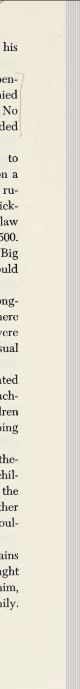

him, leaving them off at the Baptist Church while he went on to his house of worship. She required the children to contribute something, if only a penny or two, as the collection plate was passed. John, the monied one, was expected to dip into the blue bowl for his donation. No matter how little one had, it must be shared, their mother contended and she was adamant about it. The comfortable, prosperous interval in Moravia began to change. William Avery Rockefeller had a brush with the law on a serious charge—maybe more than one. Records are vague and rumors unsubstantiated. The little girl twin, delicate from birth, sickened and died. Father Davison, whose regard for his son-in-law had not increased, sued him for a past-due note on a loan of $1,500. Paying it shattered the Rockefeller resources. Gossip about “Big Bill” was bandied about the neighborhood. Life in Moravia could no longer be endured. Eliza and her husband gathered their offspring and their belongings and drove off to Owego in Tioga County, the county where their three oldest children were born. For the first time they were not on a farm, but on the edge of a town. Yet their setting as usual was one of natural loveliness. When John was eleven, he and William entered the highly rated Owego Academy. John thought the lessons difficult and the teachers “harsh.” The frequent uprootings had put him behind children of his own age, but he appears to have had little trouble keeping up in mathematics. His father’s affairs for the time being were at low ebb. Nonetheless, he contrived to pay his sons’ tuition. He was giving his children the best “book learning” he could. They, in turn, walked the three miles to and from school. In warm weather, like the other pupils, they arrived barefoot with their shoes slung over their shoulders to save wear. Doctor Rockefeller’s roamings had led him over the mountains into Ohio, maybe more than once, and possibly farther. He caught the western fever. The uncrowded lands beckoned, promising him, as they had countless others greater scope for himself and family.

SS ee

<!-- issues: low_ocr_confidence:59.14, image_text_overlap:0.231 -->

<!-- page_id: 0019-left | printed: 24 | viewer_token: 24 | viewer_sequence: 40/340 -->
## Page 24

The Rockefellers left Owego late in 1852 or early 1853. There are conflicting statements as to whether they traveled by train or via the Doctor's usual means of transportation, horse and wagon. Ostensibly they were heading for Cleveland, a city whose fame was spreading. However, they went first to Strongsville, a few miles from Cleveland, in the same county—Cuyahoga. They boarded with the Doctor’s sister Sara Ann, wife of Willis Humiston. According to Strongsville tradition, the Humiston residence was on Wooster Pike near Whitney Road. How Eliza fared amidst her in-laws is not known. On the other hand, her husband soon found cronies who took him to turkey shoots and on hunting forays. They admired his prowess with a rifle for they were good shots themselves. Many could remember the Great Hinckley Hunt of 1818 in neighboring Medina County. Fathers of some had joined men of other settlements in that bloody orgy when hundreds of defenseless wild animals were ambushed and exterminated. After a bit the Rockefellers set up housekeeping on a small farm on the outskirts of Strongsville. Big Bill’s new friends, impressed with his ready cash, were curious as to its source. The only answers they received from him were sly winks and hearty guffaws. One of them, on an errand in Richfield, a nearby village, stumbled on the explanation. He was attracted by a small crowd loitering around a spring wagon. A sign propped against the wheels proclaimed that “Dr. William Avery Rockefeller” was in town selling his “Celebrated Cancer Treatment for $25.” And there, sure enough, was Big Bill himself in a frock coat and silk hat, holding his bottle aloft, discoursing eloquently on its efficacy. The man’s report lost nothing in the recounting once he was back in Strongsville. The Doctor hawked other nostrums (or, were they the same formula as the Cancer Cure?)—guaranteed remedies for a series of maladies, all probably equally harmless and ineffective. One wonders if his assortment included vials of Seneca Oil widely used for the aches and pains of man and beast. It was a dark, greasy substance made from petroleum, better known as “rock oil.” After what probably were none too comfortable quarters in Pn

<!-- page_id: 0019-right | printed: 25 | viewer_token: 24 | viewer_sequence: 40/340 -->
## Page 25

Strongsville, it is likely Eliza enjoyed the months spent in the house they had rented from O. J. Hodge on Cleveland’s Perry Street. There, however, her husband’s wanderlust surfaced again. She well may have resented leaving the house for another move to an unfamiliar place. But she packed up for Parma, and went along. It was this Parma house that John went to visit after finishing his business school training. The Cleveland-Parma stagecoach that John had taken was routed along the Pike and put him down practically at his parents’ front door. It would be a safe conjecture that his mother had been listening for hours for the stage driver's long horn heralding its coming. John spent a month in Parma. As he prepared to leave for the Great Adventure, his search for work, his father observing the youthful confidence, tried to cushion him against possible disappointment. If no employment was forthcoming in the city, he told his son, he need have no fear about making a living—he always would be able to find work in the country.

> 6. We 5 1 1 1 1 3 148 26 12 25 55.239365 \

<!-- issues: low_ocr_confidence:55.24 -->

<!-- page_id: 0020-left | printed: 26 | viewer_token: 26 | viewer_sequence: 42/340 -->
## Page 26

little church, taking part in the young people’s meetings and Bible classes. John admired him and they saw a good deal of each other. All in all, getting reestablished at Mrs. Woodin’s was like a homecoming for the sixteen-year old youth. His compelling objective was to locate a commercial concern in need of what he had to offer: a knowledge of bookkeeping and good penmanship. He had attained man’s height, but not his girth. As he set out on his quest, his suit, a bit worn perhaps, was somber but well-pressed. A black cravat was wound around his neck in the current mode, shoes polished, hair in place, and on his head, doubtlessly, a narrow-brimmed derby hat. He did not carry a letter of introduction to a company head, for he knew no Cleveland businessmen. And certainly none had ever heard of John D. Rockefeller. He turned to the City Directory and from it copied a list of the important firms. It was like him to consider only those of high rating and to ask to see their chief officials. Day after day the earnest, slender youth tramped the city streets in the humid summer heat. No one wanted a young man who could keep books and who wrote a good hand. Cleveland was feeling the effects of “hard times.” Doggedly he returned to business places to re-canvass merchants on the chance that an opening had developed since his first inquiry. When his courage dropped to its lowest point it was restored by the memory of his father’s well meant parting words about farming. Anything but that! And he would try another door. The perseverance and determination that were to mark all his later dealings won out. After a month of turndowns, as Rockefeller wrote nearly seventy years later, “one man on the docks told me that I might come back after the noon meal.” John departed in dignified manner, but once out of sight of the office, he skipped along the street in boyish exultation. He rushed to Mrs. Woodin’s to tell her the good news. “I was elated but in a fever of anxiety lest I should lose this opportunity,” he said years later. After what seemed to him the proper time, he presented himself again and heard the thrilling words: “We will give you a chance.”

<!-- page_id: 0020-right | printed: 27 | viewer_token: 26 | viewer_sequence: 42/340 -->
## Page 27

Nothing was said about wages. The man who hired him was Henry B. Tuttle, of Hewitt & Tuttle, a wholesale commission and produce company. Their headquarters was beside the Cuyahoga River on Merwin Street. The street had been laid out by Noble B. Merwin, pioneer landowner, whose handsome home and tavern, the Mansion House, had been a popular hostel in Canal days. Its site when the two Rockefeller boys arrived in Cleveland was occupied by the Atwater Block. Tuttle and the senior partner, Isaac L. Hewitt, were well known in Cleveland, especially Hewitt. Both had business interests in addition to their commission house. Hewitt owned downtown real estate, including the Hewitt Block which was occupied by shops and small industries. He was a founder of the Cleveland Iron Mining Company which had been organized five years before, one of the first operations to bring out ore from the Michigan wilderness. Tuttle later joined the mining company and became its secretary. Hewitt, a pleasant, friendly man, introduced John to the office routine, explaining he was to assist Tuttle with the bookkeeping. The boy took off his coat, hung it on a peg, carefully, to avoid wrin- Kes, and topped it with his hat. He slipped on a pair of black cotton sleeve guards as he had learned to do at Folsom’s. His employer pointed to the high bookkeeper stool. The new clerk climbed up, hooked his long legs in the rungs, and felt like a king on a throne! Hewitt pushed the letter press toward him, and John went to work. That memorable day was September 26, 1855. Rockefeller observed the date every year for the rest of his life. He considered it as significant as family birthdays and Christmas. On each anniversary of that September day the American flag was flown at Forest Hill. It was only a few miles from Merwin Street. Young Rockefeller gave all his energy to the demands of his first job. The only diversion he permitted himself was his church. All his social as well as his religious activities centered there. The Baptist faith was to become the keystone of his life. J

<!-- page_id: 0021-left | printed: 28 | viewer_token: 28 | viewer_sequence: 44/340 -->
## Page 28

### 7. I 5 1 1 1 1 3 96 25 211 33 96.018921 Contributed 5 1 1 1 1 4 320 27 99 32 96.613701 What 5 1 1 1 1 5 432 30 8 30 96.249077 I 5 1 1 1 1 6 455 29 120 32 92.727104 Could”

The Erie Street Baptist Church was the outgrowth of a mission organized in 1850 by the wealthy First Baptist Church, which was located on Seneca (West 3rd) at Champlain Street (present sit of the Terminal Tower). The parent congregation hoped thus “to meet the religious destitution” accompanying the increase in population in the Erie Street neighborhood. As a first step, a lot at Erie and Ohio Streets was acquired. A small, quaint building, once home of the Second Presbyterian Church on Rockwell Street, was purchased and moved to the new property. The cost, $2200, included the moving and restoration expenses. Within a year, under a dynamic young leader, Rev. J. Hyatt Smith, the congregation felt strong enough to function as a full-fledged church, independent of the mother institution. Among the parishioners of the modest house of worship, there soon would be a lad named John D. Rockefeller. The young man was a faithful attender at all sessions, the three Sunday services, midweek prayer meetings, and the socials. He often was accompanied to church by Eyears, a more frequent visitor at Mrs. Woodin’s as the day for his marriage to Martha approached. When John Rockefeller decided to take the step of formal baptism, Alfred Eyears joined him in the rite, the two being immersed in the baptismal basin by Deacon Alexander Sked. A Scotsman and a florist, the deacon gave the same tender care to the young men in his church as to his flowers. While John was in high school he had enrolled in Deacon Sked’s Bible class, and before he left school, when about fifteen, he succeeded him as its teacher. Among Rockefeller’s first friends at the church was Henry Chisholm, some years older than he and recently come from Scotland. At first engaged in a profitable business building piers and docks, he was soon to establish the Chisholm and Jones Company, iron manufacturers, in the proud little village on the edge of Cleveland called Newburgh. Rapidly expanding, before long the mill was em-

<!-- page_id: 0021-right | printed: 29 | viewer_token: 28 | viewer_sequence: 44/340 -->
## Page 29

ploying more than one hundred and fifty men, and the first blast furnace, in this area was erected. In 1863 Chisholm organized the Cleveland Rolling Mill (later the American Steel and Wire Company). He and his wife, like the Rockefellers, continued as dedicated members of the church, the two families carrying on their friendship through the years. John’s brother William soon joined the little mission. Another member was Benjamin Rouse, whose block on Public Square housed Folsom’s business school. Rouse and his wife Rebecca, one of Cleveland’s notable women, had come to the city as agents for the American Sunday School Union. They lent energetic support to early religious temperance and charity movements and helped found the Cleveland Orphan Asylum. This institution provided the first dependable care for the city’s indigent homeless children. Communicants of the Erie Street outpost were largely in modest to poor circumstances. They included clerks, shopkeepers’ assistants, artisans and the like. The denomination’s more prosperous adherents assembled at the First Baptist Church, the first house of worship in Cleveland to have a steeple. Such pretentiousness did not attract the young assistant bookkeeper at Hewitt & Tuttle. In the humble edifice, the boy had a satisfying sense of belonging. Every Sunday saw him settled in one of the straight-backed pews on the men’s side of the austere meeting room. How limited a budget the Erie Street Baptists operated on is suggested by excerpts from trustees’ records for the year 1855:

> $ 50.00 3.00 250.00 34,00 58.44

Organist, Miss Billson Clement H. Farrar, blowing the organ Rev. A(lfred) Pinney for one year’s salary Sexton Transportation (of) pastor’s furniture

So great was the difficulty in raising the necessary operating funds that “the young people were required to defray the expenses of heating and lighting the lecture room for their weekly prayer meetings.” So, John D. Rockefeller, with others, swept out the room, supplied candles for the wall sconces and wood for the baseburner aor

SO r————C(‘CiéSCSC‘éRS

<!-- issues: low_ocr_confidence:75.69 -->

<!-- page_id: 0022-left | printed: 30 | viewer_token: 30 | viewer_sequence: 46/340 -->
## Page 30

in the corner. Without doubt it was a bare, grim little room, uncarpeted, not brightly lighted for candles cost money, nor overly warm since fuel was expensive, too. His fellow churchmen, recognizing the newcomer’s devotion and dependability, shortly appointed him clerk. Before he was eighteen they elevated him to trustee. The reticent lad took his place beside church elders, all considerably older than he. They were ready to give respectful ear to his suggestions, always offered with deference and few words. A heavy financial burden hung over the parish, a mortgage of $2,000, long past due. Keeping abreast of interest payments alone was a struggle. The debt had worried Rockefeller, and soon a crisis was at hand. The mortgage holder, A. A. Stafford, was pressing for his money. One Sunday moming the minister announced from his pulpit that the creditor threatened foreclosure and this, notwithstanding the fact that he was a deacon of this church. The young trustee, as he himself has stated, stepped into the emergency, assuming responsibility for discharging the obligation. He stationed himself at the church door after service and buttonholed worshippers as they left. Pleading with each to give something, he gathered contributions then and there. Amounts for the most part were ten, twenty-five, fifty cents, rarely as much as a dollar, with promises of sums not much larger. He cajoled, and, as he admitted, “almost threatened.” He followed up his campaign with thoroughness. Equipping himself with a notebook in which he entered each pledge, he then went about collecting them. It was a tedious task that lasted for weeks and was carried on after a long day at his office post. Collections finally added up to the desired $2,000. The church was saved. He looked back on the accomplishment as training in what he termed “begging.” It was useful, he liked to say, for it helped him when he had to beg at banks for loans in the years ahead. “I contributed what I could,” he stated, but he regretted it could not have been more. “My first ambition to earn more money,” he added, “was aroused by this and similar undertakings in which I was constantly engaged.”

<!-- page_id: 0022-right | printed: 31 | viewer_token: 30 | viewer_sequence: 46/340 -->
## Page 31

### 8. Ledger A

For John D. Rockefeller, landing his first job did not mean earning money. He acted as assistant bookkeeper at Hewitt & Tuttle’s from September 26, 1855 until the end of the year with no word about salary between his employers and John himself. “When January arrived,” Rockefeller related, “Mr. Tuttle presented me with fifty dollars, which no doubt was all I was worth, and it was entirely satisfactory.” At the same time Tuttle told the boy that from then on his wage would be twenty-five dollars a month. It was obvious, however, that he had not been without funds before receiving the fifty dollars. William Avery Rockefeller was the probable source, or was there also a residue from some sort of a blue bowl cache? At any rate, he did have some money and it had to be accounted for, every penny of it. Shortly after going to work at Hewitt & Tuttle’s he bought an inexpensive notebook, ruled it according to the best bookkeeping principles and lettered on its cover Ledger A. That journal, not much larger than an ordinary pocket notebook, and unpretentious as to paper and binding, is a treasured item in the Rockefeller family archives at Rockefeller Plaza, New York. In Ledger A the fledgling businessman recorded the money he received and spent and saved. The little book provides a picture as unstudied and intimate as a candid photograph of John Davison Rockefeller at sixteen, on his own and unknown in the big city of Cleveland. He was about to step into a career that would make him the most famous person ever to live in that city. This journal was the first of a succession of similar personal account books he maintained throughout his life. Before he began tallying his dollars and cents, he set aside a section labeled “Records.” Under the important date of September 26, 1855, with what must have been a triumphant glow, he penned the first item: “Commenced business as bookkeeper for Hewitt and Tut-

ES eee

<!-- issues: low_ocr_confidence:76.58 -->

<!-- page_id: 0023-left | printed: 32 | viewer_token: 32 | viewer_sequence: 48/340 -->
## Page 32

tle, Merwin Street, Cleveland, Ohio, after graduation from E. C. Folsom’s Mercantile College, Cleveland, Ohio.” Next, dated December 27, he wrote: “Miss Susan Sked married to Mr. David Austen at Father Sked’s house.” Was Rockefeller a guest at the wedding? One wonders. His wardrobe required attention. It probably was fairly well worn and, since he was still growing, some of it must have been too small for him. As he pointed out, he kept his attire within his means in the early years, but his dress was important to him. Throughout his life, as photographs attest, he was fastidious about his appearance. His first expenditures, as specified in his new account book, were headed “Clothing.” On November 24th he purchased:

> I pare (sic) drawers 1 silk scarf 2 wollen (sic) undershirts 1 pare fur gloves

> $1.50 1,50 2.25 2.50

It is clear from the above that he had cash to spend and that his various schools had been woefully lax in teaching him spelling! The silk scarf, and particularly the fur gloves, seem an extravagance and so were viewed by Rockefeller himself as he puzzled over the entries years later. “I thought I used to wear mittens,” he mused. Actually, there was the notation of a small sum spent for mittens. Those fur gloves could have been a welcome protection for a bookkeeper’s fingers against Lake Erie’s winter winds. They might have functioned, also, as a kind of status symbol for a littlenoticed youth struggling ‘to get on in a new job. To have is to share. The adage had been ingrained indelibly on John’s conscience by his mother. The day following his indulgence in outfitting himself he ruled up another column, “Donations,” a reckoning of what he allocated to his church:

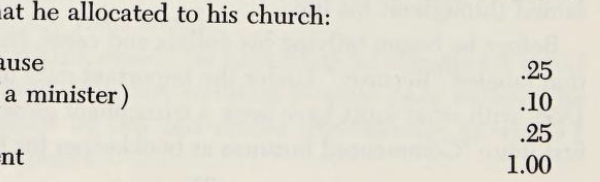

<!-- issues: image_text_overlap:0.273 -->

<!-- page_id: 0023-right | printed: 33 | viewer_token: 32 | viewer_sequence: 48/340 -->
## Page 33

From December 16 to the end of the month:

Sabbath School present for Mr Farrar Five Points Mission (a center for poor boys in New York City) The Macedonian (a religious paper) present for Deacon Sked

> 10 -10 -10

He contributed “to the poor in the church” ten cents every week. Like amounts frequently were given “to a poor man in the church” and to “a poor woman in the church,” evidently currency he handed personally to the recipients. His largest single donation was one dollar paid out several times for slip rent. Continuing this careful accounting from December to April, he added up his “Donations”: } $5.88. He greeted the new year, 1856, by sallying forth to Cleveland’s emporiums for some further cautious investments: January 2 2% yards cloth for pants $3.13 January 5 making same 2.25 January 5 1 pare rubbers 1.25 In February he needed only “1 pare shoes” for $2.25. He selected a “Shirt Collar” for thirteen cents and a “Coat Button” for eight cents. Total clothing costs for the four months came to $9.09. Except for the interesting purchase of the fur gloves, he had given away almost as much as he had spent on necessary clothes in the same period. True, beginning in January 1856, he received a salary of twentyfive dollars a month. However, he had to juggle his entire budget against the fact that practically half of his income went to Mrs. Woodin for lodging, entered in his account book week after week at three dollars. He was completely self-supporting now—and he even managed to save a few dollars, here and there, duly noted in his book. He indulged himself in no new wearing apparel until October came with the threat of winter, when he purchased an overcoat for ten dollars. Vanity now conquered the otherwise staid lad: he bought “1 pare cassimere (cashmere) pants at $6.50.”

> $3.13 2.25 1.25

eo rrr———i(‘i‘CSCSC‘éRS

<!-- issues: low_ocr_confidence:76.57 -->

<!-- page_id: 0024-left | printed: 34 | viewer_token: 34 | viewer_sequence: 50/340 -->
## Page 34

Items under “Sundries” throw more light on the life of the young clerk, as for example:

December (1855) repairing boot $ .12 bottle indelible ink 25 watch guard .06 tooth brush 18 January cleaning my watch 1.50 February shovel and tongs 15 March piece sponge .05 piece soap 21 5 pare shoe strings .05 April haircutting and shaving 25 2 boxes tooth paste 15 There were recurring debits for “burning fluid,” probably whale or sperm oil at eleven to twelve cents a pint; for “the stage home” (to Parma), fifty cents; hickory nuts and chestnuts in five and six-cent lots and like tabulation for apples. This fruit remained a favorite with him. It is said he kept a sack of apples on his bedroom window sill at Forest Hill and at his Fifth Avenue home. A couple of times he bought ten cents worth of candy. He splurged on an “ambrotype” (a chemically treated picture on glass) for three dollars and a gold pen for a dollar and a half, “A mug broken at home” cost him fifty cents for its repair or replacement. Twice he loaned “A. Pinney,” the underpaid minister, two dollars, and after a bit, A. Pinney’s name duly appeared on the credit side. The preacher paid his debts! Mrs. Woodin took care of her boarder’s “washing.” He put down in detail the kind and number of “pieces” with her charge for each. His landlady handled a good many garments for him, and her bill for six months of tubbing was $4.22. Payments of from five to ten dollars were credited from time to time to “H & T,” indicating, it would seem, that the monthly stipend was not forthcoming in a lump sum. Likewise, credit was given William Avery Rockefeller for “presents,” usually of ten dollars each time. Though his wages came by piecemeal, the boy had an income he

> $ .12 25 06 18 1.50 15 05 21 05 25 75

January February March

<!-- page_id: 0024-right | printed: 35 | viewer_token: 34 | viewer_sequence: 50/340 -->
## Page 35

could count on. Consequently, he increased his gifts for Sabbath School, Foreign Missions, Mite Society and the like, from five and ten cents to double the sums. Sixty cents went for expenses of a “Young People’s Meeting.” As church clerk, he had supplied stationery as well as postage. Systematically he noted each week on the debit side: paper, 15, stamp, 05, etc.” After a few weeks he decided not to hold the church longer for the obligations, and he wrote across the entries, “Let it go!” Young Rockefeller keyed his philanthropy to his financial condition. He continued the policy as the years transformed pennies into dollars and dollars into millions in his business and benefactions. In no sense did he scale his charity to tithing, for such a practice, he made it clear, had no appeal for him: “that one-tenth of a man’s income must be devoted to good works . . . is but a rough yardstick to go by. To give a tenth of one’s income is well nigh an impossibility for some, while to others it means a miserable pittance.” | His philosophy was expressed in a much quoted statement in a speech he made before a young men’s class in New York: “I believe it every man’s duty to get all he honestly can, and to give all he can.” Though pay at Hewitt and Tuttle might have been somewhat irregular, Rockefeller in his Reminiscences wrote of his first job: “I thoroughly enjoyed the work. My father’s training, as I have said, was practical, the course at the commercial college had taught me the rudiments of business and I had a ground work to build upon.” His employers evidently were not unaware of such qualifications in their assistant bookkeeper. At the end of 1856 Hewitt promised him a promotion and a pay raise for the coming year.

<!-- page_id: 0025-left | printed: 36 | viewer_token: 36 | viewer_sequence: 52/340 -->
## Page 36

### 9. “Mr. Rockefeller”

Tuttle quit the firm of Hewitt & Tuttle, and the assistant bookkeeper, John D. Rockefeller, was given his job without the title of partner, or the income. For some time he had been carrying more and more of Tuttle’s work, so no breaking-in period was necessary. Tuttle, though a partner, had preferred a regular wage to depending on company profits and he was paid $2,000 a year. Salary of his successor was $500, shortly raised to $600. Activities of the commission house were diversified, providing Rockefeller with valuable opportunities for varied experiences. He came to know jobbers, commission merchants and producers. Shipments handled by lake, canal, and railroad gave him insight into transportation routines and put him in touch with vessel owners, lake captains, canal and railroad operators. Complications often arose, as for example, determining a carrier’s proper share in cases of loss or damage. “It taxed all the ingenuity of a boy of seventeen to work out this problem to the satisfaction of all concerned,” said Rockefeller looking back on this period. Railroads were still more or less of a novelty and they appealed to him particularly. Young as he was he was keen enough to sense a significance for the future in the steadily increasing number of lines coming to Cleveland. With the company and Hewitt himself controlling a number of rental properties, rent collection was a regular item of business. When payments were slow, Rockefeller was assigned to go after them. He also took on produce bills long overdue. Calling on each tardy debtor he pressed determinedly for settlement. If the offending party was located at a distance, he would drive out in the little cart Hewitt put at his disposal, tie up his horse, and settle himself in the individual's office obviously prepared to stay until the money was in his hand. He made his points briefly, keeping his voice low,

<!-- page_id: 0025-right | printed: 37 | viewer_token: 36 | viewer_sequence: 52/340 -->
## Page 37

his poise and his patience intact. When he turned his unfaltering blue-grey eyes on his debtor and said firmly: “Mr. Hewitt has waited long enough,” the man might grumble a bit, but finally gave in. The bookkeeper scrutinized all statements submitted to the commission house, checking every item before paying out “my employer’s money from the till.” He was shocked at the careless practices that he observed in a neighboring business house. He happened to be there one day when a plumber presented a bill “about a yard long,” as he described it afterwards. “This neighbor was one of those busy men,” Rockefeller said. “He merely glanced at the tiresome bill and ordered his bookkeeper to pay it.” By coincidence, Hewitt & Tuttle employed the same plumber. The man presented a statement a few days later for work on their premises. Rockefeller was ready for him. He went over every bit of the bill and discovered some errors. Though amounting to only a few cents, he insisted on correction and considered it “greatly to my firm’s interest to do so.” Cleveland in 1857, like most of the nation, was caught in an economic depression that saw banks fail and mercantile establishments close. The recession was to continue until an upswing came with the Civil War’s demand for goods and services. William Avery Rockefeller seemed unaffected by the financial slump. Actually, it was a period of stability and prosperity for him. He gave up his place in Parma and brought his wife and children to Cleveland, settling them in a comfortable house at 35 Cedar Street. He rented it from William Gabriel, a blacksmith, later a carriage maker. The house was large enough to accommodate them all, including John. And it had the great distinction for that day of an inside toilet and bathroom. John had stayed with Mrs. Woodin as she shifted her boardinghouse from Erie to St. Clair Street, to Hamilton and finally to Miami (East 6th) Street near the new Market House. Now that he lived at home, he paid board at the same rate as at Mrs. Woodin’s. The Rockefeller brood was growing up: Lucy, almost nineteen, preparing to marry Pierson Briggs; William, soon to graduate from

mo —“(i‘s;stsSsC‘éRS

<!-- issues: low_ocr_confidence:48.11 -->

<!-- page_id: 0026-left | printed: 38 | viewer_token: 38 | viewer_sequence: 54/340 -->
## Page 38

Central High School; Mary Ann, a plump fourteen; and Frank, at eleven, already impatient under discipline, but an attractive youngster. Good likenesses of the family were made at this time. Photography was coming into vogue. A dozen studios, including some still making daguerrerotypes, were opening up along Ontario and lower Superior Streets. One proprietor, James F. Ryder, was to win international fame through the work of his protégé, Archibald M. Willard, and his painting, “The Spirit of ’76.” Parents and all five Rockefeller children sat several times before the cameras of these early operators. The young people, stiffly posed, with solemn, tense expressions, seem older than they were. John sits very straight in his chair, a hand on each knee, no hint of a smile or boyish merriment on his sensitive face. They were well dressed, but in a style seemingly more suitable for middle age than for youth. The senior Rockefeller was listed in the City Directory for 1857 at the Cedar Street address as “Dr. Rockefeller.” In the classified section under Physicians the word “botanic” was added in parenthesis after his name. Doctor Rockefeller, now openly a dispenser of herbal medicines, dabbled in other gainful projects. His absences from home, though less frequent, were still of long duration. Doubtlessly he continued his buying and selling of horses. He also was a money lender, a respectable pursuit in that era and a profitable one. John was accustomed to arrange loans for his father. One was to Hewitt for $1,000. The date for its repayment came and went. Though the father importuned his son to ask Hewitt for the cash, the boy, understandably, felt at a disadvantage in approaching his employer on the matter. The father, feeling no such hesitancy, came brusquely into the office one day. He faced Hewitt and demanded his money. Hewitt forthwith paid the debt. “When Father looked at a man like that, the man was apt to do what he told him,” Rockefeller said of this incident which he had witnessed. He confided in Mrs. Woodin details of these transactions, She deplored the high rate of interest involved—ten percent. “We,” Rockefeller related, “had frequent and earnest arguments on the

<!-- page_id: 0026-right | printed: 39 | viewer_token: 38 | viewer_sequence: 54/340 -->
## Page 39

subject . . . But all the arguments in the world did not change the rate and it came down only when the supply of money grew more plentiful.” It would be interesting to know what profits came to the shrewd son from the loan deals he handled for his equally shrewd father. Such arrangements would be in keeping with the practices of both. Young Rockefeller was engaging in some ventures of his own on the side, such as buying and selling consignments of flour, grain, and pork. He kept close track of price fluctuations, methodically recording costs and profits in his account book. Hewitt’s bookkeeper was becoming known up and down the busy riverside. The tall, still very thin lad was at his place by six-thirty every morning, often staying after the warehouse was closed for regular business. In winter’s pre-dawn and early twilight, a passerby could see him on his high stool beside the window, bending over the blotter and the letter press in the light of a whale oil lamp, or maybe a candle. Through the day he was frequently in and out of the office on Hewitt’s affairs, but he had no time to loiter or visit with other young clerks. He did, however, strike up an acquaintance with Charles Farrar Browne, a Plain Dealer reporter, five years older than John D. and often on the docks to pick up financial news. Soon adopting the pseudonym Artemus Ward, Browne began writing daily whimsies to the delight of his newspaper’s readers, including the young bookkeeper. To the latter, Browne was “always funny,” even when gathering produce reports. Somehow he broke through Rockefeller’s reserve. Artemus Ward, to be called America’s first humorist, left Cleveland for New York, where his books of quips and drolleries won him ardent fans, among them President Lincoln and John D. Rockefeller. Rockefeller was an equally enthusiastic follower of the one-time reporter's books and often spoke of their Cleveland association. When he was with Hewitt & Tuttle, Rockefeller came upon the biography of Amos Lawrence, a wealthy New England textile manufacturer who made a practice of giving away crisp new bills in one to ten-dollar denominations. While in no sense a bookish person,

So rr————Ci(‘(‘éaRS

<!-- issues: low_ocr_confidence:52.62 -->

<!-- page_id: 0027-left | printed: 40 | viewer_token: 40 | viewer_sequence: 56/340 -->
## Page 40

Rockefeller read the volume avidly. The teen-age clerk was greatly impressed with Lawrence’s largesses and, according to tradition, resolved to do something similar when he was rich, as he fully expected to be. It has been said that the Lawrence story prompted Rockefeller’s habit years later of handing out shiny nickels and dimes. At the time this seemed a harmless diversion, but in retrospect it was unfortunate. The public too often now associates Rockefeller with disbursement of those small coins rather than the many millions he distributed for the betterment of human kind. At the Merwin Street commission house, the hard-working youth became a man without tarrying in boyhood. He gave few an opportunity to know him well, but he soon was regarded with marked respect. Seasoned merchants on the waterfront found themselves addressing the eighteen-year old bookkeeper as “Mr. Rockefeller.” His sagacious father, aware of his son’s capability, approached him at this time with a proposition that he build a house for the family. The Doctor explained that he had bought a lot on Cheshire (East 19th) Street and assured him adequate funds were on hand. Whether John drew up the plans or not is uncertain, but he was in full charge of construction. Gathering estimates from eight contractors, as he indicated in his ledger, he selected the lowest bidder. A fine brick residence, substantial in every detail, went up. Mary Ann, in an interview years later, declared the builder lost money in the transaction, and this troubled her. It was the best house the family had lived in, and they made it their home for many years. The William Avery Rockefellers had attained respectability and security. Coming into quiet waters at long last after twenty tempestuous years, Eliza Rockefeller basked in the serenity, especially appreciative of the fine home her John had built for them. She attended services at the Erie Street Church and participated in various programs there. The Society for Women elected her vice president. Except for her Baptist associations, she probably had few contacts outside her home. There is no evidence that she was drawn into

<!-- page_id: 0027-right | printed: 41 | viewer_token: 40 | viewer_sequence: 56/340 -->
## Page 41

civic causes like the abolition movement then surfacing in Cleveland, and supported by many churches. The city was the final “station” on the “Underground Railroad” from which fugitive Negroes could embark on Canadian-bound vessels. Trembling blacks climbed the steep belfry stairway of St. John’s Episcopal Church on the West Side to await signals for their freedom voyage. Many others were secreted in Cleveland homes. The bell on the Stone (Old Stone) Church on Public Square tolled to sound alarm whenever slave hunters, frequently in the city, were sighted. As evidenced by editorial viewpoints of two Cleveland newspapers, sentiment in the city was divided over emancipation. The Leader, vociferously anti-slavery, stood for immediate abolition. On the other hand, the Plain Dealer advocated “gradual extermination” of slavery and favored Negro colonization. It opposed as unconstitutional what it labeled “pre-emptory abolition.” The Plain Dealer supported Stephen A. Douglas, father of the controversial Kansas-Nebraska Act. “The Little Giant,” as he was called, had friends in the city, where he stopped off occasionally to visit his cousin Daniel P. Rhodes, a leading Democrat. John D. Rockefeller, engrossed though he was in his job, could | not have escaped the growing tension, and he may have attended some of the spirited anti-slavery meetings. His sympathies, it seems clear, were with the blacks for this year he widened his range of donations beyond his own Baptist Church to include a Negro congregation in the city, as well as a struggling German mission. His contributions rose from $19.31 at the close of 1856 to $28.37 by December 1857. His own interests broadened. He paid a dollar to join the newly launched Young Men’s Christian Association, which met in the Second Presbyterian Church. The YMCA’s president, Dan P. Eells, a prominent banker, also was active in the Ragged School, a center for poor children on lower Champlain Street. Rockefeller, possibly through Eells’s influence, earmarked a small sum for this project. One of Cleveland’s first charities, it was reorganized as the Al

eee

<!-- issues: low_ocr_confidence:65.69 -->

<!-- page_id: 0028-left | printed: 42 | viewer_token: 42 | viewer_sequence: 58/340 -->
## Page 42

Cleveland Industrial School and ultimately became the Children’s Aid Society. The Ragged School’s first president was Truman P. Handy, another banker. Rockefeller soon was to know both men —and they him. In 1858 Hewitt raised his bookkeeper’s salary to $700. Rockefeller thought he was worth $800. Hewitt promised to negotiate about the additional hundred dollars at a later date. By year’s end John’s Ledger A, under “Donations,” showed a gift total of $43.85, one and a half times that of 1857. Yet 1858 had not brought the expected salary increase. With the city’s rapid expansion eastward, it was decided at this time to extend Prospect Street beyond its terminus at Sterling (East 30th) Street. The proposed thoroughfare would pass through land owned by George Merwin directly in line with his handsome brick home. To save it, the house was moved about seventy-five feet south to a lot on the new segment of Prospect Street. Apparently the first brick structure of such proportions moved in Cleveland, the difficult undertaking would have interested Rockefeller for the old house was a symbol of Merwin Street. Called the Mansion House, it had been built long ago as home and inn by the early settler in the Flats, Noble Merwin. When its site at Superior Street and Vineyard Lane was sold to make way for the Atwater Block, Noble’s son George salvaged the house. Brick by brick he reconstructed it on his acreage “out in the country,” where it was his home for many years. After its relocation, the historic house began a new life and had a succession of occupants and owners until 1895. Then it was purchased by the Rowfant Club, a men’s literary club. Ever since, as Number 3028 Prospect Avenue it has been headquarters for this lively group of bibliophiles. As the reincarnated Mansion House was settling on its new foundation, Rockefeller was about to sever his connection with familiar Merwin Street. Hewitt had not mentioned the extra hundred dollars. Early in 1859 the youth posted the firm’s books for the last time—and resigned. Disturbing as Hewitt’s silence was to the ambitious nineteenyear-old lad, it proved most fortunate for his future. As Rockefeller

<!-- page_id: 0028-right | printed: 43 | viewer_token: 42 | viewer_sequence: 58/340 -->
## Page 43

himself commented later, had the additional pay been forthcoming, he would have stayed with Hewitt, thereby missing, in his words, “a favorable opportunity” that was shaping up for him.

### 10. He Became His Own Employer

The year 1859 was memorable historically, and no less so for Rockefeller. For one thing, “Colonel” Edwin L. Drake in August of that year discovered oil in Pennsylvania. Two months later, the fanatic abolitionist, John Brown, attacked the United States arsenal at Harper’s Ferry. Equally noteworthy, as it turned out, John D. Rockefeller, in the spring, took a courageous step: he gave up his job as an employee and went into business for himself. The “favorable opportunity” presented itself in the person of Maurice B. Clark. One of the numerous, ambitious young Englishmen who had been attracted to Cleveland, he was working for the commission house of Otis, Brownell & Company on River Street. By utmost frugality Clark had saved the tidy sum of $2,000. He wanted to set up a commission house of his own. He was looking for a partner who could invest a like amount. So it was, that after careful deliberation, he picked young Rockefeller to be that partner. Clark was twenty-eight years old, Rockefeller not yet twenty. The Englishman had reached his plateau of success after years of hardship. While working as a gardener in Wiltshire, where he was born, he had scuffled with an overbearing employer. In the fray he knocked the man to the ground. To escape possible trouble with the law, he surreptitiously sailed for America, landing in Boston, a stranger and penniless. A bitter struggle lay ahead for the immigrant. Taking any job offered him, he gradually moved west until he reached Cleveland. He liked the town. He would make it his permanent home. With such a background, Clark could appreciate the thrifty, no-

mo———isi‘iéaRS

<!-- issues: low_ocr_confidence:72.19 -->

<!-- page_id: 0029-left | printed: 44 | viewer_token: 44 | viewer_sequence: 60/340 -->
## Page 44

nonsense habits of the young bookkeeper in the neighboring commission house on Merwin Street. Actually he had more than a passing acquaintance with Rockefeller. The two met first at Folsom’s Business School where Clark had enrolled although he was older than most of the students. Also, Clark and his wife lived on Cheshire Street only a few doors from the Rockefellers and they saw something of each other as neighbors. To John D., Clark’s proposal looked alluring. But where was he to get the necessary money to match what Clark could provide? He had saved between seven and eight hundred dollars from his salary and from his various independent transactions. He thought he might be able to gather together another hundred or two, but that would make only half of what Clark stipulated. “I talked the matter over with my father,” John D. recounted. “He told me he always had intended to give each of his children $1,000 when they reached the age of twenty-one.” William Avery Rockefeller offered to advance John’s one thousand dollars at once. However, the young man’s joy was cut short as the wily botanic physician added: “But John .. . the rate is ten.” The son wrote about this episode in 1909, just a half a century later. In case he was presenting his father in too mercenary a light, he hastened to exonerate his canny parent, and explained what he well knew from his own experience: “At that time 10 per cent a year was a very common rate of interest for such loans . . . I gladly accepted my father’s offer . . .” In March a sign “Clark and Rockefeller” went up on a warehouse at 32 River Street, in those days a busy trade artery running north and south beside the Cuyahoga River. The rear of the company’s headquarters faced the Cuyahoga, a convenient arrangement for the firm. The buildings, long since razed, were between Main and Front Streets. A four-story brick building, for a time occupied by Upson-Walton Company, ship chandlers, stands on the site. On the thoroughfare, now known as West 11th Street, only a few concerns survive. These are surrounded for the most part by ramshackle, abandoned structures and a few eating places like Pickle Bill’s and Mrs. Minever’s Saloon, geared hopefully to attract adventuresome

<!-- page_id: 0029-right | printed: 45 | viewer_token: 44 | viewer_sequence: 60/340 -->
## Page 45

patrons from uptown. As this is written, there is evidence of interest in updating the district. Nearby, Merwin Street winds southward beside the river, tangling with railroad tracks and shadowed by the colossal arch of the Superior-Detroit high level bridge. Directly under it, is pointed out the one-time location of Hewitt & Tuttle's commission house where John D. first went to work. The street which retains its original name, was a main street in the Flats. On it, at the corner of Superior Street, the Sexton Block was erected. In this building, Rockefeller had his first office a few years later. On West 11th Street, at the foot of St. Clair, a handsome sign indicates the spot where Moses Cleaveland landed in 1796. Maybe some day another plaque will mark the place on the river front where John D. Rockefeller got his start. The partnership of Maurice Clark and John D. Rockefeller was noted by the Leader, which gave their undertaking its blessing:

Clark and Rockefeller is the name of a new firm just commencing a general commission business at 32 River Street. As experienced, responsible and prompt businessmen, we recommend their house to the favorable consideration of our readers.

We have no record of Maurice Clark’s attitude, but we know his young associate “swelled with pride at being a partner in a firm with $4,000 capital.” He—John Davison Rockefeller—was his own employer! Characteristically, Rockefeller checked his enthusiasm. Remembering his Bible’s warnings about pride and its dangers, he declared he seldom put his head “upon the pillow at night without speaking a few words to myself.” What he termed “these intimate conversations with myself” came to be more or less habitual throughout his life. He thus was enabled “to stand prosperity” and was saved from getting “puffed up,” as he put it. His religion was a practical religion as befitted a practical man, He used his Bible freely like a tool. It is easy to imagine him at bedtime, in his room in the Cheshire Street house, extracting what he could from the Scriptures. His

Po rrrrrt————C(i‘C™éCSCSC‘éRS

<!-- issues: low_ocr_confidence:71.89 -->

<!-- page_id: 0030-left | printed: 46 | viewer_token: 46 | viewer_sequence: 62/340 -->
## Page 46

brother Will shared the bedroom with him. He was working, too. Like John, he had started as a bookkeeper in the Flats, employed by Hughes and Davis, where later his name would be added as a partner. No self-examination plagued the carefree Will. When the hour came for sleeping, he slept. Clark & Rockefeller Company “prospered from the first . . . business came in upon us so fast we hardly knew how to take care of it,” the junior partner revealed. He took full charge of the office and the books, giving the same scrupulous attention to details as he had at Hewitt & Tuttle’s. The other member of the firm, a sociable man who enjoyed meeting people, worked on the outside, buying and selling produce. Volume increased. A freight car filled with grain for the firm might be waiting on a side track for unloading while a schooner lay at anchor, its hold heavy with a consignment for Clark and Rockefeller. Early in their venture an unseasonable frost in Central Ohio and Indiana reduced harvests and consequently slowed deals. The more temperamental Clark was discouraged. His partner, never losing his confidence, plunged into work all the more intently and righted the temporary setback. It soon was apparent that the $4,000, which had seemed so substantial a capital base, was inadequate. To meet increasing invoices and the expansion forced upon them, they needed more money. William Avery Rockefeller willingly provided several loans. After all, at ten percent what better investment could he find? His son, at first gratefully, and later with more and more misgiving, accepted such help. The big Doctor had a disturbing way of looming up unexpectedly in the office some days before a loan was due, to boom out cheerfully that he must have his money. To comply put John D. invariably in a vise financially. Yet, with no change of expression, he always agreed to have the amount ready the next day. The young merchant was doubly annoyed when his parent afterwards would confess with a grin that he had not needed the funds —he was only testing his son’s ability to meet emergencies! The tolerant John D. conceded that perhaps this sort of treatment was good discipline for him. Nonetheless the son determined to try a

<!-- page_id: 0030-right | printed: 47 | viewer_token: 46 | viewer_sequence: 62/340 -->
## Page 47

more stable kind of borrowing as the new firm’s growth continued to require additional capital. The junior partner, well groomed as usual, set out to call on a banker, Truman P. Handy at the Commercial Branch Bank located in the Atwater Block. Handy was president of the bank and its principal stockholder with Dan P. Eells the cashier. An aristocrat and an astute businessman, Handy was recognized as the foremost banker in the city. That year, among the many offices he held, he was elected president of the newly formed Cleveland Clearing House Association, an innovation in inter-bank check handling of the greatest convenience to commercial houses. He had advanced steadily since arrival in Cleveland in 1832 from Buffalo where he was cashier of a bank. Accompanied by his bride he had made the hazardous journey by stagecoach. The historian and statesman, George Bancroft, of Worcester, Massachusetts, whose varied interests included state banking, had induced him to revive the Commercial State Bank on the charter of Cleveland’s first financial institution, the defunct Commercial Bank of Lake Erie. Bancroft supplied $200,000 raised in the East for the purpose. Handy, aged twenty-five, was made cashier, soon succeeding Leonard Case as president. Cleveland at the time was a hamlet of only several thousand souls. At the front door of the new bank on Superior Street hill stood a town pump, its drippings frequently attracting a grateful pig or a couple of geese straying from the pastures on the Public Square. From the first, Handy became a leader in practically every important cultural and civic movement in the developing city. The pillared mansion he built in 1842 on Euclid Street west of Erie (Hippodrome site) was a triumph of pioneer architecture, evidence of its owner’s taste and standing in the city. As a member of the Board of School Managers (Board of Education), Handy was an ardent advocate of a free public high school. When Central High was built a few doors from his home, he enjoyed visiting there to observe the progress of its handful of pupils—John D. Rockefeller among them. Handy and Eells, both active in the Young Men’s Christian As- Ary

mo rr———“(isi‘tisCséaRS

<!-- issues: low_ocr_confidence:47.98 -->

<!-- page_id: 0031-left | printed: 48 | viewer_token: 48 | viewer_sequence: 64/340 -->
## Page 48

socation, had seen Rockefeller, now a Y member, at Association meetings. Nor did the bankers overlook the fact that the young man had been coming to the bank for the past couple of years to make deposits in his savings account. “In those days in Cleveland,” as Rockefeller observed, “everybody knew almost everybody else.” The young commission merchant from River Street was no stranger to Handy and Eells. They greeted their visitor cordially and listened attentively as he presented in forthright fashion particulars about his new business and his need for a loan. Years later Rockefeller could recall every word of the final conversation:

> “How much do you want?” Mr. Handy asked. “Two thousand dollars.” “All right, Mr. Rockefeller, you can have it. Just give me your warehouse receipts; they’re good enough for me.”

The borrower added: “As I left the bank my elation can hardly be imagined. I held up my head—think of it, a bank had trusted me for $2,000! I felt I was a man of importance in the community.” In his quest for a loan Rockefeller instinctively had selected the most prominent banker in the city, and had won his support. An endorsement by Truman P. Handy in Cleveland in those years was a passport to success. The shrewd banker, on his part, sensing Rockefeller’s ability, saw him as a valuable future customer of his institution. And so it turned out! “For long years after,” Rockefeller said of this first loan, “the head of this bank was a friend indeed; he loaned me money when I needed it, and I needed it almost all the time.” Later Rockefeller was able to express his gratitude in a way that proved most lucrative for Handy. He had recommended to the banker a certain block of Standard Oil stock as an investment. Handy knew it was a good offer, but at the time he lacked ready resources to take advantage of it. Turning banker, the oil man loaned him the necessary amount. He liked to remember that Handy “took out his principal with a very handsome profit.” Rockefeller’s contacts with the highly respected Handy and Eells went beyond financial matters. He was drawn more and more into

<!-- page_id: 0031-right | printed: 49 | viewer_token: 48 | viewer_sequence: 64/340 -->
## Page 49

local projects with them, such as the Ragged School, the Cleveland Bible Society, of which Eells was a leader, and the Sunday School Union. The latter vigorous organization had been fathered by Handy who for years was superintendent of the Sunday School at the Second Presbyterian Church. Shortly, Rockefeller was appointed to this office at his church, a position he held for most of his life, and he became a faithful attender at the Union’s gatherings. With these wider connections, Rockefellers gifts increased. While his church still was paramount in his giving program, he was going further afield. In that first year in his own business, Rockefeller’s ledger showed money sent to a Cincinnati Negro “to buy his wife.” It was the start of a lifetime concern for the American black, probably inspired by the anti-slavery agitation now growing more vociferous in Cleveland. In April, shortly after Clark & Rockefeller opened their doors, a mob of irate abolitionists descended on Public Square. A protest march was staged around the jail where distinguished citizens of Oberlin and Wellington were incarcerated. They had seized a fugitive slave, John Price, from a United States marshal in Wellington, secreted him in Cleveland and helped him onto a ship bound for Canada. The participants were found guilty under the Fugitive Slave Law, and the incident made history as the Oberlin-Wellington Rescue. On Independence Day, four days before John D.’s twentieth birthday, John Brown secretly bivouacked in a Maryland farmhouse with his “army” of twenty-one men. They were training for the thrust that would “rally Negroes everywhere and end slavery for-

ever. Almost due north of them in Western Pennsylvania at Titusville, Colonel Drake, a former railroad conductor, was drilling a well for petroleum. He had been at the task a long time, frustrated by all kinds of difficulties. No one was paying much attention to him, and certainly no one suspected what John Brown was planning, By a coincidence, in that part of Crawford County, near where Drake was occupied, John Brown had homesteaded thirty years before and there had buried his first wife, Dianthe. Before Drake’s attempt, no one had thought of going deep into

<!-- page_id: 0032-left | printed: 50 | viewer_token: 50 | viewer_sequence: 66/340 -->
## Page 50

the earth for oil, as in drilling for water. People were content to skim it off like cream on milk where it rose to the surface of certain streams. They had gathered it, too, as it seeped from rocks. Hence it came to be called “petroleum” from two Greek words meaning “rock oil.” Petroleum had been known since ancient times. John D., had he realized it, heard of it first in his Bible. Noah, building the Ark, was commanded to “pitch it within and without with pitch,” which has been interpreted as meaning petroleum. DeSoto calked his boats with “pitch;” Greeks and Egyptians used petroleum to lubricate chariot wheels. It was burned in primitive religious rites as it floated on streams. American Indians valued it as medicine. In his will, Washington noted “burning springs” on his lands in Pennsylvania and (West) Virginia that were “luminous and inflammable by nature.” American pioneers found petroleum a nuisance; it invaded fields, killed vegetation, contaminated streams where cattle drank, and spoiled salt and water wells. One Samuel Kier of Pittsburgh, who sold oil in little vials as a general and expensive remedy, used as a trade mark a derrick contraption like those erected at water and salt wells. This illustration, some claim, was the inspiration for the revolutionary idea of drilling for petroleum. Kier peddled his oily cures about the country from the rear of a gaudily-painted wagon. It is a Cleveland tradition that when John D. was at Central High, the Pittsburgher stopped off in the city and parked his caravan in the Public Square for a sales effort. Speculation is futile but irresistible as to whether curiosity might have lured the high school boy, en route to or from classes, to Kier’s caravan for a look at his bottles of oil, or to compare them with his father’s wares. Whoever deserves credit for the untried method of digging for oil, Drake and his New Haven backers were becoming discouraged with its difficulties, but they persevered. Suddenly their luck changed. Drilling at last went ahead smoothly, deeper and deeper, three feet a day. Workmen stopped for a rest Saturday, August 27. The next morning one of their boys strolled over to the shaft, cupped

<!-- page_id: 0032-right | printed: 51 | viewer_token: 50 | viewer_sequence: 66/340 -->
## Page 51

> peak

> a

Tent SP trem ene Eliza Davison Rockefeller and Dr. William Avery Rockefeller, parents of John D. | Rockefeller. (Rockefeller Family Archives )

| Cleveland’s Central High School in 1853 when John D. Rockefeller was a student. It was on the south side of Euclid Avenue a bit west of Erie (East 9th) Street. (Cleveland Public Library )

> Oy

> “

> Lye, Se

{ | 1 — ul

> Pa

<!-- issues: low_ocr_confidence:48.09 -->

<!-- page_id: 0033-left | printed: none | viewer_token: none | viewer_sequence: 68/340 -->
## Unnumbered Page

> ogee

> * ee

ase

> SIR ae ae

Rockefeller’s children: Alta, 14; Bessie (seated), 19; Edith, 13 and John D. Jr., 13. A photograph of the Rockefellers’ second child, Alice, who died in infancy, is shown in the upper right. The date of the picture, supplied by John D. Jr., is 1885. (Rockefeller Family Archives )

<!-- issues: low_ocr_confidence:34.27 -->

<!-- page_id: 0033-right | printed: none | viewer_token: none | viewer_sequence: 68/340 -->
## Unnumbered Page

> on

> Pa |

> / ey

<a

Rockefeller’s brothers and sisters about 1860. Seated: John D., 21; Lucy (Mrs. Pierson Briggs), 23; Frank, 15. Standing: Mary Ann, 17 and William, 19. (Plain Dealer)

Erie Street Baptist Church. John D. joined as a boy. Inset: Deacon Alexander Sked presided at Rockefeller’s baptism at the Erie Street Church.

> ———— g Be

> <r

> \ @ ees

> oe

<!-- issues: low_ocr_confidence:48.14 -->

<!-- page_id: 0034-left | printed: none | viewer_token: none | viewer_sequence: 70/340 -->
## Unnumbered Page

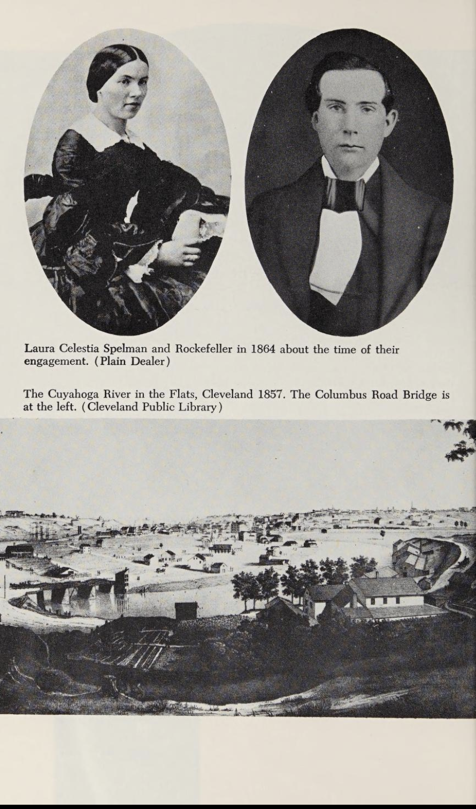

<!-- page_id: 0034-right | printed: none | viewer_token: none | viewer_sequence: 70/340 -->
## Unnumbered Page

> ttt ae

### ey ly v

> =

> Te

> af

<!-- issues: low_ocr_confidence:31.12 -->

<!-- page_id: 0035-left | printed: none | viewer_token: none | viewer_sequence: 72/340 -->
## Unnumbered Page

Founders of the Standard Oil Company, 1870. Above: John D. Rockefeller, president, and William Rockefeller, vice president. Left to right: Henry M. Flagler, secretarytreasurer; Samuel Andrews, superintendent; and Stephen V. Harkness.

<!-- issues: missing_printed_page_number -->

<!-- page_id: 0035-right | printed: none | viewer_token: none | viewer_sequence: 72/340 -->
## Unnumbered Page

> a a

> os n *

> Aunet r% Yas —o ese

> set

> he

Rockefeller’s first office was in the Sexton Block, Merwin and Superior Streets.

E

<!-- issues: low_ocr_confidence:29.07 -->

<!-- page_id: 0036-left | printed: none | viewer_token: none | viewer_sequence: 74/340 -->
## Unnumbered Page

ie ve yr yee ad gee a a eaaaa ty Gul i) teas) &

> BY ams of

Cleveland’s Public Square in 1873. (Cleveland Public Library)

Cleveland’s Public Square in 1895, shortly after dedication of the Soldiers and Sailors Monument. (Standard Oil Company, Ohio)

> =

* s TUR Ce eit at > Lith BOL} on 1 “i ey LTE!

> =

> FAA, t rat

PF ak 5 SWS TEP ans | Ci) pi ae ey +4 my 7 az

Pr eT ala i ~ ERS te MITER oad, 7 niin

<!-- issues: low_ocr_confidence:49.28 -->

<!-- page_id: 0036-right | printed: 51 | viewer_token: none | viewer_sequence: 74/340 -->
## Page 51

hands to eyes and peered down. Thick, dark liquid, greasy and illsmelling, had risen almost to the top of the tubing. | “Oil! Oil!” he shouted. Men came running. Crowds swarmed about the rigging. They _ came mostly from the near country. Men looked and hurried to buy | adjacent land, made plans to dig wells. But it was a mild and limited flurry, at first, nothing like the wild stampede that broke out later. Contrary to the way the story often is told reverberations did not fan out immediately from Titusville. If echoes reached John D., chances are he was indifferent. He was fully occupied with his new business. In writing about this period in his Reminiscences, it is significant that he does not mention Drake’s find. Similarly, Cleveland newspapers ignored the excitement in Pennsylvania, if indeed any hints of it came their way. Editors were preoccupied with other items such as lake shipping, the prospects of trans-Atlantic trade for local vessel owners, and the like. Before the public and the press had assessed Drake’s achievement, it was relegated to the background. Seven weeks to the day after the triumphant cry of “Oil,” John Brown and his men rocked the country to its depths with their attack at Harper’s Ferry. News- | papers devoted columns to the raid, the “Old Man’s” trial, and his composure as he faced the gallows. Harper’s Ferry had rallied no | Negroes: it had hastened the coming of the Civil War. All the while, efforts of Cleveland manufacturers to improve illuminants were matters of great interest to editors and readers. S. S. Barrie, for one, was advertising coal oil that “notwithstanding failures elsewhere is a brilliant success . . . non-explosive, guaranteed not to smoke if used in proper lamps,” and cheaper than lard or sperm oil or gas. The Cleveland Oil Company in new quarters at Water and St. Clair Streets was offering “a fine grade of lard oil and sterino candles.” An Englishman, C. E. Dean, who had been refining lard oil and manufacturing coal oil from cannel coal, acquired ten barrels of crude oil from the Oil Regions. He and his assistants, John Alexander and Samuel Andrews, also Britishers, experimented with this * lot of oil. Finally they produced kerosene. It is said their success, |

<!-- page_id: 0037-left | printed: 52 | viewer_token: 52 | viewer_sequence: 76/340 -->
## Page 52

to a large extent, was due to Andrews. It was the first kerosene made in Cleveland. In the meantime, details about the Titusville oil flow did not appear in a Cleveland newspaper until November 18, when the Leader got around to noticing the event that had occurred nearly three months before. Anything but a sensational presentation, the low-keyed report was published on an inside page: The Oil Springs of western Pennsylvania are attracting considerable attention and there is quite a speculative rush for the oleaginous locations. According to the Mercer Dispatch, some of these are better than gold mines for it says that until the recent fire which burned up the works of Mr. Drake at Oil Creek the well yielded from 25 to 35 barrels a day at a cost of ten cents per barrel! New Works are to be erected when it is supposed double the quantity will be obtained. We suppose 10 cents per gallon should be substituted for 10 cents per barrel. Another paper puts Mr. Drake’s profit at 90 cents per gallon clear, or over $400 per day. The reporter stated that two of the citizens of Conneaut (Ohio) visited the newly discovered deposits of oil in Titusville, Crawford County, Pa. last week and brought back samples of it. The Reporter says: Our readers will recollect that this oil was found issuing from a fissure on a rock on the bank of a small creek and early in the past season a shaft was sunk and at a distance of sixty-nine feet oil was found in apparently inexhaustible quantities. About forty barrels of oil is pumped daily from this well, and which, it is said, finds a ready market. More recently another shaft was sunk and oil at the depth of seventy feet found. Arrangements are now making (sic) for the sinking of other shafts. Indeed we learn that the land in the vicinity is eagerly sought for by companies and corner lots and oil springs are at a high figure. Geologists tell us that underneath the rock where the oil is found are large deposits of coal and that for ages this oil has been collecting from it. The doings in Pennsylvania seem to have won the attention of few Clevelanders. An exception was J. G. Hussey, of Hussey & Mc-

<!-- page_id: 0037-right | printed: 53 | viewer_token: 52 | viewer_sequence: 76/340 -->
## Page 53

Bride, a produce company in the Flats. Rumors got about that Hussey had made a trip to the Oil Regions and had acquired well rights on a large farm. On his return to Cleveland, he dodged questions and would say little about it. | Rockefeller and Clark, of course, knew him and had heard the | riverside gossip about his plunge into the new industry. The partners, however, were concentrating on their River Street business. Commission Merchant Rockefeller had reason to be pleased with his first year’s experience as his own employer.

> 11. Oil as a Sideline

When Clark & Rockefeller closed company books in March 1860, at the end of their first year, John D. stated “our sales amounted to half a million dollars.” Their net profit was $4,400. Divided between them, this meant that the junior partner, during his first year in business for himself, had earned three times what he received the previous year from Hewitt. The Oil Regions of Western Pennsylvania were now fully in the grip of a boom and an orgy of drilling. Land prices skyrocketed. Forests of oil derricks crowded the landscape. At some wells the greasy liquid flowed out beyond control; at other sites nothing surfaced. Rockefeller soberly weighed such reports now relayed daily to Cleveland. He concluded oil was speculative and hazardous. He would keep his mind on grain and meat consignments. Within a year a couple of small refineries were operating along the Cuyahoga, the tell-tale residue from them dirtying the river. Clark & Rockefeller began to handle heavy, often leaky barrels of crude petroleum shipped out of Pennsylvania. George W. Gardner was taken into the commission firm. He had worked with Clark at Otis, Brownell Company and was welcomed

eee Fp

<!-- page_id: 0038-left | printed: 54 | viewer_token: 54 | viewer_sequence: 78/340 -->
## Page 54

by the partners, for he had cash to contribute to the company’s capital. His connection was of short duration. Gardner appears to have been something of a playboy, at least in Rockefeller’s evaluation. The new partner owned a handsome boat that he loved and kept moored in sight of the office. The graceful craft floating gently at anchor tempted him. On a summer day, with soft breezes stirring, he was known to slam shut the company ledger, hurry off and set sail over Lake Erie’s waters. More than once he tried to persuade John D. to leave his desk and join him. But the youngest partner could neither comprehend nor tolerate such indifference to the work at hand. Before long the sign over the commission house at 32 River Street once again carried only the names of Clark and Rockefeller. Gardner, a member of a prominent Cleveland family, remained an ardent sailor, later becoming Commodore of the Cleveland Yacht Club. He was active in local business and politics. He served as president of the board of trade in 1868 and as mayor of the city in 1885-1887, and again in 1889-1891. Rockefeller was well into his second year as partner of a growing business before he reached the age of twenty-one. Eligible to vote for the first time in the November elections of 1860 that put Lincoln in the White House, presumably he cast his ballot for that candidate. The choice of the majority of Clevelanders, Lincoln was staunchly backed by the Leader. By contrast, the Plain Dealer, under Editor J. W. Gray, represented an articulate minority who championed Stephen A. Douglas. Pre-election tensions had been siphoned off temporarily on September 10th when crowds turned out for dedication of a statue honoring Commodore Oliver Hazard Perry. It was placed in the center of Public Square, which from then on was officially designated as Monumental Park. The new name, however, was never widely accepted. The unveiling took place on the anniversary of Perry’s victory on Lake Erie. Banker Handy persuaded his friend George Bancroft to be orator of the day. It was an appropriate choice, for Bancroft, famous for his work on American history, also had served as Secretary of

<!-- page_id: 0038-right | printed: 55 | viewer_token: 54 | viewer_sequence: 78/340 -->
## Page 55

the Navy, and had had a leading part in establishing the Naval Academy at Annapolis. Men streamed from offices and shops to hear the distinguished visitor. Since the speaker was his bankerhero’s friend, Rockefeller, it is likely, joined the crowd. After taking charge in the early days of Clark & Rockefeller’s office details, the junior partner decided to try his hand at customer development. It was an imaginative departure from commercial practices of the day: I began to go out and solicit customers—a branch of work I never before attempted. I undertook to visit every person in our part of the country who was in any way connected with the kind of business that we were engaged in, and went pretty well over the states of Ohio and Indiana. I made up my mind that I could do this best by simply introducing our firm, and not pressing for immediate consignments. I told them that I represented Clark and Rockefeller, commission merchants, that I had no wish to interfere with any connection they had at present, but, if the opportunity offered, we should be glad to serve them, etc., etc.

In this passage Rockefeller revealed a good deal about himself and his business philosophy, in essence, a pattern he followed in the big deals that lay ahead. Trimly clad in conservative but good clothes appropriate for the role of a well-established merchant, he presented his proposition simply, with a quiet voice and few words. No bombast, no high-pressure salesmanship. His hearers concluded this earnest young man was one they could trust and they gave him their business. “After I stayed in the country a few weeks, I returned home,” he said, “and the consignments came in.” For the distant calls he went by train, but when he could he drove, always happy to have a horse at his command. His travels carried him into the rich agricultural districts of the two states. He enjoyed these forays for at such times he was reminded of the bucolic countryside of his New York State boyhood. On these expeditions he met Henry M. Flagler in Bellevue, Sandusky County, Ohio, heart of lush corn and wheat country. Flagler was related to Steven V. Harkness, an influential citizen in that part

eS rip

<!-- issues: low_ocr_confidence:72.39, missing_printed_page_number -->

<!-- page_id: 0039-left | printed: 56 | viewer_token: 56 | viewer_sequence: 80/340 -->
## Page 56

of Ohio. The Clark & Rockefeller firm was handling consignments from Flagler regularly and it may be that it had similar contacts with Harkness, who was also a grain dealer. On February 15, 1861 Abraham Lincoln stopped off in Cleveland on the way to his inaugural. The sad-faced, gaunt man, stovepipe hat in hand, rode down Euclid Street in an open carriage as a cold rain fell. Church bells pealed, to be drowned out by thundering cannon in the noisy welcome. Throngs gathered at the Weddel House as the president-elect addressed them from the hotel balcony. The thin man towering above the hundreds massed before the hotel plead for the Union and the Constitution, although secession already had been proclaimed by six states. A month after Lincoln’s visit, the partners at 32 River Street finished their second year of business. Profits had soared from $4,400 in 1860 to $17,000 in 1861. Rockefeller’s charitable program expanded accordingly. The previous year his ledger showed he had given away $107.35. This year his donations came to $250.97. On April 13th Fort Sumter fell to the Confederates. Two days later Lincoln asked for seventy-five thousand three-month volunteers. An overflow audience jammed Cleveland’s Melodeon Hall to hear Judge Rufus P. Spaulding’s ringing appeal for citizens to forget politics and rally to the Union cause. Torchlight processions and street-corner exhorters boosted recruiting. The Cleveland Grays, a military organization of elite young men who had formed an honor guard for Lincoln on his stop-over two months before, was the first group from the city to leave for the front. Other young men, about Rockefeller’s age, employed in the Flats were giving up their jobs to join the forces. Older men in executive positions departed with them. Rockefeller watched them go. Many of them he saw every day. He was troubled. He knew that he, not Clark, was the company’s mainstay. He realized his mother and the Cheshire Street household were largely his responsibility. While his father was better off financially, he was as mercurial as ever, his treks away from home becoming more extended. Young William was not enlisting, but anyway John D. felt he could not shift his obligations to him. The

<!-- page_id: 0039-right | printed: 57 | viewer_token: 56 | viewer_sequence: 80/340 -->
## Page 57

upshot was John D. Rockefeller did not go to war. His conscience } obviously bothered him, for he believed in the Union cause. Stories/ persist about his gifts of large sums to families of soldiers, to local war relief funds, and for equipment given to individuals who had, enlisted. . One morning Levi Scofield, now a captain in the Union Army, led thirty recruits into Rockefeller’s office, for what purpose we do not know. According to the captain, who recounted the incident years later, the commission merchant went to his office safe, lifted out a heavy bag and from it gave each of the men ten dollars. “God! how rich he must be,” exclaimed one soldier-to-be under his breath. “Yes,” agreed a companion, “maybe worth as much as $10,000!” It was Captain Scofield who afterwards designed Cleveland’s Civil War Memorial, the Soldiers and Sailors Monument, a landmark on the Public Square that cost $280,000 and was dedicated on July 4, 1894. One member of the Rockefeller family, young Frank, did join the Union ranks. Not yet sixteen and fired by the impassioned drives for recruits, the youth tried to sign up. Rejected at first because of his age, he refused to be thwarted. Trying a second time he managed to be accepted through a boyish trick. Before returning to the recruiting office he chalked the numerals “18” on the soles of his shoes. When the officer in charge, looking at him quizzically, asked his age, he replied quite truthfully: “’'m over eighteen, sir.” Frank disclosed none of this to his family, but alert Doctor Rockefeller somehow got wind of what was up. As the boy was stealthily leaving the house, his father’s voice boomed out ordering him to come back. If he must go to war, he said to the boy, “say goodbye like a man!” John D. was distraught, but stood by his impetuous brother. He supplied him with money and his needs, including clothes and a rifle. Frank served in the army for almost three years. He was wounded in 1862 at Cedar Mountain and again the next year at Chancellorsville. After the latter engagement he was given an honorable discharge. Cleveland newspapers filled their pages with news from the bat-

ee Fp

<!-- issues: low_ocr_confidence:67.8 -->

<!-- page_id: 0040-left | printed: 58 | viewer_token: 58 | viewer_sequence: 82/340 -->
## Page 58

tlefields. Names like Bull Run, Fredericksburg, Antietam, Stone River and Chickamauga were on every tongue. As in the case of many businesses, war orders stimulated trade for Clark & Rockefeller. The firm was forced to acquire three additional offices adjacent to the original headquarters. Congressional investigation disclosed widespread profiteering, by merchants and manufacturers supplying war materiels, as well as corruption in government contracts. No shadow of irregularity fell on Rockefeller, as even those otherwise hostile to him readily conceded. One of his biographers, John T. Flynn, author of God’s Gold, often critical of him, writes on this point: “As for Rockefeller, his firm made a great deal of money during the war so that when it was over he was a rich man. But there is no evidence that he engaged in any questionable transactions or dealt in any improper way with the government.” He had benefited from the rising prices. But he was honest. As the casualty lists lengthened and Americans fought Americans in a seemingly interminable bloody struggle, war took precedence over every topic save one—oil. While battles raged, oil wells were going down in Pennsylvania, yielding steady flows of the liquid treasure—or nothing. Fortunes were made, and vanished. A Cleveland tale, persistent but never confirmed, is that a group of local businessmen, impressed with the diligence and reliability of young Rockefeller, sent him on an early inspection trip to the Oil Regions. Whether or not he went at this time, he did go later. In any case, he could not ignore the subject of oil. The steady increase in crude oil sales was apparent in shipments handled by his firm. Refineries were functioning in several parts of the country, including Cleveland. Getting the petroleum from its source to the refineries became the great problem. In a few situations, rivers and creeks provided transportation of a sort, but for the most part, draying was relied on. Roads, totally inadequate to begin with, soon were churned to ribbons of mud. Overloaded, creaking wagons crawled from the wells in unbroken lines, Horses and mules were strained to exhaustion, often forced on by cruel beatings.

<!-- page_id: 0040-right | printed: 59 | viewer_token: 58 | viewer_sequence: 82/340 -->
## Page 59

The year 1863 was ushered in with Lincoln’s Emancipation Proclamation. The Plain Dealer consistently castigated the President for exceeding his authority in the conduct of war. The Leader endorsed his assumption of power as essential for ending the conflict. _ Against the much-publicized objections of residents in the fine houses on lower Euclid Street, a horse-car trolley was put into operation from Public Square to Erie Street. This year John D. Rockefeller went into oil. Among the many men discussing this newly revealed bounty of nature, none was more eloquent about it than the Englishman, Samuel Andrews. He could think of little else since that achievement of distilling kerosene from those barrels of petroleum at Dean’s refinery. He had come to Cleveland in 1857, a self-taught chemist who was expert in tallows, candles and the like. Now he was fascinated at the possibilities he saw in this new substance—petroleum. Convinced that kerosene, properly made from it, surpassed all other illuminants, and shortly would supplant them entirely, he wanted to organize a company to manufacture the product. Enthusiastically he presented his idea to Rockefeller and Clark, both of whom he knew. Rockefeller saw him frequently at the Erie Street Baptist Church where he and Mrs. Andrews were members. Andrews was a native of Wiltshire, like Clark, and the latter had befriended him when he arrived in Cleveland, helping him to locate his first job. Rockefeller and Clark listened to what he had to say. The subject was not new to them. They, too, had been discussing oil intently. From the numerous sidelights on the family as contributed by Rockefeller’s sister, Mary Ann, we have a glimpse of him at this time, facing a crucial decision. He was thinking about oil continually, his sister disclosed. In the middle of the night he was known to waken William, his bedfellow, to go over some new angle that had occurred to him. She related how Clark and Andrews soon were coming early every morning to the side door of the Rockefeller home on Cheshire Street to sit beside John in the dining room while he ate his breakfast. “They all talked oil, oil, oil until I was sick of the word!”

ee rip

<!-- issues: low_ocr_confidence:63.95, missing_printed_page_number -->

<!-- page_id: 0041-left | printed: 60 | viewer_token: 60 | viewer_sequence: 84/340 -->
## Page 60

she declared. “They always waited until John finished eating, for,” she added, “they did not seem to want to go without him. Then they would walk off to work together, still talking about oil.” John was at breakfast by 6:30 or before, Mary Ann explained. He was carrying out their father’s admonition: “If you want your business to succeed, be there early and start it yourself.” John D. approved of Andrews’s thrifty ways. His wife took in sewing to plump the family budget. The couple saved money, always a measure of merit with Rockefeller. The infant oil industry, Rockefeller realized, was anything but stable. Wells were dug indiscriminately. Too many refineries were springing up. Already more than a dozen operated in Cleveland. The previous year crude oil brought from thirty-five to fifty cents a barrel at the pumps and, when refined, the same price per gallon. Profits, Rockefeller saw, were in the refined oil rather than in the crude. Despite the threat of over-production, he finally reached the conclusion that with good management money could be made in oil, and he invested several thousand dollars. In 1863 a new firm emerged—Andrews, Clark & Company. Maurice brought in his two brothers, James and Richard, who had followed him to Cleveland. Rockefeller’s name did not appear as a member of the organization. If he was a silent partner, he soon was the one in command. Greatly to the new firm’s advantage, the Cleveland, or western end of the Atlantic and Great Western Railroad was completed early in July. Final spikes were pounded into place the day after Lee retreated at Gettysburg. Financed largely by English capital, the road had been planned before Drake's strike at Titusville. The line penetrated the very heart of the Oil Regions, supplying for the first time an efficient means of transportation of crude petroleum from wells to refineries. Through a connection with the Erie Railroad, it shortly provided a direct route to New York City. The A&GW, with its broad, six-gauge tracks, gave Cleveland not only access to oil sources, but linked the city with the eastern seaboard markets and exporting facilities as well. This railroad became the nation’s greatest carrier of oil, offering stiff competition to other lines. Later, it was absorbed by the Erie

<!-- page_id: 0041-right | printed: 61 | viewer_token: 60 | viewer_sequence: 84/340 -->
## Page 61

in Jay Gould’s take-over of that line. The A&GW’s importance to John D. Rockefeller and to Cleveland was enormous. On November 3rd the railroad’s first train, its shiny locomotive patriotically flaunting Union colors, steamed into the city at forty miles an hour. On November 19th Lincoln delivered his immortal address at Gettysburg National Cemetery in memory of the 7,058 Americans who had killed each other on the battlefield. The Plain Dealer sent a reporter, whose brief dispatch the following day informed readers that “the weather being fine, the program was carried out successfully.” Not a word of Lincoln’s speech. The local press was more impressed with the glittering banquet staged about this time by the influential Board of Trade in recognition of the new railroad and its titled English backer, Sir Morton Peto. The menu featured nine varieties of fish, as many of meat and game, dozens of pastries and “liberal servings of sparkling champagne.” Guests included the popular General James A. Garfield, returned from the war and lionized for his service; Amasa Stone, bridge builder and railroad director, and wealthy H. B. Payne, sonin-law of the respected pioneer, Nathan Perry. John D. Rockefeller, whose oil shipments would constitute the road’s heaviest freight, did not attend. He probably was not invited. Not one to court association with the prominent or to indulge in the pleasures of the table, he likely gave no thought to the affair. The young oil executive instead was busy clinching an option he had taken in the name of Andrews, Clark & Company on a threeacre piece of land abutting on the new railroad. The property lay on the south bank of Kingsbury Run, where the stream cut its channel to the Cuyahoga (and today is hidden in a culvert as it empties into the river). Providing water as well as rail transportation, the plot was the nucleus of the one hundred-acre site occupied later by the Stan- _ dard Oil Company. From this high point there was a good view of Cleveland and its Public Square less than two miles distant. Tall trees, remnants of a virgin forest, shaded the banks of the Run. Photographs show a cow grazing placidly beside the busy plant's crude buildings. Rockefeller stated that in this period he regarded oil as a side-

<!-- issues: missing_printed_page_number -->

<!-- page_id: 0042-left | printed: 62 | viewer_token: 62 | viewer_sequence: 86/340 -->
## Page 62

line. Nevertheless, he gave serious attention to the newly launched refinery on Kingsbury Run. “It was my first direct contact with the oil trade,” he said. Meanwhile he kept his hand firmly on the throttle of the commission business. It was a flourishing enterprise as shown by public notices like the following:

A consignment of 1300 barrels of salt from the new Michigan Salt Works was received yesterday by Clark & Rockefeller. 500 bushels of clover seed, 800 bushels of timothy seed and 200 barrels of mess (army) pork now in Clark & Rockefeller warehouse ready for immediate shipping. But Rockefeller had another interest more compelling than refining oil or selling produce.

> 12. Cettie

Perhaps it was at anti-slavery meetings that Rockefeller renewed his acquaintance with Laura Celestia Spelman—“Cettie” to her classmates, and “Cettie” to John. The Spelmans were ardent abolitionists. Rockefeller, too, it would seem, was drawn early into the crusade, judging from his gifts to Negro causes. Chances are he had not forgotten the chestnut-haired Cettie who sat on the girls’ side of the classroom at Central High School. In those days Cleveland was a small community. Consequently, John had no difficulty keeping informed of Cettie’s whereabouts, although her parents changed residence frequently. The Spelman family, coming to Cleveland from Akron in 1851, settled first on “The Heights,” on the southwest side of the crooked Cuyahoga near the site of the short-lived Cleveland University. John and his brother Will, who had acquired saddle horses as soon as they could afford to buy them, found it a pleasant expedition to canter across the river valley for a call on the Spelmans. Before long, only John’s mount was seen tethered in the Spelman dooryard. Tale t

<!-- page_id: 0042-right | printed: 63 | viewer_token: 62 | viewer_sequence: 86/340 -->
## Page 63

Cettie’s family moved into the city proper, taking a house on Perry Street near Euclid Street, and finally to a permanent home at 58 Huron Street. John followed their peregrinations. The Huron Street address was within walking distance of the Rockefeller residence on Cheshire Street. Sometimes John stopped in at the Spelmans’ on his way home from his refinery. He might be in working clothes, his shoes muddied. He was known to take his place beside his employees when they were pressed for help, and he was not above trundling a barrel or two of oil in a wheelbarrow. Most of the time, however, he presented himself in his usual, immaculate attire. Harvey B. Spelman, Cettie’s father, was a prosperous merchant. As a child he had come from Massachusetts to Rootstown, Portage County, Ohio, where the family became prominent citizens. Spelman pioneered in several northern Ohio towns, opening a store in Wadsworth, Medina County in 1833. Two years later, in Middlebury, now part of Akron, he married Lucy Henry, also of New England lineage. She was a teacher in a one-room log school. They lived for a short time in Le Roy, Medina County, where, in 1837 Lucy, eldest of their two daughters, was born. Returning to Wadsworth Spelman operated a general store on Main Street. The building housing it seems to have served as both store and home, for it was the birthplace of Laura Celestia on September 9th, 1839. John D. Rockefeller was born two months before. Following a short business connection in Kent, Spelman moved his family to Akron where he managed a store at the corner of Hower and Market Streets, and also a branch in the nearby village of River Styx. He became a member of Akron’s first Board of Education in 1847, and in 1849 was elected as representative to the Ohio Legislature. He was an active supporter of the so-called “Akron Plan,” a system of free graded schools, then an innovation but later widely adopted. Wherever the Spelmans settled they participated in community affairs and were early won to the anti-slavery cause. In Cleveland their home, probably the one on Huron Street, was a “station” on the Underground Railroad. Mrs. Spelman used to say that the only

7) ee ip

<!-- issues: low_ocr_confidence:63.21 -->

<!-- page_id: 0043-left | printed: 64 | viewer_token: 64 | viewer_sequence: 88/340 -->
## Page 64

times she broke the Sabbath was when she cooked hot meals for the fugitive slaves sheltered in her home on their way to Canada. About this time Spelman went to Burlington, lowa where he opened a store, and in 1856 the family lived there for a time while continuing to maintain their Cleveland residence. The Spelmans were Congregationalists, adhering as firmly to their doctrines as Rockefeller to his Baptist faith. In Cleveland, and in several other Ohio communities, Lucy and Harvey Spelman helped organize churches of their denomination. They continued to support the Congregational Church in Rootstown where their relatives worshipped. Cettie also kept in touch with Rootstown, and after her marriage made numerous gifts to the village church, including, on one occasion, a large pipe organ. Laura Spelman had been teaching four years in the “lower forms” at Hudson Street School in Cleveland when Rockefeller’s visits turned into serious courtship. According to Lucy, it was in March 1864 when her sister said the magic yes and the two were formally engaged. They did not spread the news; few knew about it, Lucy added. Harvey Spelman and his wife were proud of their daughters and had them photographed often. We see Cettie as a very attractive young woman, her dark and luxuriant hair combed into a knot from a straight center part, her fine eyes with a happy gleam. Her dress followed the current style with full sleeves and billowy skirts, along with prim lace mittens and a bonnet tied under her chin. Cettie had more advantages in schooling and travel than her fiancé. After she and her sister graduated from high school, their parents sent them to Oread Collegiate Institute in Worcester, Massachusetts. Established in 1849, the school was among the first institutions of higher learning open to women. Emphasis was on the classics, Christian living and Negro welfare. Abolition was a burning issue. The school scheduled such visiting lecturers as Emerson, Thackeray, Wendell Phillips, and Henry Ward Beecher. John Brown came to exhort the students who listened to him as to a prophet. Religion, a strict uncompromising variety, was stressed. Cettie,

<!-- page_id: 0043-right | printed: 65 | viewer_token: 64 | viewer_sequence: 88/340 -->
## Page 65

given to letter writing, had been in the habit of writing home each Sunday until the school declared such activity a desecration of the Sabbath. The product of a devout upbringing herself, she was dismayed and selected another day for her weekly epistle. Despite the rigid regime, she entered into the Oread schedule, her zest, albeit, somewhat dimmed by a five-thirty rising bell for prayers at dawn and recitations that began at seven. She was “Editress” of the school paper, Vox Oreadum, “issued weekly by the Oread Euphemia and devoted to literature and general intelligence (politics excluded).” It was handwritten by Cettie whose penmanship was excellent. She found the New England winter severe, and so expressed herself in a long essay entitled “The Winter King Has Triumphed.” Under the by-line, Cettie L. Spelman, her contributions to the Oreadum included a many-versed poem which began:

> Are there not studies on each leafy tree? Did God not write his glorious sermons there? Are there not lessons in the deep-tossed sea? Are there not whispers in the wild, free air?

In addition to the advantages offered at Oread, she and Lucy had had a better than average musical education. When the Spelmans were in Iowa, their daughters studied piano and voice under a much-loved teacher who made creditable amateur musicians of both young women. With all this to offer, the sisters presented their credentials to the Cleveland Board of Education, applied for positions and were engaged. Lucy as well as Laura taught at Hudson Street School. For one interlude Lucy was a member of the faculty of Cleveland Institute, a successful coeducational boarding and day school. It had taken over the campus of the former Cleveland University on the South Side near where the Spelmans lived for a time. The director was Ransom F. Humiston, once a teacher in the public schools. One of Cettie’s able pupils was John Green, a Negro whose late father had purchased John’s freedom in the South. The boy and his mother, also a freed slave, came to Cleveland but had a difficult time in the unfamiliar setting. John, however, managed to re-

a OOhhhhrrrrtrtrt———C“(‘i‘iRR SS

<!-- issues: low_ocr_confidence:76.28 -->

<!-- page_id: 0044-left | printed: 66 | viewer_token: 66 | viewer_sequence: 90/340 -->
## Page 66

main in school. Eventually he became a lawyer and practiced in the city. As Ohio’s first Negro state senator, Green introduced the legislation that ultimately led to annual observance of Labor Day as a national holiday. Often referred to as the “Father of Labor Day,” he attributed much of his success to his teacher, Miss Spelman, who had encouraged him to go on with his studies. In later years, Green, with his wife and children, were frequent guests of the Rockefellers at Forest Hill. Reminiscing about Laura in 1917, two years after her death, Lucy described her sister as:

gentle and lovely, but resolute with indomitable will, that had been ‘trying’ when she was little. She was slender but strong . .. quiet in her movements and speech, and had a soft, gentle voice . .. There was pursuasion in her touch when she laid her fingers ever so gently on your arm. Later as Mrs. John D. Rockefeller, she took no part in her husband’s business affairs. Nevertheless, she was his devoted partner, maintaining their home as a quiet harbor where he could be sure of surcease from outside pressures. Both were deeply religious and neither cared for formal social affairs. The two shared a love of music which became an important element in their family life. Another common bond was concern for community welfare. As appeals for help mounted, Rockefeller’s giving reflected his wife’s point of view as much as his own.

<!-- page_id: 0044-right | printed: 67 | viewer_token: 66 | viewer_sequence: 90/340 -->
## Page 67

### 13. “The Boss Is In Love”

Rockefeller pursued his marriage plans systematically. He maintained a financial diary covering his courtship, wedding, and honeymoon. The old account book, Ledger A, was superseded in 1864 by Ledger B. In it under the heading “Sundry Expenses” he recorded romance-related expenditures as well as purely personal items. The new volume was a sturdier, thicker journal as befitted one whose community and business interests were expanding rapidly. Discerning Cleveland leaders saw the twenty-five year-old “Mr. Rockefeller” as a citizen to be recognized, already a man of some wealth, well launched toward more. Despite his easier financial condition, he continued his early habit of accounting in detail for income and outgo. The practice, he explained, kept him up to date on his financial cireumstances. No matter how small the sum it was noted in his ledger. Entries of five cents occur frequently for such expenditures as tolls on bridges over the Cuyahoga, as well as on certain roads; and for “car” rides, which meant trips on horsecars then widely in use. The small size cars were the bane of women wearing hoop skirts, until the invention of the “tilting” or collapsible device. If Rockefeller bought a postage stamp, its cost, five cents or less, was jotted down, along with the five cents and one cent that one time he gave to his sisters, Lucy and Mary Ann. He apparently was fond of “sodas” (maybe ice cream soda?), and each time he indulged himself in the treat, the price, ten cents, went into the book. In February of this year there were notations of from five cents to one dollar and twenty cents under “Fair.” In other words, Rockefeller had been attending the Northern Ohio Sanitary Fair which opened that month on the Square with great ado. General Garfield, who had resigned from the army and was now a United States Congressman, gave the principal address at the dedication of the vast new building. It was arranged in the form of a Greek cross

EEE eee EEE Fp

<!-- issues: low_ocr_confidence:77.1 -->

<!-- page_id: 0045-left | printed: 68 | viewer_token: 68 | viewer_sequence: 92/340 -->
## Page 68

around the statue of Commodore Perry. The Fair’s aim was to raise funds for the Soldiers’ and Sailors’ Aid Society, that became a branch of the United States Sanitary Commission, forerunner of the American Red Cross. The event attracted many hundreds and a substantial amount was realized variously estimated at from $78,000 to $100,000. Cettie had accepted Rockefeller’s proposal in March 1864, and on April 8 her suitor made a large purchase — “Diamond Ring” for $118. Measured against dollar values of that era, it was an expensive piece of jewelry. He was not stinting on Cettie. About the time of this important transaction, his other expenditures were:

> $ .05 1.00 1.00 5.00 (War Relief Fund) 50 1.00 50

apples $ .05 barber 1.00 medicine 1.00 4th ward 5.00 (War Relief Fund) buttermilk 50 sponge 1.00 nuts 50 A significant entry in Ledger B for May was “Fairfield, $53.29.” It indicated that Rockefeller had gone to Fairfield, Connecticut, for the wedding of his brother William and Almira (“Mira”) Geraldine Gooddell that took place there on May 24th. By May 28th, Rockefeller was back in Cleveland jotting down his railroad fare and other

expenses. The date selected for his own wedding was September 8th, one day before his bride’s twenty-fifth birthday. As the time drew near, Rockefeller stepped up his role of attentive swain, making numerous purchases that could have been intended only as gifts for his bride-to-be. True to his principles, he meticulously entered each one in his ledger. He bought “Bouquettes” at from fifty cents to a dollar and a half. He paid three dollars for a “Viynette” [sic]—his spelling still troublesome. Another, spelled correctly this time, cost five dollars and seventy-five cents. (How one would like to know what kind of vignettes caught Rockefeller’s fancy!)

<!-- page_id: 0045-right | printed: 69 | viewer_token: 68 | viewer_sequence: 92/340 -->
## Page 69

On the “Fourth of July,” he spent three dollars and forty-eight cents. With the steadily mounting count of Cleveland men killed or wounded in Civil War battles in the South, the city’s mood was a sober one on this year’s holiday. The event of the day was a procession of wounded veterans who were cheered and wept over by crowds of patriotic citizens along the line of march. The culmination was a public banquet for the heroes. Rockefeller’s entry may have covered the price of tickets and transportation for himself and Cettie. The journal mentioned numerous “drives,” outings, probably in rigs hired from a livery stable. One drive was as far away as Rocky River at a cost of a dollar and seventy-five cents—in all a ten mile round trip! The account book disclosed other expenses, some sizable:

> dentistry Mary Ann History of Rebellion blister wine [surprising! ] runaway accident

> $ 50.00 101.50 (Lake Superior trip) 4.00 BS) 50 2.60

Rockefeller bought a wedding ring for Cettie for $15.75 and had it engraved. He began getting himself ready for the wedding and the tour he had mapped out:

umbrella, bag repaired $ 75 new bag [valise?] 7.00 opera glasses 16.50 covering trunks 8.00 In those days of late summer Rockefeller was busier than he ever had been. The Andrews, Clark refinery was going very well, better every day. In 1863, when they first took over their threeacre site, they had leased the land, but within a few months they bought it outright. They gave the operation a name: The Excelsior Works. The real head of the venture, as well as of the commission house, was John D. Rockefeller. Despite these responsibilities, his ledger shows that he took plenty of time out for his romance. He was an ardent bridegroom.

> $ .75 7.00 16.50 8.00

| ee Fp

<!-- page_id: 0046-left | printed: 70 | viewer_token: 70 | viewer_sequence: 94/340 -->
## Page 70

On the day of the wedding he arranged a special dinner for his refinery employees—there were twenty-six of them now. Naturally reticent, he had divulged nothing about his marriage. The men surely would have suspected something of what was up from his rare joviality. As he prepared to leave the works, he called gaily to the superintendent, admonishing him to keep everyone busy. “But don’t ask anybody to work for nothing,” he added as he hurried off with a light step, a smile on his usually serious face. “The boss is in love!” A month-long honeymoon had been planned. Rockefeller recorded the details, beginning with a succinct item: “September 8, married at 2 o'clock p.m. to Miss L. C. Spelman by Reverend D. Wolcott assisted by Reverend Page at the residence of her parents, 55 Huron Street.” (Actually the number was 58. ) Wolcott was not “D” but Samuel Wolcott, pastor of Plymouth Congregational Church, Prospect and Erie Streets, where the Spelmans worshipped. The other clergyman was S. B. Page of Erie Street Baptist Church. A notation in Ledger B, “Marriage, $20” presumably indicated what he paid the two ministers. No notice of the wedding appeared in any Cleveland newspaper. No description has come to light of what the bride wore. Judging from earlier photographs of her, doubtless she was a trim and stylish bride. A photograph of the two on Mount Washington, New Hampshire, during their wedding trip, showed the bridegroom, distinguished looking in a long frock coat and high silk hat, the attire of the well-dressed man. Six days before the wedding, Sherman had entered Atlanta. The war was tapering off, but far from over. Every train into Cleveland brought wounded, crippled veterans, who became a common sight on city streets. Ledger B reveals that Rockefeller at this time allotted monthly stipends of from fifteen to twenty dollars to substitutes and “Families of Soldiers from the 4th Ward.” There were also fifty dollar amounts to the Ward’s War Fund, as well as contributions for purchase of revolvers and the like for enlisted men. Following the wedding ceremony, a shiny brougham drew up in front of the Spelman home. The driver climbed down from his

<!-- page_id: 0046-right | printed: 71 | viewer_token: 70 | viewer_sequence: 94/340 -->
## Page 71

high seat to stand at his horse’s head, waiting for the happy couple to appear. Rockefeller had hired the carriage for two dollars from the livery stable around the corner to take him and the new Mrs. Rockefeller to the railroad station. It would have been the old Union Depot at the foot of Bank and Water Streets. The resplendent new Union Depot, then being planned, was not to be built for another two years. The Rockefellers’ first stop was Buffalo. The fare was ten dollars. After a few days there, they made the traditional honeymoon expedition to Niagara Falls. With stopovers along the way, the couple traveled by rail to Montreal and on to Quebec. Always committed to go to Sunday morning and evening church services wherever the honeymoon schedule took them, in Quebec, Rockefeller noted, they attended a Scotch Methodist Church. After a voyage on the St. Lawrence “by steamer” and a train journey to New England, they visited for a week in Boston “with wife’s friends.” The stay included a side trip to “Wooster” (Rockefeller’s spelling). Cettie wanted her husband to see the castle-like eminence surmounting its hilly campus that was the Oread Collegiate Institute. Or, maybe she wanted Oread to see the tall handsome husband she had acquired! Also on this call they met for the first time Sophia B. Packard and Harriet E. Giles, who only a few weeks before had joined the Institute faculty. Miss Packard was executive head and the other a teacher. These remarkable women, both Baptists, left Oread in 1867, and after an interval devoted largely to Baptist home missions, founded a school for Negro women in Atlanta, Georgia. Years later, with Rockefeller support, it developed as Spelman College. The bride and groom, however, had no intimation of such a development on this carefree stopover at Oread. They went on to Fairfield, Connecticut, where William Rockefeller and his bride of a few months were visiting her parents. All of the Rockefeller family liked William’s friendly, talkative wife, Mira. John and Cettie had a few days in New York City, perhaps the first time either had seen the metropolis. Heading homeward, they booked passage on a Hudson River boat as far as Albany. At Buf-

| es Fp

<!-- issues: low_ocr_confidence:70.03 -->

<!-- page_id: 0047-left | printed: 72 | viewer_token: 72 | viewer_sequence: 96/340 -->
## Page 72

falo they could not resist one more look at Niagara Falls before boarding the train for Cleveland. Like tourists everywhere, they spent money for souvenirs and keepsakes, as well as for necessities—all carefully accounted for, including: looking glass $ .75 silver cups 20.00 broom [two of these, probably whiskbrooms] .60 view of Niagara 15 cushion 1.57 pictures 1.50 hair restorer [a grooming aid] 1.00 Davis & Company, livery 8.00 Rockefeller indeed must have been enjoying himself. For once he failed to make daily entries of expenditures. Instead, at the finale of the trip, he summed it all up with: “Wedding tour, $490.” It should be noted that this was considerably less than what the bridegroom was designating during this period for various war aid programs. It also was less than Ledger B’s allocation that year for charity, a total of $671.86. One month was what Rockefeller had allotted for his honeymoon, and it was concluded within one month to the day. The couple returned to Cleveland on October 8th to make their home with the Doctor and Eliza at 33 Cheshire Street. They reached Cleveland on Saturday. (No traveling on the Sabbath.) Next day, so the ledger reported, both were at Sabbath School and church. It was the Erie Street Baptist and not Plymouth Congregational Church. Cettie was deferring to John. Most people did. The following day, Monday, Rockefeller was back in harness, writing the one word “Business” as a new heading in his ledger. Tuesday he was off to Chicago, returning on Saturday to resume on Sunday the routine of church and Sabbath School. By now, Rockefeller was undisputed lay leader of the congregation, working in a Baptist mission branch, teaching Sunday School and helping wherever he could. Mrs. Rockefeller soon was drawn in, beginning as teacher of an infant class.

$ .75 20.00 60 15 1.57 1,50 1.00 8.00

<!-- page_id: 0047-right | printed: 73 | viewer_token: 72 | viewer_sequence: 96/340 -->
## Page 73

The young people, it would appear, stayed with the elder Rockefellers for approximately five months. They paid ten dollars a week for board, as is learned from Ledger B. Apparently there were extras for what were described as “late meals” at two dollars, two dollars and a half, and at fifty cents. Horses’ board for the period came to $27.50. John and Cettie then rented a house at 29 Cheshire, either next door to his parents, or one house away. William and Mira soon arrived, moving into 39 Cheshire. They were a close knit clan, as this row of Rockefeller homes indicated. Cheshire was one of the beautiful streets of Cleveland. It was laid out about 1835 by Elijah Bingham, who came from New Hampshire in the early days and bought considerable land in this part of the city. His particular pride was a double row of trees he had planted that rose to magnificent heights and arched over the thoroughfare. Bingham built his own home here, and many important Cleveland families lived on the street. Bingham extended the street south from Prospect to Central Avenue, which was then called Garden Street in the section from Brownell (East 14th) to Willson (East 55th) Street.

14. “I Had Made Up My Mind... To Go Into The Oil Trade“

On the return from his honeymoon, Rockefeller plunged with zest into the activities of his two companies, the Clark & Rockefeller commission house and the Excelsior oil refinery. In general oversight as well as financially, he was the determining authority in both and both were prospering. Nevertheless, disagreement and a break with his partners loomed. His own point of view was shifting. Within a few months he brought about drastic changes in a sweeping, courageous reorganization. Clark & Rockefeller profits were high

| Se Fp

<!-- page_id: 0048-left | printed: 74 | viewer_token: 74 | viewer_sequence: 98/340 -->
## Page 74

in the fall of 1864. The firm enjoyed a fine reputation. Yet the junior partner was relegating it to second place as his interest in oil quickened. In November virtually all of the North rejoiced in Lincoln's reelection. Though Cleveland Copperheads had backed his opponent, General George B. McClellan, the majority of citizens, including Rockefeller, it is certain, hailed the outcome. Lincoln’s election was viewed as a portent of war's end. Already hints of a peacetime economic upswing were in the air. Optimism was reflected early the next year by Cleveland’s oil boom. New refineries appeared almost daily. A few of the works were substantial, but most were small and struggling, hampered by fumbling, costly routine. Converting petroleum to usefulness in the beginning days was a primitive process requiring relatively little capital and yielding high returns. Oil was a popular topic. The Leader, with its editorial ear to the ground, published a series of articles describing the refining process. The raw material, the newspaper writer explained, was emptied into a long, wooden trough in which lumps of ice were mixed in winter, and in summer, too, when ice was procurable. It was then strained into wood tanks, and thence conveyed to still houses to be boiled and vapors separated. First and lightest vapor was gasoline; next naptha or benzol and finally, the last and greatest in quantity, by far the most important, illuminating oil or kerosene. The paper stated that “gasoline is very inflammable and cannot be used in lamps with safety.” It was the unwanted, useless and little understood residue, accountable for the destructive fires that plagued early manufacturers. All, including the Andrews, Clark concern, were pioneering in an uncharted industry. But, under the watchful Rockefeller, this firm was steadily advancing. From the first, he backed and encouraged Andrews in his experiments. Soon that enterprising, resourceful young man was turning out a remarkably high quality and quantity of kerosene per barrel of crude oil. In his aversion to waste, Rockefeller vigilantly searched out the most efficient and economical procedures. To cut plumbing bills,

<!-- page_id: 0048-right | printed: 75 | viewer_token: 74 | viewer_sequence: 98/340 -->
## Page 75

he hired a plumber by the month and purchased his own pipes, fittings and like supplies. He was buying his barrels from George H. Hopper, an English cooper on the West Side of Cleveland. These barrels were made of white oak staves and were expensive. To curtail costs he bought the cooperage outright, keeping Hopper as its head. Next, to eliminate the middleman in lumber deals, he acquired a white oak forest. With an eye to handling lighter wood and therefore cheaper freight fees, Rockefeller conceived the idea of having staves cured where they were cut. Though an experienced cooper, Hopper ran into trouble: his barrels leaked. Try as hard as he could, he was unable to correct the oozing. Warehouse floors, freight cars, and wagon bottoms were smeared with the mess. Worst of all, Rockefeller was growing increasingly impatient at the loss of oil. Dejected and sunk in gloomy thoughts about his problem, Hopper was sitting on the stoop of his house one summer evening when a tramp approached and asked for something to eat. He was shabbily but neatly clad and had a certain air of breeding, Hopper observed. Procuring a plate of food from the kitchen, the cooper handed it to the stranger and, at the same time, surprised himself by blurting out what was worrying him. It was a relief to talk to somebody. The man listened, asked questions, then pulled from his pocket a stubby pencil and a crumpled bit of paper. After writing steadily for some time, he said: “Try this.” He gave the paper to his host. Before Hopper could examine it or query him, his visitor disappeared. Next morning the cooper, ready to experiment with anything, stirred together the ingredients the caller had specified and applied the mixture. It worked! Hopper remained with Rockefeller, eventually trading the rights to his formula for Standard Oil stock. He rose to official rank in the company, and became wealthy. In 1880 he developed an extensive estate at Uniontown, Ohio, where he raised fine horses. His family was instructed to feed every tramp who came to the door, and at the same time to question each one about a certain formula for leaky barrels. Alas, the man Hopper wanted to find, and reward, 15

ee.

<!-- issues: low_ocr_confidence:64.55 -->

<!-- page_id: 0049-left | printed: 76 | viewer_token: 76 | viewer_sequence: 100/340 -->
## Page 76

never turned up. The formula for this magic mixture, too, seems to have been lost. In the Andrews, Clark Excelsior Works, Maurice Clark teamed with his brother Richard as his assistant. James Clark, the third brother took charge of buying petroleum at the source. The five worked hard and the results were gratifying. They could be proud of what they were accomplishing. But, three years after organization, friction, long gathering, was coming to a head. Rockefeller found it difficult to work with Maurice’s brothers, particularly James, whom he came to dislike heartily. On their part, they were irked at Rockefeller’s meticulous supervision of details and his insistence on thrifty procedure. They opposed his policy of expansion and, when they could do so, blocked his program of borrowing money to finance such plans. Rockefeller had a warm regard for Maurice, but he was disappointed to find him swayed by his brothers. Finally, he no longer could put up with James, accusing him of bad habits, such as gambling in oil, profanity, and carelessness with his accounts. James, equally irritated at Rockefeller, one day lost his temper and let lose a blast of blasphemy at him. Rockefeller sat in silence. His cool detachment infuriated James the more. After a bit, Rockefeller replied mildly: “You can’t scare me, Jim,” putting an end to the diatribe. From time to time, the Clarks gave out veiled suggestions about dissolving the company. Right now would be the moment, Rockefeller thought, to consider the matter seriously. One morning, he brought papers to Maurice Clark for his signature. It was an application for a loan. Clark was in a black mood and refused to sign. He declared that they were already too deeply in debt, had borrowed too much. He referred again to the notion of ending the partnership. Making no reply, Rockefeller replaced the papers in his desk drawer. Encountering Andrews afterward, he poured out his feelings to him. Andrews listened sympathetically. Would he, Rockefeller wanted to know, stand by him if he took Clark up in his next threat about breaking up the firm? Andrews heartily assented, and the two shook hands on it.

<!-- page_id: 0049-right | printed: 77 | viewer_token: 76 | viewer_sequence: 100/340 -->
## Page 77

> “I had made up my mind,” Rockefeller wrote later, “that I wanted to go into the oil trade, not as a special partner, but actively on a larger scale.” He was ready to give up the produce company and concentrate on oil refining. The Clarks had no intimation of this decision, nor of the pledge of cooperation he had from Andrews. About this time oil made headline news. A fresh fountain of riches was discovered in Pennsylvania near the Allegheny River. Directed by a water witch’s forked hazel tree twig, a prospector put down a well beside Pithole Creek and a seemingly endless stream of the coveted stuff came up from the depths. As a consequence, early in 1865 another oil frenzy swept over the country. The mood was expressed in a comic ballad, “Oil on the Brain,” that began: The lawyers, doctors, hatters, clerks Industrious and lazy Have put their money all in stocks, In fact, have gone oil crazy. Chorus: Stocks par, stocks up Then on the wane. Everybody’s troubled with Oil on the brain!

Humorous song or not, it mirrored what was going on. And as for Rockefeller and Andrews, the news from Pithole did nothing to diminish their conviction that oil was to be big commercially. One evening in 1865, at Maurice Clark’s instigation, a conference of the five partners took place in the sitting room of Doctor Rockefeller’s home on Cheshire Street where John and Laura still lived. As prearranged with his brothers, Maurice broached the matter of terminating the Clark and Andrews association, suggesting auctioning off the assets of the oil works. He really did not wish to bring about any such eventuality, and he believed Rockefeller did not—Clark merely aimed to intimidate and discipline him. In this way, the three brothers reasoned, Rockefeller’s control over the firm would be weakened. Their fellow Englishman, Andrews, they felt sure, would side with them. Rockefeller polled them, one by one, asking if this was what they wanted. All answered affirmatively. Rockefeller understood that at

| es Fp

<!-- issues: low_ocr_confidence:78.32 -->

<!-- page_id: 0050-left | printed: 78 | viewer_token: 78 | viewer_sequence: 102/340 -->
## Page 78

Andrews’s “yes” was in support of his secret agreement with him, but the Clarks thought it meant Andrews was with them. With no show of being the least bit disturbed, Rockefeller said quietly there was no need for him to vote, since the majority had spoken, and he closed the meeting. The Clarks departed satisfied that there would be no break. Rockefeller would be less domineering from now on. They had won their point. As soon as his partners were out of sight, the man who had been “defeated” put on his hat and greatcoat and hurried to the Leader office on Superior Street, quite a distance away. It was midwinter and probably a cold night. One wonders whether the determined young man went on horseback or on foot. He did have horses now, actually a pair and a carriage. The evening was yet young. There was time to insert an announcement in the newspaper for the following day’s issue. This is what Rockefeller handed in for publication: DISSOLUTION NOTICE The firm of Andrews, Clark & Co. is this day dissolved by mutual consent. All persons indebted to the firm are requested to make immediate settlement at the office of Clark & Rockefeller. M. B. Clark John D. Rockefeller Samuel Andrews James H. Clark Richard Clark

Next morning, February 2, 1865, Maurice Clark at breakfast gulped over his coffee as he read with disbelief those lines appearing on page one. They were sandwiched between advertisements of the Goff Company, coal dealers, and The Western Musical World containing numbers like “Robin Adair,” the “Blue Bells of Scotland,” and a march by Meyerbeer. Clark was incensed. He rushed to Cheshire Street where he found Rockefeller about to leave for the office. How could he do this? He was further upset on learning that Andrews was not joining him and his brothers, but was staying with Rockefeller. The latter refused to be drawn into an altercation. He pointed out calmly that they had voted for the step.

<!-- page_id: 0050-right | printed: 79 | viewer_token: 78 | viewer_sequence: 102/340 -->
## Page 79

A formal meeting soon was held to sell the oil works to the highest bidder among the partners. A lawyer whom the Clarks employed acted as auctioneer. “I had not considered having a legal representative,” Rockefeller commented in telling of the gathering. Clark started the bidding at $500. Rockefeller recorded how it went from there:

I bid a thousand; they bid two thousand; and so on little by little the price went up. Neither side was willing to stop bidding and the amount gradually rose until it reached $50,000, which was much more than we supposed the concern to be worth. Finally it advanced to $60,000 and by slow stages to $70,000, and I almost feared my ability to buy the business and have money to pay for it. At last the other side bid $72,000. Without hesitation I said $72,500. Mr. Clark then said: “Tl go no further, John, the business is yours.” “Shall I give you a check for it now?” I suggested. “No,” Mr. Clark said. “I’m glad to trust you for it.”

No one knew better than Clark about Rockefeller’s sound fiscal base and high credit standing among Cleveland bankers. Continuing Rockefeller’s recollection:

The firm of Rockefeller and Andrews was then established and this was really my start in the oil trade. It was my most important business for about forty years, until at the age of fifty-six I retired.

However, he admitted he had not realized at the time that “the whole oil industry would soon be swamped by so many men rushing into it.” Two notices in the local press disclosed first, the purchase by John D. Rockefeller and Samuel Andrews of “the entire assets of Andrews, Clark and Company in the Excelsior Oil Works” and next, the dissolution of Clark & Rockefeller Company. “John D. Rockefeller was retiring,” the newspaper declared, unaware of the facts. What the items did not indicate was Rockefeller’s relief at freedom from the tensions he had labored under with the Clarks. But he and Maurice Clark remained friends.

EEE es Fp

<!-- page_id: 0051-left | printed: 80 | viewer_token: 80 | viewer_sequence: 104/340 -->
## Page 80

On the face of it, $72,500, a substantial fortune in those days, seems a big price for Rockefeller to have paid for the refinery, especially when he also surrendered his half interest in the commission house. The Excelsior Works, on the other hand, as guided by the team of Rockefeller and Andrews, was a most desirable asset in point of profit and quality of the product. It was without doubt the best operated of the city’s nearly thirty refineries. Cleveland was going ahead as an oil center, threatening quickly to outdistance its nearest rival, Pittsburgh. If, as was said, Cleveland was “saturated and flavored with oil, and smelled of oil,” most of its citizens were proud of the odor and of the oil wagons rumbling through the streets. True, discharge from the oil factories was fouling the Cuyahoga River, and recurring fires at the stills polluted the air with black, greasy smoke. Householders living within the periphery of refineries complained that fumes turned milk and butter rancid in their cool-cellars. Brewers were heard to grumble at spoilage of their beer. Yet on the whole, the disadvantages were looked upon as the price of progress. A month after Rockefeller and Andrews took control of the Excelsior Works, Lee surrendered at Appomatox. Peace celebrations were dashed five days later, April 14th, by the assassination attack on Lincoln, the President dying the following day. As the country reeled from the news, the postwar commercial revival was beginning. An economy geared for four years to turning out materiel for war’s destruction, realigned to create items for peace needs. One such need was for oil. The whole world wanted it. Canny John D., with foresight that some claimed could see around corners, recognized his opportunity. A new industrial structure was rising and he was in it on the ground floor. Confident of oil’s future, he persuaded his brother William to relinquish his partnership in the well-established commission house of Hughes, Davis and Rockefeller, and join him. Shortly, Rockefeller and Company was formed with William the nominal head, underpinned by John D. and Andrews. Named the Standard Works, it took over property facing Pittsburgh Street on the bluff across from the Excelsior operation.

<!-- page_id: 0051-right | printed: 81 | viewer_token: 80 | viewer_sequence: 104/340 -->
## Page 81

By January 1866, when the Leader returned to the subject of oil, and selected the top refineries, there was no question about the Excelsior being outstanding among those functioning in Cleveland. Capitalization, according to the newspaper, “was about $200,000.” The company’s numerous buildings were close to tracks of the Atlantic and Great Western Railroad with a spur leading directly into the premises. Thirty-seven hands were employed. Wages ranged from $45 to $85 per month, the latter figure being slightly higher than at other refineries. One of the plants mentioned in the article was Hanna, Doherty Company, headed by Mark Hanna, who later was briefly connected with Hanna, Chapin Company, another refining concern. Hanna had great faith in oil, but bad luck in his first venture. Further, he was forced to endure tirades against the industry by his outspoken father-in-law, Daniel P. Rhodes, who ceaselessly stormed against the business as risky and doomed by its calamitous fires. Whenever the city’s fire bells sounded and the department's fine, big horses charged out in response, Rhodes would exclaim: “There! Mark’s damned refinery is burning down!” He said it so often that it became a family joke. One day Hanna’s factory did burn down, a complete loss. Unlike the prudent Rockefeller, Hanna had not provided for adequate insurance or an emergency backlog. He was hit by another financial disaster, the sinking of a lake ship in which he was a major investor, and he was not fully recovered from a severe bout with typhoid fever. Hanna had hit bottom. He and his wife Augusta had no choice but to give up their Prospect Street home and move in with Rhodes, who was delighted to have his beautiful and adored daughter under his roof again. The roof covered a handsome house described as “representing the height of luxury” on fashionable Franklin Circle in the aristocratic old Ohio City neighborhood. Rhodes was particularly pleased at the arrangement because he also would have with him his baby grandson, Daniel Rhodes Hanna. The parallels already noted in the lives of Rockefeller and Hanna continued. John’s and Cettie’s first child, Bessie (Elizabeth) was pe

| ee...

<!-- issues: low_ocr_confidence:63.51 -->

<!-- page_id: 0052-left | printed: 82 | viewer_token: 82 | viewer_sequence: 106/340 -->
## Page 82

born the same year, 1866, as Hanna’s son, Dan. When Mark and Augusta were establishing themselves on elite Franklin Circle, the Rockefellers were preparing to move to elegant Euclid Avenue— no longer a mere street. But here the two couples’ life patterns lost their similarity. The Hannas loved a good time and were soon in the midst of the gay doings staged by Cleveland society. By comparison, Rockefeller and his wife kept to a simple, almost austere way of living in the Euclid Avenue “mansion” they were about to acquire.

> 15. A Home on Euclid Avenue

A sure barometer of John D. Rockefeller’s ascending success was his purchase in 1868 of a house on Euclid Avenue, the avenue of the affluent. Towering wine glass elms lined both sides of the street, while behind them a succession of sumptuous dwellings looked out over broad lawns and luxuriant gardens. The homesites testified to fortunes for the most part made during the past few decades in Cleveland’s pioneer industries. And now, the leading figure in the city’s newest business, oil refining, was moving into “Millionaires’ Row” at 424 (later 997) Euclid near the corner of Case Avenue (East 40th Street). Rockefeller’s house was less pretentious than many of those around it. He bought it from Francis C. Keith who had lived in it only a short time. He was a partner of Luke H. French in a wholesale dry goods company on Water Street. The interior of the house is said to have been refurbished by a New York City decorator before Mr. and Mrs. Rockefeller and their two-year-old daughter, Bessie, took possession. The price was $40,000, which one can be certain was not an extravagance on Rockefeller’s part. As he often emphasized, he never lived beyond his means and had no patience with those who did. Number 424 was on the “wrong side” of Euclid—the south side.

<!-- page_id: 0052-right | printed: 83 | viewer_token: 82 | viewer_sequence: 106/340 -->
## Page 83

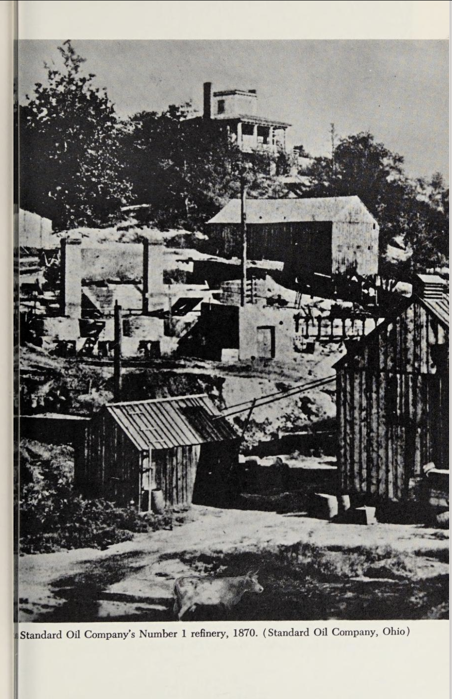

|

<!-- issues: low_ocr_confidence:48.47, image_text_overlap:0.209 -->

<!-- page_id: 0053-left | printed: none | viewer_token: none | viewer_sequence: 108/340 -->
## Unnumbered Page

> pa Ce See Be

> ee

> 2 Nee

Eee

> SO: See

ae ae

> P

> ae

> a |

Above: Rockefeller’s Number 1 refinery in 1889 when Cleveland was the world center of the petroleum industry and “illuminating oil” was its chief product. (Standard Oil Company, Ohio) Opposite: A section of the Lima-Indiana oil field in the late 19th century. (Standard Oil Company, Ohio)

Opposite above: One of the wagons used to deliver kerosene to householders. This one was decorated for a parade. (Standard Oil Company, Ohio)

<!-- issues: low_ocr_confidence:38.42 -->

<!-- page_id: 0053-right | printed: none | viewer_token: none | viewer_sequence: 108/340 -->
## Unnumbered Page

> A

> ‘

> \ Siandare | =>

> . VS

> RG if Nok , 2

### Kz Kt eeu =< ay ea ay a

> io

> dis.4,

> <=

> “seem 74

eee Se: BP gS

> es

> AL ES adh Asc BD

<!-- issues: low_ocr_confidence:26.78 -->

<!-- page_id: 0054-left | printed: none | viewer_token: none | viewer_sequence: 110/340 -->
## Unnumbered Page

, Ge ce hs | : q 4 tl I Hl MU ar eee i ag

FErRA FET EE TEETER F

> Tie - |

### WI a

> 8 fF ee REED

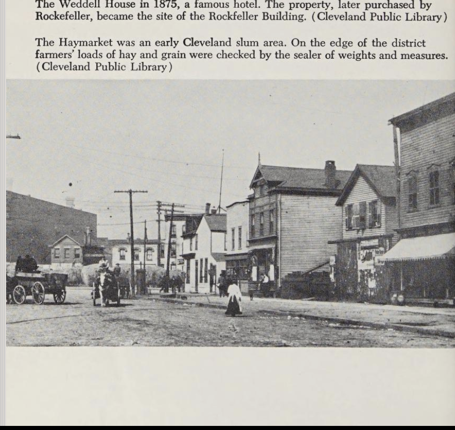

<!-- issues: low_ocr_confidence:32.93, image_text_overlap:0.176 -->

<!-- page_id: 0054-right | printed: none | viewer_token: none | viewer_sequence: 110/340 -->
## Unnumbered Page

alg.

### i BUN iN ph

> Pec,

> #

> Pie th

> Hah QWAINS.

The Standard Block, two doors west of the Arcade on Euclid Avenue, became the Standard’s headquarters in 1873. (Standard Oil Company, Ohio)

Central Friendly Inn was opened in 1888 at the edge of the Haymarket, Broadway and Central Avenue. Cost of the building, $50,000, was defrayed by Rockefeller, Joseph Perkins and William Taylor. (Plain Dealer)

TE i ica geaees F5a4!

atm Ne _ =o

> aE al

i =

<!-- issues: low_ocr_confidence:42.54 -->

<!-- page_id: 0055-left | printed: none | viewer_token: none | viewer_sequence: 112/340 -->
## Unnumbered Page

> it WE VE ae ss on it, am

### bo \i 4G Coe ~ + ee ea VE ee oe SK Ky mma ~ | tert] HVAT ttt” PARSER: fh TAHA

> Nf

re ba uo S ‘nese ei

Amasa Stone’s imposing mansion in “Millionaires’ Row,” Euclid Avenue. (The Western Reserve Historical Society)

First Cleveland home of Stephen V. Harkness, at the corner of Euclid Avenue and Fairmount (East 107th) Street; then East Cleveland. (Cleveland Public Library) = oR Dae

we ght get

Ae ' eer hea)

7, aewnees

> a2 . aie

> *

<!-- issues: low_ocr_confidence:29.22 -->

<!-- page_id: 0055-right | printed: LI | viewer_token: none | viewer_sequence: 112/340 -->
## Page LI

> ap |

.

> ae

> ) n

On the steps of the Eells Euclid Avenue home. Left foreground, Mr. and Mrs. Dan P. Eells; behind them Truman P. Handy (white hair and beard); at extreme right, seated, President Rutherford B. Hayes.

Ambrose McGregor worked for Standard Oil in the early years, succeeded Samuel Andrews as superintendent, and had a long and distinguished career with the Company. (Rockefeller Family Archives) Henry Chisholm, Rockefeller’s friend and fellow-Baptist, was honored at his death in 1884 with a heroic size statue erected by his employes in Lake View Cemetery. Mr. and Mrs. Rockefeller are buried in the same cemetery.

> . > }: Hi Wl As

> Goucsonell

<!-- issues: low_ocr_confidence:41.52 -->

<!-- page_id: 0057-left | printed: 84 | viewer_token: 84 | viewer_sequence: 116/340 -->
## Page 84

wife, the former Martha Woodin, lived on the desirable Wood (East 3rd) Street near St. Clair. On this particular day the two men, both behind fleet thoroughbreds, were tearing along the favored section of the Avenue, their trotters neck and neck. Suddenly a heavily loaded wagon appeared directly ahead in Rockefeller’s path. Without slackening his horse’s pace he swerved and passed. He came so close that he scraped the hubcaps of the wagon to the great consternation of the drayman. After making certain that he had only frightened the wagoner but in no way harmed his vehicle, Rockefeller recounted the entire episode to Eyears as delighted as a boy with his adroit maneuver. In winter this portion of the street was the scene of spirited cutter races that became a tradition in the city. Drivers muffled in fur coats and caps sped past their big homes to the jingle of silver sleigh bells and the cheers of spectators lining the sidewalks. Euclid Avenue was widely referred to as “the most beautiful street in the world.” The accolade was first bestowed by Bayard Taylor, author and world traveler, in a speech before a learned society in Great Britain in the 1860’s. Known as “Poet of the Gilded Age” for his widely read verses, Taylor declared that the Cleveland street's only rival was Nevesky Prospect in St. Petersburg. Taylor was well acquainted with Euclid Avenue, for he always asked to be driven along it on his frequent lecture engagements in the city. Another visitor, historian John Fiske, remarked glowingly that Euclid Avenue’s “double row of arching trees and handsome stone houses . . . yielded vistas reminding one of the nave and aisles of a huge cathedral. . . .” The humorist, Artemus Ward, who had left Cleveland for New York, poked fun at the venerated street as “a sacred highway where the houses present a distangy appearance and the owners employ hired girls and are patrons of the arts.” About the time Rockefeller was moving into Millionaires’ Row, the Cleveland Herald reprinted an effusion from a Zanesville, Ohio, newspaper editor who had found “The architectural taste of the mansions, the extensive grounds, velvet lawns, rare flowers and plants, the fountains that adorn each residence . . . alone worth a trip to the lake to see.”

<!-- page_id: 0057-right | printed: 85 | viewer_token: 84 | viewer_sequence: 116/340 -->
## Page 85

Exulting Clevelanders, comparing their “sacred highway” with the Champs Elysées and Berlin’s Unter den Linden, treated every visitor to a drive along the storied street. Soon they were pointing out the home of John D. Rockefeller, whose house was not the most impressive, but whose name shortly became the best known in the Row. On their part the socially-elect in the big houses, who had ignored Rockefeller’s arrival on the Avenue, soon would be aware that the president of the Standard Oil Company was in their midst. And neither attitude made any impression on the Rockefellers, for they had no social ambitions. Rockefeller would find it difficult to recognize Euclid Avenue today. A few forlorn remnants of houses he knew have survived. Victims of a planless, civic building code and an indifferent community, they have been mutilated by tasteless remodeling. Others were razed, like the handsome houses of Senator H. B. Payne and his father-in-law, Nathan Perry, at Euclid Avenue and Perry Street. The land is now taken over by the incredibly ugly concrete masses that house Cleveland State University. Rockefeller’s home was demolished by John D., Jr., a year after his father’s death. It made way for a parking lot and a gasoline filling station for a Standard Oil competitor. The selling price was $300,000, according to press accounts. When Rockefeller bought the house it had seemed beyond the desirable part of the Avenue. However, a trend soon developed in that direction. The corner of Euclid and Case Avenues was selected as site of fashionable St. Paul’s Episcopal Church. Before long, liveried coachmen manning shiny broughams were driving past the Rockefeller house carrying smartly attired communicants to Sunday services in the new edifice. At the same time the indifferent Rockefellers, in their modest carriage, but driving smart horses, headed in the opposite direction to their house of worship downtown. The same year that the Rockefellers settled on Euclid Avenue, the Erie Street Baptist Church made plans to build on the same street but nearer the city’s center. The Baptists sold their old house of worship to the German Evangelical Protestant congregation and purchased a lot at the corner of Euclid and Huntington (East 18th) Street. While the main structure was under way, the chapel was

<!-- page_id: 0058-left | printed: 86 | viewer_token: 86 | viewer_sequence: 118/340 -->
## Page 86

completed and church services were held temporarily in it. The name was changed, first to the Second Baptist Church and later to the Euclid Avenue Baptist Church. But it was generally known as “the Rockefeller Church.” And this was understandable considering the money, time, and leadership John D. contributed to it. After living a few years in his new residence, Rockefeller bought the house and lot adjoining it on the east. The property, which belonged to Levi Burgert, was on the corner of Euclid and Case Avenues and extended to Prospect Street. Burgert was a member of the firm of Burgert and Adams, wholesale boot and shoe dealers with a warehouse on Water Street. The dwelling obscured Rockefeller’s view. Devoted as he was to Open spaces, he wanted more land where he could grow trees and lay out gardens. He decided to move the Burgert house and offered it to Miss Augusta Mittleberger the head of an exclusive school for young ladies. She was then reestablishing her school on a new site a block away, at Case Avenue and Prospect Street, and welcomed the idea of such an addition. Recalling Merwin’s rehabilitated Mansion House, set down two decades prior on Prospect Street, newspapers hailed the Burgert house-moving as an even more challenging project and reported on its daily progress. Hoisted up on greased logs, the building crept south along Case Avenue at a tedious pace. Power was supplied by a huge windlass. Bevies of onlookers, faithful sidewalk superintendents, gathered daily at the scene getting in the way of workmen. When Prospect Street finally was reached, more than two weeks was required to propel the house across the thoroughfare. Meanwhile the street was blocked to all traffic, including horsecars. Riders heading east or west were obliged to halt at the obstruction and leave their car. Mumbling imprecations against Rockefeller (by now a public figure), they walked around the house to board another car waiting on the other side and thus completed their journey. The difficult house-moving was accomplished. Lucy Spelman, who had been a fascinated observer of the whole proceeding, comeR

<!-- page_id: 0058-right | printed: 87 | viewer_token: 86 | viewer_sequence: 118/340 -->
## Page 87

|) mented that “Mr. Rockefeller . . . set it on new foundations where |) it was as good as ever. This was a marvelous undertaking, but |} then he was always undertaking marvelous things.” Rockefeller had arranged to have the uprooted house placed exactly where the schoolmistress wanted it. Later she had an aide write him that she was having difficulty heating it. She was forced |} to install an auxiliary stove which proved more expensive than the } estimate. The problem, in part at least, she seemed to think was Rockefeller’s responsibility. She wished to know if he would be willing to pay half the cost of the stove, about $100? Rockefeller, it | appears, was willing. Her appeal was typical of those he now was receiving constantly. Problems of giving were mounting, along with lj those of getting. | The relocated house served as a main building for Miss Mittle- | berger until 1908 when she retired and closed the school. Young women from prominent families had made up the student body, including Elizabeth Cutter, later Mrs. Dwight Morrow, mother-in- } law of Charles Lindberg; the daughters of John Hay, President ) Hayes, and President Garfield. None of the Rockefeller daughters was on the school roll. With the Burgert house out of the way, the grounds around Rockefeller’s home soon compared favorably with other Avenue show places. The four corners at Case and Euclid were particularly attractive. | Directly opposite Rockefeller’s property, at the northwest corner ¢ of Case, were the homes of J. H. Wade, founder of the Western Union Telegraph Company, and next door that of his son, Randall. Both were imposing homes, The Wades’ combined acres, with exotic plants, formal flower beds, fountains and statuary, were much talked about and, on occasion, were opened to the public. Randall Wade’s daughter, Alice, married Sylvester T. Everett, who built a magnificent Romanesque mansion on the northeast corner across from St. Paul’s Church. The Everett house, designed by the celebrated architect Charles F. Schweinfurth, was said to be the costliest erected in Cleveland up to that day. Everett, who had wide financial interests, was a leader in the Republican party and

<!-- page_id: 0059-left | printed: 88 | viewer_token: 88 | viewer_sequence: 120/340 -->
## Page 88

a close friend of Hanna. Rockefeller and Everett were well acquainted. The Everetts were a hospitable couple, staging notable social functions some of which the Rockefellers attended. At such gatherings one might meet dignitaries like Presidents Hayes, McKinley or Taft, as well as J. P. Morgan and Andrew Carnegie. Guests were greeted by Mrs. Everett on a hostess balcony, midway up a grand staircase at the entrance of the large ballroom. When the Rockefeller house was razed in 1938, the palatial Everett house also was torn down.

16. The Standard Oil Company Is Formed

A newcomer to Cleveland appeared in the offices of Rockefeller & Andrews in the Sexton Building. He was Henry M. Flagler, a grain dealer in Bellevue, Ohio, who was establishing himself in the city. He persuaded Rockefeller to rent him desk space. The two had met when Rockefeller was a commission merchant and Flagler sold him carload lots of wheat and corn. On his trips around Ohio developing customer contacts, the Cleveland produce man often had climbed the stairs to Flagler’s office above a village store facing Bellevue’s “Square.” Sober-faced, withdrawn Rockefeller was attracted to Flagler, quick-smiling and gregarious, who made friends easily. Different though they were in temperament, they had a good deal in common, including an inborn zeal for business and hard work, plus an underlying determination to get on in the world. Flagler, nine and a half years older than Rockefeller, had made and lost a fortune by the time he arrived in Cleveland. Wartime contracts with the United States Army for food and commodities netted him his first big money. He invested heavily in the booming salt industry in Michigan. Overproduction, plus sharply curtailed

<!-- page_id: 0059-right | printed: 89 | viewer_token: 88 | viewer_sequence: 120/340 -->
## Page 89

demand for salt at the war’s end, knocked the bottom out of the | market. Flagler was virtually bankrupt. Tided over his financial stringency with a loan from his wealthy Harkness kin, he had come to the big city on the lake to start again, | to recoup his Josses, and to pay back what he owed as soon as possible. He brought with him a patented horseshoe which he had invented and hoped to manufacture. But nothing came of that. He sold barrels to Rockefeller and to other refiners, putting his hand to anything he could find to do. He went to work for a commission house in the Flats that was headed by Rockefeller’s former partner, Maurice Clark. He made a lucky speculation, and before long he was able to buy Clark’s company. Once more Flagler had money, possibly as much as $50,000. He often dropped by Rockefeller’s desk to talk over the deals he was putting through and to listen to Rockefeller talk about oil. The Rockefeller-Andrews works was ahead of its rivals, but Rockefeller told Flagler competition was terrific. Writing later about this period, Rockefeller summed up the problems: The price went down and down until the trade was threatened with ruin. It seemed absolutely necessary to extend the market . . . by exporting . . . and also to greatly improve the processes of refining so that oil could be made and sold cheaply, yet with profit. The overall advancement program could be accomplished “only by increasing our capital.” But where to get it—enough of it. He was borrowing constantly from Cleveland banks. He declared that he went to bed at night worrying about how he would discharge the loan he had assumed that day only to waken next morning wondering how he could borrow more. Flagler was a sympathetic audience—and more. With his sharp, practical imagination, without doubt he would have put forward searching questions and suggestions . . . Rockefeller had an innate faculty for appraising talent and personality, for picking the right man at the right time. He had ample opportunity to study Flagler. He liked what he described as his “vim and push.”

<!-- page_id: 0060-left | printed: 90 | viewer_token: 90 | viewer_sequence: 122/340 -->
## Page 90

One can be sure also that the refiner would have admired the man’s daring business moves, and his courageous comeback from disaster. Before long, in his words, Rockefeller “thought of Mr. Flagler as a possible partner and made him an offer to come with us and give up the commission business.” Discerning Flagler, wiser now from his ups and downs, was fully conscious of the enviable position the Rockefeller works had attained and of the respect Rockefeller himself was winning from business leaders. The difficulties confronting oil production only intrigued Flagler, for he had the kind of mind that saw tangles as challenges. He accepted the partnership offer and invested his newly acquired assets. With Flagler now one of the firm, Rockefeller had a ready-made entree to the monied Harknesses in Bellevue. F lagler’s wife, the former Mary Harkness, was a first cousin of Stephen Harkness. Mrs. Flagler’s father, Lamon Harkness, and Stephen’s father, David, both physicians, were brothers. There were other connections between this remarkable family and Flagler. His mother had been widowed twice before she married his father, Isaac Flagler, an impoverished, itinerant Presbyterian minister in Western New York State. Her son was christened Henry Morrison Flagler, the boy’s middle name being that of his mother’s second husband. Her first husband was David Harkness, Stephen’s father, a widower when she married him. From this marriage Daniel Harkness was born. Daniel was the half-brother of Stephen and also of Flagler. Flagler and Stephen, however, were no blood kin, but they had been close friends since their youth. The inter-relationships were tangled further when Daniel married his first cousin Isabelle Harkness, who was a sister of F lagler’s wife, Mary! Withal, this was a congenial, affectionate group. While probably as bewildered as everyone else over the involved relationships, Rockefeller would not have missed the significance of the Harkness-Flagler connection. On his Ohio travels he had some contact with Stephen Harkness, foremost citizen in the Bellevue-Monroeville locale, Operating a variety of business enterprises, one a distillery. Harkness recently had come to Cleveland and he and Rockefeller seem to have renewed their acquaintance,

<!-- page_id: 0060-right | printed: 91 | viewer_token: 90 | viewer_sequence: 122/340 -->
## Page 91

Keen-minded Harkness appears to have been as impressed as Flagler was with Rockefeller’s standing in the community and with his thriving, smoothly running oil works. At any rate, Harkness soon became a partner, bolstering the company with a large sum of money, the total never made public. Nevertheless, it was estimated variously as from $60,000 to $90,000. Whatever the amount, | it was a life-giving transfusion for the refinery program. Rockefel- | ler had the capital he was seeking. | Cleveland now had a new firm: Rockefeller, Andrews and Flag- | ler. Harkness was a silent partner. Brother William Rockefeller was | the fifth partner—John D. always managed to have this brother share in the good things that came his way. He dispatched Wil- | liam to New York City to cultivate the export trade and domestic | markets along the eastern seaboard. | John D. was boldly projecting his Cleveland-based business into | far places. With an ardor not unlike that of the Baptist mission- | aries he supported, he intended to carry the new light to peoples | living in darkness both at home and in foreign lands. He installed William in an office at 181 Pearl Street in Gotham, and soon this address as well as names of the Rockefeller brothers appeared in | the New York City directory. William was a genial, ready mixer who resembled his father, Doctor Rockefeller, in many ways and, | like him, was a good salesman. He proved to be a most able export | manager. | These five men formed the nucleus of the Standard Oil Com- | pany that soon came into being. All of them except Andrews had | been commission merchants during the Civil War. In addition to the } distillery profits made by Harkness, a goodly share of what the | four invested in the oil company represented returns from contracts | with the Army. All five were self-made men. Andrews and Flagler f | had risen from humble beginnings, Harkness faring little better. | While the early years were more secure for the two Rockefellers, | their boyhood was anything but one of luxury. . The able works superintendent, Samuel Andrews, arrived in | Cleveland as a poor English immigrant. He had little education | and no technical training save what he picked up by his own ef- | forts. Schooling was equally brief for Flagler, who quit the class- Po

<!-- page_id: 0061-left | printed: 92 | viewer_token: 92 | viewer_sequence: 124/340 -->
## Page 92

room in the eighth grade. To ease the family’s meager income, the boy decided at fourteen to leave home which was near Canandaigua, New York, and support himself. He packed his few belongings in a carpetbag and started out on foot to join Harkness relatives in Ohio. Working his way on the Erie Canal and aboard a lake vessel, he disembarked at Sandusky, Ohio. His first job was in a general store where he dispensed merchandise like calico, molasses, and tallow candles for a salary of five dollars a month. As an emolument he was given the privilege of sleeping under the counter, blanketed on cold nights with brown wrapping paper. He made his start in the grain business in Republic, Seneca County, where his future fatherin-law, Lamon Harkness, was a well-to-do produce wholesaler. Flagler met the gently reared Mary and promptly fell in love. They were married when she was nineteen and he was twenty-three. Success came easily to Flagler. He settled in Bellevue, outpost of the Harknesses. While still a young man, he made money, built a large home so ornamented that townspeople called it the “Gingerbread House.” It was sold to Daniel Harkness, and later it became the Young Men’s Christian Association headquarters. Next to it Daniel erected the Memorial Congregational Church in memory of his wife. Inasmuch as whisky distilling had been one of Daniel’s enterprises, the propriety of his joining the church was questioned. However, the denomination’s hierarchy saw nothing amiss in accepting the church building, since it honored the “sainted Isabelle” who had been a member in good standing. Stephen Harkness, senior among the new Cleveland oil firm’s partners, was born in 1818 in Fayette, New York. He was more than twenty years older than the two Rockefellers. His mother died when he was two, his father’s death followed a few years later in Milan, Ohio. Its canal to the lake made it a noted wheat port where David Harkness had been a grain dealer. Stephen was reared by his grandfather, Stephen Cook, in Waterloo, New York, At fifteen, apprenticed to a harness maker, he worked at this trade until his indenture was completed. Then he headed for Ohio and the Bellevue area. There he was welcomed cordially by cousins, uncles and aunts,

<!-- page_id: 0061-right | printed: 93 | viewer_token: 92 | viewer_sequence: 124/340 -->
## Page 93

He dealt extensively in lifestock and, like his relatives, in grain and |) other produce—lucrative operations in war time with the govern- || ment as a steady customer. Here was another member of the clan with the Harkness Midas || Touch—everything he went into turned out well. Distilleries were } common in the region, for whisky-making was a practical way to | utilize the abundant crop of this corn belt. Stephen established a | large distillery in nearby Monroeville where he also organized a | private bank. He settled here, and in 1842 married Laura Osborn, | like him a native of New York State. After her death, Anna M. | Richardson of Dalton, Ohio became his wife in 1853, and he con- | tinued to make his home in Monroeville. | Senator John Sherman, brother of General William Tecumseh Sherman, is said to have dropped a hint in Harkness’s hearing that |} a tax was to be placed on whisky as a wartime revenue measure. Harkness at once set about buying all the whisky he could locate, combing the countryside around Monroeville and filling his ware- | houses and barns ceiling-high with barrels of the stuff. Worried j depositors claimed he almost drained his bank’s surplus for funds | to pay for his stock. The tax was voted. Harkness sold the lot at a | price which covered the excise tax and yielded him a handsome | profit, making him a rich man almost over night. If this money found | its way into the new oil partnership, as is generally conceded, Rockefeller, strict temperance advocate though he was, managed to overlook its origin. More than dollars accrued to Rockefeller from his association with Flagler and Harkness. The latter could be practical and impersonal in commercial transactions. Yet he also was a kindly, generous-hearted friend, as Rockefeller discovered in an incident he afterward recorded. A devastating fire had destroyed the company’s large warehouse and refinery complex in the East, the buildings covering many acres. The plant was insured for “many hundred thousands of dollars,” in Rockefeller’s words. He was worried about collecting so large a claim, or at best that there might be a delay in the insur- | ance adjustment. The unit had to be rebuilt and put back into op- |

<!-- page_id: 0062-left | printed: 94 | viewer_token: 94 | viewer_sequence: 126/340 -->
## Page 94

eration at once. Rockefeller approached Harkness about the possibility of a loan, should one be required. Harkness grasped the situation quickly and said: “All right, J. D., Pll give you all I've got.” Rockefeller went home that night relieved of anxiety. The full amount of the claim did come through from the insurance company, an English concern. The reconstruction was paid for. Rockefeller had no need to call on Harkness for assistance, but, he said: “I never forgot the whole-souled way in which he offered it.” It had also seemed wise to ascertain if bank help could be counted on, should it be necessary in this same situation. The bank canvassed, though not designated by Rockefeller in his memoirs, was obviously the Second National Bank of Cleveland. One member of the bank’s board of directors opposed granting such a loan. Whereupon, Rockefeller has recounted, Stillman Witt, another director, took issue with his colleague. He asked his son-in-law, Dan Eells, also an officer now of this bank, to bring him his strong box. With an emphatic gesture, Witt pledged its contents to the “young men” who, he declared “are all o.k. and if they want to borrow more money I want to see that this bank advances it without hesitation.” Rockefeller referred to this episode on several occasions as further illustration of “the kind of friends we had in those days.” He did not mention that the objecting director was the imperious Amasa Stone, reputedly the richest man in town, but not one of the most popular. In his Reminiscences, Rockefeller makes it clear that of all the men with whom he was associated through the years, none meant more to him than Flagler. Not even John D. Archbold, later Standard Oil Company president, could quite take Flagler’s place, though Rockefeller had the highest regard for Archbold. “The part played by one of my earliest partners, Mr. H. M. Flagler,” Rockefeller stated in this unusual tribute, “was always an inspiration to mee Out of their business contacts, a very real relationship developed between the two. Rockefeller quoted Flagler as saying a friendship founded on business was better than a business founded on friendship. For the reticent Rockefeller, who kept his emotions well under cover, friendship of any sort was not entered into easily.

<!-- page_id: 0062-right | printed: 95 | viewer_token: 94 | viewer_sequence: 126/340 -->
## Page 95

When Rockefeller at seventy was casting backward glances over his years, and writing about his old-time colleagues, it was Flagler to whom he gave the most attention. At that time his former partner was still alive, renowned for his spectacular achievement in opening up eastern Florida, laying a six-hundred mile railway to Key West, promoting hotels, and homesites. Flagler had entered into these vast undertakings after his long, lucrative connection with the Standard Oil Company, and at an age, as Rockefeller commented, when most men would be retiring. The same creative ability and energy that Flagler directed to Florida, he had given to nurturing the oil company. Rockefeller put it this

way: He invariably wanted to go ahead and accomplish great projects of all kinds. He was always on the active side of every question and to his wonderful energy is due much of the rapid progress of the company in the early days. Rockefeller reminisced further:

For years and years this early partner and I worked shoulder to shoulder; our desks were in the same room. We both lived on Euclid Avenue, a few rods apart. Flagler bought the house the year the Standard Oil Company was formed, and in December of that year, a son, the third child, Henry Harkness Flagler, was born there. A boy long had been hoped for and the proud father made great plans for his future. Flagler’s wife, Mary, never robust, however, grew increasingly frail. Her husband was devoted to her, spending the long winter evenings at her side, often reading aloud to her for hours at a time. Stephen Harkness was a frequent visitor, for Mary was his favorite cousin. John and Laura Rockefeller, both fond of the Flaglers, dropped in often to cheer the invalid. By day the energetic, popular Flagler was active in civic and business organizations like the Board of Trade, associating with the city’s leading men. In the fresh hours of the morning, Rockefeller made it a habit, as he has said, to stop in at Flagler’s house from where the two “walked to the office together, walked home for luncheon, back again . . . and home again at night.” We can

a, ss

<!-- issues: low_ocr_confidence:76.81 -->

<!-- page_id: 0063-left | printed: 96 | viewer_token: 96 | viewer_sequence: 128/340 -->
## Page 96

almost see them striding along, clad in the regimentals of the successful executive: striped trousers, frock coats, high silk hats. Rockefeller affected a heavy brown moustache to add a touch of age to his youthful face, and was taller than his black-haired, distinguished looking companion. They had moved their offices to the new Case Block on Superior Street east of Public Square. This seems a considerable distance to cover on foot, and doubtless there were times when they went back and forth by horse and carriage — or on horseback. Yet, in those days before the split-second tempo of the automobile era, people did know how to walk and took time to do so. Rockefeller and Flagler used that time profitably. “Free from office interruptions,” Rockefeller said, “we did our thinking, talking and planning together.” Euclid Avenue itself invited walking, with its broad “sidewalks overarched with massive shade trees.” The stately homes Rockefeller passed on these walks were owned by men with whom he had frequent contacts in the course of a day’s business. The two bankers, Witt and Handy, always his allies, had moved from lower Euclid to “The Row,” Witt coming from Euclid near Muirson (E. 12th) Street (site of the western end of the Statler- Hilton Hotel). Handy sold his classic pillared house on Euclid below Erie Street to Cleveland’s mayor, George B. Senter. The massive stone mansion of Dan Eells, shortly to be president of the Commercial National Bank, was pointed out in later years as the place where he and Mark Hanna had a conference with McKinley, resulting in the latter’s candidacy for the Presidency. They passed the sumptuous home, in fashionable Italian villa style, of Hinman B. Hurlbut, built in 1855. Hurlbut, later a Standard Oil stockholder and horticulturist of note, was a discriminating collector of art. A well-modeled heroic—sized bronze dog that he had found on one of his European trips, stood poised on the lawn as if guarding his master’s property. Farther downtown was Amasa Stone’s imposing mansion, its heavily embellished facade making it the most ornate on the Avenue. On their walks Rockefeller and Flagler were not concerned with architecture or landscaping. Their discussion now centered on con-

<!-- page_id: 0063-right | printed: 97 | viewer_token: 96 | viewer_sequence: 128/340 -->
## Page 97

verting their company into a joint stock corporation. Rockefeller had been contemplating such a step for a long time. The stock was not to be placed on the open market. He and his four partners would retain control. Above all, there was not to be any manipulation of the stock, such as was the notorious practice of Jay Gould and the elder Morgan. Rockefeller never digressed from this stand and could say truthfully years later: “there has been no ‘water’ introduced in its capital (perhaps we felt that oil and water would) not have mixed).” Taking the name of the Standard Works that William Rockefeller had headed, a new company, the Standard Oil Company, came into existence. The name, John D. said, signified “standard quality.” The two Rockefellers, Andrews, Flagler and Harkness formed “a body corporate under the laws of Ohio for manufacturing Petroleum and dealing in Petroleum and its products. . . .” Incorporation took place January 10, 1870. Capitalization was $1,000,000. Ten thousand shares were issued at $100 each. No bank was involved. Each investor paid for his lot. Assets of the corporation actually far exceeded the capitalization figure. In Cleveland alone the holdings included two refineries in excellent condition, sixty acres of land, an up-to-date cooperage shop, lakeside dockage, and railroad tank cars. In addition, heavy investments had been made in property and facilities in the Oil Regions and in the East. The Standard Oil Company of Ohio at the time of its inception was not only the biggest oil operation in Cleveland, it also represented one-tenth of the petroleum business in the country. The pre-eminence of Cleveland in oil refining was assured. Pittsburgh was definitely out-paced. The Standard Oil Company was headed for phenomenal growth and the city of its origin would share in the harvest. The company’s made-in-Cleveland products would be used around the world. Neither Rockefeller nor any of his partners glimpsed the future in store for them: “None of us ever dreamed of the magnitude of what proved to be the later expansion,” Rockefeller said forty years later, and even then, he could not quite believe it. A few days after the incorporation, the men met to elect officers.

— ee Fp

<!-- issues: low_ocr_confidence:57.7 -->

<!-- page_id: 0064-left | printed: 98 | viewer_token: 98 | viewer_sequence: 130/340 -->
## Page 98

On January 18th the Leader gave the news to the world: President, John D. Rockefeller; vice president, William Rockefeller; secretarytreasurer, Flagler; superintendent, Andrews; and director without portfolio, Harkness. John D. Rockefeller subscribed to 2,667 shares; Harkness, 1,334; William Rockefeller, Andrews and Flagler, 1,333 shares each; the Rockefeller, Andrews, Flagler Company, 1,000 shares. This brought the number of shares to nine thousand. The remaining 1,000 block was taken by O. B. Jennings of New York, brother-in-law of William Rockefeller. Nine-tenths of the total stock was owned by the five partners. John D., master mind of it all, was in charge. He was not yet thirty-one. Like a good golfer who keeps his eye on the ball, he kept his on his goal, and his vision never wavered. In this same year, 1870, in Akron, thirty-six miles away, Doctor Benjamin Franklin Goodrich organized the first rubber factory west of the Alleghenies. Goodrich, two years younger than Rockefeller and like him born in New York State, was a physician turned manufacturer. Convincingly presenting his proposition before a group of Akron business leaders, he raised a capital loan of $13,600. His modest operation soon got under way, specializing in fire hose and also making such things as wringer rolls, billiard cushions and fruit jar rings. After financial struggles that threatened more than once to scuttle the effort, the B. F. Goodrich Company was established. Akron was on its way to becoming the Rubber Capital of the world, and Cleveland the Oil Capital. Doctor Goodrich died in 1888 before the era of automotive power. Rockefeller lived long enough to witness the first decades of that age. But neither man could have any conception of the revolutionary impact on oil and rubber that was to come.

<!-- page_id: 0064-right | printed: 99 | viewer_token: 98 | viewer_sequence: 130/340 -->
## Page 99

### 17. Giving

Rockefeller did not wait to become rich before starting his program of giving. In a period before public welfare existed, local citizens took care of local needs. Considering himself a Clevelander, he began when still in his teens to do his part and continued to do so. One of his earliest charities, after his church, was the Ragged School to which he allocated small sums from his meager resources. — Dedicated men and women operated the “school,” really a mission in a rented room on Champlain Street to care for “vagrant youth” recognized as beyond reach of the public school. Children rounded up here were from impoverished families. Sometimes described as “vicious,” they often were homeless boys and girls with no place to lay their heads at night. The waifs, a ragged lot indeed, were clothed, fed and instructed in the Three Rs, trades, morals, and the Bible. Some were placed temporarily in private homes in lieu of children’s aid agencies or orphan asylums. Ultimately absorbed by the public school system, in its early days, the project ministered to hundreds of neglected children. During the years it functioned, Rockefeller’s original miniscule contributions grew to a five-figure largesse. In 1867 a new building went up at Superior Street and Ohio Lane (West 10th Street) with “Cleveland Bethel Union” over its= door. True to the “Bethel” in its name (a place of worship for seamen), the sailors, dock and shipyard workers (and some women) who gathered in its rooms heard talks on temperance and the Christian religion. A kind of glorified Wayfarers’ Lodge, it was an outgrowth of the Western Seaman’s Friend Society which was organized in the 1830s for destitute members of lake vessel crews. The colorful Bethel was close to Rockefeller’s heart. He underwrote a substantial part of the budget, but he kept his name off the donor lists appearing in the local press. He liked to stop in at noon to observe with satisfaction the men assembled in the big

<!-- page_id: 0065-left | printed: 100 | viewer_token: 100 | viewer_sequence: 132/340 -->
## Page 100

dining room for the substantial meal served for twenty-five cents which included ice cream for dessert. Those who lacked the price could earn their dinner by chopping kindling at the Bethel woodpile, an arrangement approved by Rockefeller. To his way of thinking, free handouts pauperized the recipient and dulled initiative. Among other Clevelanders behind the Bethel’s endeavors were Dan Eells, Mark Hanna and his wife, Mrs. Henry Chisholm and Edwin Cowles, editor of the Leader. Bethel Union is not to be confused with the “Floating Bethel” of a later date. This was an abandoned scow moored at the foot of St. Clair Street, that was reconditioned as haven for lakefront derelicts. Here one-armed “Brother” J. D. Jones, a town character for years, held prayer meetings so powerful in appeal that river men were lured from surrounding saloons to listen to his exhortations. Brother Jones had only to appear at Rockefeller’s office to receive a good size check; the oil magnate, it is said, gave in all many thousands of dollars to the earnest evangelist. Rockefeller, not yet thirty years old, was an early member of __\Cleveland’s first continuing cultural organization, the Western Reserve Historical Society. Born as the historical department of the Cleveland Library Association, it broke away from the parent institution and in 1867 it became a separate entity. Its ambitious purpose was to “preserve whatever relates to the history, biography, genealogy, antiquities and statistics . . . of the city of Cleveland and the Western Reserve.” Founders of the Society chose as its first president the dynamic Colonel Charles Whittlesey, West Point graduate, veteran of the Black Hawk and Civil Wars. A geologist by profession, he had carried on explorations of the copper mines in the wilderness stretches of Michigan’s Upper Peninsula. Pursuing his interest in local history and archaeology throughout his life, he published almost two hundred books and pamphlets. This harvest from his research became the basis of the Historical Society’s collections. Like many of the later Society presidents, including the present head, Frederick C. Crawford, Whittlesey was a native New Englander, The Whittleseys lived on Euclid Avenue about opposite Dun-

<!-- page_id: 0065-right | printed: 101 | viewer_token: 100 | viewer_sequence: 132/340 -->
## Page 101

ham Tavern on what today is the 6700 block. Their simple, rambling white house, hung with vines and shaded by tall trees, was in the midst of open country, practically farmland. Next to them across the meadow stood the home of Rockefeller’s associate, Stephen V. Harkness, their house not unlike the Whittleseys’. Neighbors were far apart and not numerous. There was much visiting between the two families, “Grandma Whittlesey” becoming a special favorite of the Harkness children, particularly of their little daughter Flor-

ence. Before this, on arriving in Cleveland, the Harknesses had occupied a large Victorian house at the southwest corner of Euclid and Fairmount (East 107th) Street in the “Doan’s Corners” area. Forming a company to handle crude petroleum, Harkness went into partnership in 1864 with William Halsey Doan, grandson of Nathaniel Doan, early settler at the “Corners.” Two years later the district was designated as the Village of East Cleveland, and Harkness served as mayor for a brief time. To be nearer Cleveland’s business district, Harkness decided to move and selected the property beside the Whittleseys. The Colonel soon won the newcomer as a member of the Historical Society. Rockefeller already had joined, to be followed later by Flagler and Andrews. Membership was by invitation, a privilege reserved for the prominent. Whittlesey had brought into the Society the leaders of what was to be the Standard Oil Company. Notables from out of town, classified as “corresponding members,” included the Ohioans Governor Rutherford B. Hayes, Senators Benjamin F. Wade and John Sherman, and the Toledo attorney, Morrison B. Waite, later Supreme Court Justice. Historical Society headquarters were in rooms on the third floor of the Society for Savings Bank Building on Public Square where - lengthy and learned papers were delivered. “Meetings were thronged,” according to Cleveland newspapers which reported all proceedings in full. After some years (1891) the Historical Society, greatly expanded, bought the entire bank building for $40,000. By this time Rockefeller was vice president of the Historical Society and a member A toad

oS hhhhrrrrrr———C(‘“‘zaaRS

<!-- issues: low_ocr_confidence:65.5 -->

<!-- page_id: 0066-left | printed: 102 | viewer_token: 102 | viewer_sequence: 134/340 -->
## Page 102

of the finance committee. He endorsed the project and supplied $10,000 toward the purchase. J. H. Wade, of Western Union fame and a banker, contributed $5,000, which was the next largest gift. Judge C. C. Baldwin, successor to the presidency of the Society at Colonel Whittlesey’s death, and William J. Gordon, donor of Gordon Park, to the city each gave $2,000. While trustees thought Western Reserve Historical Society was “settled for life,” their sense of security was upset three years later by the Cleveland Chamber of Commerce whose directors cast covetous eyes on the former bank building. The Chamber offered the Historical Society $55,000 for the property, plus a lot for new headquarters on the corner of Euclid and Fairmount streets across from the one-time Harkness home. Some members felt the proposed location was too far out from the center of the city. On the other hand, an advantage was seen in its proximity to the cultural attractions unfolding around Case School of Applied Science and Western Reserve University. The Chamber's proposition was accepted. Well established in its handsome, new terra-cotta building on the new site, the Historical Society in 1907 launched a campaign for a $350,000 endowment fund. Rockefeller promised $25,000 on condition that the balance be raised by a stipulated date. Pledges lagged. Time ran out. The Society did not get the Rockefeller money. Rockefeller’s interest in the Society was rekindled when Wallace Cathcart, first became president, and later director, He was an ar- ~dent Baptist. Further, his alma mater was Denison University at ‘Granville, Ohio, a Baptist institution which Rockefeller liked and helped with regular sums amounting to almost $300,000. At Cathcart’s urging, Rockefeller remained a vice president of the Historical Society. Later he was made honorary vice president, a title he carried as long as he lived. Preserved in Society files is a sheaf of correspondence and notes on conversations between Rockefeller and Cathcart. The Society today is firmly established on East Boulevard in University Circle. It occupies a three-building complex, the newest unit of which is the Frederick C. Crawford Auto and Aviation Museum.

<!-- page_id: 0066-right | printed: 103 | viewer_token: 102 | viewer_sequence: 134/340 -->
## Page 103

In line with his intent to be identified with the city of his adoption, Rockefeller joined the Early Settlers Association which was founded in 1879 by the venerable pioneer “Father” H. M. Addison. The new organization’s first president was the distinguished Harvey Rice, whose bill in the State Legislature created Ohio’s system of free public schools. In 1888, under Rice’s leadership, a statue of Moses Cleaveland was erected in Public Square, and there the Founder stands today surveying his rapidly changing city. Cost of the sculpture, slightly under $4,500, was raised by public subscription, with fifty dollars, it is said, received from Rockefeller. Attending an Association meeting in 1912, he was called upon to speak. Rockefeller said that when he was first a member he felt himself “a very young early settler.” Since then, he continued wryly, the crowding years had altered all that. At his death in 1937 he was found to have the longest membership record up to that time. As a teen-ager Rockefeller paid a dollar to join the Young Men’s — Christian Association when it was organized in Cleveland and he remained a loyal supporter. He sent $4,500 to the secretary when a block at Euclid and Sheriff (East 4th) Street was remodeled as a “Y” center in 1880; $50,000, or a fifth of the total, for a new headquarters at Prospect and Erie streets and $15,000 when the Broadway branch was burned out and restored in 1890. There were other large gifts reaching about a quarter of a million dollars given the Y.M.C.A. in the early days. Originally women were admitted to membership in the Young Men’s Christian Association, and Mrs. Rockefeller became a life member. In the late 1860s the Young Women’s Christian Association had its start in Cleveland as the Women’s Christian Association. Two women delegates from each of twenty churches met as organizers in the rooms of the Young Men’s Christian Association. Mrs. Rockefeller and Mrs. Henry Chisholm represented the Second Baptist Church (the former Erie Street Baptist, later called the Euclid Avenue Baptist Church). As a consequence of manpower loss in the Civil War and pressures from the high cost of living, young women were flocking into the city seeking employment. The new association directed its

| es Fp

<!-- issues: low_ocr_confidence:67.63, missing_printed_page_number -->

<!-- page_id: 0067-left | printed: 104 | viewer_token: 104 | viewer_sequence: 136/340 -->
## Page 104

early efforts to finding “suitable boarding places where the working girls could be sure of proper literature and religious influences.” Among the projects, also, was The Retreat on Perry Street where “fallen women” were sheltered and, hopefully, turned away from sin to Christian usefulness. ) In vain, one looks for Mrs. Rockefeller’s name in the long tabulations of officers and committee members in the first Young Women’s Christian Association yearbooks. Evidently she preferred a background role. Her husband, as if substituting for her, helped the program with contributions of $500 to $1,000. When the big “YW” building at Prospect Avenue and East 18th Street was planned in 1907, the Rockefellers gave $150,000 of the $250,000 cost. Years before, as the temperance movement was sweeping across Ohio, Mrs. Rockefeller joined the hundreds of women, many of them Young Women’s Christian Association members, who met at (Old) Stone Church in the spring of 1874 to establish the Women’s Christian Temperance League, soon called the Women’s Christian Temperance Union. Reared by parents who were strong abstinence advocates, the Rockefellers became almost fanatic supporters of the dry cause. One of the first undertakings of the League was an onslaught on the inroads of alcohol in the Haymarket, then the inner city slum. Both Rockefellers endorsed the idea. From his marriage on, John D. made his wife a partner in his giving. The Haymarket for some time had been a common concern of the couple. It was the district south and to the west of Public Square, site now of the Terminal Tower and group of buildings erected by O. P. and M. J. Van Sweringen. To make way for the complex that was opened formally in 1930, fourteen hundred buildings in the area were razed and several streets obliterated from the Cleveland map. At the edge of the old “bad lands” a large section was given over to farmers who drove into the city with loads of hay and grain to be checked by the sealer of weights and measures. Afterwards they lined up to dispose of their produce from their wagons. Other country people came in with fruit and vegetables which they sold in this lively marketplace.

<!-- page_id: 0067-right | printed: 105 | viewer_token: 104 | viewer_sequence: 136/340 -->
## Page 105

Nearby was Whisky Hill and a crisscross of narrow, littered streets and alleys which teemed with recently arrived immigrants— Italians, Hungarians, Germans, Lithuanians, Poles, Slavs. Thirtyone different nationalities and more than a dozen religions were counted here. The men were in demand as laborers in this city of rapidly increasing mills and factories. Big families crowded into dilapidated shanties. Ill-clad children played happily in roadway mud puddles, a beloved mangy dog invariably in their midst. Here and there flowers rooted in tin cans bloomed on window sills, reminders of some homeland garden patch. On a tin roof a flock of listless chickens might be seen pecking at slim rations, while a few scrawny goats roamed the grassless hillsides. Winter brought special hardship plus an influx of homeless men, _” jobless, as cold weather ended work on the lakes and wheat fields. Here was the city’s highest birth and death rate, the greatest ratio of crime, and everywhere poverty. Saloons stood conveniently placed at every turn, ready to welcome the mill hands and to relieve them of their wages. Drunkenness and neglected homes were the accepted way of life in the Haymarket. Temperance League members, among them Mrs. Rockefeller, now arrived in their fine carriages to make war on the liquor takeover. Dismissing bewildered coachmen, they stayed to stage programs of Gospel songs and prayers for “souls drowning in drink.” Demon Rum, however, remained unvanquished. Regrouping for a fresh attack, the women rented a couple of empty storerooms where they set up canteens. Along with hymn-singing and Bible lessons, they served “wholesome food and sarsaparilla.” Men weary from a long, hard day’s work began to congregate in these “friendly inns,” enjoying the pleasant surroundings and sociability as they had in their native village taverns. Their women folk in shawls and babushkas, offspring at their heels, came to have a look at the fine ladies, and they did not want to leave. The scope of the friendly inns broadened to encompass training for mothers and older daughters in home care and child rearing. A kindergarten and playgrounds were opened and a children’s li-

| es Fp

<!-- issues: low_ocr_confidence:65.37 -->

<!-- page_id: 0068-left | printed: 106 | viewer_token: 106 | viewer_sequence: 138/340 -->
## Page 106

brary was set up. Grog shops began to close—not all of them, but a satisfactory number, and home life improved. .) Before long it was apparent larger and permanent quarters were called for. Laura Rockefeller had withdrawn from the daily activities because of home duties. John D. carried on. He, with Joseph Perkins and William Taylor, dry goods store owner, gave $50,000 for a building erected as Central Friendly Inn on Broadway at Ohio Street. This was Cleveland's first settlement house. Dedication took place in 1888, one year before Jane Addams opened Hull House in Chicago. After several moves dictated by shifting urban population, the settlement house continues to function. Known as Friendly Inn, it is located now on Unwin Road in the Carver-Outhwaite Housing Development, a section in today’s inner city. Institutions mentioned in this chapter are from a tabulation in Rockefeller Archives of Cleveland organizations which John D. be- . gan helping in his early years. The number, by no means complete, \adds up to about one hundred and fifty. Not included in the list are those later Cleveland grants of much larger sums, nor what he gave to his Cleveland church. The pattern that John D. and Laura Rockefeller followed in their early Cleveland charities was adhered to as wealth piled up. The oilman soon realized that instead of haphazard giving, it was as essential to chart a course for his benevolences as for his business. Thus, he developed definite guidelines for his philanthropy. “It is easy to do harm in giving money,” he concluded, Only when . , money helps a man (or organization) to help himself, he declared, is it beneficial. An institution should have many friends and supporters. For this reason, as is explained in the Rockefeller Reminiscences, he tended to make his “gifts conditional on the giving of others.” Before endorsing a grant, thorough investigation went forward to insure that the undertaking met a true community need, showed evidence of potential, sustained local backing and did not duplicate an existing agency or source of aid.

<!-- page_id: 0068-right | printed: 107 | viewer_token: 106 | viewer_sequence: 138/340 -->
## Page 107

### 18. Turbulence

The Standard Oil Company, incorporated in 1870, was launched in rough seas. Rockefeller and his first mate, Henry Flagler, piloted a craft buffeted by gales from two directions: overproduction of oil, both crude and refined, on the one hand; on the other, transportation of that oil jeopardized by a freight rate war among the three vil-carrying railroads, the New York Central-Lake Shore, the Erie, and the Pennsylvania. For Rockefeller, as for all refiners, the glut of oil, plus the unpredictable haulage charges, were narrowing profit margins to the danger point and bringing about ruinous competition within the industry. The chaos was a continuation—intensified—of what had confronted the firm of Rockefeller, Andrews & Flagler two years before. At that time, in the spring of 1868, Rockefeller went to New York where he and his brother William met with Commodore Cornelius Vanderbilt and his son William—autocrats of the New York Central. They also saw Amasa Stone of Cleveland, who was in New York, having been elected president of the Lake Shore. John D. told Laura all about it, writing her on a Sunday afternoon and feeling guilty about thus breaking the Sabbath. He was in Brooklyn where her parents and “Lute” (Lucy) were living. For the previous day’s conference he reported to his wife they had not run at the bidding of the railroad potentates. Instead, they sent their card by messenger to let them know where he and Will could be found (at 181 Pearl Street). The meeting took place later, not in the office of the Vanderbilts but at the Manhattan Club. The rail men—even the haughty Stone—were impressed apparently with the Rockefeller potential in oil freight, and some agreement was reached. Whatever it was, it paved the way for later haulage contracts when the Standard Oi] Company was born. In his letter, Rockefeller refers to Stone as “Amasa Stone, Jr.” the way the latter often signed his name since his father was also

| eee EEE Fp

<!-- issues: low_ocr_confidence:74.8, missing_printed_page_number -->

<!-- page_id: 0069-left | printed: 108 | viewer_token: 108 | viewer_sequence: 140/340 -->
## Page 108

Amasa. The “Jr.” has confused some of Rockefeller’s biographers (including Allan Nevins) who have interpreted it to mean a son of the Clevelander so often mentioned in the Rockefeller story. But it was the tycoon himself, for he had no son named Amasa. However absorbed in business matters Rockefeller might be, the home fireside was never overlooked, as is evident from his letters. He had taken time, he wrote, to shop for gas lighting fixtures, presumably for their Euclid Avenue home—they had not yet moved from Cheshire Street. “If we can afford it,” he added, “I want our house to be well furnished.” The 1870s saw all Cleveland refineries—except the Standard—in more or less trouble. Weak outfits, long tottering on the brink of ruin, began to disappear. Word came that Oil Regions men, resenting Cleveland’s ascendancy as an oil center, were about to join with the Pennsylvania Railroad to place an embargo on crude oil for the city. Rumors swept through the works up and down Kingsbury and Walworth Runs like leaves before an autumn wind. Cleveland was about to be wiped off the oil map “as with a sponge.” Panic gripped Cleveland oil men. Rockefeller alone stood firm, “kept a stiff upper lip.” The Standard Oil was by far the strongest refinery. Rockefeller management had paid off. But the president knew that even the Standard could not keep afloat forever against the rising storm. Home worries also clouded his life. His second child, Alice, born \ about a year after the family was settled on Euclid Avenue, became ill and died in 1870. Memory of the child’s sickness and death, it has been said, helped influence her parents in 1901 to found the great philanthropy, the Rockefeller Institute for Medical Research. Alice’s grave (later moved to the present Rockefeller lot) was one of the first in Cleveland’s famous Lake View Cemetery. An initial unit of land, three hundred acres, was purchased in 1869 and made available for burials the following year. J. H. Wade was elected first president of the Cemetery Association. Rockefeller served later as a trustee and contributed $35,000 toward development of the grounds. Despite family anxieties, Rockefeller spent many hours discuss-

<!-- page_id: 0069-right | printed: 109 | viewer_token: 108 | viewer_sequence: 140/340 -->
## Page 109

ing with Flagler the unsteady business situation. Flagler, an experienced shipper with acquaintance among railroad men, now went to General J. H. Devereux, who succeeded Stone as vice president of the Lake Shore. He laid before the General a startling proposition: whereas Rockefeller, to curtail expense, had been sending his oil to the east by lake and canal during the warm months, Flagler offered to ship the Standard’s output exclusively by rail, promising sixty carloads a day everyday of the year. In return, he asked for a large rebate: a total trip (Cleveland to New York) rate of $1.65 opposed to the current $2.40. Devereux concluded such an arrangement would be advantageous for the railroad. One kind of frieght for one destination would cut running time from thirty to ten days, reducing materially the number of cars tied up. The General’s superiors in New York, who had not forgotten their meeting two years before with the Rockefellers, heartily concurred. In his Reminiscences Rockefeller commented: “The profits of the Standard Oil Company did not come from advantages given by the railroads. The railroads, rather, were the ones who profited by the traffic of the Standard Oil Company.” Naturally, when other Cleveland refiners learned of the contract, they besieged Devereux for like consideration. The suave Lake Shore vice president listened to them courteously and gave them all the same answer: Any firm equalling the Standard’s volume of freight would be given the same rate. But none could, and by inverse logic, castigation of Rockefeller began. Devereux, who had won his commission during the Civil War for his expert handling of military trains, rose to a high place in the peacetime expansion of rail lines. He built a home on Millionaires’ Row and was prominent in civic and social affairs. He was named head of a committee welcoming the Russian Grand Duke Alexis whose visit in 1872 caused a great stir. Amasa Stone staged a brilliant banquet at his home in honor of the titled Russian. Socially prominent Flagler was invited, but not Rockefeller. The Devereux family made history shortly after this when their young son, Henry K. Devereux, posed as the drummer boy in what

— ee Fp

<!-- issues: low_ocr_confidence:56.32 -->

<!-- page_id: 0070-left | printed: 110 | viewer_token: 110 | viewer_sequence: 142/340 -->
## Page 110

came to be a world-renowned painting, “The Spirit of ’76.” The artist, Archibald Willard, a friend of Devereux, painted it in Cleveland and then exhibited it in cities across the country. One of several “originals” created by Willard was purchased by Devereux and given to his birthplace, Marblehead, Massachusetts. What may be the earliest extant “original” is owned by The Western Reserve Historical Society. Another hangs in Cleveland’s City Hall. While paintings were not among Rockefeller’s interests, railroads were, and the General and he had numerous contacts thrugh the years. Faced with storms that in 1871 still beset “the oil trade,” Rockefeller also was giving much attention to home affairs. Laura was expecting their third child, Alta, who was born in April. Another girl! It was said that the father had hoped this time the baby would be a boy, an heir apparent for the kingdom he was building. But a girl was God’s will, and the child was welcome. Alta inherited certain of her father’s traits, like his organizing ability. She was a “doer.” Father and daughter grew increasingly companionable. She was born partially deaf, a handicap that won Rockefeller’s sympathy. The affliction was overcome later through treatments in Vienna. Instability in the oil business persisted. Companies were foundering, threatening to draw others with them into the depths. After lengthy conferences with his partners, Rockefeller evolved a way to save the industry. It was not a wholly altruistic conception. The Standard would benefit as well, if order could be established within the oil ranks. What he termed “Our Plan” followed these lines: Cleveland refineries, and eventually those in other parts of the country, would be asked to combine in partnership with the Standard Oil Company as the nucleus. It was a philosophy of “united we survive, divided we perish.” Overhead costs thus would be lessened, duplication eliminated, and production volume increased. The result would be lowered prices for the consumer and higher profits for the refiner. With his genius for looking ahead, Rockefeller saw that industrial combination was to be the way of the future. Indeed, though

<!-- page_id: 0070-right | printed: 111 | viewer_token: 110 | viewer_sequence: 142/340 -->
## Page 111

little realized, it already had arrived in areas of the economy. The idea, however, was new and viewed with suspicion by citizens who yet had to hear of a supermarket or a national chain of retail outlets. While Rockefeller was formulating his plan, another was being nurtured with utmost secrecy by a handful of Pittsburgh and Philadelphia refiners inspired by Thomas A. Scott, vice president of the Pennsylvania Railroad. In essence the scheme was to be a union of refiners and railroads for mutual gain: the refiners guaranteed rebates on oil haulage and the railroads assured the oil shipments. A nefarious provision was added, namely, “drawbacks.” Outside refiners were to pay top freight rates, half of which would go back to a pool to be divided among the member refiners. A more ruthless device scarcely could be imagined for squeezing out independent oil manufacturers. Early in 1872 the organizers acquired the charter of a nonexistent corporation known as the South Improvement Company. The name had no relation to the intended activities. Rockefeller and Flagler, testifying afterward at a federal hearing, insisted they had no part in framing the scheme; they knew nothing about it until much later. “It was not our idea,” Rockefeller declared to his biographer, Inglis in 1917. Ida M. Tarbell, brilliant high priestess of the muckrakers who were to excoriate Rockefeller in coming decades, claimed otherwise: “Rockefeller and Flagler,” she wrote, “went in at once and began to work up the company—secretly.” Nevins disagreed. After careful study he concluded both men were telling the truth. Another biographer, Flynn, agreed with him in part: “It is almost certain,” he wrote, “it did not originate with Rockefeller.” But he was not so certain about the role of Flagler, who, he believed, was in it from the start. Unfortunately for Rockefeller’s standing, the Standard Oil Company did ally itself with the South Improvement Company later. However, before that step was taken, Rockefeller had set about putting into operation his own plan, which he always insisted was a much sounder system for strengthening the industry.

| es Fp

<!-- issues: low_ocr_confidence:64.97, missing_printed_page_number -->

<!-- page_id: 0071-left | printed: 112 | viewer_token: 112 | viewer_sequence: 144/340 -->
## Page 112

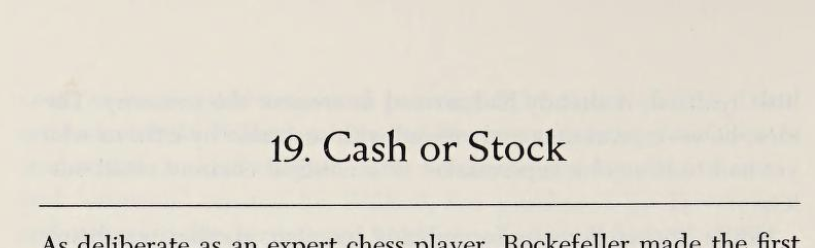

As deliberate as an expert chess player, Rockefeller made the first move in “Our Plan” to bring other Cleveland refineries within the orbit of the Standard Oil Company. One late December morning of 1871, he dispatched a message from his office in the Cushing Block on Public Square to the Second National Bank in its handsome new quarters at Superior and Water Streets. There his friend Stillman Witt was a leading director. The president of the Standard Oil Company wished to have a conference with Colonel Oliver H. Payne that afternoon at three o'clock in the bank’s rooms. Would someone kindly see that the Colonel got the word? The abrupt summoning of Payne was a characteristic Rockefeller technique; once a decision was made, he acted immediately. A few minutes before three o'clock the tall figure of John D. Rockefeller could be seen proceeding with a purposeful gait, but not hurrying, across the Square. Snow was falling, powdering his tall hat and well-cut black overcoat. As he reached the bank doorway and was shaking off the flakes, a clock somewhere began to strike the hour. The Colonel was waiting for him. Colonel Payne’s works, Clark, Payne & Company on Walworth Run, was the Standard’s closest competitor. The Clark part of the firm consisted of Maurice and James Clark, Rockefeller’s onetime partners. John D.’s early associates had a strange way of appearing and reappearing in his saga like actors coming and going through scenes of a play. Holding the greatest share of stock, Payne was the actual head of the company and it was with him Rockefeller wished to deal. He came directly to the point, offering the Colonel the opportunity to merge with Standard Oil on a partnership basis. There would be a management role for Payne, but Rockefeller would have nothing to do with the Clarks. Payne had suspected the object of this meeting before Rockefeller disclosed it. The Walworth Run plant, substantial as it was,

<!-- issues: missing_printed_page_number, image_text_overlap:0.179 -->

<!-- page_id: 0071-right | printed: 113 | viewer_token: 112 | viewer_sequence: 144/340 -->
## Page 113

had been losing money of late, and Payne knew the oil industry was in bad shape generally—with the exception of the Standard. The Colonel was not long in acceding to the combination idea, confident he could convince his stockholders likewise. In the settlement that followed, Payne’s company received $400,000 worth of Standard Oil Company stock, or 4,000 shares. It represented payment for the plant and other assets as well as for good will and Payne’s brains. One of Rockefeller’s aims was to bring able men into the Standard Oil Company. Payne was one of them and before long he was put on the board of directors. James Clark, who acquired 1,000 shares as his portion, evidently was as much of a problem to Payne as he had been to Rockefeller whom he never ceased to abuse. Tired of Clark’s tirades, Payne bought his stock at a price above market value. Clark was jubilant. He had extracted a profit from Rockefeller’s Standard Oil Company! Later, as the stock soared he assumed what became a familiar stance: cursing the Standard’s president for the lost wealth. Rockefeller, on his part, could understand why men might prefer United States currency to the then unstable oil industry's stock, but he never could comprehend why they later invariably blamed him for their decision. Rockefeller’s basic strategy was to approach the strongest refineries first. Success with them would influence the lesser firms to follow, he reasoned. Making his initial overture to Payne, a carefully thought out step it is certain, was a master stroke. Payne was a member of the wealthy Perry-Payne family. The Perrys were connected with Commodore Oliver Hazard Perry, hence young Payne’s name, Oliver Hazard. The Colonel was an aristocrat and fully aware of the fact. He and Rockefeller were born the same year, but they had little else in common, save a respect for each other's business sagacity. One can think of no greater contrast in lineage than between the two young men. Rockefeller, with a father listed in the Cleveland city directory as a botanic physician, was descended on his mother’s side from an obscure farmer in New York State. Cultured Henry B. Payne, the Colonel's father, had made his money in law

eee Flip

<!-- issues: low_ocr_confidence:67.5 -->

<!-- page_id: 0072-left | printed: 114 | viewer_token: 114 | viewer_sequence: 146/340 -->
## Page 114

and railroads. He was prominent in the national Democratic party, was a United States Congressman and later a Senator. Oliver Payne's mother was the daughter of Nathan Perry, Jr., whose father, Nathan Perry, Sr., had come to Cleveland the first time with General Moses Cleaveland. On his second trip here from Connecticut he bought tracts of land in several sections of the Western Reserve, including 1,000 acres in the young city General Cleaveland had founded. The Payne mansion at this time stood next to the Perry homestead amidst extensive grounds on Euclid Avenue at the corner of Perry Street. However, the Paynes when first married had lived some distance away on St. Clair Street. Every morning the bride’s father saddled a horse before breakfast to canter over the fields to see his daughter. All the way he was riding through his own property, crossing what was to become Payne Avenue and a wide stretch that later was known as “Payne’s Pastures.” When John D. was attending Central High School in Cleveland, Oliver Payne was a student at Phillips Exeter Academy in the East. From there he went to Yale University. He interrupted his college studies to enlist in the army at the outbreak of the Civil War, serving with distinction. He never married and mixed with only a few select friends. Flagler referred to him as “the kin of God.” Diffident though Payne might be with Rockefeller socially, the two got on well together in business. The Colonel was made treasurer of the Standard and invested heavily in the company’s stock as well as in other enterprises. After retiring he moved to New York where he developed an estate in Ulster County. He also made trips to Europe in his yacht, the Aphrodite. He was the uncle of Cleveland’s veteran Congresswoman, Frances Payne (Bingham) Bolton and her sister, the late Mrs. Dudley S. Blossom. With the prestigious Payne in his camp, Rockefeller turned to other refiners. Next he won the sturdy Yorkshireman, John Stanley, who received 200 shares for his small but well established plant. Operation of the firm had been an uphill struggle of late and Stanley did not disguise his relief at coming under the wing of the Standard Oil Company.

<!-- page_id: 0072-right | printed: 115 | viewer_token: 114 | viewer_sequence: 146/340 -->
## Page 115

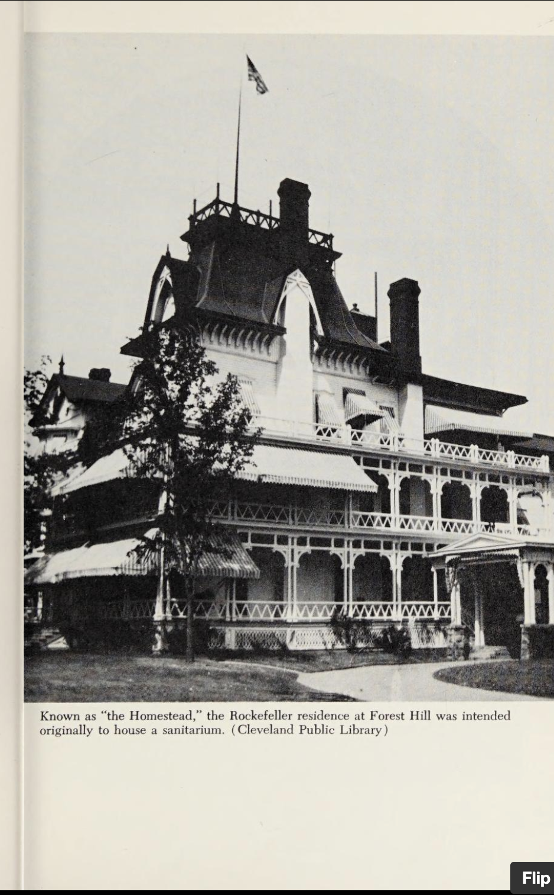

<!-- page_id: 0073-left | printed: none | viewer_token: none | viewer_sequence: 148/340 -->
## Unnumbered Page

> T2s,

> a

> eR Es 98) re Sea Ss re

> Me hd} teh e et

> ee

> Gi

> tage

> “we “Be, , iN =" \ *~ ose 7 4 .-

> Sse Se — Se eh 3 Se

Center hallway at Forest Hill. (Rockefeller Family Archives)

<!-- issues: low_ocr_confidence:30.46 -->

<!-- page_id: 0073-right | printed: none | viewer_token: none | viewer_sequence: 148/340 -->
## Unnumbered Page

> ONS

ppl 8 mn ileamlietassce tt

> Ve Sih ra a eee

|

eS aed Pas

EAST CLEVELAN SOUTH PA

> t

> Lane vin) CEMETERY an 1

_ met H e Hi ane | Mai eee 3 eae i i i se ora ae weet cert The Forest Hill domain as it was in 1903, bordered by Lake View Cemetery (lower left of map) and intersected by Lee Road (upper right of map). The lake, today, remains the same as it was laid out originally by Rockefeller,

<!-- issues: low_ocr_confidence:43.66, missing_printed_page_number -->

<!-- page_id: 0074-left | printed: none | viewer_token: none | viewer_sequence: 150/340 -->
## Unnumbered Page

### r_ ©

SS ee a Mr. and Mrs. Rockefeller swimming in the lake at Forest Hill. In the water Rockefeller invariably wore a straw hat as protection from the sun. (Rockefeller Family Archives )

The Boat House at Forest Hill. Its veranda was a favorite gathering place for the family, particularly Mrs. Rockefeller and her sister, Miss Spelman. (Cleveland Public Library )

<!-- issues: low_ocr_confidence:68.87, missing_printed_page_number -->

<!-- page_id: 0074-right | printed: none | viewer_token: none | viewer_sequence: 150/340 -->
## Unnumbered Page

> co)

> ._— a.

i.e

> ar q os

> y a A

LE eerie tgp epee gg ea ee TT te Family gathering at Forest Hill in the early 1880s. Standing, Rockefeller, Miss Lucy Spelman, unidentified man. Seated, Mrs. Rockefeller; Eliza Rockefeller, John D.’s mother; Mrs. Henry Chisholm; Mrs. Harvey Spelman, Mrs. Rockefeller’s mother. Front row, Alta and Edith Rockefeller. (Standard Oil Company, Ohio)

<!-- issues: low_ocr_confidence:36.2, missing_printed_page_number -->

<!-- page_id: 0075-left | printed: none | viewer_token: none | viewer_sequence: 152/340 -->
## Unnumbered Page

nf Sane Sel Pal tf Ss <a Er ploe |.|. aulkawetcto Mees ae \ a fis = Lak 5 Ss 7h a JIe Le paid a “a x Sf Ge / Se MOA] WROrth Pos ore] BY oa Ee 8 PRC» OO pratae & = on Siig tieey | 9g ard Ai Fog 1 Lyon wf eas Sel tien *. NEE ai fi pial | Shae ale a a Aa es ead ine

> See

> \\S\\ Pl Rockafller Ss. Lie\s Xv Ae \B le nartness Wes om ‘S. (Ya : Roy Wes aS Wx feed

> Sogo PIERS e eae Se Corket Ruple % pele Bariier: ES Oe BL EG Al Cade. 3 ve Q es nie Ke KEE e: . C.Beh. SYREN NES, PPERVID SE, ONS NSS \teag \ WAY GIFS £ ae ~~

me Ss er Te SSN EEN eR St PES Seg tae BS Se = 2 hap east REI IS AR SS inl) $2] 207. [ae eee ke MURR BOS psi Pes soos he Bae PR Nia, 19 es ee | a Pailin a Boor y \ J\ ee, coe ] J “¢ oe ENE toy |. a Lat Page yh 'Y, lenges tar Nege s gee is Dae | ae Zax, 15 Jie Loe a7 ; i. \ et wai 5 ae . % |-24 =p Psy rs ; tat Fo, KPO ARE, ee ie oy es ae itt |S BS OS 4 — ay uy tye = te Tv fs = een EAC ary, NO eet 0) eM SEIN » | 2

> Z ay & go €

> Snncyst Bitind -| 366 § lt 5 Marton & 095

Ca ae ES G> Pe RCE Bos pore fel rap wee | 2 ee os ~# =i eu fer ‘<3 ir T 7 BROLIN bp ~ ng ee BERLE 2 Gl saree | Et aa op ea [eae | oR 2 ALSOP SEL St as RUM EA B gon eet a RP as ES Sous) SV iy Buckiey Te ES OR ae aA Ser

> ohn Hicks | Fanni 36 Ncompte = ih artes) FIAD rN Mlaisted

> ia RO & 4 1 1 1 3 0 0 19 102 44 -1 5 1 1 1 3 1 0 19 102 44 20.290890 Pew 4 1 1 1 4 0 0 45 130 36 -1 5 1 1 1 4 1 0 48 7 33 53.695755 | 5 1 1 1 4 2 11 45 11 26 42.777882 |. 5 1 1 1 4 3 23 45 34 26 78.696602 Tones 5 1 1 1 4 4 58 45 5 26 84.368393 | 5 1 1 1 4 5 125 53 5 7 13.997049 °

S NS Ae NTH Se et a Se 8 Ne ONS SE is ova 5 $ \ {ohn Hicks | Penni i < HES $y Zones x en [compte SS eee dial RR | = Lb. RAL Netaisted i Cuyahoga County Map, 1874, showing the parallel routes of the Lake View and Collamer Railroad and Euclid Avenue. Also, on the opposite side of Euclid, near the point at which the Railroad turns west appears the original plot identified as “Hotel, J. D. Rockefeller,” the nucleus of the later estate at Forest Hill. The western end of the Railroad was at Superior Street and today’s 71st Street— the eastern terminus of the horsecar line. At the other end (top right on the map) was the land jointly owned by Rockefeller and Stephen V. Harkness which they donated for railroad roundhouse and repair shops.

Rockefeller was a major stockholder in the Lake View and Collamer Railroad, “deluxe standard gauge dummy steamline” in 1875. It operated for a brief time from present-day East 71st Street, east, past Forest Hill.

> | PMN OR Xa.

<!-- issues: low_ocr_confidence:37.12 -->

<!-- page_id: 0075-right | printed: none | viewer_token: none | viewer_sequence: 152/340 -->
## Unnumbered Page

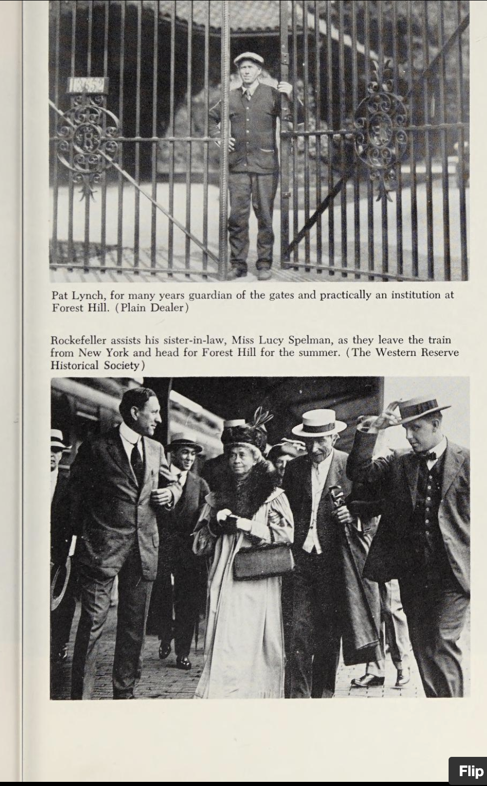

<!-- page_id: 0076-left | printed: none | viewer_token: none | viewer_sequence: 154/340 -->
## Unnumbered Page

> Sgt th A€ LS os

### tng g ae

ISS ROO OR AY : Sess ESOS INS SSSs: y/

> CD 4 \ » 4G SY wa QS SY OI ANG NS

> He 40" 4

### ssdet

> q ft

> Mia pinata - tel Tu é

inet 4 4

> peeing Mi

> A

i

Cleveland’s “Crystal Palace,” the Arcade, an architectural marvel. Stephen V. Harkness was president of the company that built it. Rockefeller was among the heavy stockholders. (Cleveland Public Library )

<!-- issues: low_ocr_confidence:36.88, missing_printed_page_number -->

<!-- page_id: 0076-right | printed: 115 | viewer_token: none | viewer_sequence: 154/340 -->
## Page 115

/ ] On January 1, 1872, the Standard increased its capitalization to $2,500,000. Witt and Stone each bought 500 shares and Handy, 400. The Long Island refiner, Jabez Bostwick, an admirer of Rockefeller and his company, came into the fold receiving 700 shares for Z a desirable plant that included a terminal of importance to the Standard. There were other new shareholders, one of them Peter H. Watson, freight agent for the Lake Shore Railroad. He also was one of the men working to form the South Improvement Company, _ _ but this was known to only a few. ] Rockefeller now presided over a much larger group than in the ¢= beginning days when he and his four partners were in charge. He - was no novice in the role of chairman, for he had learned the art as a teen-ager when appointed head of the Erie Street Church’s { _ board of trustees, all older than he. Except for Colonel Payne, the Standard’s new directors were also his seniors. . As chairman he was fully in command and thoroughly informed ar # on every detail of company operations. Yet Rockefeller’s mild manin ner deceived the uninitiated. Director Stone differed with him one ut day in an encounter as reported by Rockefeller. Stone suggested 1 _ the controversy be settled by two directors whom he would name. § §©6>-_ Rockefeller agreed and Stone selected Witt and Colonel Payne. On the way home that night Flagler was nervous about the outcome, but not Rockefeller. “I am right,” he said succinctly. When the meeting took up the following day, Stone reminded f | the two arbiters that it was he who had appointed them. NeverthegE less, their verdict was in favor of Rockefeller. Stone stormed out of ‘ | = the room. | Contemporaries found Stone gentle and pleasant in his home, Ma) but in public the thick set, heavily built man was domineering, al- “MN ways insisting on being “top of the heap.” He resented the rise of j Rockefeller, who was nearly twenty years his junior, a poorly paid 2 clerk when Stone was already a man of affairs. His dislike of Rockefeller flared again over an option he held for a the purchase of additional shares of Standard Oil stock. He failed ( to present it until after expiration of the option date. Rockefeller refused to recognize the right because of the time element. Stone

| es Fp

<!-- issues: low_ocr_confidence:58.02, missing_printed_page_number -->

<!-- page_id: 0077-left | printed: 116 | viewer_token: 116 | viewer_sequence: 156/340 -->
## Page 116

was so furious that Flagler advised letting him have the shares. Rockefeller would not and the disgruntled man sold all the stock he held. Several times during January 1872, Rockefeller was in New York for more or less extended stays. From references in letters to his wife, it is clear that he was then working with the men formulating the South Improvement Company. He wrote to Laura about “a new plan which grows on me.” And again: “we got our contract from Scot... and I feel well over it.” He obviously was much occupied with these negotiations, but, also, he had his wife and home in his heart and mind. Another baby was on the way. Bessie was four, Alta, eight months. Their mother, it appeared, felt burdened by this pregnancy and the prospect of a third child so soon. Her husband tried to cheer her. Addressing her as “My Beloved Wife,” he told her about attending a Baptist church service where he met a Mrs. Gribble (evidently known to both). “she remarked how much comfort Harriet (her daughter) had been to her,” Rockefeller wrote, “and she didn’t want her when she came . . . how do we know that in old age we may be left to lean on who we hoped would delay coming for some time” (the italics are Rockefeller’s). “Don’t allow any misgivings,” he continued. “We together will make the best of our experiences and try for all the good and happiness that can come from our mutual life.” He added a P. S. “I dreamed of the girl Cettie Spelman and woke to realize she was my Laura.” Letters went from Laura to him, often long letters. She had driven in the carriage—there was not enough snow for the sleigh—to call on Mrs. Eyears and had stopped to see Mrs. Chisholm. The latter had been hurt in an accident, possibly a runaway. At the door she met the injured woman’s physician, Dr. Henry K. Cushing (whose son, Harvey W., became a celebrated neuro-surgeon). It was from Dr. Henry Cushing that Rockefeller rented his office space. The physician razed the family homestead and on its site, in 1870, erected the Cushing Block (eastern part of the May Company building). Sending news of the children, Mrs. Rockefeller described “how

<!-- page_id: 0077-right | printed: 117 | viewer_token: 116 | viewer_sequence: 156/340 -->
## Page 117

prettily Baby has learned to kiss . . . but somehow she has taken a fresh cold . . . Bessie sends thanks to her Papa for her music box ... Mr. and Mrs. Sam Andrews spent the evening with me .. . The Flaglers dropped in. . . .” John D. wrote his wife he had arranged to have her parents visit her. They would be company for her while he was away. He was paying their expenses. Apparently only her mother came, and when she left, Laura was more lonesome than ever. She missed her husband. He, in turn, longed for “wings to reach you tonight.” He had been staying at William’s house. “Tell Bessie that last night I slept with Emma (William’s baby daughter) and O! did she kick! I feel more than ever thankful for a true and loving wife. Why shouldn't a man be stimulated to effort! the world is full of Sham, Flattery and Deception, our home is a haven of rest and freedom.” Between trips Rockefeller resumed his program of persuading “the important Cleveland refineries” to join with Standard. Giving them a choice of cash or stock in the company, he always counselled taking shares. The oilman needed to conserve all the cash possible. Also, Rockefeller had absolute faith in the Standard Oil Company. | He believed in it as he believed in God and the Baptist church. Those who accepted his injunction made fortunes. Many of the others became his enemies. Rockefeller invariably tried to discharge debts for plant improvements by urging contractors to take payment in stock. Two brothers, John and Hugh Huntington, had installed fireproof roofing under a sizeable contract. John reluctantly settled for stock. Hugh held out for cash. John became a multi-millionaire, leaving many bequests to Cleveland, including an endowment to help found the Museum of Art. Hugh, on the other hand, remained a man of modest means. For one refiner, Alexander, Scofield & Company, losses had forced the firm to suspend operation for a time, and the partners sold out. They wanted no stock, for they heartily disliked John D. Both of these Englishmen had pioneered in illuminant manufacture in the Flats, and they found it hard to accept the rapid rise of the young upstart Rockefeller.

| ee Fp

<!-- issues: low_ocr_confidence:58.16 -->

<!-- page_id: 0078-left | printed: 118 | viewer_token: 118 | viewer_sequence: 158/340 -->
## Page 118

John Alexander nursed a particular grudge because his early assistant, and fellow countryman, Sam Andrews, had left him to go with Rockefeller—and had prospered! The firm’s relations with Rockefeller were not improved in the case of William Scofield (not to be confused with William Sc(h)ofield) when his daughter Helen married Frank Rockefeller whose contacts with his brother were growing strained. The fact that Frank had also had an interest in another refinery bought out by the Standard did nothing to sweeten his attitude toward John. Alexander and Scofield later denounced Rockefeller as having cheated them in the price paid for their plant. Similar charges were leveled at the Standard by other refiners who had sold. Rockefeller countered such criticism as due often to an owner's exaggerated notion of his property’s worth, plus disregard for the inroads of age and obsolescence in a plant. Isaac Hewitt, Rockefeller’s old employer, the only man he ever worked for, was a partner in the Alexander & Hewitt refinery. An evaluation of $20,000 was put on his holdings when the company was planning to sell out to the Standard. Hewitt consulted his former bookkeeper as to whether he should take it in cash or stock. Rockefeller argued for the latter. Hewitt, however, disregarded the advice. Before long it was plain to him—and to his daughters—that he had thrown away an opportunity to become a millionaire. A few years later he testified at a government hearing that he had been “threatened” by Rockefeller and had sold under duress, all of which was vehemently denied by Rockefeller. The muckrakers preferred to believe Hewitt and quoted him often. Frank A. Arter, another Clevelander, left a different story for posterity. Arter had been in difficulties with his refinery and was ready to unload to the Standard. Rockefeller’s appraiser, Ambrose McGregor, a redheaded, conscientious Scot, went to work with his customary thoroughness. He never overlooked a thing, not even a hammer or a screwdriver, in his effort to compile a fair list. This time he came up with a salvage value of $3,000 for a plant that had cost Arter $12,000. Also, the oilman was shouldering a $25,000 debt, and he felt the money settlement was the only alternative for

<!-- page_id: 0078-right | printed: 119 | viewer_token: 118 | viewer_sequence: 158/340 -->
## Page 119

him. Rockefeller and Flagler, whom Arter knew, counselled him to take the stock if he possibly could manage. He did, and after a struggle Arter emerged a very wealthy man. His son, Charles K. Arter, often made a point of telling how much the family felt “obliged to Mr. Rockefeller—a very great obligation, indeed.” In February 1872, the Plain Dealer broke the story of the South Improvement Company. A fury like hot and searing lava erupted against the program. Crowds of angry men in the Oil Regions staged mass meetings that were near-riots, labeling the “company” a “monster,” an “octopus,” and its members “thieves and robbers.” As soon as it was discovered that the Standard Oil Company had joined, imprecations of the most violent sort were directed at Rockefeller. Rockefeller was the Standard Oil Company to the public. Neither he nor Flagler was prepared for the virulence of the uproar. Even Rockefeller’s most laudatory biographers criticize him for subscribing to the South Improvement Company. The questionable feature was not so much in the rebate provision since reduced freight cost for big shipments was a recognized commercial practice. The evil lay in the drawbacks arrangement. The South Improvement Company cannot be ignored in any study of Rockefeller, for, short-lived as the “company” was, it contributed to the cumulative, intense enmity focused on the Standard Oil head until well into the early nineteen hundreds. Rockefeller explained many years later his reasons for the Standard’s participation. The oil industry situation was desperate. Though he thought the proposition not as good as “Our Plan,” it was a ready-made scheme backed by powerful refiners and railroads. He could not afford to antagonize them, for if the proposed setup failed, he would need their cooperation to put across his own conception of a united oil industry. The opposition proved too much for the South Improvement Company. Within a matter of weeks it fell apart without ever starting to function. Not a barrel of oil was carried under the arrangement, Rockefeller emphasized when discussing it later. While the furor was raging he would make no comment. He barred his doors to reporters and refused to give out any statement.

| es Fp

<!-- issues: low_ocr_confidence:58.77 -->

<!-- page_id: 0079-left | printed: 120 | viewer_token: 120 | viewer_sequence: 160/340 -->
## Page 120

He explained his stand to his wife, writing to her from New York in March. Newspapers were full of the excitement and of accusations against him. Laura was greatly disturbed as she indicated in her letters to him. “It is easy to write newspaper articles,” her husband told her. “We will do right and not be nervous or troubled by what the papers say .. . by and by [sic] when we are through we may briefly respond (though it is not our policy). But leave future events to demonstrate our intentions and plans were warranted. I want to act perfectly conscientiously and fearlessly in the matter and feel confident of good results.” In refusing to talk, Rockefeller made a mistake, as he realized later. The public interpreted his silence as an admission of guilt. With these events swirling about him, his church was never neglected. He took his place as superintendent of the Sunday School at the Euclid Avenue Baptist Church and made notes about the sermon for Laura if she was unable to attend. He gave much attention to the new church building being erected at this time at Euclid and Huntington Street. He and Henry Chisholm were the heavy contributors to the building fund. Chisholm tithed, but not Rockefeller. Instead, he matched members’ pledges dollar for dollar. No reliable record of his gifts to this church is available. In what must be regarded as incomplete total, the sum is put at $755,466 over this period and a little beyond. The Rockefellers’ new baby arrived in August and was named Edith. Three small children—Bessie, Alta and Edith—to liven up the Euclid Avenue home! If they were all girls, their father loved them, every one, for he was a doting parent. Cleveland’s Union Club, an exclusive town club for men, that had been incorporated at the beginning of the year, was organized in September 1872. The club purchased the Handy mansion on lower Euclid Avenue. Officers were elected with William Bingham, wholesale hardware merchant, named president, and Henry B. Payne, vice president. The committee on admissions consisted of Amasa Stone, Henry Chisholm, J. H. Wade and Oliver H. Payne. Writing about Rockefeller, authors like to picture him and Flagler at luncheon in the rarified atmosphere of the Club, deep in discussion of business problems. Actually, neither Rockefeller nor

<!-- page_id: 0079-right | printed: 121 | viewer_token: 120 | viewer_sequence: 160/340 -->
## Page 121

Flagler was a member of the Union Club, nor was William Rockefeller. The only Rockefeller who ever belonged was Frank, who was a member from 1890 until his death. The Club, today located on Euclid Avenue at East 12th Street, purchased this property in 1901 from Mrs. William B. Castle, whose son-in-law, D. Z. Norton, was an early member. The Castle home was razed, and the present club house completed in 1905. By midsummer of 1872, all but a half dozen of the many oil refineries in Cleveland either had united with Standard Oil Company or had been purchased outright. Rockefeller at thirty-three was the head of the largest oil company in the country. And Cleveland was the nation’s oil center. Ida Tarbell contended that Cleveland oil plants had been crushed by the Standard head. And, paralyzed, they collapsed into the Standard’s net, she declared. Nonsense, Rockefeller retorted. They already had collapsed and were near bankruptcy. “Most of the refiners were very desirous to get out of the oil business,” he wrote in his Reminiscences. Within a few years, several of the important oil men who had been loudest in their castigation of Rockefeller for his part in the South Improvement Company joined the Standard. Notable among them was the boyish Titusville refiner, the able John D. Archbold, who ultimately succeeded Rockefeller as president of the Standard.

> 20. A Son and A Summer Home

With a laggard January dawn breaking over the sky, a short, plump woman carrying a doctor's satchel hurried up the steps of the Rockefeller home on Euclid Avenue. At her approach, the big front door swung open promptly, for Dr. Myra K. Merrick was expected. A familiar figure in this house, she went directly to Mrs. Rockefeller’s bedroom upstairs, radiating good cheer and self-assurance with every step. Before many hours had passed, she came briskly out of the room

— Ee Fp

<!-- issues: low_ocr_confidence:76.25 -->

<!-- page_id: 0080-left | printed: 122 | viewer_token: 122 | viewer_sequence: 162/340 -->
## Page 122

to confront Rockefeller patiently waiting nearby. “You have a fine son, Mr. Rockefeller,” she announced triumphantly. And shortly she put in his arms a blanketed mite of humanity who, it was understood, would be named John D. Rockefeller, Jr. Later that day the elated father burst into his office with the news. Never had his associates seen him so excited. He had dropped his mask of formality and, for the first time, his emotions were in view. With an onrush of affection, the men crowded around him to shake his hand. Even Payne unbent. He and Flagler stood beside him, their arms around his shoulders. Tears glistened in Rockefeller’s eyes. It was January 29, 1874. The great day was described in a letter written by Mrs. Rockefeller to her son on his birthday years later:

Twenty-two years ago today I remember almost as well as though it were yesterday. The scene was laid in our upstairs bedroom at 997 Euclid Avenue—the hour was ten o'clock in the morning, the day has slipped my memory (actually it was Saturday). The persons were Dr. Merrick, Sr. (her niece Eliza was Dr. Merrick, Jr.) and Mrs. Lobb (a nurse). Father was across the hall. How glad we were the baby was a boy for there had been four girls and that he was perfectly formed. Though the first three years of his life were filled with anxious care for his health, he now stands a man of strength and vi- CONS: ze

Dr. Merrick, Cleveland’s pioneer woman physician, was widely recognized as a skilled obstetrician. Male practioners, it is said, often secretly consulted her in difficult cases. Having overcome the roadblocks against entry of women in the medical profession, she now numbered prominent Clevelanders among her many patients, including practically all the wives of Standard Oil officials. A homeopath and a woman of great charm, she was regarded as a family friend by the Rockefellers. They never forgot that it was she who brought John D. Jr. into the world, and they were generous | supporters of her free clinic for women and her work to establish ‘Huron Road Hospital. The arrival of this long-awaited son was accepted by his parents as answer to their prayers. Consequently they determined to mold

<!-- page_id: 0080-right | printed: 123 | viewer_token: 122 | viewer_sequence: 162/340 -->
## Page 123

him after their image of righteousness and duty. No details survive of the delicate babyhood mentioned by his mother in her letter. His Aunt Lucy referred to a stay in Colorado when he was a year old, and this possibly was for the child’s health. Then, too, his parents may have been over-solicitous in the guarding of this only boy. Nevertheless, John and Laura Rockefeller seemed more concerned with their children’s spiritual than with their physical wellbeing. Shortly before young John’s birth, his father acquired Forest Hill, a tract of a little over seventy-nine acres bordering Euclid Avenue in East Cleveland, part of the extensive lands of the Doans who were early settlers. The site was four miles east of the Rockefeller Euclid Avenue home and seven miles from the Standard Block on Euclid Avenue facing Sheriff Street, new headquarters of the Standard Oil Company. While Forest Hill was to become the family’s beloved summer home, originally Rockefeller had no such plan in mind. He bought the property as an investment. Perhaps he was following the lead of Stephen Harkness, who believed in the future of Cleveland and was buying real estate particularly along Euclid Avenue east from Willson Street. Rockefeller sold his acreage in December 1875 to the Euclid Avenue Forest Hill Association and then bought shares in the company. Its purpose was to establish a “water-cure and place of public resort.” The company was incorporated at a capitalization of $250,000 with 2,500 shares issued at $100 each. Incorporators were: Marcus W. Montgomery, C. B. Dutton, W. F. Walworth and John D. Rockefeller. As part of this enterprise, Rockefeller and Montgomery with several others earlier had organized the Lake View & Collamer Railroad, described in its prospectus as a “deluxe standard gauge dummy steamline.” It was routed east from Lockyear Avenue and today’s East 71st Street, near where the Superior Street horsecar line ended and, keeping to the north of Superior Street, went to Chardon Road, or Collamer. High wooden trestles carried the tracks over the valley of Doan Brook where later Rockefeller Park was laid out, and also over Nine Mile Creek. Harkness was in this venture, too, for he and Rockefeller do-

/ ee Fp

<!-- issues: low_ocr_confidence:54.85 -->

<!-- page_id: 0081-left | printed: 124 | viewer_token: 124 | viewer_sequence: 164/340 -->
## Page 124

nated land near Lake View Avenue for a roundhouse and repair shops, which gave employment to a number of men. Rockefeller personally interviewed each worker, warning them that indulgence in intoxicating liquor on or off the job would cost them their positions. A notice in the Leader in September 1875 stated that the Lake View & Collamer Railroad expected delivery in a day or two from the Globe Iron Works in Pittsburgh of a locomotive and coaches to accommodate one hundred and fifty passengers. Stockholders had voted to lease the road for fifteen years to L. M. Tantum at a rental beginning at $3,240 for the first year. Capitalization of the railroad was $250,000 with shares of stock to be sold at $50 a share. Value of the equipment was put at $90,000. The directors, in addition to Rockefeller and Montgomery were: William West, president, John H. Ammon, Isaac H. Page, James McCloskey and Hezekiah Avery, most of them East Cleveland residents. On October 7th the undersize engine, glittering in brass trim, pulling small, steam-heated cars, clattered over the tracks on the first run. The road was well patronized. The community of Collamer, thrived with an influx of settlers, new stores, and churches, all dependent on the little railroad. The road’s terminus at the Nickel Plate right of way in East Cleveland was in close proximity to the water-cure resort getting under way at Forest Hill. This, and the fact that two men, Rockefeller and Montgomery, were the leading promoters of both the railroad and the Forest Hill resort, show the close tie-up between the two undertakings—each would stimulate patronage of the other. But the country was hit by a depression. Both enterprises failed. It is difficult to determine whether the little railroad’s collapse brought about that of the water-cure resort or vice versa. Backers of both lost money—including Rockefeller. A most unusual circumstance as far as he was concerned. Today nothing remains to mark the route of the Lake View & Collamer Railroad. The only reminders of its existence are stock certificates, now collectors’ items. Forest Hill fared better. Rockefeller was not slow in buying it back. He probably had explored the slopes and deep valleys sev-

<!-- page_id: 0081-right | printed: 125 | viewer_token: 124 | viewer_sequence: 164/340 -->
## Page 125

eral times on horseback, both when he first acquired it and also when plans were afoot for the water-cure development. The unspoiled land appealed to him, reawakening memories of his boyhood in scenic New York State. He was not sorry to have the domain again in his possession. Laura Rockefeller liked Forest Hill from the moment she saw it. The big, rambling building intended to house the sanitarium was half finished when work was abandoned. It was very large for private family use, yet it had a redeeming feature, a splendid setting on a knoll commanding a sweeping view. From upper floors the blue waters of Lake Erie could be seen on clear days. The Rockefellers set about completing the house, remodeling it somewhat, but retaining all the clutter of turrets and towers, its bay windows and ornate verandas. There then ensued what must be regarded as the most out-ofcharacter episode in Rockefeller’s life story. Once the house was finished and furnished, he ran it for one summer as a club for paying guests selected from among Cleveland friends. Perhaps he had in mind carrying out the resort part of the original project. At any rate, John D., Jr., related that one of his earliest memories was of coming into the dining room to find Negro waiters serving the food. This was the summer of 1878 when he was four. On a Cuyahoga County map of 1874 the route of the Lake View and Collamer Railroad is clearly indicated as the land jointly owned by Rockefeller and Harkness for the Road’s repair shops. The original Forest Hill track is marked “Hotel,” “Rockefeller.” So evidently his part in this venture was widely known. Although Rockefeller most surely kept records of this enterprise, none has come to light, nor has the list of guests been found. However, it is a tradition in the Chisholm family that Mr. and Mrs. Henry Chisholm stayed at Forest Hill at this time, according to a granddaughter, Mrs. John H. Hord (Helen Chisholm), of Cleveland. “Grandfather Chisholm died before I was born, but I heard the story many times,” said Mrs. Hord. “Grandfather and his family were most cordially invited to Forest Hill for a visit, but hesitated

om Flip

<!-- issues: low_ocr_confidence:57.53 -->

<!-- page_id: 0082-left | printed: 126 | viewer_token: 126 | viewer_sequence: 166/340 -->
## Page 126

to take the children so far out into the country. Mr. Rockefeller urged them to come, assuring them there would be plenty of good fresh milk for the children, and they went.” She added that after her grandfather returned home he was surprised to receive a bill from Rockefeller for ten dollars for board. “Grandfather had not realized they had been at a hotel,” she said. Alfred Eyears and his wife, accompanied by their children may have enjoyed the hospitality of the “club,” as well as the Flaglers. Rockefeller’s foray into innkeeping was not a success. He discovered the guests expected “Mother” to entertain them, and he would have none of that. The waiters were dismissed, and the experiment abruptly terminated. Rockefeller resolved that Forest Hill would be maintained exclusively as a summer home for his family. Many years later Mrs. Hord came to know Forest Hill as well as she did her own home. Her father, Wilson, son of Henry Chisholm, built a residence adjoining the Rockefeller estate, and Forest Hill became Helen’s girlhood playground. Riding her bicycle over the winding paths, she often encountered Rockerfeller. He always greeted her pleasantly, she said, but Mrs. Rockefeller was her favorite. Though considerably younger than John D., Jr., she knew him and the girls well. Like all the Chisholms, she attended the Euclid Avenue Baptist Church. Edith Rockefeller was her Sunday School teacher. Mrs. Rockefeller was in charge of the junior department. “I was in and out of the big house at Forest Hill to see her like one of the family. When I married and moved away,” Mrs. Hord continued, “we corresponded. Mrs. Rockefeller was a wonderful letter writer—she never forgot my birthday or any special event in my life.” Looking back to memories of seventy years ago, Mrs. Hord declared, “Mrs. Rockefeller was a darling!”

<!-- page_id: 0082-right | printed: 127 | viewer_token: 126 | viewer_sequence: 166/340 -->
## Page 127

### 21. Crowded Years

Rockefeller’s excursion into operation of a dummy railroad and a water-cure resort is all the more amazing when one considers that at this time he was in the midst of one of the most eventful and grueling periods of his career. The Standard’s absorption of Cleveland refineries was largely completed with amalgamation or purchase of more than twenty (the figure sometimes put at over thirty) local plants. In the wake of this accomplishment Rockefeller and Flagler along with Payne, now in the company’s upper echelon, were faced with many decisions: which plants should be scrapped; which updated and retained; who of the inherited personnel to add to the Standard family; who to pension off. . . . In the end six big refineries emerged under the Standard banner. Number 1 and Number 2 plants were original Standard units. The other four were reconditioned and remodelled from those taken over. As vigilant as in the days of a more limited operation, Rockefeller kept in touch with the sweeping changes. He appeared in the yards to check outgoing freight. In the office a bookkeeper might find himself displaced from his high stool while “Mr. Rockefeller” looked over a ledger. Inspecting a lineup of barrels one day, he wondered if the overlap in the iron bands around them could be shortened with safety, and he assigned the thorough going Mc- Gregor to find out. The Scot in due time reported that several inches might be eliminated with no risk to reinforcement. The resultant decrease in the required metal saved the company several thousands of dollars—“a small fortune,” the president commented with great satisfaction. Despite his heavy schedule, Rockefeller often interviewed former employees of disbanded plants as well as other job seekers. On the lookout for promising individuals to add to Standard’s staffs, he was known to spend as much time in patient examination of an inexperienced teen-ager as with a skilled older applicant. O09

- ——“————”C—“(C(C‘“‘zrS'

<!-- issues: low_ocr_confidence:64.07 -->

<!-- page_id: 0083-left | printed: 128 | viewer_token: 128 | viewer_sequence: 168/340 -->
## Page 128

The oil industry was caught up again—or still—in the twin bogey of too much crude and an overcrowded refinery field. It was affected, too, by the country’s financial troubles. Panic had gripped the nation with the sudden collapse in 1873 of the banking house of Jay Cooke, the man who had been such a factor in financing the Union cause in the Civil War. Attempting to bring order out of confusion, certain manufacturers formed the National Refiners’ Association. Producers also united. But both soon broke up. Although Rockefeller was elected president of the refiners’ group, he had little faith in either one, calling them “ropes of sand.” Instead, he turned more vigorously than ever to his bold design of strengthening the petroleum business generally—and benefiting the Standard—by merging refineries throughout the country with the company as he had done in the case of Cleveland plants. The West required little attention since the Standard’s geographic location provided natural ties. In the South he extended his hold by purchasing half interest in a Louisville company whose distributing outlets opened the way soon for Standard’s departure into retail selling. However, the bulk of oil manufacturing and some of the strongest refineries in the United States were to be found within a roughly triangular area embracing parts of Pennsylvania, New York and New England. Rockefeller and Flagler in the early 1870s were concentrating in this section. Representatives of hard-to-win, out-of-town oil companies sometimes were invited to Cleveland where they might be met at the railroad station by the Rockefeller carriage with its trimly liveried coachman and sleek horses. After a tour of the Standard’s superbly functioning works and an examination of company books at the busy office in the Standard Block, the visitors, returning home, invariably recommended affiliating. Important refiners, responding to the proposals, were coming into the union one by one. Jabez A. Bostwick’s Long Island Oil Company with a valuable refinery and terminal at Hunter's Point joining in 1872, was followed by two other Long Island companies. Leading plants in the Philadelphia and Pittsburgh districts also were acquired. The Standard now dominated the main oil manufacturing sections of the country but was not yet a monopoly.

<!-- page_id: 0083-right | printed: 129 | viewer_token: 128 | viewer_sequence: 168/340 -->
## Page 129

At a meeting in Cleveland in 1875, the company raised its capital structure to $3,500,000. The board of directors was enlarged to include officials of the newly acquired refineries. Among them was Charles Pratt, an able New York oilman and a dedicated Baptist whom Rockefeller admired. With him came H. H. Rogers, who was to have a prominent part in the Standard’s subsequent chronicle, but who did not gain Rockefeller’s complete confidence. Clevelanders were still in the majority with former independent local refiners like Huntington, Stanley and Arter elevated to the board. New stockholders included city leaders like Eells, Handy, and H. B. Payne. As the Standard’s power extended, despair and animosity seized bypassed independent refiners as well as producers. There was mistrust not alone of the Standard, but even more of the railroads. Investigations were started in Ohio and Pennsylvania. In Ohio the proceedings dwindled to nothing. In Pennsylvania, on the other hand, indictments were lodged against Rockefeller and certain other Standard officials. While these charges were never carried out, unfavorable attention had been turned on the Standard, damaging it greatly. A stiffer enquiry got under way in New York State, where the legislature appointed a committee headed by an energetic young man, one Alonzo B, Hepburn, who dug ferociously into the matter. Since discriminatory practices on the part of railroads implied cooperation with a second party, the New York committee shifted to big shippers, the millers, meat packers, salt makers—and the Standard Oil Company. After two years of hearings, a long report was issued in January 1880 that selected the Standard for special indictment as a monopoly, and the railroads the for connivance that made this possible. Chastisement of the railroads was pointless, for by this time pipelines had largely taken their place in transportation of oil. While other industries were found to have risen to monopoly proportions, the committee turned its biggest guns against the Standard. Its officials declared the findings unfair to the company, a conclusion generally substantiated as viewed through the perspective of passing years. Contemporary opinion, however, accepted

eee Fi

<!-- issues: low_ocr_confidence:57.12 -->

<!-- page_id: 0084-left | printed: 130 | viewer_token: 130 | viewer_sequence: 170/340 -->
## Page 130

the judgment, condemned the Standard and even more bitterly denounced its symbol, John D. Rockefeller. With these proceedings still fresh in the public’s mind, Rockefeller’s reputation was injured still further by two episodes that took place in his home city. One concerned a firm made up of William Scofield, Daniel Shurmer and John Teagle. The other was precipitated by Mrs. Fred M. Backus, whose late husband had manufactured lubricants. The Scofield, Shurmer & Teagle Company was a consolidation of two firms that had sold out to the Standard. They had made the usual pledge not to engage in refining operations for a ten-year period. Yet, in 1875, less than three years later, the new partners had built a plant and were refining oil. Rockefeller met the situation by setting up a profit-sharing arrangement whereby the Scofield firm was guaranteed a minimum yearly profit and was given the privilege of buying crude oil and shipping its product under the aegis of the Standard’s special rates. In return, the Scofield Company agreed to a limitation in output as specified by Rockefeller. All went well for three or four years. The firm enjoyed profits that even the biased Ida Tarbell declared were “enormous.” Scofield and partners began to exceed the limitation agreement and refused to curtail the quantity. Rockefeller sued and lost. The case went to higher courts. The Standard, which meant Rockefeller to the public, was found guilty of attempted restraint of trade. Scofield and partners came out the winners and were hailed as heroes. But theirs was a Pyrrhic victory. Without the Standard’s underpinning in buying power and freight costs, the once prosperous company was forced to shut down its operation. As a footnote to the bitter controversy, it is interesting to record that Teagle, who later closed his breach with Rockefeller, married the daughter of Maurice Clark, Rockefeller’s first partner. Years later the couple’s son, Walter Clark Teagle, became president of the Standard Oil Company of New Jersey. Rockéfeller’s standing with fellow Clevelanders, as well as his own feelings, were deeply hurt by the encounter with Mrs. Backus. Whatever interpretations may be put on his actions in other in-

<!-- page_id: 0084-right | printed: 131 | viewer_token: 130 | viewer_sequence: 170/340 -->
## Page 131

stances, in the Backus case it would seem that the verdict must be entirely in his favor. Mrs. Backus, who had been running her husband’s plant since his death, approached Rockefeller stating she wished to sell, estimating the property as worth $150,000. At the outset she was displeased when Rockefeller stated that such matters were not handled by him, as she wished, but by specially trained company personnel. Nevertheless, he followed the proceedings carefully because he had known Mr. Backus. When the appraiser's report came through he saw to it that $10,000 was added to the payment price for good will. Mrs. Backus received $79,000 in cash. She also retained assets she valued at $60,000 and later sold elsewhere at this price. Thus, she netted $139,000. Rockefeller urged her to keep some of the Backus stock that soon would be converted into Standard Oil stock, but she did not wish to do so. She seemed completely satisfied with the transaction, as Rockefeller thought. After some time, Mrs. Backus changed her mind and wanted some of the settlement in stock. Rockefeller explained this was legally impossible, as the papers had been filed, and the plant taken over. In short, negotiations were closed. To his “profound astonishment,” as he wrote in his Reminiscences he received “a most unkind letter” from the widow. Worse was to | follow. Testifying on behalf of the Scofield Company at a hearing of their suit, she claimed in an emotional outburst that Rockefeller had forced her to sell a plant worth $200,000 (she had raised its value by now) for $79,000, had refused to sell stock in the Standard to her, and altogether he had cheated “a poor widow who was the sole support of three fatherless children.” When Rockefeller brought out his memoirs more than twentyfive years later, he told his side of the tale for the first time. He also included statements by the brother of Mr. Backus, Mrs. Backus’s own attorney and some former employees of the Backus plant. All contended that in their judgment Mrs. Backus had been fairly, even generously, paid for the plant that they pointed out was beginning to deteriorate. Until this late date Rockefeller had made no move to vindicate himself. Many people, therefore, put full credence in

Ee rie

<!-- issues: low_ocr_confidence:66.01 -->

<!-- page_id: 0085-left | printed: 132 | viewer_token: 132 | viewer_sequence: 172/340 -->
## Page 132

Mrs. Backus’s projection of him as a heartless rich man who had taken advantage of a lone woman with three little children clinging to her skirts. Clevelanders talked about the Backus case for years, always sympathetic with the poor widow. Incidentally, when the “poor widow” died, she left an estate of $350,000. Rockefeller never forgot the encounter with Mrs. Backus. In his Reminiscences, he devoted eleven pages of the short book to the “Backus Affair.” Still smarting over the memory, he coneluded: “It is probable that its wide circulation and its acceptance as true by those who know nothing of the facts has awakened more hostility against the Standard Oil Company and against me personally than any other charge which has been made.” In the midst of these disturbing happenings in Cleveland Rockefeller was continuing his effort at unification of the oil industry, winning refineries in many places including the Oil Regions. As corollaries of the annexations, the Standard was gaining fleets of tank cars and barges, segments of pipelines which were welded into a facility of great value, increased shipping assets and the like. A complex and widely spread organization was emerging under the genius Rockefeller. Yet, he and other officials by 1879-1880 were troubled over certain legal matters. The large combination of companies they were creating was functioning under the Standard Oil of Ohio. Its charter, however, restricted it to operation within the state. To meet the problem it was decided to deputize a Standard official as trustee. Flagler, secretary of the company, was chosen. He held the stocks of the merged companies for the stockholders of the Standard, but not for the Standard Oil Company itself. Shortly, his duties were taken over by three men in the headquarters office in Cleveland, namely Myron P. Keith and George F. Chester of the Standard’s legal staff, and George H. Vilas, company auditor. The Standard and its thirty-seven stockholders transferred to them all stocks in the new companies. Thus the Standard Oil of Ohio avoided ownership in these out-of-state businesses. As expansion continued, nine more trustees were added: John D. and William Rockefeller, Oliver Payne, Bostwick, Flagler, Pratt,

<!-- page_id: 0085-right | printed: 133 | viewer_token: 132 | viewer_sequence: 172/340 -->
## Page 133

Benjamin Brewster, Archbold and William G. Warden, an important Philadelphia oilman. The “Cleveland Crowd”—the two Rockefellers, Flagler, Payne and Harkness (though not a trustee)—were in control, owning nearly four-sevenths of the holdings. The new arrangement also called for setting up separate Standard Oil companies in each state, under one management and a common executive board. The headquarters, shared by all, was in New York, the logical location. Certain Cleveland personnel moved to that city. Key men like McGregor, and also Payne for a time, remained in Cleveland. All properties of the Standard and its subsidiaries were placed in the hands of the trustees whose duty was to issue certificates of interest in the holdings. They were also given the broad authority of “supervision over the affairs of the several Standard Oil companies” now being formed. “In effect, but not in law, one great company,” the Standard Oil Trust was formed in January 1882. Few outside the principals knew it for intentionally the agreement was not publicized. The word “trust” as yet had no evil connotation, but carried its true meaning, custodial care. By no means all the country’s oil firms joined the combination. Rockefeller repeatedly pointed out that the Standard always had plenty of competitors. But the stabilization he sought had come to the industry. The Standard Oil Trust has been called the first in American economic history, opening the door on a new industrial epoch. This trust in the 1880s, it has been stated, was the largest and richest manufacturing organization in the world. John D. Rockefeller ruled it, not as a lone dictator, but as the master mind in conjunction with the able men he drew around him. The efficient, well-knit Trust entered the retail trade field. Its wide-flung network of interlocking companies provided a readymade channel for reaching practically every part of the country. Retail sales had been handled in a disorganized, wasteful fashion, a condition soon remedied by the Rockefeller touch. Shortly, neat Standard Oil Company wagons, always pulled by good horses, became familiar sights on city streets and country lanes. Kerosene for light, and after a bit, for cookstoves, was trundled to the door of

ft ————r—CO————C(‘(C;té*rS

<!-- issues: low_ocr_confidence:54.45 -->

<!-- page_id: 0086-left | printed: 134 | viewer_token: 134 | viewer_sequence: 174/340 -->
## Page 134

every householder, or left by the tankful at corner grocery stores to be dispensed in handy little cans. Proud of this service to the public, Rockefeller asserted: “The Standard was one of the first, if not the first, industry” to promote direct-to-consumer selling. He contended the quick success and and popularity of this innovation bred antagonism among envious competitors and was responsible for much of the criticism of the Standard. He pointed out that these “selling methods, far in advance of any that then existed,” were emulated by “many lines of trade.” Constantly searching for ways to increase volume of sales, Rockefeller early sensed the opportunities for marketing oil in foreign lands. Acquisition of the well-established Long Island firm strengthened the overseas program William Rockefeller was cultivating so assiduously. John D. frequently pointed out that sales of the American oil curtailed competition from Russian and other foreign oil, and returned millions of dollars in gold to the United States. The Standard’s kerosene in increasing quantities moved from Cleveland “to be carried,” as John D. said, “by camels or on the backs of runners in the most remote portions of the earth; we adapted the trade to the needs of strange folk... . In many countries we had to teach the people—the Chinese, for example—to burn oil by making lamps for them.” Burners for these lamps were produced in Cleveland at the Buckeye Foundry on Platt Avenue. One of the partners there, Francis E. Drury, was also experimenting in the manufacture of oil burning stoves that later netted him a fortune. Out of the pioneer foundry, following a succession of consolidations through the years, the Perfection Stove Company was formed. “Perfection” oil burning stoves were put on the market at the turn of the century. The new company continued the traditional association with the Standard Oil Company, but within the United States and with stoves instead of lamp parts. Perfection’s oil stoves were distributed by the various state-based Standard Oil companies throughout their territories. No formal business agreement was signed between Standard and Perfection. It was enough that the product of

<!-- page_id: 0086-right | printed: 135 | viewer_token: 134 | viewer_sequence: 174/340 -->
## Page 135

an oil company stimulated demand for the product of a stove company. The mutually profitable relationship lasted for years. Long after the Standard’s first emissaries converted the Chinese to kerosene lamps, the Rockefeller Foundation through its China Medical Board established the Peking Union Medical College. It consisted of fifty-nine buildings, situated on a twenty-five acre compound. The culmination of long study and planning, the complex was completed in 1921 at a cost of over $8,000,000. When the Foundation’s final grant was made in 1947 it had expended almost $45,000,000 for the unit and for the stimulation of a broad medical program and medical training in China. The China Medical Board of New York is no longer connected with the Rockefeller Foundation. The Peking Union Medical College, however, is still functioning. Its name was changed to The Anti-Imperialist Hospital, and recently changed again, this time to the Capital Hospital. Rockefeller consistently plowed earnings back into the capital structure of the Standard Oil Company even though this tended to lower dividends. Samuel Andrews, one of the Standard’s “founding fathers,” grew increasingly irked at the practice. His pioneering and enthusiasm had aroused John D.’s initial interest in oil. The burly Englishman, from the beginning days in Cleveland was the Standard’s superintendent, a practical chemist, able in his job and hard working. However, he had not kept abreast of management trends. At board meetings when the Standard was launching its outof-state mergers, he was airing his discontent, finally threatening to sell his stock and pull out. One day in the spring of 1874 Rockefeller, tired of listening to his grumblings, asked him what he would take for his holdings. “A million dollars,” he answered without hesitation. Rockefeller asked for a twenty-four hour option, saying that they would discuss the matter further the next day. On the following morning Andrews came into the office in the Standard Block to find the president had a check for a million dollars ready for him. The former superintendent accepted it gladly, thinking he had the best of the bargain. Soon the same old story was re-enacted. Siar

a _————””C‘(‘(‘éiz‘ HS

<!-- issues: low_ocr_confidence:56.41 -->

<!-- page_id: 0087-left | printed: 136 | viewer_token: 136 | viewer_sequence: 176/340 -->
## Page 136

The stock climbed to new heights. Disgruntled at the riches he had lost, Andrews went about Cleveland berating Rockefeller. The latter sent for his old friend and proposed turning back the stock to him at no increase in price so that he could thus benefit by its growth in value. Andrews declined the overture. The Englishman, grown to a portly likeness of John Bull himself, watched Ambrose McGregor succeed to superintendency of all Cleveland plants, and nursed his grievances. Later, during the Hepburn investigation of the Standard, Andrews demonstrated his pique by testifying against Rockefeller. In what seemed a gesture of bravado, Andrews built an enormous and costly mansion on Euclid Avenue at the corner of Sterling Street. The house had one hundred rooms and its owner's vain boast and dream was to entertain Queen Victoria in it. Her Majesty was invited, but did not come! Another who probably never stepped foot in the big house was Rockefeller, although he passed it every time he went downtown from his home. No proper staff of servants could be found for the mansion, often referred to as “Andrews Folly.” It was boarded up and eventually leveled by Andrews’s son Horace. Although later moving to New York, the younger Andrews was active for a time in Cleveland traction affairs. He was a vigorous opponent of Mayor Tom L. Johnson in the latter’s fight for three cent street car fare. Sam Andrews was not the only Standard chemist to make a name for himself locally. Another was the German-born Herman Frasch, a brilliant technician, but tempermental and hard to get along with. Rockefeller purchased his patent for processing paraffin, an item which became one of the Standard’s hundreds of profitable byproducts. The wax was so pure that it was used by British candlemakers and by Cleveland’s “Yucatan King,” William J. White, in his novel concoction, chewing gum. Pennsylvania deposits of crude were showing signs of dwindling. The internal combustion engine was in the offing and the world generally was on the eve of vastly accelerated needs for oil. At this crucial time oil was found in the vicinity of Lima, Ohio and nearby in Indiana. The quantity promised to be tremendous, but the qual-

<!-- page_id: 0087-right | printed: 137 | viewer_token: 136 | viewer_sequence: 176/340 -->
## Page 137

ity was “sour,” due to a high content of sulphur. With uncanny sense of the oil consumption that was to come, Rockefeller insisted on the Trust investing heavily in the Lima area, although fellow directors opposed him, seeing no possible use for the ill-smelling, tainted oil that coated lamp chimneys and befouled machinery. Rockefeller had been impressed with Frasch who was now in Canada. He persuaded him to come to Cleveland, where he installed him at Plant Number 5. Putting a well-equipped laboratory at his disposal, Rockefeller set the peppery little man to work figuring out a way to decontaminate the Lima-Indiana oil. John D.’s faith in-the German was justified. It was not an easy task but at length Frasch met with success. A young Cleveland chemist, William M. Burton, had assisted him. Encouraged by Rockefeller, on the alert for any improved manufacturing technique, Burton continued his experiments in the Cleveland plant. One of his notable inventions, a way of “cracking” petroleum, greatly increased gasoline yields. The sulphurous crude oil flowed on, and now it could be “cleaned.” The Trust built a huge refinery at Lima, another, one of the largest in the world, not far away at Whiting, Indiana. Enormous storage vats were erected, miles of pipelines laid to carry the finished, purified product to waiting markets. . . . By his alchemy, Rockefellers man Frasch had transformed a worthless substance into a source of usefulness and wealth. The Standard’s president and top men were called before New , York Senate and Congressional committees during numerous investigations and charges relating to trusts. By now trust was definitely a bad word. The attendant publicity highlighted the company’s power and intensified public animosity. As usual no one in the top eschelon of the Standard did anything to counteract the unfavorable picture that was coming into sharp focus. The ominous power of trusts—the Sugar Trust, the Tobacco, Rubber and other trusts—was a popular topic in the press and with the man in the street. Late in 1889 the New York Supreme Court handed down a decision condemning the Sugar Trust, as a monopoly. In the summer of 1890 the Sherman Anti-Trust Act was passed.

ee Fi

<!-- issues: low_ocr_confidence:56.67, missing_printed_page_number -->

<!-- page_id: 0088-left | printed: 138 | viewer_token: 138 | viewer_sequence: 178/340 -->
## Page 138

A few months before this the Attorney General of Ohio had filed a suit against the Standard Oil Company of Ohio on the grounds of monopolistic practices and violation of its charter. Two years of court battles followed. The Standard’s Cleveland legal team of Virgil P. Kline and S. C. T. Dodd was augmented by Joseph H. Choate of New York. They contended that the business of the Standard of Ohio was not conducted by the Trust, but by the Standard’s board of directors. The transfer of its stock had been an act of the stockholders, not the company. Nevertheless the Ohio Supreme Court sustained the State’s charges against the company. With the nation’s rising apprehension of trusts the Court’s conclusions were scarcely a surprise. Now that the Sherman Act was the law of the land, company officials felt an appeal to federal courts would be useless and accepted the Ohio decision. The Trust had to be dissolved. The directors turned to the Standard Oil of New Jersey that operated in a state more lenient with corporations than Ohio. With its name changed to Standard Oil (New Jersey) and its capital increased, it took over the Trust properties, reducing their number for convenience by regrouping. Flagler was made president of the company. Revenues, which continued to rise, were distributed by the same men who had acted as trustees during the ten year duration of the Trust. But now they were liquidation trustees. The Standard Oil Company of New York was likewise expanded with William Rockefeller the president. The Jersey Standard, as it frequently was alluded to, and the New York Standard had largely identical boards of directors. John D.’s name was carried as a member of both boards and as president of the Standard of Ohio. During the first few years of the 1890s, however, he was in poor health and was often absent from meetings. But he kept in close touch. Thus Standard Oil of New Jersey, of New York, and of Ohio, with those of Pennsylvania and Indiana, operated practically as a unit with interlocking directorates. Officials of the companies met regularly at 26 Broadway to conduct business, Rockefeller attending when he could. Legally the trust agreement had been nullified, but practically, it continued in operation.

<!-- page_id: 0088-right | printed: 139 | viewer_token: 138 | viewer_sequence: 178/340 -->
## Page 139

Yet Rockefeller and his associates sensed an insecurity in the arrangement. Following the customary long range planning and consultation, reorganization was affected in 1899. The charter of Standard Oil (New Jersey) was again broadened, its capital again added to, this time from $10,000,000 to $110,000,000 and it came into being as a vast holding company that took charge of the Standard aggregate. It was recognized in its day as one of the richest corporations in the world and soon became more so by increasing its original list of properties. Within five or six years after the holding company was formed, its net assets were just short of $360,000,000 and net earnings over $83,000,000. Until ordered broken up by the United States Supreme Court in 1911 the Jersey giant handled a diverse business, carrying on in its efficient, orderly way. Of the thirteen original directors (more were appointed later) seven served the entire twelve years of the holding company’s existence, namely: John D. and William Rockefeller, Flagler and Payne of the “Cleveland Crowd,” Pratt, Archbold and Charles W. Harkness, taking the place of his father Stephen Harkness, after the latter’s death. McGregor also was one of the originals, but served only a short time. John D. Rockefeller was listed as president, Archbold and William Rockefeller as vice presidents, during the entire life-span of the holding company. The fact was, however, that about 1896 John D. felt the great business he had originated had grown strong enough to permit him to retire. He turned his generalship over to Archbold. The move was not announced for fear such news would have unsteadying consequences for Standard interests. If he shifted the bulk of the load to another’s shoulders, John D. never lost contact with the Standard and remained a strong background force. In other words, the creation of the holding company brought no break in management, and the continuity of the Standard was assured,

<!-- page_id: 0089-left | printed: 140 | viewer_token: 140 | viewer_sequence: 180/340 -->
## Page 140

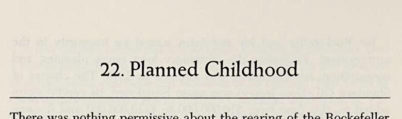

There was nothing permissive about the rearing of the Rockefeller children. Their father and mother followed a carefully thought-out pattern by which they molded their girls and their son, this manchild on whom so much depended. Above everything, they wanted their offspring to grow up as Christians—Christians dedicated to the parental Baptist faith. Rockefeller looked on the wealth that was pouring in on him as from the Lord, while he was its appointed custodian. He regarded his children in much the same fashion and so did Mrs. Rockefeller. “Happy am I,” she wrote to a friend, “and blessed of God above so many mothers in my dear children, my precious jewels—loaned to me for a season to be handed back when the call comes.” John and Laura Rockefeller considered themselves accountable for the children entrusted to them. As it became increasingly evident that their son and his sisters would inherit a great fortune, the parents felt duty bound to provide them with a spiritual framework for that future. Despite the prominence being thrust upon them, the two clung to a retiring way of life, a preference for themselves and even more so for their children. Mrs. Rockefeller was a meticulous housekeeper with well disciplined maids, meals served on a schedule, a place for everything and everything in place. At the same time, the keynote was simplicity. The children’s clothing, for example, while of good material and well made, was plain in style, the girls’ dresses usually of cotton and without frills. This was part of the parents’ effort to keep the girls and their brother as unaware as possible of the family affluence. None of the youngsters, not even young John, ever visited the thriving Standard Oil Company domain in Kingsbury Run, an adventure that would have fascinated any boy. In line with this policy

<!-- issues: missing_printed_page_number, image_text_overlap:0.227 -->

<!-- page_id: 0089-right | printed: 141 | viewer_token: 140 | viewer_sequence: 180/340 -->
## Page 141

of shielding their children, their father filled out the family pledge cards for their weekly contribution to the Euclid Avenue Church:

> $10 each week $10 each week .20 each week

> Mrs. Rockefeller Mr. Rockefeller Each of our children

Behind the scenes, little suspected by the youngsters, their father was giving large sums regularly. He also could be counted on to make up a deficit and meet any budget emergency. For the little Rockefellers church was an integral part of their lives. Every Sunday morning the coachman had the carriage waiting at the door shortly after breakfast. The whole family went to Sunday School, often the first to arrive. The children felt completely at home in the big church; their father presided over the Sunday School and their mother was in charge of a department. Before long the girls and young John were teaching, too. From the time they were very small the children stayed for the adult church service to listen to a preacher who was so often a visitor at their home that he seemed like one of the family. Friday nights were given without fail to prayer meeting. Mrs. Rockefeller encouraged the children to participate like the grownups. They might deliver a short prayer, or perhaps testify to some personal religious experience. Church “socials” were the fun times for John and Laura Rockefeller, as well as for their youngsters. Highlight of the year, the church picnic, often took place at the Euclid Avenue home or at Forest Hill. The church figuratively flowed into the home. Mrs. Rockefeller’s interest centered in home, church, and children. With Rockefeller’s business often taking him out of town, the children’s upbringing, particularly their religious training, devolved largely on their mother. She had left the strict Congregational denomination of her youth for the equally strict tenets of her husband’s Baptist Church. Everyone in describing Mrs. Rockefeller has spoken of her piety as wife and mother. The New Testament was the stanchion to which she anchored her daily life. Like her husband, she accepted the Bible literally as the inspired Word of God. If she instituted a more ae

EEE Fp

<!-- issues: missing_printed_page_number -->

<!-- page_id: 0090-left | printed: 142 | viewer_token: 142 | viewer_sequence: 182/340 -->
## Page 142

strict religious regime than Rockefeller might have adopted, he nevertheless, gave his wife his full support. Each day began with devotions at which the father presided. Punctuality being a watchword with the Rockefellers, late comers were fined one cent an infraction. Before he was nine John, Jr., was exposed to the Rockefeller fetish about keeping accounts and was assigned to recording these debts and payments. Each person, parents and children alike, read a verse from the Bible, or repeated a selection “learned by heart.” Rockefeller expounded on obscure passages and prayed for guidance through the day. Worship ended, breakfast was served. No matter where the family might be, nothing was permitted to interfere with morning worship. Rockefeller had begun to take time out from business to travel with his family, something he enjoyed very much. Midsummer when John, Jr. was twelve, they all boarded a train with a private car, “The Glen Eyre,” in Cleveland for a twoweek journey to California and return. This car was divided into six sections with a number of rooms, such as an observation room, bedrooms, a kitchen and a pantry. In the party were Aunt Lute, Dr. Hamilton F. Biggar, the family physician, Mrs. Biggar, a maid, and the Rev. Edward Judson, a Baptist minister, and son of a noted Baptist missionary. On this trip stops were made for sightseeing at Yellowstone National Park and several cities. An hour was set aside each day before breakfast for the Bible study routine, the preacher in charge. He took for his subject for the trip the Beatitudes with one discussed each day. After tea they would get together for an enjoyable interlude singing gospel hymns. Young John entered it all in his diary. In the family’s schedule at home, Sunday was a special time, What Mrs. Rockefeller called “Home Day” began Sunday after church services. It was her favorite part of the week. It was observed as a rest interlude. No unnecessary work was carried on. A cold repast was eaten at noon to save the cook unnecessary effort. Games and play were not permitted, and no school lessons studied. Even letter writing was frowned upon. Only “suitable” books were read, such as the Bible, gospel stories and Sunday School publications. Novels and similar secular literature were forbidden.

<!-- page_id: 0090-right | printed: 143 | viewer_token: 142 | viewer_sequence: 182/340 -->
## Page 143

> “On Sabbath evenings after tea,” in Mrs. Rockefeller’s words, young John and his sisters gathered around their mother for what she called her “Home Talks.” Each child was asked to concentrate on a “besetting sin.” After discussing it and praying over it, each resolved to conquer the weakness before next Sunday's meeting. The children were constantly urged to weigh their actions by asking themselves “Am I right? Am I doing my duty?” Mrs. Rockefeller readied herself in advance for these sessions, outlining in a little notebook points she wished to make each week. The Home Talks were used also as preparation for the baptism of Alta, Edith and John, Jr. It was a joint ritual taking place at the Euclid Avenue Church. Presumably Bessie already had been through the rite. Mrs. Rockefeller, in a letter of December 5, 1883, described the baptistry as surrounded by plants and flowers with “a dove suspended over it.” Rockefeller, participating in the service, perhaps thought back to his own very different baptism thirty years before at the little Erie Street Church, with Mrs. Woodin and Martha looking on, and no flowers, or dove to grace the baptismal tank. Laura Rockefeller’s parents, the Harvey Spelmans, were zealous supporters of temperance reform, their daughter and her husband no less so. Mrs. Rockefeller liked to recall that 1874 was the year when her beloved son was born, and also the year when Cleveland women, inspired by the “Woman's Crusade” in Hillsboro, Ohio, organized a temperance league, forerunner of the Women’s Christian Temperance Union. After Mr. Spelman’s death in 1881, Grandma Spelman came to live with the Rockefellers. Family talk at this time turned to the prohibition movement, so dear to Grandma’s heart. As culmination of long effort, Ohio “Drys” in 1883 were working for a proposed amendment to the state constitution to ban manufacture and sale of liquor. Rockefeller served on the advisory committee although he usually avoided involvement in public enterprises. The legislation failed to pass, making the Rockefeller clan even more vigorous temperance advocates. If there is any truth in one of the many “Rockefeller stories” that circulated in the city about its famous family, they unknowingly

— es Fp

<!-- issues: low_ocr_confidence:57.52 -->

<!-- page_id: 0091-left | printed: 144 | viewer_token: 144 | viewer_sequence: 184/340 -->
## Page 144

once may have enjoyed Demon Rum. According to the tale the Rockefeller pastry cook, when making holiday mince pies, surreptitiously added rum to those intended for the help. By mistake one of these pies was served to the family. Afterwards, Mrs. Rockefeller is supposed to have hurried to the kitchen to exclaim that that was the best mince pie Cook had ever made. Deeply devoted to John, Jr., “my only grandson,” Grandma Spelman longed for the day when he would be enrolled in the Cause and could recite for her “The Price of a Drink.” Eliza Rockefeller, too, spent a good deal of time now with John and Laura. Doctor Rockefeller’s absences were stretching out longer so that he returned to the Cheshire Street house only occasionally. Grandma Rockefeller, while she talked less about it, was just as dedicated a prohibitionist, the little boy found. And so was Aunt Lute. Before he was ten, John, Jr. took the step. He signed a pledge to “abstain from tobacco, profanity and drinking intoxicating beverages.” He did not understand much of what he promised not to do, but his parents, his two grandmas and Aunt Lute were very happy over it. Soon he could repeat the lines Grandma Spelman had been waiting for:

> Five cents a glass, does anyone think That that is really the price of a drink? The price of a drink, let him decide Who has lost his courage and his pride And who lies a drowning heap of clay Not far removed from a beast today.

The matriarchal atmosphere that enveloped the young Rockefellers was offset by the dominant influence of their father. Rockefeller had strong views about the father-role in a family, as he wrote in his Reminiscences: “I wish to urge . . . the importance of a father keeping in close touch with his children, taking into consideration the girls as well as the boys who in this way learn by seeing and doing and have their part in the family responsibility.” His relationship with his children was by no means as solemn as this would lead one to believe. According to his son he “was a

<!-- page_id: 0091-right | printed: 145 | viewer_token: 144 | viewer_sequence: 184/340 -->
## Page 145

genius with children.” John, Jr. thought of his father as “a beloved companion.” He was a friend to him and his sisters—their playfellow. Rockefeller’s business associates saw him as reserved and withdrawn, always courteous, but never wasting a moment in small talk or badinage. They would have been astounded could they have observed some of his antics at home. They might have come upon him playing blindman’s buff with a gusto that roused squeals of delight in his youngsters as they struggled to out smart him. Or, maybe the dignified president of the Standard Oil Company, forgetting for the moment those perfectly pressed trousers, would be down on his knees with a child on his back for a ride around the room. Few, if any of the rising tycoons of the period developed anything like such close ties with their children. Indeed, it is said the offspring of the elder Morgan, for example, ran in terror as he appeared on the threshold. John and Laura Rockefeller looked on the theater, dancing and card playing as sinful. They loved music, but stayed away from concerts because these smacked of the theatrical in their eyes. However, the young Rockefellers were not deprived of music. At an early age each child was given an instrument, a fine one in every case. Eminent Cleveland musicians were engaged as instructors. There was a rich field to draw from, for Cleveland was enjoying a flowering of musical talent. Music as a business was so flourishing that Silas Brainard and Son, music publishers and dealers in imported instruments, occupied the entire four-story building at Euclid Avenue and Sheriff Street opposite the Standard Oil Company offices. Music had come into Cleveland with the influx of Germans and other settlers from European cultural centers. There were two or three music schools, as well as choral societies and orchestral ensembles. Best known of the performing groups was the Cecilian Quartet, later renamed the Philharmonic String Quartet, the “Pride of Cleveland.” Its members—the musical Who’s Who of the city— were Sol Marcosson, first violin; James D. Johnston, second violin; Charles Rychlik, viola and Charles Heydler, ‘cello. Bessie played the viola and, it is said, was taught by Rychlik,

— EE Fp

<!-- issues: low_ocr_confidence:63.62 -->

<!-- page_id: 0092-left | printed: 146 | viewer_token: 146 | viewer_sequence: 186/340 -->
## Page 146

the master of that instrument. Alta chose the piano and found her hearing impairment no problem. James H. Rogers, distinguished pianist, organist and composer, was her teacher. At the time he was organist and choir director at the “Rockefeller Church,” a post he held until taking up similar duties on Sundays at the Unitarian Church, Euclid Avenue and Genesee (East 82nd) Street, and on Saturdays, playing at the Jewish Temple across the Avenue. He also had a long tenure as music critic of the Plain Dealer. The ‘cello, taught by the gifted Heydler, was Edith’s instrument. Young John, violinist, began with the violin when he was seven and from the first showed considerable ability. It is believed that Sol Marcosson was one of his teachers. Before long there was an accomplished Rockefeller quartet. Concerts were frequently staged at home with the players’ parents an appreciative and musically knowledgeable audience. The four also played frequently at church gatherings where their appearance was always warmly welcomed. School lessons were handled by private tutors. Educated at home, the children were safe from undesirable contacts and could grow up in an environment of their parents’ choosing. No television or radio, and as yet no telephone, intruded with the corrupting voice of the world. John, Jr., like a prince of the realm, was singled out for special attention. “What he did, where he went and with whom he went,” was the constant concern of his parents. It apparently never occurred to any of the children to question the parental dictum. Mrs. Rockefeller ruled firmly but gently. Her son called her “a saint.” Reminiscing years later, he declared that he could not recall hearing his mother raise her voice in displeasure or impatience. As for John D., Sr., his children waited eagerly for his homecoming whether from out-of-town trips or from a day in the Cleveland office. The youngsters, it would seem, could not get enough of him. One of them said: “He never told us what to do or what not to be.” The austere and restricted upbringing of the young Rockefellers was leavened by long and joyous stays at Forest Hill. The exclusive expanse of woods and lakes wove its spell over all the Rockefellers who looked upon it as their real home.

<!-- page_id: 0092-right | printed: 147 | viewer_token: 146 | viewer_sequence: 186/340 -->
## Page 147

> Na Be Pe,

### oo.

> ” oe

4Z

aa yi ee eee More than 400 prominent Clevelanders gathered at Forest Hill September 26, 1905 to honor Rockefeller. (Mrs. Albert D. Levy )

<!-- issues: low_ocr_confidence:27.18 -->

<!-- page_id: 0093-left | printed: none | viewer_token: none | viewer_sequence: 188/340 -->
## Unnumbered Page

> 1 \ Se Dt ai

> etait A camera portrait of Rockefeller made by photographer, in 1910. Rockefeller was 71

eee cinadeaaliaeemanemmie aa edetearhitaaaeme tice cmmameemmememaiaan George Edmondson, Cleveland

<!-- issues: low_ocr_confidence:50.11, missing_printed_page_number -->

<!-- page_id: 0093-right | printed: none | viewer_token: none | viewer_sequence: 188/340 -->
## Unnumbered Page

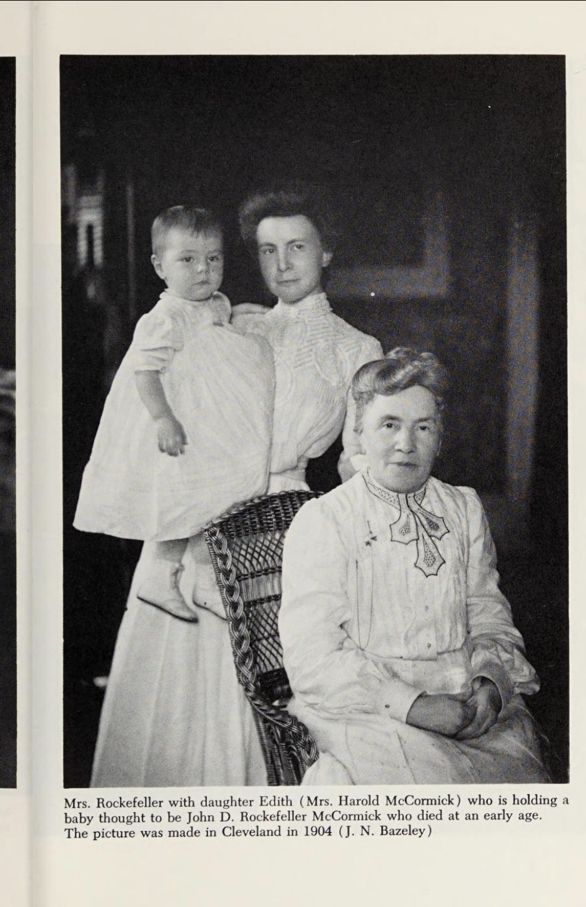

EE EEE eee Fp

<!-- issues: low_ocr_confidence:42.68 -->

<!-- page_id: 0094-left | printed: none | viewer_token: none | viewer_sequence: 190/340 -->
## Unnumbered Page

Rockefeller bicycling to the go’ course in a light shower, push by “Mike,” one of the regular workers on the Forest Hill staf

Dr. E. B. Rhodes, a neighbor ai close friend, was Rockefeller’s frequent golfing partner. PRS io Aa ales chm A

> i

> eae

> pm

> Am

> fa;

> leery ete ee = a ne i

> ag

<!-- issues: low_ocr_confidence:43.67 -->

<!-- page_id: 0094-right | printed: none | viewer_token: none | viewer_sequence: 190/340 -->
## Unnumbered Page

> (44:4 } Pee 6, TT ad, ie eee

ee 3

### dee oe 3 a - * 5a fh #y Spx ee de Te

> oN a + Pe

> ah

> —— gar Z

> \"

> et ae s i Me

> ee

Rockefeller mixing his mid-morning drink of barley water and milk while his little friend, Lizzie Rhodes, keeps him company at the edge of the golf course.

<!-- issues: low_ocr_confidence:34.11 -->

<!-- page_id: 0095-left | printed: none | viewer_token: none | viewer_sequence: 192/340 -->
## Unnumbered Page

### Peck ie ey ~—4

)

os

= ee

Mr. and Mrs. Rockefeller arriving at the Doan (East 105th) Street railroad station from New York for their summer at Forest Hill. (The Western Reserve Historical Society )

Scene in Rockefeller Park in the early 1900s not long after it was laid out. (Cleveland Public Library)

os aN, sheen Cl.

<!-- issues: low_ocr_confidence:58.1, missing_printed_page_number -->

<!-- page_id: 0095-right | printed: none | viewer_token: none | viewer_sequence: 192/340 -->
## Unnumbered Page

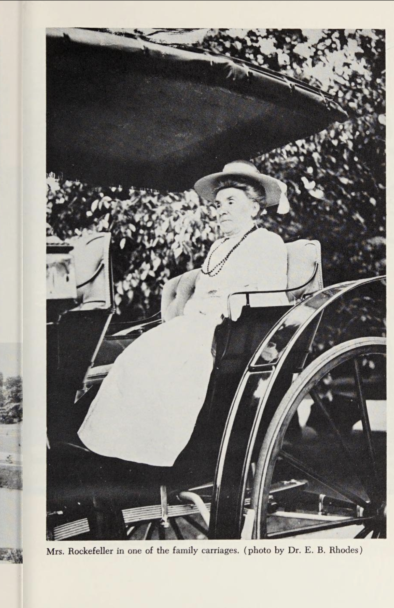

| ee Fp

<!-- issues: low_ocr_confidence:26.77, image_text_overlap:0.194 -->

<!-- page_id: 0096-left | printed: none | viewer_token: none | viewer_sequence: 194/340 -->
## Unnumbered Page

ee

iy 4 ~\

\ #

Pee

> Bsn

> can +4, Fe Te a eet ene

> Rockefeller in action on the golf links.

> Serene IO John D. was in a hurry.

<!-- issues: low_ocr_confidence:41.7 -->

<!-- page_id: 0096-right | printed: 147 | viewer_token: none | viewer_sequence: 194/340 -->
## Page 147

### 23. Forest Hill

For the Rockefeller children, Forest Hill was a wonderland, a vast green province providing happy freedom to offset their otherwise circumscribed routine. When the family took possession of the big rambling house in 1878 after the abortive experiment with “paying uests,” Bessie was twelve, her sisters seven and six, and little brother four. Thus, they did much of their growing up in this land that lay as nature had made it. Forest Hill was as much a boon to their father. It supplied him with health-giving relaxation and recreation through the most tense and high pressure years of his life. Here was reawakened his boyhood love of the out-of-doors. Brought to the surface was a latent but very rea] talent for landscaping. With a zest he went about the refinement of the grounds to which he added bit by bit. In all, he acquired seven hundred acres that stretched like a continuous park beyond the East Cleveland line and into Cleveland Heights—an enclave apart from the world and yet within driving distance of the Standard offices in downtown Cleveland. Captivated by the many magnificent forest clumps on the rolling expanse, Rockefeller plunged into the study of tree management, a subject that held his interest the rest of his life. He mapped out eighteen miles of excellent roadways. Paths and trails were cut through the terrain so that the furthermost parts of the estate could be reached on foot, by bicycle or on horseback. Forest Hill encompassed a fully functioning farm with houses for workers and their families, barns for stock and carriages as well as stables for Rockefeller horses, some of the finest thoroughbreds in the country. He raced them on a well-planned track, and when he took up golf, a nine-hole course was laid out by experts. The peaceful, secluded precincts also made simple pleasures possible. He arose at six. On a fine summer morning he liked to walk barefoot over the dewy, well-groomed lawns.

— eee Fp

<!-- issues: low_ocr_confidence:72.63 -->

<!-- page_id: 0097-left | printed: 148 | viewer_token: 148 | viewer_sequence: 196/340 -->
## Page 148

No money or thought was spared in fashioning Forest Hill fon the enjoyment of his children. They were an isolated little group with few playmates except an occasional visiting cousin. Nevertheless, there was plenty to occupy them, hillocks and ravines to explore and the always lively doings at the farm. Streams were dammed to make two lakes, one big enough for swimming and boating. Following the example of his own father, the vigorous Doctor Rockefeller, John D. taught his brood to swim and handle a boat. His own swimming outfit brought many a laugh from his children, for in the water he wore a straw hat to protect his head from the sun. During winter sojourns, there was ice skating in which John D. excelled and saw to it that his youngsters did also. Special sections of the estate were set aside as play spots and were smoothed for small-wheeled vehicles. Rockefeller wanted to buy a velocipede for each of the three youngest children. Their mother, however, vetoed the idea. One would do, she said. In that way they would learn the lesson of sharing. By the time John was eight, his father was seeking a pony for him, one that was “lazy and safe.” The children were imbued at an early age with their father’s enthusiasm for horses. He gave them lessons on carefully selected animals, and soon all four were accomplished in the saddle and with the reins. Bicycles were greatly favored by Rockefeller, and he kept a supply on hand for family and visitors. He was known to lead unsuspecting guests over winding paths on long and arduous cycle expeditions. With a white handkerchief tied to the back of his bicycle as a guide flag, he gleefully tried to loose his panting followers in the maze of the beech woods. Rockefeller’s far flung operations took him more and more frequently to New York. He missed his wife and children on these trips, and decided to take them with him. At first they stayed at a hotel. But they disliked the lack of privacy. In 1884 Rockefeller bought a large brownstone house at 4 West 54th Street. Flagler, who some time before had left Cleveland for New York, lived around the corner. He, along with other Standard Oil officials, often

<!-- page_id: 0097-right | printed: 149 | viewer_token: 148 | viewer_sequence: 196/340 -->
## Page 149

dropped in. Baptist ministers and Baptist missionaries from far corners of the globe, as well as strangers on begging errands for all sorts of causes, also found their way to the house. When in New York, the Rockefellers worshipped at the Fifth Avenue Baptist Church. John D. was in demand for talks before Bible study groups. His wife taught a Sunday School class of young men. Among her scholars was Charles Evans Hughes, who became a close friend of the family. One of his visits to Forest Hill was in 1906 shortly before his election as governor of New York State. Another member of that class was Harry D. Sims, destined to be Rockefeller’s private secretary and a prominent citizen of Cleveland. Despite their active participation in the New York church, John and Laura Rockefeller never felt as much at home there as in their Cleveland church. Under the pressure of business demands in the East, Rockefeller made New York his legal residence. This step did not alter the fact that he and his wife thought of themselves as Clevelanders, and Clevelanders so regarded them. They returned early every spring to live at Forest Hill until late fall. They arrived at the Doan (East 105th) Street station of the New York Central with their children and a sizeable retinue of retainers to be greeted by representatives of the local press and a flotilla of carriages to take the travelers to The Hill. The Euclid Avenue house functioned as little more than a way stop, but always was well cared for. It also proved to be a convenience for the family on Sunday trips to and from services at the Euclid Avenue Church. After morning worship, parents and children gathered there for their midday meal. They brought their food with them. In deference to the Sabbath as a day of rest, it had been prepared and carefully packed the night before in the Forest Hill kitchen. Rockefeller horses could be skittish. Mrs. Rockefeller often arranged to have a second groom accompany them to hold the horses’ heads as she alighted from the carriage at the church. En route she required the coachman to keep the span at a steady pace with no change of speed and no stopping. It was not an easy feat to

EEE Fp

<!-- issues: low_ocr_confidence:66.6, missing_printed_page_number -->

<!-- page_id: 0098-left | printed: 150 | viewer_token: 150 | viewer_sequence: 198/340 -->
## Page 150

achieve, particularly after a trolley line was put into operation along Willson Street which the party had to cross. To avoid being held up here the coachman had to guage his progress against the time schedule of street cars. In the afternoon, following a quiet few hours at No. 997, with everyone—horses, too—well rested, they headed back “to the country.” Rockefeller’s weekday “commuting” to the Standard Block was very different. He set out in the morning behind a quick-stepping pair, took the reins himself and drove down Euclid Avenue as fast as the law allowed. In the evening he managed the team the same way, never missing the chance for a bit of a race when he encountered other drivers of fast horses. Few have had closer association with the Forest Hill family than Dorothy Rudd Sims of Cleveland, widow of Rockefeller’s secretary, Harry Sims. Her aunt, Mrs. William C. Rudd, was Mary Ann Rockefeller, John D.’s sister, while her mother, Mrs. George A. Rudd, the former Ada Piper, had tutored the Rockefeller children at Forest Hill. George Rudd and his brother William were friends of Rockefeller since the days when they worshipped together at the Erie Street Baptist Church. The Rudd brothers founded the Chandler & Rudd Company, with William as president. From early childhood the domain on the Hill was familiar territory to Dorothy Rudd. She often accompanied Rockefeller on his afternoon drives, and with her parents had dinner numerous times at the Homestead. The fare was plain, she recalled, meals formal. The family dressed for dinner, which lasted exactly one hour. Rockefeller ate sparingly, habitually waiting until any hot food had cooled. Leg of lamb was served frequently, as it was his favorite meat. However, his meal sometimes consisted mainly of bread and milk. John D., Jr. affirmed more than once that his father chose this and similar simple dishes out of preference, and not, as often stated in the press, because of stomach trouble. Following dessert, usually something wholesome like rice pud: ding, the two butlers cleared the table, removed the cloth and brought on “Numerica.” It was a game then much in vogue, consist: ing of small colored cardboard squares each bearing a numeral

<!-- page_id: 0098-right | printed: 151 | viewer_token: 150 | viewer_sequence: 198/340 -->
## Page 151

Rockefeller thoroughly enjoyed the contest. Two rounds were played. Conclusion of the second round signalled departure time for guests. Woe to the unwary one who tarried, for the Rockefellers retired early. A carriage waited at the door. The discerning could hear the horses’ impatient stomping, Mrs. Sims added. Visitors were driven down the hill to the Forest Hill gate. They could start homeward via a streetcar, or perhaps in their own conveyance that might have waited for them beside the lodge at the entrance. As a child Mrs. Sims was in awe of Mrs. Rockefeller. However, she came to realize that the mistress of Forest Hill was a kindly, sweet-person, her strict ways merely expressions of a perfectionist. The household staff was devoted to her and stayed with her for

years. Mrs. Sims remembers her Aunt Mary Ann as quiet and reticent, clad in nondescript black, often with a black shawl over her shoulders. She was seldom at Forest Hill, despite the fact she and her husband lived nearby on Euclid Avenue. For a period each year she took her children to Saranac Lake for their health. The rest of the time she stayed in her big house where she kept no help and had little company. Like her brother, John D., she felt it her duty to share her wealth and is said to have given generous assistance for years to a considerable number of deserving and needy individuals. However, she never permitted anything to be known about her benefactions. Mary Ann’s husband, congenial with the Rockefellers, was often on The Hill, welcomed as dinner guest or golfing partner. One day when Dorothy, a teen-ager enrolled at Laurel School, a private school for girls in Cleveland, was watching a golf game, Rockefeller introduced her to a young man who had arrived that morning from New York. The newcomer was Harry D. Sims. In 1915, she and Sims were married. William Rudd died within the year and Sims resigned his secretarial post with Rockefeller to become president of the Rudds’ Company. Sims held the position until his death forty years later. The Rockefeller-Sims friendship continued as long as Rockefeller lived. After he left Cleveland, Mr.

fee

<!-- issues: low_ocr_confidence:68.96 -->

<!-- page_id: 0099-left | printed: 152 | viewer_token: 152 | viewer_sequence: 200/340 -->
## Page 152

and Mrs. Sims with their three sons were visitors more than onc at the Rockefeller estate at Pocantico Hills. From her mother, Mrs. Sims heard many stories of the happ days spent by the Rockefeller children amidst the rolling acre: Their time was not given entirely to play. Besides lessons ther was work to be done and money earned, saved and given away Each child was assigned a specific task such as laying out a flowe garden or vegetable plot that must be kept free of weeds; the pay one cent a weed. Raking leaves, chopping kindling, and gather ing the chips, breaking stone—these brought a few cents an hour It had to be an honest hour with no minutes wasted. Their weekl contribution to Sunday School and church came from these wage: It was their duty, they were told, to give as well as to get. John D., Jr. might be the heir apparent to a kingdom. Nonethe less, his parents were determined that he would not be indulge but would be trained in thrifty ways. Guided by his father, he be gan at an early age to keep records of whatever money came hi way. In one account book he noted that he had been paid ten cent for sharpening pencils; two cents for killing flies; ten cents for put ting up a thermometer and a dollar for repairing a vase. Out of sev eral months of such income he gave $8.76 to Sunday School anc church and spent fifteen cents for candy. The little boy tagged after his father all over Forest Hill. H would stand beside him watching intently as a big tree was set it place or a row of saplings planted. It was the beginning of a life time association that must rank as one of history’s outstandin; father-son relationships, untroubled by any generation gap. As the boy grew older he assumed responsibility for the estat payroll and acted as overseer for work in progress. He tried som« landscaping and road building of his own. This delighted his father who encouraged him to make any changes he wished in the ground layout. When young John was sixteen, he spent a year at Forest Hil because of ill health. In February and March, he helped in the an nual “sugaring off.” A farmer skilled in maple syrup making wa engaged, buckets hung on sugar maples and a sugar camp set up it

<!-- page_id: 0099-right | printed: 153 | viewer_token: 152 | viewer_sequence: 200/340 -->
## Page 153

the maple grove. Working along with the man, the lad charted the number of trees tapped, the yield in sap and the quantity of sugar and syrup produced. He recorded the data in a neatly kept notebook. Mr. and Mrs. Rockefeller came from New York for brief visits. At such times, father and son delighted in skating on the lake, John Jr. often pushing his mother over the ice in a chair. In the father’s Reminiscences, pages are taken up with descriptions of his landscaping experiences at Forest Hill, especially “the pleasure and satisfaction of saving and moving trees.” He kept detailed records of methods and results, the accumulated practical data on various species and their characteristics as to which could be moved safely, which could not. Uprooting and restablishing a tree was not entered into casually, but only after minute advance planning, and for a purpose, most often to open up a view. Applying the same landscape techniques developed at Forest Hill, John D., Sr., transferred to his three-thousand acre estate, Pocantico Hills, in Tarrytown, New York, and to his more modest place at Lakewood, New Jersey. Forest Hill’s influence became even more far-reaching in the case of John D., Jr. One of his absorbing concerns was preservation of scenic and historic areas in various parts of the country. Through his leadership Rockefeller wealth was diverted to such objectives as The Great Smoky National Park. He arranged to have $5,000,000 from the Laura Spelman Rockefeller Memorial that honored his mother added to a like sum raised by public and private subscription. The total $10,000,000 made the park possible. He thought of the Rockefeller portion as a “memorial to the beautiful spirit of my mother.” Other natural preserves saved for the American people by the millions and vision of John D., Jr. include: Palisades Park along the Hudson; Acadia, the first national park east of the Mississippi; the Shenandoah district, and the country of the Grand Tetons. Dramatically demonstrating his passion for trees, he opposed the private exploitation that jeopardized California’s redwoods, the earth’s oldest and tallest living things.

| ee Fp

<!-- issues: low_ocr_confidence:63.81 -->

<!-- page_id: 0100-left | printed: 154 | viewer_token: 154 | viewer_sequence: 202/340 -->
## Page 154

Such accomplishments are described in a handsome book, Th Heritage of Every American, the Conservation Activities of John D Rockefeller, Jr., by Nancy Newhall published in 1957. The autho: emphasized that his adult preoccupation with preservation wa: inspired by his boyhood days at Forest Hill. “Under the tutelage of his father,” she stated, “he first developed his lifelong interest ir landscaping, and also in trees and parkland drives.” The practical knowledge he gained at Forest Hill, it is claimed, characterized all his subsequent conservation undertakings.

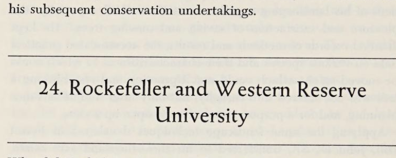

Why did Rockefeller bestow all those millions—about $35,000,000 —on the University of Chicago, instead of Western Reserve University in Cleveland where his fortune was generated? What of the stories bandied about to this day that he offered a sizeable sum of money to Western Reserve, but it was refused by a prominent Clevelander who for many years headed the university’s board of trustees? Anyone delving into Cleveland lore about Rockefeller soon discovers that such questions and innuendos still circulate by word of mouth and have found their way into public print. e 8 © @

With a seemingly wistful backward look at what might have been, Rockefeller stated in his Reminiscences “the plan had been to send me to college.” As we have seen, his mother was the parent, it is assumed, who had dreamed of his going to college, maybe to Western Reserve College in Hudson. However, “the plan” did not materialize. As he grew older John D. gave increasing thought to education, a concern that may have been kindled by regret over the opporanal

<!-- issues: image_text_overlap:0.355 -->

<!-- page_id: 0100-right | printed: 155 | viewer_token: 154 | viewer_sequence: 202/340 -->
## Page 155

tunity denied him in youth. In his memoirs he stressed what he saw as “the great claims of higher education,” convinced that “we cannot overemphasize the importance of this matter.” It seems certain, therefore, that he would have followed with keen attention the agitation about moving the then impoverished Western Reserve College from Hudson to Cleveland, a subject that was debated in the press and the community generally for many years from the late 1870s on. First expressed publicly in the Cleveland Herald in December 1877, the idea was welcomed by Clevelanders. Ever since the closing of Cleveland University in pre-Civil War days, there had been hope of setting up another college in the city. Understandably, vehement opposition to the removal developed among Hudson residents, alumni, and certain members of the academic community. With prayerful fervor their forebears, led by the generosity of the village founder, David Hudson, had established this “Yale of the West” in 1826, and villagers did not want to lose it. But the fifty-year old citadel of learning was in trouble. Enrollment was falling off. There was difficulty meeting operating costs and endowments were dwindling. The scheme of uprooting the college seems to have been inspired by a Clevelander, the Rev. Hiram C. Haydn, long a college trustee, and pastor of Cleveland’s fashionable First (Old Stone) Presbyterian Church, which he always referred to simply as “The First Church.” The college president, Carroll Cutler, discouraged by the problems facing him, also favored relocation. Both men, however, were aware of the strong opposition they would encounter and the many other difficulties in the way of such a drastic step. Never lacking in self-confidence, Dr. Haydn, practically singlehanded, undertook to direct the delicate negotiations for the move as he revealed in his book, From Hudson to Cleveland. After two tedious years, the discussions came to a head abruptly upon announcement in January 1880 of a bequest by Leonard Case, Jr., recently deceased. He had left property valued in excess of $1,000,000 to found a polytechnic institute in Cleveland that would be known as Case School of Applied Science.

| ee Fp

<!-- issues: low_ocr_confidence:56.24 -->

<!-- page_id: 0101-left | printed: 156 | viewer_token: 156 | viewer_sequence: 204/340 -->
## Page 156

The prospect of this school as nucleus of a cultural center it Cleveland influenced the Hudson college trustees to vote for re moval. They announced, however, that the college would requir: $500,000 to underwrite endowment, erection of buildings and th like in the new setting. Rockefeller in 1880 was worth about $18,000,000, according t« Nevins, making him not alone the richest man in the city, but among the richest in the country. Further, since boyhood he had made allocations in increasing amounts to all manner of local causes, in cluding numerous cultural organizations. One might expect, there fore, that he would have been appealed to at once for a contribu. tion toward underwriting a new educational setup. As far as can be ascertained from records of the period in pres: ent-day Case Western Reserve University archives, no attempt was made to gain his backing. Because of the quiet way in which he handled his business and his unostentatious private life, the size of his fortune was not suspected. Nevertheless, he was known as a very wealthy man. But Dr. Haydn had no need of Rockefeller’s help. As he admitted later, he already had a sponsor and had had one from the start. On the other hand, Case’s incorporators, headed by highly regarded Judge Rufus P. Ranney, lost no time in getting in touch with Rockefeller. Levi Kerr, secretary of the group and Case’s cousin, wrote Rockefeller before the incorporation was completed, asking him to serve as a trustee of the school. Rockefeller replied that he considered the invitation “a high honor and a compliment.” But it was his “duty in view of the great responsibilities I am now entrusted with, to decline.” Actually, he skirted appointment to boards or committees with a few exceptions such as the office of vice president of the Western Reserve Historical Society, as a trustee of Vassar College, and briefly, likewise, at Denison University in Ohio. He even refused membership later on the board of the University of Chicago, visiting there only twice in the first ten years of its existence. Case School's first president, Cady Staley, apparently made no effort to nurture the contact with Rockefeller, although Forest Hill,

<!-- page_id: 0101-right | printed: 157 | viewer_token: 156 | viewer_sequence: 204/340 -->
## Page 157

where the oilman lived most of the year, was only a few miles from the campus. Bulwarked by Leonard Case’s million dollars, Staley probably saw no necessity to court another rich man. Shortly after news of the Case legacy was publicized, Dr. Haydn let it be known who was to finance relocation of the Hudson college, The benefactor was Amasa Stone, a member of Dr. Haydn’s church, the man with whom Rockefeller had crossed swords more than once. Stone would supply the money, under certain terms: First, the name of the college be changed to Adelbert College of Western Reserve University, honoring the memory of his gifted, only son who had drowned while a student at Yale; next, a site to be approved by him be provided by Cleveland citizens in close proximity to Case School, and lastly, the present board of trustees be reduced to eight members, with men of Stone’s choosing. A committee headed by Judge C. C. Baldwin, president of The Western Reserve Historical Society, was appointed to select joint property for Adelbert College and Case, as well as to raise money for its purchase. Soon a forty-three acre plot was decided upon on the south side of Euclid Avenue. It was opposite the landscaped domain that J. H. Wade shortly was to give to the city as Wade Park. A part of the proposed campus belonged to Liberty E. Holden, soon to be owner of the Plain Dealer, and another area to Mrs. Martha C. Ford. For reduction in the asking price, they were credited with gifts of $25,000 and $8,000 respectively. Case School pledged $10,000. Others donated large and small sums. Rockefeller and/ Harkness each gave $2,500. Price of the total property is said to} have been $85,000. Officials of the future university took the eastem portion as its campus, Case the western. Those in charge of the removal of Western Reserve College accepted Rockefeller’s money and forgot about him for the next eight years. Case School overlooked him until 1903. By 1881, with the Adelbert campus site settled, Stone had named his choices for the board of trustees: John Hay, his son-in-law; former United States President Rutherford B. Hayes; newly elected President James A. Garfield; Judge Samuel E. Williamson, who was a Hudson college trustee and member of an early Cleveland fam-

jf ——“———Ci“‘(C‘(‘éarS'

<!-- issues: low_ocr_confidence:55.86 -->

<!-- page_id: 0102-left | printed: 158 | viewer_token: 158 | viewer_sequence: 206/340 -->
## Page 158

ily; George H. Ely, ore merchant; W. J. Boardman, Cleveland lav yer; William Harris, son-in-law of Stillman Witt; the Rev. Charle T. Collins, pastor of Plymouth Church; Holden; Samuel Andrew: Rockefeller’s former partner who had quarreled with him, and W H. Doan, equally hostile to the oilman. With Stone the bellwethe and Andrews and Doan trustees, the budding university was no likely to arouse Rockefeller’s enthusiasm. | While few Clevelanders realized the extent of John D.’s fortune he himself was aware that his wealth was piling up. Motivated a always by the obligation of giving, he was beginning to formulate | system for the orderly, meaningful distribution of his riches. A ma jor philanthropy came to be the field of education, and he alread: was inclining in that direction when the Hudson college remova was under way. As it was written long ago in Ecclesiastes, “To every thing there i a season, and a time to every purpose under the heaven.” It was it 1880 that the time was at hand for recognition of Rockefeller’ budding interest in higher education. But those setting up Cleve land’s new college ignored him, and missed the cue despite hi initial pledge in the land purchase. By chance, at this telling moment his pastor, the Rev. George T Dowling, minister at the Euclid Avenue Baptist Church, called hi attention to Morgan Park Theological Seminary, connected with th« “old” University of Chicago. It would benefit from some financia aid, Dowling stated. Rockefeller knew of the Seminary which was citadel of the liberal Baptist learning to which he subscribed. In vestigating carefully, as he did every appeal coming to him, he found it and the University greatly handicapped by the recent de parture to Yale’s faculty of a brilliant young Bible scholar, William Rainey Harper. He was to have a telling impact on John D., but a: yet the two had not met. Chicago University, founded by Stephen A. Douglas, was totter ing under massive debts and, in Rockefeller’s opinion, was beyonc resuscitation. However the Seminary, in the hands of two able men \ Gw. Northrup as president, and Thomas W. Goodspeed, secre tary, was worth backing, Rockefeller concluded, and sent it $40,000 This awakened his interest in the Chicago education picture, anc

<!-- page_id: 0102-right | printed: 159 | viewer_token: 158 | viewer_sequence: 206/340 -->
## Page 159

proved to be the first trickle of the millions he poured into the Midwest city. It is not enough to say that the pull of the Baptist faith opened his purse strings to Chicago. Granted his unwavering loyalty to the, Baptist doctrine influenced much of his giving. Yet many of his millions, particularly as his wealth increased, went to causes outside this denomination, including those of Roman Catholics, whose efficient management of his gifts he praised in his Reminiscences. In Cleveland trying delays held up Adelbert College’s dedication. Although the two campus buildings, Main Building and a dormitory, were not finished, the exercises went ahead in October 1882. Earlier that year the Standard Oil Trust had been organized. Though he was probably at Forest Hill only a few miles away, the Standard Oil head was not in the thoughts of those gathered on the new campus. Stone was the prominent personage and heard himself extolled for his generous gift to education. At the time, however, he was a harassed and tragic figure. A railroad bridge which he had built near Ashtabula, Ohio had given way in 1876. A heavily loaded passenger train was plunged into the ravine below with great loss of life. In an investigation it was claimed that Stone had insisted on use of iron instead of wooden timbers in the truss, although warned by engineers that such a bridge would not be safe. Stone’s health broke under the strain of accusations and charges, some of them said to be unfair. Within a year after opening of the College, he committed suicide. Before long it was apparent that the endowment from Stone which had seemed so munificent, was inadequate. “The ungracious task of cutting salaries (thereby losing faculty and students) was inevitable,” in Dr. Haydn’s words. “For,” he explained, “as yet the College had not made friends in the new location.” During the emergencies of these critical years no appeal was made to Rockefeller, who was being besieged by so many supplications. He was not yet committed to the University in Chicago, and anyway, had he been so inclined, he could have found ample resources for large scale giving to both Chicago’s and Cleveland’s learning centers. Rockefeller detractors—and they were numerous—contended he

ee Fi

<!-- issues: low_ocr_confidence:55.64 -->

<!-- page_id: 0103-left | printed: 160 | viewer_token: 160 | viewer_sequence: 208/340 -->
## Page 160

was shunned by Dr. Haydn and cohorts because of his bad image. It is true that in his home city in the 1880s Rockefeller was hated by those like the refiners who claimed he had ruthlessly forced them out of business. In addition, his reputation was damaged by episodes like that of the widow Backus. Also, Rockefeller’s standing was further hurt when Henry Demarest Lloyd published his article, “The Story of a Great Monopoly” in the Atlantic Monthly for March 1881. In a real sense it was the opening salvo of the muckrakers’ campaign against the Standard Oil Company. Lloyd attacked railroad rates that encouraged monopolies, he twisted statistics to suit himself and was careless of his facts. He portrayed Rockefeller and the Standard as bribing railroad heads, manipulating Congress, the courts, and legislatures without citing any evidence. As in the Backus case when it was current, Rockefeller refused to answer Lloyd’s unwarranted charges. Thus in Cleveland, as elsewhere, the impression took shape that, if unrefuted, the accusations must be true. Yet what of Stone, widely disliked, but whose money was gratefully accepted? Even the judicious Nevins wrote of him: “Everyone hated his arbitrary ways, fierce temper and biting tongue.” Stone, nonetheless, had his friends. Among them was A. A. Pope, Cleveland businessman, who completed Adelbert College’s main building in Stone’s name. Stone’s daughters, Mrs. John Hay and Mrs. Samuel Mather, demonstrated their regard by erecting the Amasa Stone Memorial Chapel, one of the most beautiful buildings on the University campus. Stone’s name is perpetuated in Cleveland also by Amasa Stone House, a home for “aged gentlewomen,” established by him with a $10,000 endowment gift and in operation to this day. After Stone’s death his other son-in-law, Samuel Mather, was appointed to the board of Western Reserve University. Scion of early Ohio landowners with an illustrious New England lineage, Mather had expanded with great success the pioneer iron ore and lake shipping enterprises of his father, also named Samuel. The son organized the Pickands, Mather Company, ore merchants, and became wealthy. On the new campus he picked up the reins where

<!-- page_id: 0103-right | printed: 161 | viewer_token: 160 | viewer_sequence: 208/340 -->
## Page 161

his father-in-law had dropped them and served forty-three years as a devoted chairman of the board of trustees. The aristocratic Mather moved in Cleveland’s most exclusive society. The Rockefellers were not included in such circles, nor did they care to be. Mather and Rockefeller, according to the latter’s statement, met only once and then for ten minutes at Rockefeller’s New York City home. The occasion was a business conference during which Mather agreed to take charge of building twelve orecarrying ships for Rockefeller who had invested in ore mines in the Mesabi region. During the depression years of 1893-1896, Rockefeller had expanded his holdings in these mines. To move the ore to the head of Lake Superior for shipment down the lakes, he completed a railroad begun by previous investors and erected magnificent loading docks at rail terminals. A logical next step, he decided, was to build his own ore-carrying vessels. Familiar with Mather’s extensive ore and shipping business, he picked him as the expert he wanted to construct twelve 5000-ton ore ships that would be the largest such carriers on the Great Lakes. Frederick T. Gates, then in charge of Rockefeller’s mining operations, brought Mather to the Rockefeller residence shortly before the dinner hour. As he arrived, the Clevelander announced, probably a bit pompously, that he could stay only a few minutes. Describing this meeting in his Reminiscences, Rockefeller wrote: “I told him I thought we could finish our affairs in ten minutes (one can imagine the dignified politeness with which he said it) and we did.” At first Mather demurred at the proposal, recognizing that with these ships Rockefeller would become his competitor. Rockefeller replied that someone was going to build them for him, and Mather might as well have the profit from the undertaking. “We gave him the order for about $3,000,000 worth of ships and that was the only time I saw him, But Mr. Mather is a man of high business honor and we never had occasion to regret it,” Rockefeller concluded. As demands for raw material increased among steel and iron mills, Rockefeller added to his ore ships. Operated as the Bessemer

es —<“———~C<(C:rti‘éa‘aSS

<!-- issues: low_ocr_confidence:48.0 -->

<!-- page_id: 0104-left | printed: 162 | viewer_token: 162 | viewer_sequence: 210/340 -->
## Page 162

Steamship Company, with offices in Cleveland in charge of L. M. Bowers, the fleet soon numbered twenty-eight, and was the largest aggregate of ore-carriers in the world. Rockefeller had no intention of staying in mining. In 1901 he sold his ore lands and the Bessemer Steamship company (now handling nearly sixty vessels) to the United States Steel Corporation for $88,500,000. In his quiet, shrewd bargaining with the bombastic John P. Morgan, he had upped the latter's “outside” offer by $5,000,000. What he finally received, Rockefeller contended, was a “reasonable” price. It is said his profit was $50,000,000. He had made it in less than ten years in a business he viewed as a sideline. He was named a director of the steel corporation and was its largest single stockholder. In that earlier, brief, but most productive, business conference between Mather and Rockefeller, neither would have had opportunity, nor inclination to discuss a subject with which both were deeply concerned—higher education. Mather at the time was at the helm of Western Reserve University as chairman of its board, and Rockefeller, the good angel of the new University of Chicago. In 1961 the Plain Dealer in a bitterly antagonistic article about Rockefeller, printed its version of his relations with Western Reserve University: “When he (Rockefeller) offered millions to lift Western Reserve to the top cloud of the academic heaven a trustee said coolly: “Tell Mr. Rockefeller Cleveland will take care of its own.’ The money went instead to the University of Chicago.” The theme was repeated six years later in the Reserve Tribune Magazine, an undergraduate campus paper. The story was based on an interview with a university staff member who was quoted as saying: “There is little doubt that Western Reserve could have gotten [sic] the heavy financial backing that John D. Rockefeller finally gave to the University of Chicago . . . if it really had gone after his support.” Continuing: “Reserve graduates after the turn of the century believed that Rockefeller actually tried to endow this university but was turned down because of the influence of the Mather family.” There is no evidence that Rockefeller ever proffered unsolicited

<!-- page_id: 0104-right | printed: 163 | viewer_token: 162 | viewer_sequence: 210/340 -->
## Page 163

aid to Western Reserve University. Such a move would have been contrary to his habit. He was not given to throwing money at institutions or individuals. There were too many clamoring for it. Further, contrary to the assertions that Rockefeller offered the University a large gift and was “turned down’ is the fact that eight years after the Hudson college’s removal to Cleveland, Hiram Haydn was imploring him to come to the aid of the struggling institution. In the spring of 1888 the minister wrote to Rockefeller who was then in New York, asking for an opportunity to lay before him “the educational situation here.” The financial picture had not improved and, in fact, was so precarious that when President Cutler resigned, no candidate could be found willing to take his place. In the emergency Dr. Haydn filled the post, temporarily, as a “loan” from his congregation. On Rockefeller’s return to Cleveland the minister had a conference with him at Forest Hill but made no headway. However, having “discovered” Rockefeller at last, the acting president of Reserve appealed to him again and again during the next few years. In long, discursive, often emotional letters he outlined university needs at least one of which, hopefully, Rockefeller might be persuaded to underwrite: endowment and scholarship funds for Adelbert and the College for Women; establishment of a law school; money for the Medical School (then on Erie Street); a home for the Conservatory of Music and an art hall. A fireproof building for the library was an essential and anyone making that possible “would have a monument far ahead of Garfield’s.” (Construction of the imposing James A. Garfield monument in Lake View Cemetery was then in progress.) Rockefeller had not the slightest interest in erecting a monument to himself, nor was he moved to finance any of the other university projects. A problem almost overwhelming Haydn was the failure of local citizenry to back “our University,” he told Rockefeller. Clevelanders viewed Adelbert College as a memorial to the Stones’ son, as indeed it was, and looked to that family for its support. The minister argued that a gift from the oilman would stimulate others to 7020

ee Fp

<!-- issues: low_ocr_confidence:68.69 -->

<!-- page_id: 0105-left | printed: 164 | viewer_token: 164 | viewer_sequence: 212/340 -->
## Page 164

give. This was not calculated to influence John D., who donatec funds only after a cause showed promise of endorsement anc financial underpinning by the community. To all the communica tions Rockefeller replied in similar vein to the effect that “I canno encourage expectation of assistance for the Cleveland educationa project as I have so many other similar undertakings in hand but J hope other friends will come to the rescue. This must not be taker as anything unfriendly to the institution.” Dr. Haydn asked him to mention the University’s needs to Flag. ler and Oliver Payne. Both men lived near Rockefeller in New York. He and Flagler maintained their close association, but it was different in the case of Payne who was no longer active in the Stan. dard. “At your request I presented your letter to Mr. Flagler, but I have not seen Colonel Payne for a long time. I presume a letter addressed to him at Fifth Avenue corner 59th Street would reach him,” Rockefeller replied. By now the American Baptists’ long-contemplated proposal for a national center of learning was taking shape, although the location was not yet settled. One group was advocating Chicago as the site, while the other, with equal ardor, pled for New York. In both cities there was evidence that strong local backing would be forthcoming. The Standard Oil Company head, regarded as the one who would finance such a venture wherever located, was forced to listen to the two contending presentations. It was not a propitious moment to interest him in another embryonic education proposition. Before long, in 1889, it was announced that a new University of | Chicago was to rise. John D. pledged $600,000 of a million dollar | endowment fund. He inserted a characteristic proviso that the re- | mainder by raised by others, and Chicagoans enthusiastically did so.

>) ee a aR a a Ne so. This news did not discourage the persistent Dr. Haydn. He continued his futile wooing of Rockefeller for a time, even asking him with similar lack of success, to help in erection of a Presbyterian church near Forest Hill at the corner of Euclid Avenue and Windermere Street.

<!-- page_id: 0105-right | printed: 165 | viewer_token: 164 | viewer_sequence: 212/340 -->
## Page 165

In the Haydn-Rockefeller correspondence no mention occurs of Samuel Mather. Further, he seems never to have made any overtures to Rockefeller in the name of Western Reserve University with which he was so long and so prominently identified. But that is far from saying he (or any member of his family) would have blocked a Rockefeller gift earmarked for the school. If Mather at times appeared to outsiders as somewhat aloof, there can be no impugning his years of able leadership and many contributions to the University, not the least being his money gifts, which are difficult to estimate accurately, but are said to have added up to $4,000,000. Finally it is noteworthy that he was chairman of the board of trustees in 1903 when Dr. Charles F. Thwing, the University president, turned to Rockefeller for funds. His appeal bore fruit, and certainly Mather did nothing to interfere with the gifts that were then forthcoming. Beginning with his first $2,500, until shortly after Rockefeller’s death in 1937, Western Reserve University received $2,005,000 from Rockefeller personally, his General Education Board or the Rockefeller Foundation. Of this amount, $1,590,500 went to the School of Medicine as follows:

$1,000,000 in 1927 for construction and equipping the Pathology Laboratory which was planned by Dr. Howard T. Karsner, the director. 300,000 in 1929 undesignated. 250,000 in 1910 toward a $1,000,000 endowment fund raised under direction of Drs. E. F. Cushing, George W. Crile, John F. Sawyer and Frederick C. Waite. 25,000 in 1932 awarded to Dr. Gerald Shibley for clinical study of whooping cough. 15,000 in 1937 for the Public Health Nursing program. The $417,000 remainder (except the $2,500 land purchase pledge) represented allocations in varying amounts to university endowment funds; the School of Applied Social Science from 1932-1939, and $35,000 in 1935 for the dramatic program and alterations at Eldred Hall. The sum included $125,000 that Rockefeller gave in

— eee SEE Fp

<!-- issues: low_ocr_confidence:72.84 -->

<!-- page_id: 0106-left | printed: 166 | viewer_token: 166 | viewer_sequence: 214/340 -->
## Page 166

1908 when asked to contribute to the $500,000 joint Adelbert-Col lege for Women endowment campaign, as well as $10,000 in 1911 for the $100,000 Flora Stone Mather House, which was erected a: a memorial to Mrs. Mather by College for Women alumnae. The latter donation was in response to a personal appeal to Mrs. Rocke feller from Ruth Haydn Hitchings, an alumna and daughter o! Dr. Haydn. With the check, representing $5,000 from John D. anc a like amount from his wife, came this message:

Mr. and Mrs. Rockefeller cherish the memory of Mrs. Mather, and as an expression of their regard for her and Mr. Mather will take pleasure in participating in this memorial enterprise. Case School, like Western Reserve University, took no steps toward awakening Rockefeller’s interest in its program until years later. However, Case’s second president, Dr. Charles S. Howe looked up the oilman shortly after assuming office in 1904. The new president wanted a mining and metallurgy building, which he estimated could be constructed for $110,000, and also a physics lab- | oratory that would cost $75,000. “Would Rockefeller supply the required $185,000?” he inquired. After detail plans and cost sheets were submitted, the answer came back promptly from John D. Rockefeller, Jr., now helping with his parents’ giving-program: His father would send not only the $185,000 requested for the two buildings, but $15,000 besides “thereby covering in advance any incidental and unforeseen expenses that may arise.” He added: “This money will be paid when and as you request it.” The physics laboratory, with “Rockefeller” incised over the door, was built in 1906 and still stands. The other building, erected about the same time, was razed in 1961. Encouraged by his appeal for these two campus structures, Howe approached the Rockefellers with a more ambitious proposition. For a decade after his inauguration, the Case president carried on a vigorous correspondence with Starr J. Murphy, one of the influential administrators of the Rockefeller philanthropies and a trustee of the General Education Board. In his letters, Howe described

<!-- page_id: 0106-right | printed: 167 | viewer_token: 166 | viewer_sequence: 214/340 -->
## Page 167

his concept of Case as “a great technical university,” and asked from between $8,000,000 and $10,000,000 over a seven-year period to create it. When he realized he was making no headway with this idea, he trimmed his appeal to $350,000 for an engineering building. But Murphy was no more receptive to this than to the more ambitious proposal. As to the Mather-Rockefeller-Western Reserve University epic, the final chapter was enacted in 1922. With the growth of the University and the expansion of its graduate schools, Mather realized that Adelbert College and the College for Women (later Flora Stone Mather College) were becoming increasingly crowded. More campus space was urgently needed. Not far away lay beautiful Forest Hill, the vast park-like expanse of the Rockefellers. Although as well cared for as ever, it was entirely vacated. In 1917 the Homestead had been destroyed by fire. Mrs. Rockefeller was dead. Rockefeller had left Cleveland. Mather envisioned the estate as a wonderful site for an undergraduate campus, and for some other departments and functions of the land-locked University. The idea had occurred to other Clevelanders, including a young banker, Ralph Hayes. He had been secretary to Newton D. Baker, when the latter was Secretary of War, and was well-known. Also Hayes was a loyal Adelbert alumnus. A visit to New York was called for. Mather was not able to go at the time. Hayes undertook the assignment, his expenses paid by Mather. He could not see Rockefeller, but was referred to his son. John D., Jr., listened to what he had to say, and then replied with courteous finality that there were other plans for Forest Hill. Cleveland had to wait a few years to learn what those plans were. Utilizing Forest Hill as a college campus had been discussed before by university officials. In 1918 and again in 1919 Sidney Wilson, secretary-treasurer of Western Reserve University from 1918- 1936, broached the matter to Murphy. Wilson wanted a University of Cleveland, a subject talked about by many people, he stated, among them Mayor Baker. “In case Mr. Rockefeller does not rebuild his house at Forest Hill, do you think,” he queried, “he

— eee EEE EE ip

<!-- issues: low_ocr_confidence:64.48 -->

<!-- page_id: 0107-left | printed: 168 | viewer_token: 168 | viewer_sequence: 216/340 -->
## Page 168

would find happiness in transferring those acres to a proposed University of Cleveland?” A year later he wrote Murphy to ask if “our great friend, Mr. Rockefeller would want to share in founding the University of Cleveland, which would “unite many present institutions”? (Did he mean Case and Western Reserve?) Murphy’s responses have not survived in the University’s files. Wilson was occupying his university position in 1922, and one can assume that he heartily endorsed the Mather-Hayes overture to the Rockefellers.

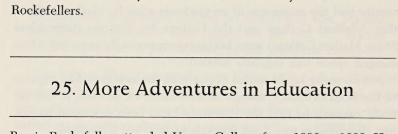

Bessie Rockefeller attended Vassar College from 1886 to 1888. Her father was a trustee of the college during these years and until 1905. He had become interested in Vassar through Dr. Augustus H. Strong whom he knew well when Dr. Strong was pastor of Cleveland’s First Baptist Church. He was now head of Rochester Theological Seminary, a top flight Baptist divinity school, and chairman of the board of trustees of Vassar. With his thoughts on the place higher education might fill in the philanthropy program he was formulating, Rockefeller was stimulated by his visits to the college campus. Contacts with the president, James M. Taylor, and fellow trustees gave him insight into the academic world. In these years the new University of Chicago was \conceived. After long deliberation and much travail, plus guidance as well as money from Rockefeller, the University was born in 1892. Much of the spirited discussion in the formative years took place at Vassar and at Forest Hill. It was at Vassar where Rockefeller first met William Rainey Harper. He was destined to be the University of Chicago’s first president and as such to launch the institution into stellar orbit. Long before this the educator and the oilman had become close friends. Dr. Harper and his wife were familiar figures at

<!-- issues: image_text_overlap:0.292 -->

<!-- page_id: 0107-right | printed: 169 | viewer_token: 168 | viewer_sequence: 216/340 -->
## Page 169

Forest Hill where they were welcomed as favorite guests and beloved by all the Rockefellers. The two men were introduced in 1888 at breakfast in the big, high-ceilinged dining room of Vassar’s Main Hall. The short, stocky young professor—he was thirty-two—occupied the chair of Biblical Literature at Yale, and was a Baptist. He came to Vassar on Sundays as visiting lecturer on Bible subjects. Rockefeller seems to have been impressed at once with the engaging scholar. He records the meeting in his Reminiscences: “as I frequently spent weekends there (Vassar) I saw and talked much with the young professor . .. and caught in some degree the contagion of his enthusiasm.” Another with whom Rockefeller first became acquainted at this time was the former Minneapolis Baptist preacher, Frederick T. Gates, who also spent weekends at Vassar and later was appointed a College trustee. Gates was to be of utmost importance to Rockefeller in many capacities, his best-known role that of almoner and molder of the Rockefeller system of philanthropy. At the moment he was executive secretary of the newly formed American Baptist Education Association. Rockefeller supported it and thus knew of Gates. No account of Rockefeller in Cleveland is complete without reference to Gates. In and out of Cleveland for conferences with Rockefeller on countless subjects, Gates at one period was the most frequent visitor at the Homestead. During his Cleveland pastorate, Dr. Strong and his family looked on the Rockefeller estate as practically a second home. Their bookish son Charles, who often accompanied them, used to go off to the Forest Hill beech woods, perch on a low tree limb and read aloud for hours to the young Rockefellers. The two families had made a joint trip to Europe and were drawn together even more closely with the marriage in 1889 of Bessie and Charles. Along with “Old” University of Chicago, Baptist colleges and universities throughout the country generally were struggling and weak. Intellectuals in the sect saw the need for a great new American university that would be under Baptist aegis but not narrowly, sectarian. As the country’s leading Baptist layman, Rockefeller was \ counted on to support all sorts of denominational causes. It was

eee — Ci SS

<!-- issues: low_ocr_confidence:55.8 -->

<!-- page_id: 0108-left | printed: 170 | viewer_token: 170 | viewer_sequence: 218/340 -->
## Page 170

taken for granted he would underwrite the proposed University And he was giving careful consideration to the idea, studying it ir his usual deliberate way. Dr. Strong came forth with the vision of a grandiose center o| Baptist learning to be located in New York City. With his trustee duties bringing him frequently to Vassar, he had ready-made op portunities to try to win Rockefeller’s approval of his concept. He was an eloquent and persistent advocate, but, despite some good points which Rockefeller saw in the scheme, he felt it impractical. However, he was at a certain disadvantage in discussions with Strong because of the family relationship between them. From contacts through the Education Society in various parts of the country, Gates was convinced the contemplated university should be somewhere in the Middle West. He agreed with Dr. Goodspeed, of Morgan Park Seminary in Chicago: The place for the institution was in that city where it would rise phoenix-like from the ashes of the defunct University. One evening at Vassar, Rockefeller and Dr. Harper were at the President's home, the three deep in the ever-present topic of the proposed university. Rockefeller turned to Harper and asked him if he would accept the presidency if and when the university came into existence, and at the same time, he wanted to know where he thought it should be situated. The young visiting lecturer from Yale replied that he would be willing to give his life to such an institution wherever it was to be. However, he indicated that his preference for its site was Chicago. In the opinion of Rockefeller and many others, Harper as head would insure the institution’s success. So the question of location seemed to be settled. Opposing views respecting the projected university were heading up to a great extent on the Poughkeepsie campus with Dr. Strong increasingly vehement and Rockefeller in a difficult pivotal position. Nevertheless, the oilman enjoyed his sojourns in the peaceful precincts, walled as they were against the world he knew. President Taylor, who had left a Baptist pulpit for his current position, welcomed him warmly, took him home for tea and for dinner with Mrs. Taylor and the children. The campus’s fine stand of trees, old

<!-- page_id: 0108-right | printed: 171 | viewer_token: 170 | viewer_sequence: 218/340 -->
## Page 171

monarchs and newly planted saplings, reminded him of Forest Hill, as did Vassar Lake where he sometimes skated with the president. However, he avoided the fancy curlicues that “Prexy” indulged in to the delight of his “young ladies.” Fellow trustees accepted the president of the Standard Oil Company as a valued associate, heedless of his ogre-image as projected by the muckrakers now snarling fiercely after him in full pack. He was among friends, and, basking in their midst, was relaxed and genial. His wry humor coming into play, he dipped freely into his store of jokes and listened with appreciation to the others’ lively anecdotes. One about Bessie then going the rounds of the campus amused him greatly. It seemed that while shopping in Poughkeepsie for furniture for her college room she saw a piece at Luckey Platt & Company that she liked but found she had not enough money with her to buy it. Did she think that her father would pay for it if the store billed him, the clerk queried hopefully. Bessie was sure he would. “What does your father do?” the man asked. “Well,” Bessie hesitated, “I don’t really know.” (Chuckles from her father as he heard this.) “What is his name?” the merchant now enquired. “Mr. Rockefeller.” “Not the Mr. Rockefeller!” (More chuckles from the Mr. Rockefeller.) The flustered salesman assured his customer that what she had selected would be dispatched at once to her Vassar dormitory.

Bessie’s father added it to his collection of stories, and took delight in retelling it. Also as a student at Vassar at the same time as Bessie, was another Clevelander, Adella Prentiss, who had been at Forest Hill and knew the family. She was an accomplished pianist. On one of John D., Jr’s visits to the College the two young people staged a pianoviolin concert in the chapel, Trustee Rockefeller applauding in the audience. Back in her home city after graduation and study in Europe,

eee Fp

<!-- issues: low_ocr_confidence:78.46 -->

<!-- page_id: 0109-left | printed: 172 | viewer_token: 172 | viewer_sequence: 220/340 -->
## Page 172

Adella saw a good deal of the Rockefellers, accompanying them on some of their travels. Soon embarked on an illustrious careet in Cleveland, she acted as impressario for world-famed musical stars, married the singer Felix Hughes, and won wide renown as a founder and manager of the Cleveland Orchestra. Realizing in 1918 that the paramount need was a permanent home for the fledgling orchestra, she succeeded in interesting the Chamber of Commerce whose “president, with one or two others presented the matter of a music hall for Cleveland to Mr. Rockefeller’s advisors at 26 Broadway.” (Rockefeller by then had left Cleveland.) Response at first seemed favorable. But the Rockefeller field representative, learning of plans to build a Hippodrome in Cleveland advised the oilman that the city would not need a music hall. Mrs. Hughes then approached John D., Jr., to ask if he thought his father would consider donating the Euclid Avenue town house property as a site for the hall. Rockefeller, Sr., she was told, did not participate in launching an undertaking. He had found from experience that the enthusiasm and ardor of initiators too often waned, leaving him with “white elephants” on his hands. The son suggested that she might write to him again if and when definite plans for a hall materialized. Years later—1929—Mrs. Hughes did write: John L. Severance had pledged $1,000,000 for a hall providing at least twice that amount could be raised as an endowment fund, she announced. Would John D., Jr. contribute to that? It was not necessary for her to remind him that Severance was the son of Louis H. Severance, one time treasurer of the Standard Oil Company, which John Severance joined as a youth... . John D., Jr. wired his reply: “While my active interest in general Cleveland activities has for some time been practically terminated, as a tribute for what you have done in building up . . . the musical values of the city, I shall be happy to contribute $250,000 to the endowment campaign.” The required endowment figure was met, the hall completed— at about twice its original estimated cost according to Mrs. Hughes. wo

<!-- issues: missing_printed_page_number -->

<!-- page_id: 0109-right | printed: 173 | viewer_token: 172 | viewer_sequence: 220/340 -->
## Page 173

If she did not gain all she had hoped from her friends the Rockefellers, she recognized, as she stated in her book, Music Is My Life, that “The great gifts of our Hall (Severance Hall) and the endowments that largely support the Cleveland Orchestra today (1947) were made possible by the Standard Oil fortunes . . . inherited by the Severances, the Blossoms and the Boltons.” J Vassar College fared better than the Cleveland Orchestra at the hands of Rockefeller, Sr. Despite his own love of music, he proved | less ready to support the arts, than higher education. \ On the Poughkeepsie campus, he gave money for a dormitory that he named “Strong” for Bessie. Next to it he erected a similar building, “Davison House,” in memory of his mother Eliza Davison Rockefeller. He supplied funds for the College recitation hall that President Taylor christened Rockefeller Hall, but which was always “Rocky” to the students. There were other funds supplied by Rockefeller. However, he had not been “besought for his money, but for his counsel,” Dr. Taylor emphasized in reporting these gifts. At a Baptist convention in Boston in May 1889, the Education Society officially endorsed establishment of a college—later to be a university—in Chicago. Only after this vote did Rockefeller allow Gates to announce his gift of $600,000 as the initial sum in the million dollar endowment fund to be collected as the first step in starting the new institution. The assemblage broke into a pandemonium of cheering and prayerful outcries of gratitude to “our great patron,” ending by jubilantly singing the Doxology. The proposed learning center was to be Christian in character, under Baptist auspices forever, but administered in a spirit of the widest liberality. William Rainey Harper, it was assumed, would be its president. He was acknowledged not only the most accomplished scholar the Baptists could produce, but was equally admired in all academic circles. Rockefeller refused absolutely to permit the university to be named for him. It was to be the new University of Chicago. Although his gift grew to about $35,000,000, no building on the campus carried his name until after his death when the handsome Rockefeller Memorial Chapel was erected.

EEE Fp

<!-- issues: low_ocr_confidence:68.16 -->

<!-- page_id: 0110-left | printed: 174 | viewer_token: 174 | viewer_sequence: 222/340 -->
## Page 174

Now president-elect of a still nebulous university, Harper ar rived at Forest Hill. He was delighted with the lovely place anc felt at home immediately. He was back in his native Ohio. His birth place was a humble log cabin in New Concord, Muskingum County Local Muskingum College admitted him as an undersized boy ir short pants. When he was sixteen, he was graduated and for ¢ short time stayed on at Muskingum to teach Hebrew. At eighteen he received his Ph.D. from Yale. On his first day at the Rockefeller home, he came down to breakfast to find the whole family at the table, the young Rockefellers as well informed and interested in proceedings about the University as their parents. This was in line with Rockefeller’s effort to include all his family in his philanthropy projects. The youthful educator won them all. “Harper was a man of exquisite personal charm,” Rockefeller wrote of him. “We count it one of the rich and delightful experiences of our home life that Dr. and Mrs. Harper could occasionally spend days together with us.” The Forest Hill visitor was widely known for his erudition: he was a master of Assyrian, Hebrew, Aramaic, Syrian—all the tongues of the Bible. But he seems to have worn his wisdom lightly, never letting it get in the way of friendliness, After the endorsement at the Boston convention, there remained the seemingly endless preliminary details to be faced in the task of bringing into being the long hoped for university. Numerous sessions took place at Forest Hill. In 1890 at least three, maybe more, important conferences were staged there with Harper and Gates in attendance. The indefatigable Gates, soon invaluable, acted as catalyst, well-informed and practical. It is clear that much of the framework of the University of Chicago was hammered out at Forest Hill, with Gates one of the skilled craftsmen. From now on he was often here as he undertook more and more assignments from Rockefeller, While he may have liked Forest Hill, he apparently did not enjoy Cleveland. Once overhearing a remark that all Rockefeller cared for was making money, he is said to have retorted hotly: “In heaven’s name, what else could he do in that city!”

<!-- page_id: 0110-right | printed: 175 | viewer_token: 174 | viewer_sequence: 222/340 -->
## Page 175

Gates was utterly loyal to Rockefeller, who in turn came to have complete confidence in him. By the time Rockefeller wrote his Reminiscences, Gates, as he noted, had been involved “with my personal affairs for many years.” He was chairman of the General Education Board and had “taken cares of many kinds off my shoulders.” In the early stages of the Baptists’ plans for a university, Gates was enroute to Chicago from New York one day on the same train with Rockefeller, who was getting off at Cleveland. Gates then was only slightly acquainted with this most famous of all Baptist laymen. He took the opportunity to scrutinize the great man and recorded his impressions in his manuscript autobiography, supplying a vivid picture of Rockefeller at this period. Gates was impressed with the neatness of his clothes, which were spotless and “inconspicuous though of the costliest material and workmanship.” He was struck with the absence of jewelry—“no watch guard or chain ...no rings and not even a pin in his necktie.” Gates noticed what was Rockefeller’s customary way of managing the tipping problem: he held out a handful of loose change and let the recipient take what he thought was right. If Gates was studying Rockefeller on the journey, the Clevelander was likewise sizing up Gates. Suse wecue

Negro schools, colleges and universities have received millions of dollars from the Rockefellers. The family’s first gift to education for black Americans was a pocketful of change that John D. Rockefeller emptied into a collection plate at Cleveland’s Willson Avenue Baptist Church one Sunday evening in June 1882. He had attended the church program at the urging of its pastor, the Rev. George O. King, who wanted him to hear a special program. Two charming New Englanders, Miss Sophia B. Packard and Miss Harriet E. Giles, were the speakers. They described most movingly a school they had opened the previous year in Atlanta, Georgia for Negro girls and women of various ages. Practically all those attending were illiterate, but eager to learn to read and write. The speakers pointed out that enrollment had increased steadily. The church basement which served as a makeshift schoolroom was

EES rip

<!-- page_id: 0111-left | printed: 176 | viewer_token: 176 | viewer_sequence: 224/340 -->
## Page 176

no longer adequate. There was no money for better quarters, | books or supplies—no money for anything! The teachers long sir had exhausted the pittance provided by their sponsor, a Bapt women’s home missionary society in Boston. The two stated frar ly they were on a tour to collect funds. They were not going to c sert their earnest pupils. Rockefeller listened intently. He had been interested in the bla race since his youth when he gave small sums to Negro causes d spite a meager salary. Stirred by what he had heard, he turned ov to the women all the money he had on his person, promised to se1 them a check for $250 at once and to help them in the future “if you stick,” he added. Next day the Rockefeller carriage was sent to take the visito for a drive along beautiful Euclid Avenue, and out to Forest Hi Enroute they passed burgeoning Case School and Adelbert Cc lege, the latter scheduled to open four months later. At Forest Hill, Mrs. Rockefeller recognized her callers immed ately. She recalled meeting them on her wedding trip, almo twenty years before, when she and her husband had stopped : her alma mater, Oread Institute. The fact, however, had escape John D. Oread made a common bond at once. A warm friendshi blossomed between the teachers and the Rockefeller family, it cluding Lucy and Mrs. Spelman. Once John D. was convinced that the little Atlanta school w: to continue, he gave the founders his support both in money an encouragement. His endorsement of the pioneer school stimulate benefactions from others and helped open the door for Negro edt cation throughout the United States. At the school’s third anniversary celebration in 1884 a privat railroad car left Cleveland taking the following to Atlanta for th event: Mr. and Mrs. Rockefeller, Lucy Spelman and Mrs. Spelmar ten year old John D., Jr. and a sister (no record of which one), Di H. F. Biggar and the Rev. Edward Judson, a frequent travelin companion. At the school they sat on the platform and Rockefelle made one of his rare public speeches, The Rockefeller-Spelman concern for the school never laggec

<!-- issues: missing_printed_page_number -->

<!-- page_id: 0111-right | printed: 177 | viewer_token: 176 | viewer_sequence: 224/340 -->
## Page 177

Contributions from Rockefeller included $7,500 toward purchase of land; $40,000 for a brick building that was named Rockefeller Hall; $81,000 for heating plants; $55,000 for two buildings named for Miss Packard and Miss Giles. When he rejected the founders’ wish to name the school for him, they selected Spelman in appreciation of the anti-slavery activity of Harvey Spelman. Nevertheless, the name, if unofficially, honored his wife and two daughters as well. Spelman Seminary became Spelman College (for women) and is now affiliated with Atlanta University. Through the years Miss Packard and Miss Giles made long and restful visits at Forest Hill, often encountering other house guests. One time in 1903 when Miss Giles, by then president of Spelman, spent a fortnight there, another president, W. H. P. Faunce of Brown University and his wife also were staying at the Hill. Spelman’s president kept a diary of each day's doings and recorded the menu for every meal! Brown was the alma mater of John D., Jr. and Dr. Faunce a leading Baptist. All in all it was a compatible group the Rockefellers had gathered together. At Spelman’s fiftieth anniversary in 1931, Rockefeller sent his congratulations regretting he could not attend. He wrote: “Of all the investments we have made as a family, Spelman stands among the | best.” His family carried on. Recorded personal gifts from the senior Rockefeller totaled $316,000. His son, who was indoctrinated | in the Spelman tradition at the age of ten, gave $836,000. There were other sizeable gifts not accounted for in these figures. From 1903 on, annual contributions from $6,000 to $12,000 were made to Spelman for current operations. In 1928 the Rockefeller General Education Board gave $1,500,000 toward a $3,000,000 endowment fund then being raised. At the same time Spelman received $1,000,000 from the Laura Spelman Rockefeller Memorial Fund which was applied to the endowment. Among the many tangible evidences on the campus of Rockefeller-Spelman connections is Sisters Chapel, a memorial to Mrs. John D. Rockefeller and her sister Lucy. The Abby Aldrich Rockefeller dormitory honoring his wife was a gift of John D. Rockefeller, Jr.

1ce ‘ist ikle-

rs Il. es

list at d

ee Flip

<!-- issues: low_ocr_confidence:64.5 -->

<!-- page_id: 0112-left | printed: 178 | viewer_token: 178 | viewer_sequence: 226/340 -->
## Page 178

Another is the Fine Arts Building erected in 1964 with $750,000 the $1,000,000 grant by the Rockefeller Brothers Fund, the rema der going to joint land acquisition by Spelman College and Atlar University. Laurance Spelman Rockefeller, son of John D., Jr., a president of the Brothers Fund, said the grant that made the buil ing possible was in recognition of his father’s and grandfathe lifelong interest in higher education for Negroes, in general, ai Negro women, in particular.

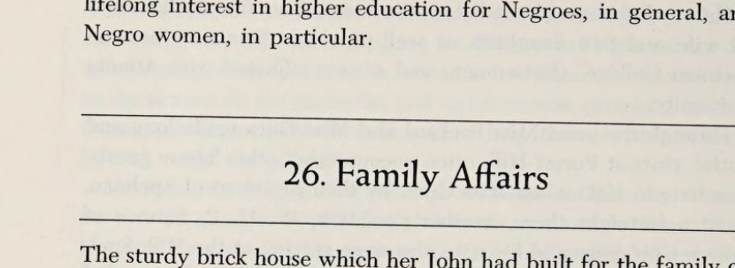

The sturdy brick house which her John had built for the family « Cheshire Street continued to be Eliza Rockefeller’s home. Mai Ann, last of the children to marry, and her husband, William Rud lived there with Mrs. Rockefeller for several years. Eliza loved the place. It was a haven deeply appreciated aft the wanderings and uprooting she had endured in earlier yea with her husband, the restless medicine man. She kept John’s pi ture in a place of honor over the parlor mantel. He dropped by o ten to see her. The stories that he had neglected his mother wer more of the malicious fabrications spun about him at this time. / we know from her letters, Laura Rockefeller came by regularly i her carriage to call on her mother-in-law and to take her to th Homestead. There Eliza always sat next to her son at meal time. ‘ remember often seeing Father hold her hand lovingly at the table, John D. Jr. said, describing the close bond between his father an grandmother. Income from the small trust account left by her father and care fully managed by John, though not large, gave Eliza a sense o independence. Also, she apparently was supplied with funds b John, for she was known to sustain some modest charities, person ally and quietly helping individuals who were in trouble. She wa

<!-- issues: image_text_overlap:0.319 -->

<!-- page_id: 0112-right | printed: 179 | viewer_token: 178 | viewer_sequence: 226/340 -->
## Page 179

of inita nd d-

### Te > Pe x

—.

> Wan

cs me ene tih e M A S TaSISST D Rockefeller and his brother-in-law, William C. Rudd, returning from service at the Euclid Avenue Baptist Church. (The Western Reserve Historical Society )

<!-- issues: low_ocr_confidence:49.32 -->

<!-- page_id: 0113-left | printed: none | viewer_token: none | viewer_sequence: 228/340 -->
## Unnumbered Page

### if

> ges,

> “

<!-- issues: low_ocr_confidence:40.86 -->

<!-- page_id: 0113-right | printed: none | viewer_token: none | viewer_sequence: 228/340 -->
## Unnumbered Page

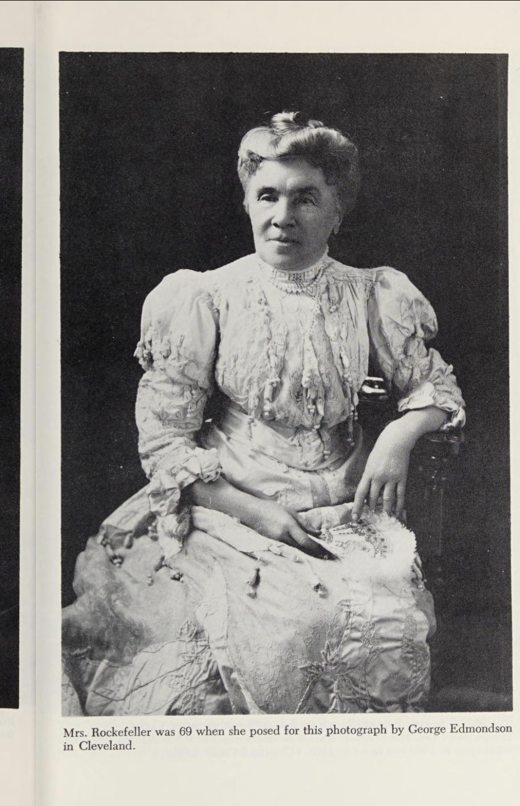

— eee Fp

<!-- issues: low_ocr_confidence:18.29, missing_printed_page_number -->

<!-- page_id: 0114-left | printed: none | viewer_token: none | viewer_sequence: 230/340 -->
## Unnumbered Page

### i

> ve

> Bab:

ied OM i Wal ©

> —aewe

Se ee pis The Euclid Avenue Baptist Church on the southwest corner of Euclid and Huntington (East 18th) Street. Known as “the Rockefeller Church,” the buildit was begun in 1869 and razed in 1926. (Cleveland Public Library )

<!-- issues: low_ocr_confidence:32.35 -->

<!-- page_id: 0114-right | printed: none | viewer_token: none | viewer_sequence: 230/340 -->
## Unnumbered Page

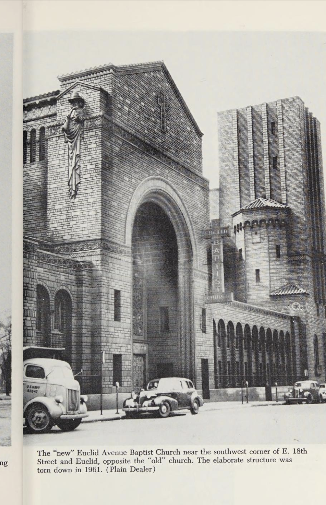

eee Fp

<!-- issues: low_ocr_confidence:30.55, image_text_overlap:0.158 -->

<!-- page_id: 0115-left | printed: none | viewer_token: none | viewer_sequence: 232/340 -->
## Unnumbered Page

### eat

> er Sen rer oh YH

### ie ae MM) ars (sh. ae a , y ie A A . & ee ~~ wi” P . ae > <N

e

> )

. Boa sy, GE

> ice |

»s A. Eaton, pastor of the Euclid Avenue Baptist Church, and his yrus Eaton, enjoying a canter at Forest Hill,

<!-- issues: low_ocr_confidence:27.59, missing_printed_page_number -->

<!-- page_id: 0115-right | printed: none | viewer_token: none | viewer_sequence: 232/340 -->
## Unnumbered Page

> _ a

> 2

> ak ri *

: i

> B} sf

Po LY, mn Pe ssa With advancing years the resemblance between Eliza Rockefeller and her son, John D., was startling, as shown in these photographs when the subjects were in their early seventies. (Rockefeller Family Archives)

Rev. W. W. Bustard, the first leader of the congregation at the “new” Baptist Church, visiting with Rockefeller.

> icsieel 4 WEN) jo

> ae

<!-- issues: low_ocr_confidence:41.0 -->

<!-- page_id: 0116-left | printed: none | viewer_token: none | viewer_sequence: 234/340 -->
## Unnumbered Page

> Pi

> AD

> as

NISRA ave tng ALY? Peak gee sh sindieoruh Oth

éh oe *

Rockefeller photographed on a Cleveland street. (Standard Oil Company, Ohi

<!-- issues: low_ocr_confidence:45.79, missing_printed_page_number -->

<!-- page_id: 0116-right | printed: 179 | viewer_token: none | viewer_sequence: 234/340 -->
## Page 179

following the precept “to get is to give” that she had so firmly taught her children. It was not too long a walk from 33 Cheshire Street to the Euclid Avenue Baptist Church. Eliza was in her pew every Sunday, rejoicing in her son’s presence nearby and in his faithful attendance on the Lord. The untimely death in 1878 of the beloved Lucy, who was Eliza’s first born, was a deep sorrow to her and to the entire family. Lucy’s husband, Pierson D. Briggs, was employed in the purchasing department of the Standard Oil Company. There was one surviving child, ten-year old Florence. The little girl was very dear to her Uncle John and Aunt Laura and spent a great deal of time with them, joining the young Rockefellers more like a sister than a cousin. Pierson Briggs remarried and with his second wife, the former Laura Price, lived on Euclid Avenue a bit east of the Rockefeller town house. Florence married William W. Benjamin, Jr. in Cleveland in 1891. The couple’s children, Lucy Avery and William, were welcomed like grandchildren at Forest Hill. After Lucy’s death Eliza began to fail. The hard experiences of her life were taking their toll. And what of her mate, the botanic doctor? His absences lengthened steadily. His name was no longer listed in the Cleveland City Directory. Occasionally he turned up. One day in 1885 he was seen driving along Euclid Avenue in a smart rig. He hitched his fine span of horses in front of the Standard Building and bounded up the stairs to see John D. He made rare and surprise visits at Forest Hill, always warmly welcomed by his grandchildren. They listened to the yarns he spun with gusto, liked the lively tunes from his violin, which he held at his waist. Once, bringing John D. Jr. a rifle, and the girls bows and arrows, he drilled them enthusiastically in marksmanship. On one recorded visit to New York, he dropped in at 26 Broadway and greatly enjoyed a tour of New York under guidance of John D.’s secretary. In robust health, well dressed and seemingly prosperous, he was as jovial as ever. “All the family loved him,” John D., Jr., said of him years later.

<!-- page_id: 0117-left | printed: 180 | viewer_token: 180 | viewer_sequence: 236/340 -->
## Page 180

His appearances grew more infrequent until the unpredictal man stayed away altogether. Eliza, it is said, received an occasion letter from him, but did not know his whereabouts. He was su posed to have provided her with an address in the Far West wh« he picked up communications from her. A stoic, and never tall tive on any subject, Eliza was silent about William Avery Rocl feller. And so were her children. After their marriage in 1872, Mary Ann and her husband mov to their new home on Euclid Avenue in East Cleveland. Eliza w too feeble to live alone. The Cheshire Street house that had so lo ministered to the family was sold to the Fleischman Yeast Co pany for commercial purposes. When East Prospect (Carneg: Street was laid out, the house was in its path and had to be to down. A billboard was erected and stood for some time at t southwest corner of 19th Street and Carnegie on what remain of the original Rockefeller lot. Eliza divided her time among her children, mostly at the hom of her sons, where she was cared for tenderly. Winters she spe in New York with William, summers partly in Wickliffe wi Frank’s family and at Forest Hill. Although relations between h oldest son and youngest son were strained for years, their moth ignored the friction and was impartially devoted to both. In March 1889 Eliza, who had begun life as a backwoods far girl, died at age seventy-six in the Fifth Avenue mansion of h son, William, Her three sons accompanied her body to Clevelai where the funeral service was held at John’s Euclid Avenue re: dence. Among the several Baptist ministers officiating were form pastors at the Euclid Avenue Baptist Church, the Rey. S$. W. Du can and the Rev. George T. Dowling. Eliza had known them we and they had come from charges in the East to honor her. The hou filled up quickly with Rockefeller relatives and friends. Willia Avery Rockefeller was not among the mourners. Everyone notic that he was missing, but no one mentioned the fact. Eliza was buried in Lake View Cemetery in a large, high-lyii lot purchased some time before by John D., who intended it as family burial plot. A few years later he marked it with a majest

<!-- page_id: 0117-right | printed: 181 | viewer_token: 180 | viewer_sequence: 236/340 -->
## Page 181

granite obelisk incised with the single word “Rockefeller.” It is the tallest shaft in the cemetery, topped in height only slightly by Garfield Monument which is close by. An unsubstantiated story circulated that John D. asked the ministers who spoke at his mother’s funeral service to indicate she was a widow. In line with this, Flynn in God’s Gold stated that the headstone placed at Eliza’s grave was inscribed “widow of William Avery Rockefeller.” The marker, however, carries only the words “Eliza Davison Rockefeller,” and “Mother.” Before Eliza’s interment there were already a number of her progeny in the Rockefeller plot. Lucy was lying beside small graves of children she and her husband had lost. Alice, infant daughter of John D. and Laura, was not far away. A second cluster of tiny headstones marked resting places of babies of Frank Rockefeller and his wife, the former Helen Scofield. But these children were not to remain in this peaceful bit of earth beside their cousins. In an upsurge of burning anger at John, Frank had the bodies disinterred in 1909 and placed in another part of the cemetery. Frank never did anything quietly. Consequently, Cleveland soon learned, and was shocked at the news, that he had moved his children so that they would not lie near his brother John, who was to be buried in this lot. From early years these two brothers’ temperaments got in the way of any real understanding between them. John was dismayed, for example, at Frank’s prank by which he dodged regulations to enlist in the Civil War, but stood by him, That sort of recklessness and irresponsibility did not wholly leave Frank as an adult. John took both of his brothers into the oil business with him, made them both vice presidents of the Standard Oil Company. Discontented, Frank left the company to return and depart again. John, nevertheless, kept him on the payroll the while. William stayed and became invaluable to John. He was rewarded for his fidelity and his ability rising to success and wealth on his own account. Frank declared William was under John’s thumb. He loved William as much as he hated John. Frank resented being catalogued as “John D. Rockefeller’s broth-

Ipere kake-

ng mie) m he ed

\es nt ith

er nd si-

n- Hl, se

ae rrrrr———(i‘i«zxmRS

<!-- issues: low_ocr_confidence:68.04 -->

<!-- page_id: 0118-left | printed: 182 | viewer_token: 182 | viewer_sequence: 238/340 -->
## Page 182

er.” The feuding between his father-in-law, William Scofield, an his brother, as already mentioned, helped influence him again: John, particularly during the hard-fought battles between th Standard Oil Company and Scofield’s outfit. But Frank was as warr hearted as he was hot headed. After a confrontation with his broth er he would go to him in contrition, ask his forgiveness and voy to end all such actions. Disregarding the brothers’ quarrels, their families remaine friendly, their children visiting back and forth between Forest Hil and the Frank Rockefeller summer place seven miles away at Wick liffe. Frank shared the Rockefeller fondness for horses and had | track at Wickliffe where he trained his racers. Frank also owned a remarkable 8,000-acre ranch, Soldier Cree! Park in southwestern Kansas. It might be more accurate to say tha John D. and William owned it, for they carried mortgages on th ranch from the time Frank bought the first acres in 1879. In a serie of complicated transactions by which Frank kept adding to hi holdings without decreasing his indebtedness, the mortgages ulti mately amounted to over $168,000. In addition, there had beer numerous other loans by his brothers for ranch operations. The ranch was known for its prize Hereford cattle and fine sheep There was a stable of pedigreed horses and a herd of buffaloes fa mous throughout the region. Despite certain eccentricities—he im ported fifty cats to take care of the rodents and the cats becam more troublesome than the rodents—Frank developed a splendic ranch. He was proud of it and spent a good deal of time on it, ofte1 entertaining Cleveland friends there. In the early 1880s Frank formed a partnership with James Cor rigan, a flamboyant, adventurous Clevelander. The two went int debt to purchase the Franklin Iron Mining Company in Wisconsin When the panic hit in 1893 they were in trouble, and went separate ly to John D. to be bailed out. Several times he loaned them larg sums in their emergencies, including for example, one sum o $140,000 and another of $80,000. John D. also advanced a total o about $265,000 on Franklin Mine paper, with Frank as signer anc Corrigan endorser of some of it.

<!-- issues: missing_printed_page_number -->

<!-- page_id: 0118-right | printed: 183 | viewer_token: 182 | viewer_sequence: 238/340 -->
## Page 183

Earlier in the 1880s, James Corrigan and his brother John had operated an oil refinery in Cleveland which they sold to the Standard. Jim thus acquired 2,500 certificates of Standard Oil Trust. He put up this block of stock as security for the loans from John D. —a sound business arrangement. As the nation’s economy continued to slip, so did the affairs of Jim Corrigan and Frank Rockefeller. They were experiencing difficulty in meeting payments on their loans; the mining venture was an especially heavy burden. At their request, John D. in March 1895 helped them by buying Corrigan’s Standard stock. He paid $420,000 or at the rate of $168 a share. It was the top market price on the day of the sale. John D. had sold some of his own stock at this figure at about this time, and also some for $140. It was time of tight money and the partners would have encountered difficulty getting such a large amount of cash anywhere—it certainly would not have been forthcoming on Wall Street. However, they were still in trouble. To ease their situation, John D. cancelled interest payments due him from Corrigan on one loan, surrendered the Franklin Mining certificates he held as security on another, and released Corrigan from liability as endorser of Frank's $130,000 note. Nevertheless, the partners were forced to give up their mining venture, selling the company to outsiders for much less than it was worth. Frank and Jim blamed Rockefeller for their plight. They claimed that he had pressured them for their debts, thus compelling the sacrifice of the mining company. As the country’s economy rallied, Standard Oil stock like that of all businesses increased in value. Corrigan watched the upward spiral, becoming more and more dissatisfied. Finally in 1897 more than two years later, encouraged according to Nevins by the prominent Cleveland lawyer, Judge Steveson Burke, Corrigan sued John D. Rockefeller. He demanded the return of the Standard stock or payment at the rate of $500 a share, a price he himself seems to have set. Rockefeller, he alleged, had cheated him, knowing the stock would be worth more. John D. had misrepresented the surplus of the company, and further, as a company trustee, had no right to deal in the stocks, he claimed.

| a Fp

<!-- issues: low_ocr_confidence:59.45 -->

<!-- page_id: 0119-left | printed: 184 | viewer_token: 184 | viewer_sequence: 240/340 -->
## Page 184

The matter was submitted to arbitration. Rockefeller’s lawy« Virgil P. Kline and George W. Murray, considered the issue so it portant that books of the Standard Oil Company were brought in court. It was the first time these documents had left 26 Broadwe By a unanimous decision in 1899 Rockefeller was complete cleared: as a director rather than a trustee he had a legal right buy the stock; he had not misrepresented the surplus. In short |] “was actuated by a desire to accommodate the plaintiff and relie him of his embarrassments.” There was a second lengthy hearing at Judge Burke's insistenc The decision was again unanimously in John D.’s favor. Corrig: took the case to the Ohio Supreme Court which, in 1902, with 1 dissenting voice, likewise exonerated John D. Frank, of course, had been deeply involved in the whole affa’ What had been an issue between the brothers for twenty years w thus concluded. The case gained much attention. Despite John D clear vindication, Clevelanders chose to view him as a rich man wl had ground down his brother. Everywhere the public was reac at this time to think the worst of the Standard Oil head. The Frank Rockefellers had a Cleveland home on Longwoc¢ Avenue and were well and favorably known in the city. Differir sharply from taciturn John D., Frank was jovial and outgoing. A together a likeable man, he had many friends, among them a coter at the Union Club who were ready to overlook his faults. Howeve Frank would break out with loud denunciations of his brother, e pecially when in financial straits. After the Corrigan suit he w: more abusive than ever, declaring John D. had taken advantage « him and his partner. In March 1905 an article by Ida Tarbell piping on the same ther appeared in McClure’s Magazine, much of it the result of a vis with Frank. He was never reluctant to meet the press. Attorne Kline was so incensed at what he termed Miss Tarbell’s biased, it accurate statements that he issued a formal denial. Frank, his wife and daughters, Alice and Ann, withdrew fro: the Euclid Avenue Baptist Church, in December, 1908. Broadcas ing the fact, Frank explained he no longer could worship under th

<!-- page_id: 0119-right | printed: 185 | viewer_token: 184 | viewer_sequence: 240/340 -->
## Page 185

same roof with his brother. John D.’s feelings were deeply wounded by Frank’s behavior, the suit and Corrigan’s unjust charges. The breach between the two brothers was irreparable. They never again spoke to each other. The younger Rockefeller was to hold forth in further vindictive interviews. At his death in 1917, John D. traveled from New York for the funeral to stand sorrowfully beside the grave in Lake View Cemetery. Inglis came to Cleveland with Rockefeller. They called on Frank’s widow and children, all of whom received Rockefeller with utmost affection, Inglis recorded. While in the city, Rockefeller took time to look up some familiar old landmarks. Going over the Superior Viaduct, he had his driver stop while he gazed down on the Flats and Merwin Street, marvelling at the changes since his youth when the river front was home territory to him. When Frank died, his two brothers cancelled the mortgages and all other loans made to him on his Kansas ranch. Soldier Creek Park passed to Frank’s widow unencumbered with debt. Mrs. Rockefeller, who died in 1932 in Cleveland, sold it in sections, realizing over $100,000 from the property, according to one account. In pleasant contrast to the trying experiences with Frank, an event took place in 1900 that was of great gratification to John D. Rockefeller and his entire family. This was the dedication of Alta House on Mayfield Road in the Murray Hill district. The neighborhood, better known as “Little Italy,” was peopled largely by Italians newly arrived from their homeland. Through the influence of his daughter, Alta, Rockefeller developed a genuine concern for Alta House. Later known as Alta Social Settlement, it had blossomed from a modest day nursery and kindergarten started by some enterprising local residents like Joseph Carabelli, monument maker, and his wife. Alta Rockefeller was interested from the first, stopping by to observe the busy program, and before long spending considerable time at the center. Her father often drove along steep, dusty Mayfield Road. He observed the industrious people and their youngsters spilling out of humble, crowded homes. Men from Little Italy were on the labor

ly. ly to he

1g Iie

| es Fp

<!-- issues: low_ocr_confidence:71.06 -->

<!-- page_id: 0120-left | printed: 186 | viewer_token: 186 | viewer_sequence: 242/340 -->
## Page 186

force at Forest Hill, which was not far away, and Rockefeller lik them. When his daughter sought his help in furthering the proj for their children, he supplied her with funds regularly. Activities stepped up, and citizens’ participation increased. W: this evidence of local commitment, always of utmost importance Rockefeller in his giving programs, he was persuaded that a mc commodious headquarters was called for and gave money for about $30,000. In addition he guaranteed “liberal yearly main nance assistance.” The community christened their fine new buil ing Alta House in appreciation. Rockefeller seemed to have an abiding fondness for the sett ment. He kept informed about its undertakings and was genero to its needs, retaining it in his name long after he left Clevelan In a published statement of his Cleveland charities, Alta House listed as having received more than $300,000. Little Italy in 19 staged a golden anniversary of Alta House’s opening, honoring Al Rockefeller (by then Mrs. Prentice) for her devotion to the settl ment. Although the present-day Italian population has lessene the neighborhood remains a stronghold of this nationality, with A] House Social Settlement now a member of the Cleveland Welfa Federation,

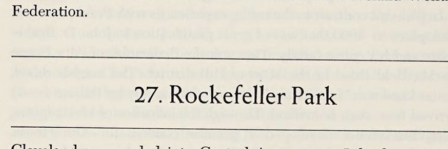

Clevelanders crowded into Central Armory one July day in 18 to observe the centennial of their city’s founding. Dignitaries s in rows on the platform. Among them were important personag from “Old” Connecticut, including Governor C. V. Coffin, who hi come to celebrate the birthday of the first settlement in “New” Co necticut. Governor Coffin had concluded his long speech and Oh Governor Asa S. Bushnell was clearing his throat preparing to r ply, when the flow of oratory was interrupted. J. G. W. Cowl president of the Chamber of Commerce signalled the chairman th

<!-- issues: image_text_overlap:0.228 -->

<!-- page_id: 0120-right | printed: 187 | viewer_token: 186 | viewer_sequence: 242/340 -->
## Page 187

he wanted the floor. He had an important announcement for the meeting. John D. Rockefeller, Cowles told the audience, was making a centennial gift to Cleveland of $300,000 in cash as reimbursement for certain parcels of land in the Doan Brook Valley purchased by the city for a parkway. Lack of funds heretofore had prevented carrying out plans for this development. As loud applause started, Cowles held up his hand for silence. He had more good news: Rockefeller had assigned the city 270 additional acres for parkland in the same valley. He had bought the land for approximately $270,000. Now the cheers rose to the rafters. There were cries of “Rockefeller, speech, speech!” But Rockefeller was not present. After the meeting quieted, Cowles went on to explain that with this money and land it would be possible to create the long hoped for seven-mile stretch of parkland which would link Gordon Park with Wade Park. He was listened to with respect for he was an authority on Cleveland real estate. Besides, as everyone knew, he handled Rockefeller property as well as that of Charles F. Brush, developer of the arc light and famed for innovations in the field of electricity. In a few years a parkland was created between Gordon and Wade Parks, called Rockefeller Park. Another Rockefeller gift of parkland to Cleveland at about this time is now a nature preserve known as Shaker Lakes Park. Originally part of the Shaker colony, it is a scenic wilderness traversed by Doan Brook where it feeds the two natural Shaker lakes. The area contains some of the finest ancient trees in this part of Ohio, as well as rare plant life. The Shakers, reduced to a handful of Believers, sold their holdings in 1889. Prompted by his love of trees and nature in general, Rockefeller bought the section to save it, the deal involving several separate parcels. In the Park Commission offices in Cleveland, there can be seen the thick and battered roll of deeds, each bearing signatures of John and Laura Rockefeller and the conditions by which all these parcels of land were transferred to the city: they were to be used for park purposes forever. 10°

ore it, te- \d-

is 50 lta led, Ita

| ee Fp

<!-- issues: low_ocr_confidence:65.06 -->

<!-- page_id: 0121-left | printed: 188 | viewer_token: 188 | viewer_sequence: 244/340 -->
## Page 188

Rockefeller offered Cleveland $100,000 for a bridge over Roch feller Park at Superior Street, providing the city added $20,000 complete the structure. This was complied with. Architect Schwei furth planned the span which, when completed, was praised for design. Contractors were the Clements Brothers, Robert, Willia and David. With some other parcels, Rockefeller’s total gifts to the City Cleveland for park purposes came to $865,038.87, according to re ords in the Rockefeller Archives. As a heavy investor, Rockefeller participated in a notable Clev land enterprise, erection of The Arcade. The company backing tl unique building was headed by Stephen Harkness, as presider and Charles Brush, as vice president. The “architectural marve' which was built at cost of $867,000, was rated among the worl arcades as second only to Milan’s. Architects John Eisenmann ar George H. Smith won particular comment for the broad stairwe that cascaded from Euclid Avenue to the lower level of Superi Street. The ingenious glass roof prompted the name “crystal pa ace.” As construction of the building was getting under way, Har ness died suddenly, succumbing in 1888 to a heart attack while c board his yacht “Twilight” off the coast of Florida. Among stockholders in The Arcade had been his friend Lou H. Severance, treasurer of the Standard Oil Company. In 1894 Ser verance married Harkness’s daughter, Florence, who was twenty five years younger than her bridegroom. Within a year of the wedding, death came to the bride who had been in ill health fc some time. In her memory Severance and the Harkness famil erected the Florence Harkness Chapel on the campus of the Colleg for Women, Western Reserve University. Cleveland was proud of The Arcade. In 1940, on the fiftieth ar niversary of the building's official dedication, the Euclid Avenu front was “modernized.” Over the entrance plaster medallions wer inserted framing bas relief likenesses of Harkness and Brush. During Cleveland’s centennial year, its most famous citize stepped down from leadership of the Standard Oil Company. Al though Rockefeller retained the title of president until 1911, he n aes

<!-- issues: missing_printed_page_number -->

<!-- page_id: 0121-right | printed: 189 | viewer_token: 188 | viewer_sequence: 244/340 -->
## Page 189

longer carried the full load of the industry he had created. Since no official announcement was made of Rockefeller’s new status, the public still held him responsible for all acts of the Standard. Consequently he continued to be the critics’ target. He had relinquished leadership on the eve of the automobile era. The company was moving into a radically different gear to meet the mounting demand for gasoline. Once a worthless by-product, gasoline now superseded kerosene as an oil product. Plants were revamped and procedures overhauled to keep pace with the booming auto sales. In 1900, the country boasted of 8,000 cars, largely rich men’s toys that frightened horses and stalled on highways. In 1915, the count was 2,500,000 and a new need for gasoline was forecast for aviation. Fresh oil reserves in the West and Southwest were being tapped to satisfy the thirsty motors. As stated in his Reminiscences, Rockefeller had hoped to give up business at the age of fifty. “Having begun work so young,” he wrote, he felt entitled to freedom “to devote myself to a variety of interests other than making money.” Confused conditions brought on by the recession of 1893 compelled postponement for a few years. After some time, the economy stabilized and by 1896 he was able to move into the background. | He now could turn to planning his philanthropies—he was to spend the rest of his life giving away most of his great fortune. He had time for his landscaping and his newest hobby, golf. But the first priority was his health. His normally robust physique gave way from the pressures and strains under which he had labored so long. He was stricken with a disorder diagnosed as alopecia, resulting in loss of all his hair. In a memorandum book in which at one point Mrs. Rockefeller recorded certain memorable events in her life, she noted that in March 1901 “Alta began housekeeping at No. 5 W. 53rd St., N.Y., Lute’s birthday. John’s moustache began to fall out, and all the hair on his body had followed by August.” Specialists were consulted and a rigorous treatment prescribed. Before long, however, he put himself in the care of one of Cleveland’s prominent physicians, Dr. Hamilton F. Biggar, a homeopath. ae ah

ceto inits

ehe it,

I's id

Ly or Ik-

or ly fe

| Fe Fp

<!-- issues: low_ocr_confidence:69.76 -->

<!-- page_id: 0122-left | printed: 190 | viewer_token: 190 | viewer_sequence: 246/340 -->
## Page 190

The Rockefellers, long adherents of this school of medicine, hi consulted the doctor previously, and were well acquainted wi him. As noted, he had accompanied the family on several triy Doctor and patient were the same age and a companionable pa Along with mild medication, Dr. Biggar instituted a “comm« sense way of life” for the ailing man. He was to eat simple foo leave the table while still hungry; exercise daily in the open air a1 get plenty of sleep. The regime appealed to Rockefeller. He px ferred plain food and was never a big eater. The muckrakers made much of his eating habits. A bad stomac it was claimed, held him to a “pauper’s diet’—doubtlessly in ret bution for his sins! With little liking for theater and concert goi1 or similar late night entertainment, the Rockefeller household we: to bed early by choice. Rockefeller’s health was restored, but n his hair. He wore a black skull cap for a time, later replacing it wi a more becoming wig. Some time before his illness, probably in 1899, Rockefeller h¢ become intrigued with golf, a sport that was gaining popularity many parts of the country. According to one tale, his interest in t] sport was first awakened during a game of quoits he was pitchir with a friend at a Lakewood, New Jersey country club. His partne noticing his accuracy with the rings, suggested he should take vu golf. That very afternoon he was persuaded to try a few shot He had beginner’s luck. His first ball soared out like that of a ve eran player. He promptly put in a four-hole course at Pocantico and by 19¢ had a nine hole links laid at Forest Hill. At the latter place tk terrain was more suitable and greatly to Rockefeller’s liking. Fe’ went into golf more seriously than the Squire of Forest Hill. H took lessons, secretly, from Joe Mitchell, famed professional at th Lake Shore Country Club, sending a carriage for him at eight ever morning. The Standard Oil head devoted the same careful atte1 tion to the game as to his business. Mrs. Rockefeller caught golf fever, and also with extreme secrecy she employed Mitchell as a coach. In due time she appeared at th first tee with her clubs, to be met by John D., who kindly offere

<!-- page_id: 0122-right | printed: 191 | viewer_token: 190 | viewer_sequence: 246/340 -->
## Page 191

to show her how to play. Meekly she stepped up, swung, sent her ball neatly down the fairway—and burst into laughter at her husband’s astonishment. Good weather or bad, Rockefeller was on the links every morning, Scores of Cleveland’s prominent citizens and some not so prominent played golf at one time or another at Forest Hill with him. There were three who made up a more or less regular foursome: Levi Scofield, Dr. Biggar and Dr. E. B. Rhodes, prominent East Cleveland physician. The Rhodes home was on Mount Union Street, its back yard bordering Forest Hill. When one of the cronies was absent they pressed in as substitute Ralph R. Snow, an attorney and former minister at the East Cleveland Baptist Church, or maybe Rockefeller’s brother-in-law Rudd. Occasionally Mrs. Rhodes played with Mrs. Rockefeller and Miss Spelman, who also became a golfer. Sometimes the women went around the course in Mrs. Rockefeller’s electric brougham, a kind of elegant precursor of the modern electric golf cart. If Rockefeller pursued golf as a health measure, it was one he enjoyed thoroughly. Ida Tarbell had her own interpretation: he played to keep fit so that he could live longer and be able to make more money! Perhaps she had heard of the tryst between Biggar and Rockefeller who vowed to play a round of golf when they reached one hundred. Dr. Biggar, however, died at age eightyseven in 1926. Biggar, a Canadian, had practiced law briefly in Toronto before coming to Cleveland in his mid-twenties to study medicine. He achieved wide recognition as a physician and surgeon. He was instrumental in founding the Homeopathic Hospital College, forerunner of Huron Road Hospital, to which Rockefeller was a generous contributor. The Biggars lived on Case Avenue not far from the Rockefeller Euclid Avenue residence. The doctor kept a stable of good horses ready to carry him at top speed to a patient's bedside. The big, handsome man had an outgoing, buoyant personality, the kind of physician whose patients said made them feel better the moment he entered the sick room.

on d; ad

1g nt ot th

1g 3 1p iS: t-

| es Fp

<!-- issues: low_ocr_confidence:71.02 -->

<!-- page_id: 0123-left | printed: 192 | viewer_token: 192 | viewer_sequence: 248/340 -->
## Page 192

Dr. Biggar and his wife were so often with the Rockefellers < to be almost like members of the family. The long friendship wa perpetuated by their grandchildren. Rockefeller’s granddaughte: Madeline Prentice, daughter of Mr. and Mrs. E. Parmalee Prentic: married the Biggars’ grandson, Benjamin D. Gilbert, son of Mr. an Mrs. Benjamin T. Gilbert. The latter was the former Sue Bigga who grew up in Cleveland. McClure’s Magazine began publishing a series of articles by Id M. Tarbell that were collected and issued in book form in 190 as the History of the Standard Oil Company. It was a masterfu attack on the company by one whose name was familiar as a write and her book became a best seller. The history appeared at a stra tegic moment. The country was awakening to the dangers of mo nopolistic combinations. Miss Tarbell’s two-pronged indictment wa against the Standard as the most dire of such offenders, and agains Rockefeller, as its evil jinni. The Standard Oil Company had beer embroiled in plenty of unfavorable litigation. Rockefeller, the Stan dard president, was a national figure, but the reticent Rockefelle as a person, was little known, and therefore vulnerable to any ac cusation. Miss Tarbell wrote with verve born of experience. She had grow up in the Oil Regions, witnessed her father and brother as the) joined the producers in fierce battles against the refiners—whicl meant the Standard Oil Company and its head. She had been in: fluenced, it is said, by Lloyd’s book Wealth Against Common wealth, published in 1894, But she was a more able craftsman that Lloyd. Her work was a good history of the company, except—a: she frankly conceded—it was presented from a slanted point of view Tedious reading today, the episodes she touched upon were fresh in the public's mind and the author's interpretations were accepted According to Miss Tarbell, Rockefeller instigated the South Im. provement Company, thus making him the scheme’s chief culprit She reviewed the Hepburn trial, omitting reference to the Standard’s side of the case. In Cleveland where the book had a wide sale there was lively comment about the author's version of the Backus litigation as well as that of the Frank Rockefeller-Corrigan affair In both presentations Rockefeller was cast in the villain’s role,

<!-- page_id: 0123-right | printed: 193 | viewer_token: 192 | viewer_sequence: 248/340 -->
## Page 193

Her information on the Standard was largely obtained from one official, H. H. Rogers, and he could be adroit in deflecting criticism from himself to Rockefeller. Apparently little effort was made to consult other Standard executives, and seemingly none at all to get in touch with Rockefeller. Standard Oil men winced at those of her barbs which hit home. Company leaders resented the unfair presentations and wanted to issue an official rebuttal. Rockefeller would have none of such a notion. “Not a word,” he said, “not a word about that misguided woman.” He would leave the matter to the judgment of the future. But Miss Tarbell was convincing. Public opinion turned more strongly than ever against him.

> 28 The Fruit Tree Gets The Clubs

A widely publicized thrust was made at Rockefeller during the muckraker era which pained him as much as any he had endured. But it also had its humorous side, which even he could appreciate. It was a comedy of errors with the big scene staged in Columbus, Ohio one Sunday morning in March 1905 at the Broad Street Congregational Church. The eloquent pastor, Washington Gladden, mounted his pulpit to deliver ostensibly a sermon on Christian ethics in business. Actually, it was a series of jibes against the Standard Oil Company as a monopoly with sharpest stabs aimed at Rockefeller. He had created, the preacher thundered, “a colossal estate whose foundations were laid in the most ruthless rapacity in commercial history.” The good man’s anger had been kindled, by a $100,000 donation from Rockefeller to the Board of Foreign Missions of the Congregational Church. Gladden did not want the gift. “It was tainted money!” he declaimed. Tainted Money! The phrase was a stroke of genius. Every newspaper in the land grabbed the words for headline use as editors played up the lively issue. About this time Rockefeller gave raul

ae OOhOhhmrrrrr——C“(‘zaRS

<!-- issues: low_ocr_confidence:72.14 -->

<!-- page_id: 0124-left | printed: 194 | viewer_token: 194 | viewer_sequence: 250/340 -->
## Page 194

\ $1,000,000 to Yale and allocated $10,000,000 to his General Educa tion Board. No one was turning down any of this, writers wer quick to note. “A million dollars deodorizes itself,” quipped on editor. “Why let the devil have it all—the churches deserve som share,” exclaimed another. The controversy was heaven-sent for cartoonists who delightec in showing pious churchmen scrutinizing every coin and greenbacl dropped in the Sunday collection plate. William Jennings Bryan intoned against the filthy lucre. Rober M. LaFollette pronounced Rockefeller the “greatest criminal of th age.” But R. H. Conwell, founder of Temple University, said Rocke feller was “a generous Christian man.” The president of the Uni versity of Virginia let it be known that the $100,000 contributior recently received from the oil magnate was mighty good money every dollar of it. As moderator of the church and its most eminent minister, Glad: den went before the Board and demanded that the money be re: turned. His word carried weight. But not quite enough. Many officials agreed with him. But not all. And there was another diffi culty: the check already had been cashed. The denomination’s Pru. dential Committee had not been slow in the matter. The new: brought broader smiles and more comments in the press. Annoyed as he was with the limelight turned glaringly upon him Rockefeller, nonetheless, maintained his habitual poise and man aged a joke or two of his own. Returning to Cleveland for the summer in the midst of all this, he was welcomed with special warmth at the Euclid Avenue Baptist Church. At Sunday School as usual he was called on for a speech. He was in fine form physically, it wa: observed, and he responded in gay vein. After talking briefly, he interrupted himself. His blue eyes twinkling, he said: “I must stop I don’t want to monopolize your time.” Everyone got the point anc laughed. Gates, who had advocated making the gift to the Congregation. alists, was growing very impatient. No contribution was ever announced by Rockefeller. That was left to the recipient. Yet no acknowledgment was forthcoming in this case. Finally a church papei

<!-- issues: missing_printed_page_number -->

<!-- page_id: 0124-right | printed: 195 | viewer_token: 194 | viewer_sequence: 250/340 -->
## Page 195

recorded receipt of the donation “with joyous surprise.” It thanked God—but not Rockefeller—for the windfall. James Barton, executive secretary at church headquarters in Boston, in an interview gave the impression the gift had come unsolicited. The real story, which Gladden had not known, was that Barton for three years had been waging a campaign to get some Rockefeller money for the denomination’s foreign missions. These projects made a weak showing in comparison with the Rockefellersupported Baptist activity in heathen lands. His original request, incidentally, was for $200,000. Barton had left no stone unturned, appealing first to Lucy Spelman, still a member of the Congregational Church. She, he hoped, would intercede with her sister and John D. The energetic secretary had approached Gates and even John D., Jr. As the facts leaked out there were some mighty red-faced churchmen. Gladden’s voice was hushed. Congregationalists, after reconsideration, decided that the tainted money was not too tarnished to be useful. Some endorsed Gladden’s stand. But for the most part, the populace was merely amused at the fracas. Public opinion swung to Rockefeller; he was more sinned against than sinning. | As the curtain rolled down on the last act, the loudest applause went to the oilman, who had been a silent actor throughout the play. Flynn, not always a Rockefeller partisan, commenting on the controversy, was puzzled “at the unreasoning criticism against him”) as compared with other rich men in similar circumstances. “The constructive work of Rockefeller in building a great business and in pioneering in the field of efficiency and honest administration . . . was wholly overlooked,” Flynn contended. During the entire year of 1905 Rockefeller was almost constantly in the public eye, particularly so in Cleveland. The million dollar Rockefeller Building that had been two years under construction was completed. The skyscraper rose sixteen stories high at Superior and Bank Streets. The original portion of the famous Weddell House occupied this site when John D. bought it. He remembered it in its prime. On his first trip to Cleveland, his father had pointed it out to him and his brother William.

| es Fp

<!-- issues: low_ocr_confidence:66.45 -->

<!-- page_id: 0125-left | printed: 196 | viewer_token: 196 | viewer_sequence: 252/340 -->
## Page 196

Through the years the hotel had become a Cleveland landma cherished by many for its association with Lincoln and othe among the great. Despite a hue and cry to preserve the venerate structure, Rockefeller razed it. For some time, however, the Bar Street portion survived, carrying on a modest business. Called an early example of modern functional design, the Rock feller Building remains a desirable office block. The architects, Knc and Elliott, patterned it after a Buffalo bank building planned t Louis H. Sullivan. Rockefeller appreciated the good lines of h building and was proud of it, but he never stepped inside it. One of the first tenants in the new structure was the Central N: tional Bank, which moved from the Perry-Payne Building wher the institution had been organized fifteen years previously by Col nel Jeremiah J. Sullivan. The Perry-Payne building, on the sam side of Superior Street a short distance to the west, was the city finest office building when erected by H. B. Payne in 1889. Th Perry in its name honored Payne’s wife, the former Mary Perr Shortly, Rockefeller transferred this block to his son for a do lar consideration. John D., Jr. dropped in at the building on h visits to Cleveland. From its upper floors, were he so inclined, h could view the busy Standard Oil Company complex sprawling ot from its original location along Kingsbury Run. Or at another var tage point he might gaze down over the Flats and Merwin Stree where his father had started work just fifty years before the Rock feller Building was dedicated. In 1920 John D., Jr. sold the building to Josiah Kirby, Clevelan financier, later imprisoned for mishandling the Cleveland Discour Company, of which he was president. Kirby erected a big, ey« catching electric sign, “KIRBY,” on the roof. Although later he sol the building, the glaring sign remained. The blatant change name had aroused the senior Rockefeller, and he ordered his son t buy back the building. In 1923, after some negotiations and pay ment of $2,937,000, he succeeded. The Rockefeller name was re stored at the building’s entrance, and the sign removed from it roof. Shortly the building again passed out of Rockefeller hand: this time with an agreement that the Rockefeller name be retaine by the new owners.

<!-- page_id: 0125-right | printed: 197 | viewer_token: 196 | viewer_sequence: 252/340 -->
## Page 197

In McClure’s Magazine for July, Ida Tarbell denounced John D. again for his action in the Frank Rockefeller-Corrigan controversy. In the same article and a following one in August, she attacked the Oil King with a burst of venom and bad taste hard to reconcile with a woman of her attainments. Her purpose, she stated, was to warn the public about Rockefeller. The American people, she wrote, had a right to such information. He was not only the richest man in the world, he was the most important because through the millions he was giving to education and religious bodies, he threatened to control these great national forces. Since she considered origins revealing, she turned her attention to his father: his cancer cure peddling; his alleged “horse rustling”; the rumored trouble with the law in New York State; his long mysterious absences. Now, she announced, William Avery Rockefeller had disappeared. She set about analyzing John D., both from a profile sketch of him currently being circulated and from studying him firsthand in Cleveland. She had come to the city, meeting by prearrangement a local newspaper reporter who was to guide her to Rockefeller haunts. The two attended a Sunday service at the Euclid Avenue Baptist Church. They selected seats from which Miss Tarbell’s victim was directly within her range of vision. It was late fall, the last Sunday before Rockefeller left for his home in New York. Parishioners crowded around him to say good-bye. He was more the focus of attention than the minister, the writer observed. By her own descriptions of Rockefeller he was obviously among friends, Yet Miss Tarbell claimed he was in the grip of fear—“fear, fear” she wrote. And in this her shaft fell wide of its mark. No one ever before had accused Rockefeller of being afraid. Once during a particularly bad epidemic of threats and crank letters, it was suggested that he employ a bodyguard. Rockefeller ridiculed the idea; he could take care of himself. Watching him as he moved about in the Sunday School room that day, Miss Tarbell was impressed with the sense of power he exuded in every move. But he also seemed “the oldest man in the

y. le is

| ee Fp

<!-- issues: low_ocr_confidence:65.36 -->

<!-- page_id: 0126-left | printed: 198 | viewer_token: 198 | viewer_sequence: 254/340 -->
## Page 198

world, a living mummy.” His face, she stated, expressed “conce tration, cruelty and craftiness”; the nose “like a thorn between puf cheeks”; a “lipless” mouth; blank eyes; a head “swept bare of hait “flesh diseased and unclean.” Mixing her metaphors, he was “like dead jellyfish.” In fact, “there was something altogether indescri ably repulsive about him.” Moreover, Rockefeller was parsimonious, wasting nothing. F had given a needy friend a pair of his worn out shoes; his life w one of hypocrisy. The millions he distributed were a cover-up f his transgressions. For good measure Miss Tarbell threw in a few brickbats Rockefeller’s church and his home. The church was “gloomy” wit unattractive dark woodwork, “hideous black and gold wallpape cheap lighting fixtures and equally cheap stained glass windows Her reporter escort took her out to Forest Hill. She called the Hom stead “a monument of ugliness.” She was amazed that “anyone ni compelled to do so, would live in it.” It was during this visit to Cleveland that Miss Tarbell had look¢ up Frank Rockefeller, who was only too happy to add to her an munition. Her “searing portrait” boomeranged. The slurs she cast Rockefeller’s father, plus the uncalled for remarks about Rock feller’s personal appearance, won sympathy for John D. He pr served his composure and made no reply. Cleveland businessmen, however, reacted differently. A grou lunching at the Union Club in mid-September decided some a tion must be taken in the face of the abuse hurled against the fellow townsman. They were fully aware of the Standard Oil Con pany as a major factor in the city’s industrial and economic growt They knew of Rockefeller’s countless local benefactions throug the years. Indeed, many were trustees or active participants in tl very cultural and civic institutions he had aided. It was decided that a number of representative citizens woul gather and call on Rockefeller at Forest Hill to pay their respect Those at the luncheon that day were; General James Barne' Charles F. Brush, C. C. Bolton, E. H. Bourne, C. A. Grasselli, L. ]

<!-- issues: missing_printed_page_number -->

<!-- page_id: 0126-right | printed: 199 | viewer_token: 198 | viewer_sequence: 254/340 -->
## Page 199

Holden, J. H. McBride, D. Z. Norton, Andrew Squire, J. F. Whitelaw and J. B. Zerbe. They formed the committee on arrangements. Each man was to ask those among his acquaintances he thought would like to join the delegation. On the appointed day, September 26, 1905, more than four hundred men met at the Lodge, the Euclid Avenue entrance to Forest Hill, the big iron gates wide open now. Most had come by streetcar, some in chauffeur-driven automobiles and a few by horse and carriage. The visitors walked across the lawn up the hill to the house where Rockefeller, assisted by his wife and Miss Spelman, received them in the big parlor. As reported the next day on the first pages of Cleveland newspapers and others throughout the country, his callers found Rockefeller in glowing health. He was lithe of step, keen-eyed and younger than his years. The contrast was striking between this vigorous, confident man and the image Miss Tarbell, beclouded by hate, had projected a few weeks before. Faultlessly garbed in a cutaway coat and striped trousers, Rockefeller shook the hand of each guest, calling many by first name, stopping to chat or exchange anecdotes. He was a jovial host, obviously pleased with this demonstration of friendship and goodwill. The crowd overflowed to the veranda and lawn and listened to speeches. The first orator was Andrew Squire, nationally known corporation lawyer and senior partner of the firm of Squire, Sanders and Dempsey. There was a talk by Liberty Holden, a man as prominently identified with civic causes as with the newspaper business. In his response, emotion almost got the better of Rockefeller a time or two. “This is a very great honor,” he began and stopped. Collecting himself, he went on: “I shall always think of this afternoon as a very great day in my life.” He pointed to the big American flag waving above his house. It was there in remembrance, he explained, “of the day when I succeeded in obtaining a chance to work in Cleveland. That was just fifty years ago today,” he added dramatically. A murmur rippled over the gathering. Totally ignorant of the

nty >,

1p c ‘ir

ld Ss tt, ae

| es rip

<!-- issues: low_ocr_confidence:63.19 -->

<!-- page_id: 0127-left | printed: 200 | viewer_token: 200 | viewer_sequence: 256/340 -->
## Page 200

date’s import to Rockefeller, his callers, by happy chance, had se lected the day that held so special a place in his memory. References to the flag led Rockefeler into some reminiscing. H. spoke of men and events in early Cleveland and gratefully pai tribute to Stillman Witt, who had supported him in a crisis wher fire destroyed a large and strategically located oil refinery. In his address, Attorney Squire said:

Cleveland and Ohio have produced many men great in their particular lines; but in the knowledge of the laws of trade, in the creating and building up of industries that are far reaching, it is doubtful if the world ever produced a greater man than yourself... . The commercial machinery which you have done so much in creating has probably in the world’s history never been excelled?.; It is a great pleasure to us to see you upon these beautiful grounds and to feel that during your entire life, your devotion to your family, your simple, temperate method of living will always shine forth as a grand example. .. . Holden, long a friend and admirer of Rockefeller, in his speect said:

There is no other record like yours in the whole world. ... We respect you for your ability, for your integrity and your generosity in helping to build great institutions for the benefit of your fellow men. It is always the tree that bears the fruit that gets the clubs. When we see the clubs lying around the tree we are apt to look up to the tree that bore the fruit and forget the clubs... . We stand here to express our confidence in you and to acknowledge you as one of the great men of the age in which you live.

Holden expressed gratitude for his gift to Cleveland of Rocke feller Park, which he pointed out, the donor was reluctant to have named for him, consenting only after considerable persuasion Continuing, he said: “We have learned to appreciate the many gift you have made to the city. You have taught the world how to giv wisely, largely and well.”

<!-- page_id: 0127-right | printed: 201 | viewer_token: 200 | viewer_sequence: 256/340 -->
## Page 201

At the conclusion of the talks refreshments were served. As the callers prepared to leave, each signed a sheet of parchment provided by the committee and left it with Rockefeller as a memento. Afterward a book in a limited edition of four hundred and twentyfive copies was published entitled Forest Hill, September 26, 1905. In it were recorded the remarks made that afternoon and facsimilies of the signatures of four hundred and nineteen leading Cleveland citizens. Probably no event in his adult life stirred Rockefeller more profoundly than this show of regard by members of his community. He was a sixteen-year old boy on that memorable September day when he climbed onto the high bookkeeper stool at Hewitt and Tuttle. Now he was sixty-six, officially retired and reputedly a billionaire.

> 29. Two Empires

With Rockefeller’s business obligations lightened, he and the family could indulge in travel. There were several jaunts to American historic and scenic sites, as well as to Europe. Dr. Biggar usually went along. As a souvenir of a stay in France in the summer of 1906, the doctor prepared a scrapbook diary which has been carefully preserved. The Rockefellers’ purpose this time was to see their daughter, Mrs. Charles Strong (Bessie) who was ill, suffering from a nervous malady in which she was obsessed with the fear of dying in poverty. She was staying in Compeignie at the summer place of her husband’s parents, the Rockefellers’ old friends, Dr. and Mrs. Augustus Strong. The Rockefeller party, according to the Biggar journal, left Cleveland by private railroad car for New York where they boarded the Deutschland. In addition to Mr. and Mrs. Rockefeller and the doctor, the travelers were: Miss Spelman and maid; Alta Rockefeller Prentice and maid; a niece (not named); Miss Turner, a

— ee | Fp

<!-- page_id: 0128-left | printed: 202 | viewer_token: 202 | viewer_sequence: 258/340 -->
## Page 202

nurse; Mrs. Rockefeller’s maid; Charles Heydt, Rockefeller’s pr vate secretary, and John Hafner, the oilman’s valet, who doubled a “Kodak artist” for the Biggar scrapbook. Their names did not appear on the ship’s passenger lists, an they were so little in evidence, few of their fellow voyagers realize they were aboard. On landing they did not tarry for sight-seein but went directly to their destination. The Strongs had taken ove an estate bordering the beautiful Forest of Compeigne, occupyin one chateau, with a second put at the disposal of the Clevelander: Despite his anxiety about his daughter, Rockefeller enjoyed hi six-weeks stay. He acquired a bicycle and pedalled over the wind ing roads of the lovely grounds, casting a connoisseur’s eye at th magnificent trees that reminded him of his own fine specimen back home. Tt was Joan of Arc country, nct far from where the English hai captured the Maid, Dr. Biggar wrote. Rockefeller was greatly in terested in the historic landmarks, driving about the countryside i the estate’s ornate carriage behind a span of good horses. Aided by an interpreter, the notable American chatted with vil lagers, asking the butcher, the fishmonger and the baker about thei yearly income and how much money they had saved. He was cow pletely at ease among these simple folk and they with him. Th Mayor called. Rockefeller returned the courtesy promptly, leavin a generous donation in the poor box at the Hotel de Ville. William Hoster, a reporter from the New York American, sough out Rockefeller, who broke his precedent and received the news man. In his dispatches, the reporter declared the “King of Petrol eum” was in top form, agile in mind and body and he presented hi subject in a thoroughly favorable light. He liked Rockefeller! H urged the oilman to make himself accessible to members of th press, and take them into his confidence. Thus they could explai his side of issues. Rockefeller listened attentively. While in France a lengthy cablegram brought alarming news along with other company officials he had been indicted in Ohi for alleged violation of the state’s anti-trust laws; the Interstat Commerce Commission was flexing its muscles to charge into Jerse

<!-- page_id: 0128-right | printed: 203 | viewer_token: 202 | viewer_sequence: 258/340 -->
## Page 203

Standard, and a storm was brewing against the Standard Oil of Texas. Regretfully leaving his afflicted daughter, Rockefeller departed at once. He evidently had taken to heart the advice tendered him in France by Reporter Hoster; on reaching New York, to the amazement of the Fourth Estate, he consented to an interview. He hurried on to Cleveland to face the Ohio bombardment, and immediately entered a plea of “not guilty.” He was in the news more than ever. Reporters flocked to Forest Hill. Carrying out his new policy, he received one of them, Will S. Couch, a staff member of the Plain Dealer, who for a period headed the paper’s Washington bureau. The carefully written piece that he produced was appreciated by John D., who conferred the ultimate kudos on him—Couch was invited to play golf at Forest Hill. Soon, it was conceded in Cleveland newspaper circles that Couch was the one representative of the local press sure of an entree to the Standard Oil head. But Rockefeller continued to be chary of reporters as a whole, holding that they too often failed to quote him accurately and instead put their own words in his mouth. It was the Theodore Roosevelt trust-busting era, and for Rocke- \ feller, though he had retired, it proved to be one of the most difficult of his experience. Personal attacks increased, the allegations as irresponsible as they were malicious. The Standard combination and affiliates were raked by the biggest guns that state and federal officials could muster. Rockefeller unwisely ignored the censures directed at himself, thereby strengthening their credibility. On the other hand, charges against the Standard were refuted by batteries of lawyers who presented its case before every level of tribunal, including ultimately the Supreme Court itself. Rockefeller and Standard leaders were harried by subpoena servers, called into court and cross-examined for hours. It was of small consequence that John D. was no longer the Standard’s commander-in-chief—few knew about that. In November of 1906 a shower of blows descended on him: Word came from France of Mrs. Strong’s death; a second indictment was lodged against him in Ohio; the Indiana Standard was accused of accepting railroad rebates forbidden by state law, and the United

| ee Fp

<!-- issues: low_ocr_confidence:63.38 -->

<!-- page_id: 0129-left | printed: 204 | viewer_token: 204 | viewer_sequence: 260/340 -->
## Page 204

States government began its long battle to dissolve Standard ¢ (New Jersey) under the Sherman Anti-Trust Act. The latter suit w of course, the most ominous of all the prosecutions. In the Indiana case, tried in 1907, the judge was the vocal you liberal, Kenesaw Mountain Landis, presiding in a United Sta District Court. Called as a witness on a sweltering July day, Rocl feller had difficulty making his way through the Chicago cou room so crowded was it with the curious who had come to s him—he could attract as good a gallery as any of today’s mor stars. Averring on the stand that he was retired and never had be in close touch with affairs of Indiana Standard, he was polite, u ruffled and noncommittal—the coolest man in the room, someo declared. A month later the jury came in with a verdict of guilty agair the company. It was known that Landis would level a fine and | gin presenting his decision as to its amount at ten o'clock on certain August day. That morning Rockefeller appeared as ust on the golf links at Forest Hill. He had two men as guests, Cou from the Plain Dealer, and a friend of the latter from Philadelph Midway over the course they saw a messenger coming towa them from the house, pedalling rapidly on a bicycle. This, th knew, signalled that news had come from the Chicago court via t telegraph wire at Forest Hill. The two visitors watched intent as the oilman unfolded the slip of paper that was handed to hi: He read it, returned it to his pocket, and said: “Shall we ple gentlemen?” Unable to contain his curiosity longer, one of the men, after a b ventured to ask the amount of the fine. “The maximum penalty believe—$29,240,000,” Rockefeller replied, and added: “Judge Le dis will be dead a long time before this fine is paid.” With a sm he commented to Couch that he did not know much about the nev paper business, but could imagine it was some achievement scoop the Associated Press as the Cleveland reporter had been ak to do with this dispatch over the private wire. At that, seeming wholly unperturbed, he resumed his game. Next morning the Plain Dealer carried a streamer headline acr«

<!-- page_id: 0129-right | printed: 205 | viewer_token: 204 | viewer_sequence: 260/340 -->
## Page 205

the front page announcing the size of the fine and that Rockefeller, after learning of it, had played one of the best games of his life! The article was signed by W. S. Couch. The heavy fine won approval from some, while others condemned it as confiscatory, “vindictive and very bad law.” Rockefeller’s reaction was warranted. Two years later, following an appeal, Landis’s decision was reversed, the fine cancelled and the costs paid by the prosecution. In the meantime the government had instituted seven suits against Standard companies and subsidiaries with still others scheduled under state officials. Rockefeller’s legal force included his Cleveland counsel, the law firm headed by Kline with William F. Carr, Sheldon Tolles and Frederick H. Goff as partners. Kline and Goff were particularly active in the Standard litigation, Kline continuing as Rockefeller’s attorney for years, and Goff until 1908 when he left the firm to become president of the Cleveland Trust Company. In 1914 Goff created the Cleveland Foundation, first of the community trusts in the Western world. In his law practice he had become well acquainted with Rockefeller. It was at the time when Rockefeller was launching his philanthropic agencies, then unique in concept. This contrast may have influenced Goff to some extent. At any rate, he shared Rockefeller’s conviction that property should be managed by a living and not a dead hand. Following Goffs death in 1923 a public memorial meeting was held in Cleveland presided over by Ambrose Swasey. A warm tribute was read from John D. Rockefeller to “my friend and counselor.” The federal case against Jersey Standard was filed in November 1906. It was not to be concluded until 1911. The defendants, beside the Jersey company itself, were seven Standard officials, four of them the familiar personalities of the early Cleveland era, namely: John D. and William Rockefeller, Flagler and Oliver Payne; the others, Archbold, Pratt, and Rogers. They had conspired to control the oil business through restraint of trade, it was alleged. Top ranking Standard men, one by one, were called to testify. Some were not always articulate witnesses.

ng tes kert-

pa al ch

ey he tly

vit,

isa

inile

to le sly

es Flip

<!-- issues: low_ocr_confidence:74.31 -->

<!-- page_id: 0130-left | printed: 206 | viewer_token: 206 | viewer_sequence: 262/340 -->
## Page 206

Rockefeller when summoned gave the impression of wanting to | operate with the bench. He would seat himself in the witness ch: cross his knees, seemingly as relaxed and tranquil as if in his o' parlor. He was pleasant and alert, expansively reminiscent wh answering queries of his own lawyers but oddly forgetful when terrogated by the prosecution. His courtroom appearances throu; out the hearings were described in detail in news columns and corded by cartoonists. During the interminable trial publicity of a more offensive s broke over Rockefeller. Joseph Pulitzer, editor of the sensati¢ bent New York World, seized upon Ida Tarbell’s statement in ] McClure’s Magazine article that the oilman’s father had dis peared. For years John D. had been a victim of the World’s sl and shell. Here was a ready-made chance to renew the barra Pulitzer announced a reward of $8,000 for information as to 1 whereabouts of the elusive William Avery Rockefeller. It wa: goodly sum, especially in those days. The offer stirred a flurry reader interest, but no definite lead was forthcoming. Impatient at the lack of information, Pulitzer assigned a report James W. Slaght, to find the missing parent. Posing as a doordoor salesman of safety razors, and equipped with numerous pho graphs of the botanic physician, Slaght followed illusive clues fr New York to Alaska and put in two years on the chase. Carefu maintaining his incognito, the newsman seems to have tarried so time in the Cleveland-Strongsville area, picking up what he cot from the Doctor’s old cronies or their families. Working his way the tedious quest, vending his razors in likely places and holdi doorstep colloquies with householders, he struck what seemed him was pay dirt in Freeport, Illinois. Pulitzer was satisfied with the “evidence” collected. On Febru: 2, 1908, he published a long and lurid article: “Secret Double L of Rockefeller’s Father Revealed by the World.” William Av Rockefeller, the newspaper proclaimed, deserted his wife E] shortly after the Civil War when they were living in Clevela Adopting the name Dr. William Levingston (sometimes spel “Livingston” by the World), he concluded a bigamist marri:

<!-- page_id: 0130-right | printed: 207 | viewer_token: 206 | viewer_sequence: 262/340 -->
## Page 207

with a Miss Margaret L. Allen in Ontario. Later they moved to Freeport, and also lived part of the time on the “bridegroom's” 400acre ranch on the Park River in North Dakota. By the time the reporter had sleuthed out this trail, the object of his search was dead. He died May 11, 1906, when ninety-six years old, Slaght stated. The old man was buried in Freeport and, conforming to accepted detective book fiction, was lying in an unmarked grave. Thus, the plot was nicely compounded. Slaght visited at length with the “widow.” When shown photographs of the elder Rockefeller she “verified” them at once as those of Dr. Levingston, the man she had believed was her legal husband —until shortly before his death. Then, according to the newspaper, he confessed who he really was. She pointed to a large photograph conspicuously displayed in her home. That, she declared, was Dr. Levingston. According to the World writer, it was a duplicate of the likeness of Rockefeller’s father that he had with him. Asked if she ever had approached John D. for help, she replied indignantly that she had not. Dr. Levingston had been a good husband. They had had years of happiness. She wanted to have no contact with the Rockefellers. The World’s secret agent discovered a Dr. Charles H. Johnston, a medical doctor, who claimed he had been in partnership with Levingston and knew his identity. He proceeded to recite incidents in the elder Rockefeller’s early life, which seemingly, he could have learned only from the man himself. However, such information had been in one of the McClure’s Magazine articles in which Miss Tarbell thoroughly winnowed that same field. Johnston could have obtained his stories from that publication. A Freeport newspaper got into the act. The North Dakota property which Levingston had acquired through government grant, it stated, had been deeded by William Avery Rockefeller to Pierson Briggs, his son-in-law. The day following the New York World’s bombshell, Cleveland newspapers retold the tale. Frank Rockefeller, ever ready to talk, denied that his father was dead. He was living in retirement in the West, he said. William Rockefeller’s son Percy agreed with him.

inghre-

aphot ge! the

om lly me ald

on ing to

ery iza nd. led

Ee «ip

<!-- issues: low_ocr_confidence:77.65 -->

<!-- page_id: 0131-left | printed: 208 | viewer_token: 208 | viewer_sequence: 264/340 -->
## Page 208

Years later Frank’s daughters stated that the old man had died his ranch in 1909 aged one hundred. But they had no real proof this. There were never any other comments by the family, not wh the story was first published, or later. Briggs said nothing. John was tight-lipped. Pulitzer printed more on the “scandal” from ti: to time. Readers followed the story avidly at first, but inter palled. The bits and pieces of the puzzle seemed to fall almost 1 neatly into place. People sensed Rockefeller’s chagrin at all this, and a kindly fe ing for him developed. Whether or not he knew the truth of t story, they admired his dignified silence. Many years later Slaght recounted to a friend that he h watched as his article was rolling off the presses of the Wor Standing there he wondered if Levingston really was Rockefelle father. So, whatever knowledge the family had of William Ave Rockefeller, to the public he remains a man of mystery. While the dust was settling on Pulitzer’s “revelation,” anoth furor that affected Rockefeller was stirred up by William Ra dolph Hearst. The publisher brought to light letters Archbold h sent to leading political figures. The contents divulged the write efforts to influence legislation and his donations to campaign func Such conduct, in complete violation of Rockefeller’s principles, d turbed him greatly. Though he had known nothing about any this, the opprobrium that was generated splashed over him. T public, uninformed of his retirement, looked on him as president the Standard and therefore responsible for actions of its officers. In the meantime the government case against the Standard whi had opened in 1906 in the federal Circuit Court of Missouri w grinding on under Frank B. Kellogg as special prosecutor, w! later was Secretary of State under Presidents Coolidge and Hoov | It was November 1909 before the Court's verdict came: a comple | victory for the government and for Kellogg. Taft, by now in tl White House, personally congratulated him. Jersey Standard w ordered to divest itself of all subsidiaries and was given thirty da in which to comply.

<!-- page_id: 0131-right | printed: 209 | viewer_token: 208 | viewer_sequence: 264/340 -->
## Page 209

Standard’s lawyers immediately appealed, argued before the United States Supreme Court in March 1910 and reargued in January 1911. They had to wait until the following May for the decision: The Standard Oil Company (New Jersey) had violated the Sherman Anti-Trust Law ... there was “an intent to set up a monopoly . . . to drive others from the field. . . .” Chief Justice Edward D. White, described as “heavy of mind and body,” used 20,000 words to detail ponderously how the holding company had interfered with competition in the market place and now, within six months the thirty-eight companies which it controlled must be separated. The strength and soundness of the colossus became apparent during the court proceedings, winning admiration even from those not friendly to Rockefeller. He had brought order to the oil business—as had been his aim—and in so doing had demonstrated methods that were to be adopted by other industries. Following the separation, individual companies pursued their operations with renewed initiative, the Standard of New Jersey forging ahead of them all. Standard Oil stock appreciated in value, profits the year after the trust breakup being higher than ever before. The empire, which John D. had begun to create in Cleveland in 1870, was not destroyed, but divided in 1911 into its component parts. And that year Rockefeller retired in name as well as in fact. ; More time now could be given to his other vocation, the stewardship of his wealth. He had already made a start, founding the Rockefeller Institute for Medical Research in 1901. Its purpose was to discover the causes, prevention and treatment of disease. The Institute is now Rockefeller University devoted to graduate education and research in medicine. The General Education Board began functioning in 1902 “for promotion of education within the United States without distinction as to race, sex or creed.” Up to 1965 the Board distributed $325,000,000 for improvement of education on all levels. Two more agencies were set up later. The Rockefeller income was growing, keeping pace with rising consumption of petroleum products. As the dollars flowed in, so did

r"S ds. isof he of

oe Flip

<!-- issues: low_ocr_confidence:65.35 -->

<!-- page_id: 0132-left | printed: 210 | viewer_token: 210 | viewer_sequence: 266/340 -->
## Page 210

communications from those wishing to share the treasure. Ga engineer of the giving program, headed a staff who handled begging letters arriving literally by the bushel—sometimes as mi as 50,000 in a month, With a cigar in his mouth, his feet on his de Gates sorted the cranks’ and the crusaders’ appeals, tossing out absurd and setting aside for study any that might seem wort Rockefeller felt that his wealth, so much more than had be anticipated, was his only for administering; it must be expenc for the benefit of the earth’s people. John D., Jr., wholly in agr ment with his father, put his shoulder to the burden of riches. Major disbursements were funneled through four philanthro agencies; the Laura Spelman Rockefeller Memorial and the Roc feller Foundation being the last two organized. The latter, the m comprehensive in scope, was established in 1913 “to promote | wellbeing of mankind throughout the world.” The agencies were philanthropic trusts. With them Rockefel built his second empire. Each unit functioned independently the others, under its own corps of specialists, celebrated in th fields. Rockefeller relied entirely on their judgments, never off ing counter suggestions or questioning their decisions. The ties between Rockefeller Sr. and Rockefeller Jr. seemed deepen with the years. Young John’s marriage in 1901 to Ab Aldrich was a happy event, the young Mrs. Rockefeller becomi a favorite with her father-in-law. He enjoyed John, Jr.’s big famil the first born a daughter, Abby, followed by five sons to carry the name. The first boy, to the joy of his grandfather, was nam John D. Rockefeller, 3rd. After him came Nelson, born on his grat father’s birthday, then Laurance, Winthrop and David. Alta was married the same year as John D., Jr. Bessie had be the first to step into matrimony, with Edith next. The latter m ried Harold McCormick in 1895, the union ending in divorce 1921. The growing troupe of grandchildren meant a great deal Rockefeller who was always responsive to youngsters. They cai for visits at Forest Hill where the family patriarch was regard with affectionate deference. The cousins romped through the beat eed

<!-- page_id: 0132-right | printed: 211 | viewer_token: 210 | viewer_sequence: 266/340 -->
## Page 211

any sk, the

pic keost the

> we y

to by ing y— on ed ad-

> ied

> Lg ea SSa SS

te ne EE eS LS ne a Sl ay ae TN TD BGI GE NTS IT a SN AM ae George A. Rudd greeting Mrs. Rockefeller and her son, John D. Jr., as they arrive from New York. (Mrs. Harry Sims)

<!-- issues: low_ocr_confidence:48.76 -->

<!-- page_id: 0133-left | printed: none | viewer_token: none | viewer_sequence: 268/340 -->
## Unnumbered Page

> Pee | Sie tet

> &.

> ‘vant il

> q

bath + aaa ig <7 = a

# bef f af NS ‘ ie ‘ ee

The large oil painting, “Disputed Boundary,” owned by Rockefeller, figured in tax suit against him instituted by Cuyahoga County tax commissioners.

John D. Fackler, deputy tax commissioner of Cuyahoga County, principal in the tax : against Rockefeller.

<!-- issues: low_ocr_confidence:53.33 -->

<!-- page_id: 0133-right | printed: none | viewer_token: none | viewer_sequence: 268/340 -->
## Unnumbered Page

> Frank Rockefeller, youngest of the William Avery Rockefeller children. From boyhood on he lived in Cleveland where he had many friends. He died in 1917.

Dr. Hamilton F. Biggar, Rockefeller’s physician and frequent companion. The two were born the same year, 1839. Although a Clevelander, the doctor often accompanied Rockefeller to the New York home.

> —— om Oe

o Pe

> am 4:

<!-- issues: low_ocr_confidence:49.45 -->

<!-- page_id: 0134-left | printed: none | viewer_token: none | viewer_sequence: 270/340 -->
## Unnumbered Page

> t ~ Porn pg Be

7 a 7 ii Gf ISLE. Gay q | Miss Sophia B. Packard (left) and Miss Harriet E. Giles, founders of what becz Spelman College in Atlanta, Georgia. (Florence M. Read)

Oread Institute, Worcester, Massachusetts, where Laura and Lucy Spelman wer students. After they left, Miss Packard and Miss Giles also taught here before going to Atlanta. (Florence M. Read)

> ae es wen

OO £5...”

eA Sor RS

> 2 ifs | as i

> as

<!-- issues: low_ocr_confidence:46.5, missing_printed_page_number -->

<!-- page_id: 0134-right | printed: none | viewer_token: none | viewer_sequence: 270/340 -->
## Unnumbered Page

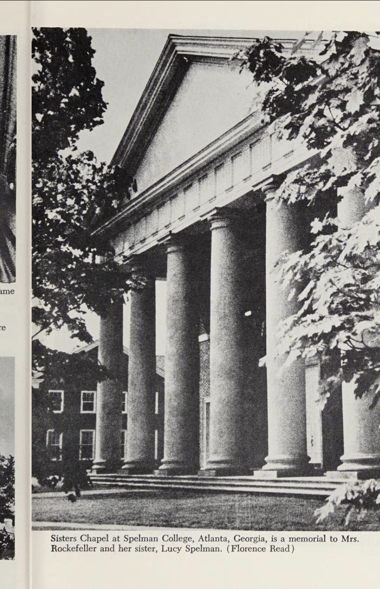

| SE Fp

<!-- issues: low_ocr_confidence:35.16, image_text_overlap:0.163 -->

<!-- page_id: 0135-left | printed: none | viewer_token: none | viewer_sequence: 272/340 -->
## Unnumbered Page

at

> cr?

> sa '

> \

eS ‘ |

Two John D. Rockefellers, on Fifth Avenue after Sunday church service. (Plain Dealer )

<!-- issues: low_ocr_confidence:44.77 -->

<!-- page_id: 0135-right | printed: none | viewer_token: none | viewer_sequence: 272/340 -->
## Unnumbered Page

> Ss

> Mr. and Mrs. George De Cuevas and family. Mrs. De Cuevas, daughter of Bessie Rockefeller (Mrs. Charles A. Strong), was the chief individual beneficiary bs mentioned in Rockefeller’s will, and so singled out since her mother was not living when he had made large gifts to his other children. (Plain Dealer)

New York became Rockefeller’s legal residence after he and his family took possession of this house at 4 west 54th Street.

> sao reat

> es | :

<!-- issues: low_ocr_confidence:52.87 -->

<!-- page_id: 0136-left | printed: none | viewer_token: none | viewer_sequence: 274/340 -->
## Unnumbered Page

### 7

> e

PRS et =

> L=

pos S

> wes ws Weary INOS ANS PA Ve.

> aX _ coun z=

On his ninetieth birthday Rockefeller cut a candle-bedecked birthday cake. (The Western Reserve Historical Society)

<!-- issues: low_ocr_confidence:34.71, missing_printed_page_number -->

<!-- page_id: 0136-right | printed: 211 | viewer_token: none | viewer_sequence: 274/340 -->
## Page 211

ful grounds as happy as their parents had been, swimming in the lake, bicycling, and riding horseback over paths and roadways laid out by their grandfather in the early days of Forest Hill.

### 30. Forest Hill Nostalgia

Rockefeller, rapidly becoming a hazy legend in Cleveland where his wealth was rooted, comes alive in the reminiscences of a number of the city’s prominent men who as boys worked for him at Forest Hill. Theirs was the uninhibited closeup view of critical youth, a behind-the-scenes look at a world figure off guard, pursuing dayby-day routine. From their composite recollections there is flashed on the screen of history a vivid picture of the Oil King at home—a picture of him seldom seen. During the summer months the permanent staff at the Cleveland estate was augmented, bringing the count to fifty or more. With his interest in youth and in education, Rockefeller preferred that the extras were high school and college students who used the vacation to earn needed money for school expenses. Cyrus Eaton, prominent Cleveland financier, internationally known for his connections with Russian political leaders and his efforts to bring about world peace, was a Forest Hill summer employee when he was seventeen. In 1901 his uncle, Charles Aubrey Eaton, like him a Canadian, was called to the “Rockefeller Church” on Euclid Avenue. The minister, his wife and children first made their home in the Euclid Hotel at Huron and Brownell, within easy walking distance of the church. Cyrus joined them shortly for the summer vacation. Minister and family, including Cyrus, were invited for dinner at Forest Hill. Rockefeller asked the boy what he was going to do during his stay and learned that he already had taken the job of night clerk at the hotel. Mrs. Rockefeller felt this “was not a proper position for a boy like you.” She queried her husband: “John, can’t

| Fe Fp

<!-- page_id: 0137-left | printed: 212 | viewer_token: 212 | viewer_sequence: 276/340 -->
## Page 212

you find a place for Cyrus right here this summer?” Her husbar thought he could. “Although I worried as to how the hotel manager would g along without me,” Mr. Eaton chuckled, “I went to work the ne day at the estate. I did everything from milking cows to helping | tree moving operations that were much in evidence then.” The Eatons soon were installed in a house on Lee Road, the proy erty adjoining Forest Hill and probably belonging to Rockefelle The role of young Cy became a double one: week days he was a employee while on Sundays he rode to church with the Rockefe lers. The two-seated conveyance with a top was unostentatiot but the horses were the finest anywhere. Coachman Blakemore s: on the high front seat with the footman, Tim Concannon, h brother-in-law beside him, “They were an impressive pair,” Eato recalled, picturing them in smart dark tan liveries. Toward the end of his first summer at Forest Hill, the boy w: looking forward to a great treat, a trip to the Pan-American Exp sition at Buffalo as guest of the Rockefellers. They expected to lea Cleveland in a private car on the Lake Shore & Michigan Souther Railroad. The day before this big event, Cyrus at work in flower bec around the house, was summoned by Rockefeller’s secretary, Mr S. Louise Patteson, who obviously was much excited. She preside over the private telegraph instrument installed in the office of tk Big House. Moments before, the clicking had carried tragic new “President McKinley has been shot at the fair!” she exclaime “Take this message out to Mr. Rockefeller on the golf links. Hurry “I jumped on a bicycle and rode as fast as I could,” the indu: trialist said. “Mr. Rockefeller took the slip of paper I handed hin read it without comment, and then said calmly, ‘Please ask Mr Patteson to cancel the arrangements for the private car and te Mrs. Rockefeller we will not be going to Buffalo tomorrow.’ Wit that he resumed his golf game. It was a typical performance. M Rockefeller never permitted himself to become agitated or wrougl up over anything.” One of the dividends accruing to the youthful Cyrus from h

<!-- page_id: 0137-right | printed: 213 | viewer_token: 212 | viewer_sequence: 276/340 -->
## Page 213

> “vacation” at Forest Hill was the opportunity to meet illustrious guests. One who came frequently for stays of a week or two was Dr. Harper. He made a lasting impression on the boy, as he did on everyone who ever saw him. At this time the attention of the world was on him as President of the University of Chicago, which had been reestablished only recently with the Rockefeller millions. As described by his admirer, Dr. Harper was a “short, stout man, who was a hearty eater, as his figure indicated. He had a large head and gazed at you through thick glasses. Warm and friendly, he was a person one could not forget. Mr. Rockefeller was very fond of him.” He recalled that at times the university president used to hold forth at great length on some erudite subject. To lighten his boredom on such occasions Rockefeller would repeat one of his jokes. “If I was within earshot,” he declared, “I was the butt of one Mr. Rockefeller had improvised from a currently popular ditty: She sighed Cy sighed They sighed Side by side By the river side.

At the conclusion of course we all laughed dutifully. “One subject Dr. Harper talked about, Russia, we listened to with great attention. He had been there in 1899-1900 and again in 1902.” Both times he made the trip with the wealthy Chicagoan, Charles R. Crane, an authority on the country. Through Crane’s many contacts, he was enabled to see the real Russia. Cyrus was fascinated with accounts of the people the two men had met—Emperor Nicholas, whom Harper described as gracious and cordial; eminent intellectuals like Tolstoy; skilled craftsmen, musicians, stars of opera and ballet. “When in Russia, Dr. Harper, as a good Baptist, made a practice of looking up members of this denomination.” He declared, the industrialist recounted, “that at that period Russia had more Baptists than any other country, save the United States.”

| ee Fp

<!-- issues: low_ocr_confidence:74.6 -->

<!-- page_id: 0138-left | printed: 214 | viewer_token: 214 | viewer_sequence: 278/340 -->
## Page 214

> “As head of the Standard Oil Company Mr. Rockefeller was world personality, and almost as much so as the good angel | Baptists. As a result of Dr. Harper’s meeting with these Baptist plus their knowledge of his close relationship with Rockefeller, de egations of these churchmen began coming to Cleveland to appe for funds for struggling churches in their homeland. “Mr. Rockefeller put up the visiting Russians at the Hollend« Hotel and saw to it that they were well provided for. I was ofte sent downtown with Uncle Charles to assist them, or to carry me sages to them from Mr. Rockefeller. They were a fine lot of peopl practically all of them aristocrats, many titled individuals amor them. I thoroughly enjoyed meeting them.” Dr. Harper usually was accompanied to Cleveland by his wif Ella, and their son Samuel, a boy a couple of years older the Cyrus. “We liked each other from the very first,” Eaton sai “My uncle often played golf with Mr. Rockefeller, but not D Harper—he didn’t enjoy exercise. However, Sam was enthusiast about the sport, and he and I took many a turn around the cour: when it was free. Sam and I developed a close friendship th: lasted until his premature death in 1942. “He shared his father’s enthusiasm for Russia. Eventually | made Russian literature and history his career. He became head « the Russian Department of the University of Chicago after h father’s death. His father died young—in 1906. For years Sam mac annual trips to Russia. He spent six months there and six at h post in Chicago. During part of this period I served on the Un versity of Chicago board of trustees. “Through Sam Harper and his father my interest in Russia w: kindled there at Forest Hill. It has continued throughout my lif and I am 87.” (The interview took place in 1970). He recently ha completed his twelfth trip to Moscow in pursuit of his continuin aim, improved Soviet-American relations. He admitted he woul like to visit Peking to help further Sino-American understandin The youth spent three summer vacations working at Forest Hi “By then,” he said, “I was planning to enter McMaster Universit and expected to get a part-time job there. Mr. Rockefeller su,

<!-- page_id: 0138-right | printed: 215 | viewer_token: 214 | viewer_sequence: 278/340 -->
## Page 215

gested in his quiet way that if I were interested he could arrange a position for me at 26 Broadway. I did not take up the offer. “I wonder,” he mused, “what my life would have been, had I done so. During his college days young Cyrus returned to Cleveland, but not to work at Forest Hill. He acted as substitute pastor for three months in 1906 at Lakewood Baptist Church. “In every generation on both sides of my family there had been at least one Baptist minister,” he continued. “I had occupied the pulpit at the Euclid Avenue Baptist Church when my uncle was away. While at the Lakewood church I had to make up my mind whether or not to enter Divinity School. I finally decided the ministry was not my calling.” Instead, he went into business in Cleveland. His friendship with Rockefeller continued. Invited for tea one afternoon, he found Charles Evans Hughes there as another guest. He was candidate for the governor of New York State opposing William Randolph Hearst, who was anathema to the Rockefellers. “I remember Mrs. Rockefeller saying very earnestly to Mr. Hughes, ‘Charles, I do hope you best that man Hearst!’ ” He spoke of the attacks on Rockefeller at the time by publications like Hearst’s. “I have heard Mr. Rockefeller say more than once he had no need to defend himself against such,” he said. “I learned a great deal through my privileged association with that man. He was kindness itself to me. “When I was a teen-age boy, and later as a young man starting on my way, I had the greatest admiration for him and I have never changed my mind,” the youthful appearing octogenarian concluded. oe 8 8 @

of Ss, ]al

1e of is le is i-

A retired Cleveland bank executive, Robert J. Izant, who was a vacation-time helper for several summers from 1906 on, talked about what Forest Hill had meant to him. “Lessons I learned there,” he said, “have stayed with me through life.” The “lesson of the rake” he learned the first day. He was assigned the job of hoeing and raking in the vegetable garden. The work day had begun at 6:30 a.m. At 5 o'clock, he dropped his rake and hurried home. Next morning when he went to the tool house to get

oe ll. ty g-

| es Fp

<!-- issues: low_ocr_confidence:67.13 -->

<!-- page_id: 0139-left | printed: 216 | viewer_token: 216 | viewer_sequence: 280/340 -->
## Page 216

it, it was missing. But, he said, “Morin, truck and flower gar boss, was there to tell me firmly that at Forest Hill when ‘you finished with tools, you put em back where they belong!’” “Rockefeller gave meticulous attention to the place, never m ing a detail in the smoothly operated enclave. Mr. Rockefeller \ particular—everything had to be done just so,” this former coll boy continued. “But he was kind and patient with us boys. He \ a man of few words, always soft spoken and deliberate. I ne heard him raise his voice.” Years later he realized that during the years when he had wor! on the estate storms were swirling around Rockefeller. But v the self-centered outlook of youth, the boy was unaware of any it. And looking back, he added, he could recall Mr. Rockefe only as placid and calm, never giving a hint of such a pile-up worries. This summer extra, after a bit, was given the responsibility taking outgoing mail to the Lake View postal substation and bri ing back the batch for the family and personnel of the estate. | this he had at his disposal a buckboard and a horse named H Head. He described how without warning one day High Head stumb and fell, bloodying a foreleg alarmingly. As the distraught | was trying desperately to get the animal to its feet, the dour E lish estate manager, Alfred Knapp, came up, With one look at catastrophe, he called a groom to take care of the horse, and the spot curtly discharged its rider. “Tt all happened a good many years ago, but I'll never forget My $55 a month salary was gone and I needed all the mone could get if I were to go on to college in the fall. I held a posit of trust and I had lost it. I was in disgrace. I walked slowly b to the house, a long trek, to turn in my mail bag and money por at the office on the second floor. As I went up the stairs I co hear the clicking of the telegraph and knew that Mrs. Tuttle, current operator of the instrument, was at her post in the room. “There sat Mr. Rockefeller reading the morning newspaper. greeted me pleasantly, then told me Knapp had phoned him ab

<!-- page_id: 0139-right | printed: 217 | viewer_token: 216 | viewer_sequence: 280/340 -->
## Page 217

my trouble. ‘But you are not dismissed,’ he said emphatically. “High Head, I am sure, will recover. I am more concerned about you. I have arranged with Edward Blakemore (head coachman and a very important individual) to give you driving lessons. He is waiting for you. You will start right away. Before you go, though, I want to say something: you have to make a horse know you are boss—not he. I learned that from my father and later when I used to ride from our Euclid Avenue home to the office on horseback.’” “And so,” continued High Head’s former driver, “for the next two weeks Blakemore and I rode over the roads of Forest Hill, an hour a day, eighteen miles of them and behind the best horses in the USA.” After this drill he was promoted to official messenger and errand boy. He was given another horse and a buckboard for morning trips, a coach horse and curtained cart for afternoons. Missions took him to Chandler & Rudd Company for groceries and meat at their store on Euclid at East 55th Street (Cleveland streets were numbered now). There Vincent Meakin, in charge of the store, personally handled the Rockefeller orders. The messenger was often sent with notes or supplies to the Euclid Avenue house, which was well cared for by a resident housekeeper, Miss Antoinette Axe. Later she married Walter E. Coffin, mechanical expert with the National Malleable & Steel Casting Company. She traveled with him on business throughout the world, and wrote to Rockefeller about her experiences. Mr. Izant described the trips he made to downtown department stores where he collected hats and other wearing apparel ordered by Mrs. Rockefeller or her sister. (The next day to return those they did not want!) He picked up jewelry at Cowell & Hubbard’s in the Garfield Building at East 6th Street. Now and then there was a long jaunt to West 25th Street with a pair of Rockefeller’s shoes for Zwerlein Shoe Repair Shop. He was sent frequently to Burrows Brothers Company to make purchases or to leave papers for the manager, Wallace Cathcart, who also at this time was president of The Western Reserve Historical Society. “On return from one of these errands, I drove past Mr. Rocke-

ked vith y of ller » of

ng- For igh

led boy ngthe

t it. yl ion ack ach uld the

a

<!-- issues: low_ocr_confidence:74.06 -->

<!-- page_id: 0140-left | printed: 218 | viewer_token: 218 | viewer_sequence: 282/340 -->
## Page 218

feller who was sitting on a bench near the Lodge at the gate,” | former banker related. “He hailed me down saying, ‘When was | last time the axles of that cart were greased?’ You never made answers to Mr. Rockefeller, so I told the truth: ‘I don’t know, replied. ‘Well,’ he began mildly, ‘I think they had better be greas soon. I heard a squeak as you came up the road.’ I saw about gre ing them that very afternoon for I knew he would be sure to che those wheels.” He went on: “There often were newspaper reporters loiteri outside the gates that Gatekeeper Pat Lynch kept padlocked. Ma times as I drove through onto Euclid Avenue they would stop | and besiege me with questions—what was going on at the | House, were there any visitors, and the like. I knew Mr. Roc! feller always tried to dodge reporters and would not allow one the grounds. I made it a rule to say I didn’t know anything, thou maybe I had just passed John D., Jr. by then as important a p sonality as his father, bicycling toward the lake. Or I might ha seen Frederick T, Gates, so much in the news because of the Roc! feller millions he was dispensing. “I could have given them a real story one time. The whole ple at that very moment was under heavy guard because of a kidni ping scare over a small grandson, Fritz Prentice, who was visiti there with his French governess. I had just come from patrol dt where the little boy was playing. “One reporter whom I used to meet regularly at the gate tri to make friends with me. He would climb over the wheels of 1 cart to have a téte-d-téte on the seat beside me. Several times might have had a wonderful scoop, if he had lifted the lid of 1 dashboard box. Inside he would have seen a package that clea contained Mr. Rockefeller’s toupee. I frequently took it to a ha dresser for renovation. “I was weeding in the verbena bed one day when George, t butler, came to tell me Mrs. Rockefeller would like to see me in t dining room. She and Miss Spelman were finishing luncheon knew them both well and was fond of them. Mrs. Rockefel wanted a path made through the beech woods. ‘When we fin

<!-- page_id: 0140-right | printed: 219 | viewer_token: 218 | viewer_sequence: 282/340 -->
## Page 219

our round of golf (it was seldom more than four holes), we like to go to the boathouse to rest on the veranda. It would be much shorter to return home if we could come like this’: She picked up an unused fork and with the back of it made a diagram on the tablecloth.” She explained that she wanted him to start the work that afternoon, he said. He rounded up three workmen and at once began clearing out underbrush, cutting and graveling the path. They were getting on nicely when the stern Knapp drew up in his cart and angrily demanded to know what was going on. “I see,” he retorted coldly, adding, “but don’t let this happen again without seeing me first.” By noon next day the path was completed and Mrs. Rockefeller sent for the boy to thank him. “You hear Mr. Rockefeller disapproved of the theater,” the former Forest Hill messenger continued. “That may be, but one sum- I saw him make a wonderful amphitheater with a sloping lawn arranged for the audience. Every day bicycling home from golf he stopped and handed the wheel to Hafner, his valet. Then the Master would pull a strip of white cloth from his pocket and ask a workman nearby to tie it around a certain tree. This continued several days. “After a few weeks trees so marked were felled. Stumps were done away with and the ground smoothed and sodded. A large and perfect natural stage emerged with trees in the background forming a proscenium arch. Plays were given here by the YMCA and other groups.” In addition to the large lake, enjoyed so much by all the Rockefellers, Mr. Izant explained there was another smaller one, not much more than a pond in the upper, farm part of the estate. One day he was standing nearby when Mr. Rockefeller asked Knapp “to run a transit line and tell me what the difference is in the level of the two lakes. Sometime we may find it necessary to drain the upper lake into the lower.” Rockefeller then added slowly: “My own calculation would make its drop of forty-two feet.” In a couple of days, knowing the engineering work was completed, Mr. Izant asked Knapp what he had found. He replied: “Pretty good at mental

the the

up y sed

ing ny me Big ke-

on gh er-

1png ity

ay: rly Lir-

the the

ler ish

> ee | Fp

<!-- issues: low_ocr_confidence:77.29 -->

<!-- page_id: 0141-left | printed: 220 | viewer_token: 220 | viewer_sequence: 284/340 -->
## Page 220

arithmetic, Mr. Rockefeller! The difference I figured was for seven and a half feet. The messenger recounted his goodbye from the Squire at For Hill at one summer’s end. Shaking hands warmly he left in | young man’s hand a small envelope: “I am giving you my rules golf so you can study them this winter,” Rockefeller said witk twinkle. Safely out of sight, the boy opened the envelope. It tained a one hundred dollar bill. “First I had ever seen,” he sa “And this was repeated the next year, my last at Forest Hill. Mi you, this was when Mr. Rockefeller was being ridiculed as a stin; rich man who gave away only buffalo nickles and shiny dimes.” e 8 8 6

Another member of the summer crew was Samuel Augustus F ler, now a retired executive of Jones & Laughlin Steel Corporati: He lived on Holyoke Street not far from Forest Hill. City-br though he was, his chores for a time were on the farm. One very | day after he and a fellow worker had been pitching hay, they st denly decided to cool off and, fully clothed, dove into the lake a swim. After the refreshing plunge they hid in a sunny spot behi bushes to dry off. At that moment Rockefeller drove by. “Certair he had seen us,” Mr. Fuller recounted. “Those sharp eyes of | took in everything. But he went on and said nothing.” They kn they would have fared badly if Knapp or his helper had come up them. “Mr. Rockefeller might be a taskmaster,” his former summ helper added, “yet, he liked boys and could overlook an innoce prank.” “He was always trying to improve his game,” said Mr. Fuller, 1 calling how one of his jobs for several days was to follow him fre tee to tee and each time Rockefeller started his drive, the boy w ordered to cry loudly: “Keep your head down! Head down!” Despite what the automobile was to mean to the Standard’s bu ness, horse-lover Rockefeller accepted the car age reluctant However, by the time young Fuller worked on the Hill, Mr. Rock feller had a Locomobile and later acquired a Simplex. A pet story which, in his usual habit, Rockefeller told over a1 over, concerned one of these cars. He was driving along Eucl o0on

<!-- page_id: 0141-right | printed: 221 | viewer_token: 220 | viewer_sequence: 284/340 -->
## Page 221

Avenue, enveloped in a linen duster and sitting in the front seat beside his chauffeur. As the big car was chugging on its way, a wagon approached, pulled by a pair of handsome bays that began to rear and prance in terror at the oncoming monster. The drayman tugged manfully at his reins while his wife sitting behind him, screamed advice and gesticulated frantically. Admiring the fine team and sympathizing with the driver, Rockefeller had his chauffeur stop the automobile, go to the man and offer to lead his horses past the car. But the wagoner had another notion. He shouted over to Rockefeller: “If you’d take care of me old woman here in the back seat, I can take care of me horses!” es 2 @ 8

est the for

onid. ind

Having a Baptist minister for a father was a great help in getting coveted summer employment at Forest Hill, as Charles and Clifford Stilwell discovered. The Rev. H. F. Stilwell, their father and a good friend of Rockefeller, was the pastor of the First Baptist Church. The boys working in small gangs under a foreman, trimmed trees to keep the vistas open. They absorbed a good deal about tree management. Some of the time they caddied for Rockefeller, both often pressed into service as a team. Rockefeller bicycled from the house to and over the golf course. At the same time as he often explained, he wanted to save his strength for the game, and so had his caddie, frequently one of the Stilwells, push the bicycle. The other brother was likely to come along holding a big black umbrella over Rockefeller if the sun was hot, or if a shower came up. “It took a good deal to keep him from golf,” Mr. Charles Stilwell said in recalling those days. “We worked a ten and a half hour day with a half hour off for lunch which we brought from home. Our pay was twelve and a half cents an hour, which seemed all right—it was, too, for our age in those days. It was a long day, but there was a fine crowd of young fellows working there, too. We knew them all.”

on. ed 10t idfor nd ily his

sily. ce-

nd. lid

> ae es

| es Fp

<!-- issues: low_ocr_confidence:72.68 -->

<!-- page_id: 0142-left | printed: 222 | viewer_token: 222 | viewer_sequence: 286/340 -->
## Page 222

To the Rockefeller montage portrait etched in memories of te age boys who worked for him at Forest Hill, must be adde« sketch of the famous man as the friend of a little girl. She was Elizabeth Rhodes, now Mrs. Kenneth Haber of Cle land, daughter of Dr. E. B. Rhodes, a previously mentioned g ing crony of Rockefeller and a near neighbor in East Clevela Mrs. Haber has recorded her childhood impressions in an unp lished manuscript, “Recollections of My Friend Mr. Rockefell from which with her permission the following excerpts are tak “Our friendship began when I was about three. . . . The freed of Forest Hill was at all times my privilege. It was a child’s pa dise. . . . Pat and Ed (Lynch), those gnarled Irish custodians the Euclid Avenue gate, and their sister Sarah were my staunch friends. While other children could get into the estate only by s! ping over or under fences, I skipped merrily through the fr gate. ...” On the Rockefellers’ arrival for the summer, word at once v sent to her parents asking Dr. Rhodes to come the next morni for golf. The little girl went along. Rockefeller’s golf outfit, ; remembered, consisted of white trousers, a green grass helmet ai on cold days, a paper vest laced down the front and worn unc his coat. Before driving, he always chalked his club, and he wor tell her: “Lizzie, when you play golf be sure to chalk your driver for th you can tell just how you hit the ball!” At a regular time during the morning “a boy arrived from | house bringing bottles of barley water, ice water and milk . guests could have their choice, but Mr. Rockefeller always had h barley water and half milk, which he mixed himself.” The little § usually managed to sit beside him for the repast and was oft teased about her love of milk. “Lizzie,” he would say, “don’t y think a thin old man like me needs that milk more than a fat lit girl like you?” Her friend often hummed hymns and popular airs while playi golf. A favorite hymn was “Jesus Wants Me for a Sunbeam,” whi “we often sang together.”

<!-- page_id: 0142-right | printed: 223 | viewer_token: 222 | viewer_sequence: 286/340 -->
## Page 223

One day Rockefeller lost a ball. When the game was over the superintendent of the estate was summoned and told to have every man on the place look for it. “Next morning the ball was brought to him before breakfast.” One summer he had a small driver made especially for Lizzie, just right for her height, perfect as to size and proportion. “He presented it to me with great ceremony and from then on I was often the fifth wheel of the foursome. After the men had driven off, I was allowed to drive with a ball Mr. Rockefeller selected for me from the (caddie’s) willow basket.” One moming at the beginning of World War I the golf game was held up by reporters who insisted on seeing Rockefeller. As Lizzie learned later, they wanted information about a foreign loan in which it was rumored the Standard Oil Company was involved. After the newsmen had left, Rockefeller sat down beside his little friend who had been waiting for him. She asked what he had been saying to those men. “He patted my hand and said . . . ‘Oh, I just told them a little verse that goes like this:

veolfnd. uber,”

raof est ipont

vas ing she nd, der ald

> A wise old owl lived in an oak, The more he saw the less he spoke, The less he spoke, the more he heard, Why aren't we all like that old bird?

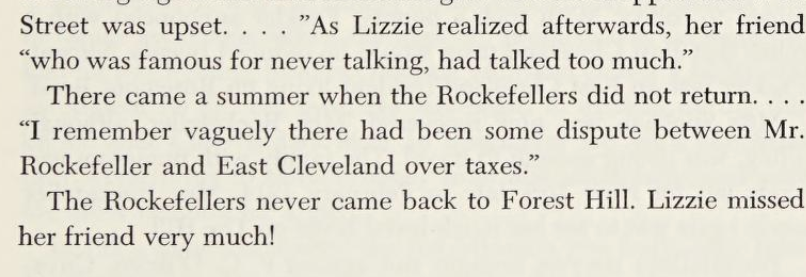

<!-- page_id: 0143-left | printed: 224 | viewer_token: 224 | viewer_sequence: 288/340 -->
## Page 224

### 31. Finale

It was the Rockefellers’ custom to leave Forest Hill in the fall fc their New York home. However, as preparations for departure were under way in October 1913, Miss Spelman was taken sick Before she had recovered fully, Mrs. Rockefeller became serious] ill and rapidly grew worse. Plans for travel had to be cancelled. Rockefeller remained at th Homestead until his wife could be moved. By this time it was lat February. He had stayed beyond what was called tax listing day February first, according to Ohio law. Cuyahoga County Tax Commissioners John D. Fackler and Wi liam Agnew were quick to act. They notified Rockefeller that h must file an intangible personal property tax return. He ignored th matter, holding he was not liable for such an Ohio tax, since lega’ ly he was a citizen of New York State and had been for nearl twenty years. He paid this tax in that state. Nevertheless, the commissioners assessed him $1,500,000 on a estimated evaluation of $311,000,000 on all his intangible propert not only in Cleveland but in New York as well. They warned hir there would be a delinquency penalty of fifty percent. In othe words, delay in payment would bring the tax to $2,250,000. Rockefeller refused to pay and the commissioners were dete mined to collect. With such a bounty, Fackler announced with relish that East Cleveland taxes would be reduced twenty percen Fackler was an East Cleveland resident living on Rosemont Roac Miss Spelman was now recovered. Mrs. Rockefeller, althoug ailing, was strong enough to travel. The family with numerous ser vants left for New York late in February 1914. Mrs. Rockefelle never again was to see her much-loved home on The Hill. Rockefeller’s lawyers brought suit against P. C. O’Brien, Cuyz hoga County Treasurer, enjoining him from leveling or collectin the tax on the grounds that John D. was not legally an Ohio resi

<!-- page_id: 0143-right | printed: 225 | viewer_token: 224 | viewer_sequence: 288/340 -->
## Page 225

dent. Kline was his chief counsel, Cyrus Locher the county’s prose. cuting attorney. Fackler and Agnew made an issue of a large painting, “The Dis puted Boundary,” by Erskine Nicol. Rockefeller had lent it in No. vember 1913 to the Art Loan Exposition arranged by prominent Cleveland art lovers in the Kinney and Levan Building. The well: attended show, it developed, stimulated interest in establishing the long hoped for Cleveland Art Museum. The painting had been insured by Rockefeller’s secretary, Sims for $75,000 for the show and at close of the exhibit he shipped it tc Pocantico. In court, Fackler pounced on the high insurance as indicating a valuable work of art, which as such was taxable prop: erty. Rockefeller’s lawyers claimed it had been insured beyond it worth; Nicol’s rating as an artist had dropped of late. Affidavits tc prove the point were produced from a New York dealer who statec the painting’s value was under $3,000. In January 1914, trustees of three separate legacies left to found an art museum in Cleveland reached an agreement clearing the way for such an institution. Work on the project went forward Shortly, it was found that one sizeable bequest, funds left by H. B. Hurlbut, had shrunken in the years, thus curtailing plans fot the museum. At this juncture Rockefeller was appealed to to make up the deficit, but he declined. His reason as generally stated was that he felt the proposed building was larger than Cleveland needed. More likely it was the timing of the appeal that influenced him to refuse assistance. When the museum problem was presented to him he was fighting local tax officials’ efforts to collect a $2,500,000 assessment he did not owe. He was heard to exclaim during this period that Clevelanders were an ungrateful lot; with one hand they were trying to extract money from him unlawfully, and with the other begging for a gift. In 1925, some years after the Art Museum was built, Mrs. John D. Rockefeller, Jr., who was especially fond of the “Disputed Boundary,” suggested donating it to the Cleveland institution. Her father-in-law was willing although he feared it “might be too trivial

=a. mhmmmrrrrrr———C(‘“‘COCéRRS

<!-- issues: low_ocr_confidence:48.35 -->

<!-- page_id: 0144-left | printed: 226 | viewer_token: 226 | viewer_sequence: 290/340 -->
## Page 226

a gift.” He was correct for the much-traveled painting was summa ily rejected and shipped back once more to Pocantico. The follov ing year the Rockefellers sold it at auction in New York for $1,80 Later, the Cleveland Museum of Art received some highly regarde gifts from John D., Jr., notably a large oil canvas, Lady Louis Manners, Countess of Dysart, by Sir Thomas Lawrence. John I Rockefeller, 3rd also has been a donor to the Museum. Spring in 1914 invaded Forest Hill with its usual loveliness, tran forming the secluded acres into a magic realm. But for the first tim since they had taken over the estate more than thirty-five years b fore, the Rockefellers did not come to enjoy it. They went instea to Pocantico and stayed there for the summer. There on September 8th they celebrated their golden weddin anniversary. The following day was Mrs. Rockefeller’s seventy fifth birthday. A gala dinner was staged, the guests being the children, grandchildren, and a few close friends. Rockefell: brought an orchestra from New York to play the “bride’s” favorit music. It was a happy occasion. “Cettie is the only sweetheart I'v ever had,” Rockefeller declared. “I’m thankful she’s still with me The Rockefellers remained at Pocantico through the winter « 1914-1915. Mrs. Rockefeller was feeling stronger and spoke ofte and longingly of returning to Forest Hill. No definite plans, hov ever, were possible due to the threat of process servers and lik legal tangles in connection with the tax dispute. Yet the rolling acres held sway over-the affections of both. The had not given up the idea of resuming their life there. This seer evident from a letter Rockefeller sent early in 1915 to Mrs. Mar Springer who lived near Forest Hill on Mt. Union Street. His wii wanted “to come home,” he wrote. She would feel better, he wé sure at Forest Hill. “I am coming to take you driving ... when w return to our dear old home,” he promised this neighbor. Mrs. Rockefeller’s health had improved sufficiently by Marc 1915 to permit her husband with John D., Jr., and wife to take short trip South. They had been away only a few days and were : Ormond, Florida, when on March 12th word came of Mrs. Rock feller’s death from a heart attack. Simple funeral services were hel March 15th at Pocantico.

<!-- page_id: 0144-right | printed: 227 | viewer_token: 226 | viewer_sequence: 290/340 -->
## Page 227

Ohio’s governor, Democrat James M. Cox, had endorsed the tax assessment against Rockefeller, who faced a subpoena and other harassments if he stepped foot in the state. It was, therefore, not safe for him to try to bring his wife’s body to Cleveland for burial. She was given a temporary resting place in the Archbold mausoleum in Sleepy Hollow Cemetery at Tarrytown. World War I was escalating in Europe. Life in the United States, not yet involved, was proceeding more or less as usual. Cleveland newspapers printed news of Rockefeller’s tax fight side by side with reports of bitter fighting at Ypres. At the first hearing of the tax suit, the decision was in Rockefeller’s favor. Fackler and Agnew appealed. The extended litigation meant further delay in moving Mrs. Rockefeller’s body from Tarrytown to Cleveland. At this juncture it appears that her family, particularly John D., Jr., advocated selection of another grave site, presumably one outside of Ohio. Her husband, however, felt otherwise as is shown by the following letter dated June 15, 1915: Dear Son: Much as I regret under all the circumstances, my wish would be to continue Lake View Cemetery as the burial place for Mother and me. gta) lee ye nes

John D. Rockefeller

The tax case reached the United States District Court, presided over by the respected Judge John H. Clarke, former Cleveland attorney. He granted the plea of the Standard Oil head to enjoin Cuyahoga County from collecting the tax, rendering the opinion that Rockefeller was not a citizen of Ohio, but had been detained in the State in the winter of 1913-1914 by his wife’s illness. Further, in handing down his decision, the jurist added that he was aware there might be criticism of his ruling. Nevertheless, Clarke said, it is as incumbent on the judiciary to protect the rights of the rich as of the poor. It was at last possible to bring Cettie “home.” On August 10th, 1915, five months after her death, she was buried in Lake View Cemetery next to Eliza Rockefeller’s grave with one space left between them. The graves of Mrs. Rockefeller’s parents were in the next lot.

| es Fp

<!-- issues: low_ocr_confidence:79.22 -->

<!-- page_id: 0145-left | printed: 228 | viewer_token: 228 | viewer_sequence: 292/340 -->
## Page 228

There Lucy would be buried five years later. Due to her siste’ health “Aunt Lute” in recent years had assumed some of the dome tic responsibility at Pocantico. Soon after Mrs. Rockefeller’s dea Mrs. R. A. Evans came from Strongsville to take charge ther She was one of the relatives on Rockefeller’s father’s side, and Jol D., with his strong sense of family, had kept in touch with the kinfolk. The capable Mrs. Evans proved to have been a splend choice and was liked by the entire family. The 1915 elections gave Ohio a new governor, Frank B. Will a Republican. He was able to dismiss the tax commissioners w1 had so badgered Rockefeller. At the same time all the State’s clain against him were formally set aside by Willis. But the gestur though appreciated, had come too late. Rockefeller no longer spent his summers at Forest Hill, retur ing for only infrequent and brief stays. The house and groun were cared for by a skeleton staff. There was no summertime cre of lighthearted, earnest boys at work on the rolling acres. Pat a1 Sarah (Ed had died) lived on at the Lodge, faithful guardians of changed domain. Occasionally some of Rockefeller’s friends can to play golf. But most of the time Forest Hill was a deserted, lone place. The Homestead and its setting were clearly not the same John D. without Laura. Yet her husband maintained their other re idences after her passing, actually making additions and improv ments in some. On the Cleveland estate, acquired in his early yea he had lavished special attention, and he, as well as Mrs. Rockef« ler, had been deeply attached to the sweep of land so favored | nature. Would he have abandoned Forest Hill had he not been co fronted with the attempted tax grab and the resulting intolerak circumstance at his wife’s death? The conclusion seems inescapab that these harassing episodes turned John D. Rockefeller—and ps haps even more so his son—from Cleveland. Late one cold December night in 1917 fire engulfed the Hom stead. The enormous wooden structure (there were four floo1 with its big rooms and long flights of open stair wells was a tind

<!-- page_id: 0145-right | printed: 229 | viewer_token: 228 | viewer_sequence: 292/340 -->
## Page 229

box. The flames leaped from floor to floor and out the roof, crackling and snapping and throwing a red glare over nearby homes. Little Lizzie Rhodes was awakened to find her bedroom filled with a queer dancing light. Her father dashed into his clothes and rushed off to the Hill. This time Lizzie was not allowed to go along. Dr. Rhodes joined a crowd of neighbors huddled on the lawn. Led by Pat with tears streaming down his face, efforts were made to rescue some of the furnishings like the grand piano on which John and Laura had played duets. But nothing was saved. Even the firemen were helpless. The cause of the conflagration was never determined. With the charred heap on the high slope, there was much speculation about the future of Forest Hill. As we have seen, the hope of its becoming an expanded campus for Western Reserve University was presented by university officials in 1922 to the Rockefellers, father and son, and rejected by them. Soon word got about that Rockefeller had signed over the estate to John D., Jr. Under the latter’s custody in the mid-1920s the storied realm was broken up. Portions provided sites for a new Huron Road Hospital, a junior high school, and a Masonic hall. A considerable section was laid out as an allotment. Handsome homes were built with full regard for the magnificent trees and scenic sites. Stores and business blocks took advantage of the Euclid Avenue frontage. A broad highway, Forest Hill Boulevard (often erroneously spelled Forest Hills), was cut through the estate, invading it where the big gate and Pat Lynch’s stone Lodge had stood. Management of the project was in the hands of a locally organized real estate company, the two Rockefellers staying in the background. In keeping with John D., Jr.’s, concern for preservation of natural beauty spots, he set aside 266 acres, a little less than a third of the whole, to become a public park. After the death of the senior Rockefeller, the son donated it in his memory to East Cleveland and Cleveland Heights within which municipalities the land lay. Speaking at the dedication ceremonies, John D., Jr., noted that this area to be called Forest Hill Park was the heart of the original

rs, e]by

n= dle le

\ers) ler

| ee Fp

<!-- issues: low_ocr_confidence:61.9 -->

<!-- page_id: 0146-left | printed: 230 | viewer_token: 230 | viewer_sequence: 294/340 -->
## Page 230

Forest Hill which he had “so greatly enjoyed in the happy days my youth.” A few years before Forest Hill's new era got under way, dras change also was in the air at another Rockefeller outpost, the E clid Avenue Baptist Church. For some time it appeared that larger church edifice was called for. Although the Rockefellers h cut most of their ties with Cleveland, John D., Sr., was steadf: in his allegiance to the church, and indeed was still honorary s perintendent of the Sunday School. He came forward with an of to pay the entire cost of a new building, its design to be select and approved by the congregation. However, it must be erected | the site of the present church, he stipulated. His proposal was turned down. Members voted in 1921 to car out their original idea of moving from the old southwest corner Euclid and East 18th Street directly across to the northwest corn: It was the beginning of the flourishing 1920s. Church leade caught up in the optimism of the times, envisioned a communit oriented, downtown religious center that would be large enou to meet needs of what they saw as a growing, prosperous Cle\ land. The site, purchased for $1,325,000, included commercial buil ings along the Euclid Avenue frontage. They would be replac by a modern block as a revenue-producing investment. The chur home itself—to cost an estimated $1,000,000—was located arou the corner on the East 18th Street part of the property. The ambitious concept, it was said, had been mastermind largely by the minister, the Rev. W. W. Bustard who left for out-of-town pastorate shortly after the scheme was launch Rockefeller, known frequently to disagree with Rev. Mr. Busta: made no effort to disguise his disapproval of the entire ventu Nonetheless, in 1924 ground was broken for the new church. Before long both he and his son were importuned to he Money-raising lagged despite heroic efforts of communicants. | buyer was forthcoming for the original church property, the s: of which was counted upon as substantial aid in financing the 1 dertaking. At this point John D., Jr., stepped in and took the « house of worship off members’ hands, paying them $500,000 in ca

<!-- page_id: 0146-right | printed: 231 | viewer_token: 230 | viewer_sequence: 294/340 -->
## Page 231

Complications and delays plagued the enterprise. Costs constant ly outran expectations. Requests for funds went regularly to Nev York. Records, while incomplete and confused, show that Rocke feller, Sr., answered the continuing SOS with remittances o $20,000, $30,000, $1,000, and $300. John D., Jr., came from Nev York on several occasions to “see how his money was being spent and no doubt also to check up on his building operations at Fores Hill. In the early spring of 1926, demolition got underway for the ven. erable “Rockefeller Church,” famed Cleveland landmark and re pository of so many memories for John D., Jr., and his father. By May of that year the first services were held in the chapel of the new building. Work in the main body of the church had been haltec by lack of money. With a $75,000 loan from a Cleveland bank, the banquet hall with accommodations for 1,000 was finished, and the first services of worship were held in this room. At a discouraging point in church finances, the Rev. John Snape, who had accepted the difficult charge, went to New York to consult with the Rockefellers. Shortly, he was able to announce that $250,000 would be forthcoming from Rockefeller, Sr., and his son, in part in memory of Laura Rockefeller. The money made possible the completion of both the main Sunday School room that was big enough to take care of 3,000, and the auditorium with a seating capacity of 2,300. Further, it was learned, there would be an additional $100,000 from Rockefeller if the congregation raised $250,000. The membership accepted this challenge, and eventually pledges for this amount were given. The new Euclid Avenue Baptist Church of polychrome terra cotta, with Biblical symbols carved on its facade and heroic figures flanking the high entrance arch, was a massive, handsome edifice. Mrs. Woodin could not have imagined her beloved Erie Street Church flowering into anything as elegant as this! Yet the structure, impressive though it appeared, never was finished, due to lack of funds. One example was the tower. Intended to soar aloft carrying five floors of Sunday School rooms topped by a carillon, its construction was halted when only partially completed.

ufer ed

TS, tygh yve-

lded ch nd

an ad. rd, re.

Ip. No ale

inaid sh.

| ee Fp

<!-- issues: low_ocr_confidence:79.77 -->

<!-- page_id: 0147-left | printed: 232 | viewer_token: 232 | viewer_sequence: 296/340 -->
## Page 232

The church had fallen victim to the depression. (John D., Jr.’ Forest Hill allotment was also affected, the fine houses there sellin; slowly.) As to the church, pledges were not fulfilled. Attendance: at services steadily dwindled as members joined the exodus t suburbs. Expected income from the adjoining businesses failed and finally the entire commercial property was lost. Foreclosur threatened the church building itself. Rockefeller in his young manhood had raised the money neede to meet a mortgage that was jeopardizing the humble Erie Stree Church. His son now came to the rescue, and saved its pretentiou successor with a payment of $250,000 to the mortgage holder, a insurance company. He then arranged matters so that the churcl henceforth was under the control of the Cleveland Baptist Associa tion. The ill-starred church home was a white elephant, seemingly, anc could not be managed. In 1961, after both Rockefellers were dead the elaborate building was torn down, the land, which is now | parking lot, becoming the property of the Cleveland Baptist Asso ciation. The few remaining members scattered to other churche: The Euclid Avenue Baptist Church disappeared. Its original site where the Rockefeller family worshipped, today is occupied by | well-designed building housing the Jewish Community Federation Er eee

The years were piling up for Rockefeller. He had outlived by de cades his four associates, young men who in the pioneer days o Cleveland had pooled their dreams and their hard work to stan by him as he brought into being the Standard Oil Company. Harkness, warmhearted and astute, whose money had quickene the enterprise into life, died in 1888, at age seventy. Flagler, secon: in command, who above all the others had won John D.’s affectio and respect, pushed his $40,000,000 railroad across Florida’s island to Key West in 1912 and died the next year. His passing was a blov to Rockefeller. William Rockefeller’s death in 1922 profoundly grieved John L for the brothers had been close since earliest childhood. After chilling canter in Central Park, William developed pneumonia t

<!-- page_id: 0147-right | printed: 233 | viewer_token: 232 | viewer_sequence: 296/340 -->
## Page 233

which he succumbed. The blustering Sam Andrews, the skilled re finer of the group, had died years before. Rockefeller’s rules for living paid off. His health remained excel lent, his mind as alert as ever. His eyesight and hearing were un impaired, and even his teeth were sound. As he grew older, he be came more affable—really very friendly—showing a sociability tha probably was inborn but had been submerged during his bus; early years. Contrary to persistent reports, he had no digestive curb: but ate abstemiously through choice. There were more guests ai the dinner table—Standard Oil executives, directors of his philan thropies, ministers, world figures, and the not-so-great, all of who he enjoyed. Rockefeller admired achievement, but rank or socia standing never made an impression on him. Belgium’s Cardinal Mercier, and, at another time, King Alber! came to thank him for contributions to Belgium Relief during World War I. Rockefeller had hoped America would stay out o} the conflict, feeling that Germany could be controlled by effective economic sanctions. But with the United States once in, he wholly backed the cause. In 1917 when he and Inglis came to Cleveland Rockefeller’s subscriptions to the Red Cross, YMCA, K of C, liberty loans and the like for that year equalled $70,000,000. At Forest Hill as his leisure increased, he frequently had had his chauffeur stop during afternoon automobile rides so that he might chat with farmers, tradesmen, and anyone who caught his atten. tion. He kept up the practice in drives about Pocantico and Ormond. He liked all kinds of people and often invited young folk to accompany him on his outings. News spread about his support of the war effort. The far-flung benefits of his heavily financed philanthropic programs were gaining attention. The public, heretofore unable to see anything but menacing evil in John D. Rockefeller, became equally extreme in praising him. While this swing of the opinion pendulum undoubtedly surprised him, it nonetheless must have been a pleasant change. John D. Rockefeller lived long enough to see in operation his wise and basic principles of giving: His gifts, rather than being turned

| es Fp

<!-- issues: low_ocr_confidence:63.76 -->

<!-- page_id: 0148-left | printed: 234 | viewer_token: 234 | viewer_sequence: 298/340 -->
## Page 234

to specific needs were allocations aimed at inspiring others | cooperate and carry on; there were no rigid provisions for futur utilization to be outmoded in a changed era; nothing was set up 1 perpetuity. “Perpetuity,” he once remarked dryly, “is a prett long time.” Years before, while his wife was still alive, Rockefeller ha settled large inheritances on his children, his son receiving the bul of the fortune left from the millions channeled into the phila thropic agencies. The real satisfaction of his last years was the complete unde standing between him and his son. John D., Jr., joined Gates in tt task of administering distribution of Rockefeller wealth, and | times represented his father in business matters. Rockefeller, S: keeping well informed, was content to look on, his pride never en¢ ing in “Mr. John’s” management of family obligations. With lively interest, he followed events of his world and ; ninety-six could write clear headed letters of advice on investment But he was frail. He took short walks for exercise and went f only brief automobile rides. Gradually he grew weaker, relying good deal on a wheelchair and requiring constant attendance. At 4 o’clock Sunday morning, May 23, 1937, John D. Rockefell died at his Florida home. Funeral services were held at Pocantic with the renowned Baptist and family friend, Dr. Harry Emersc Fosdick, delivering a brief and moving eulogy. While the funer was in progress, the beautiful carillon of his Riverside Church New York played “Lead Kindly Light.” In tribute to Rockefelle as the service began, work ceased for five minutes in every sho every plant and office of the Standard Oil Company in Ameri and in those abroad. In Cleveland where the company started, it was indeed an ir pressive silence; the Standard Oil Trust that had been dissolve by court decree thirty years before was revived and again in opé« ation during those five minutes. His industrial empire still stoo On May 27th his body was brought to Cleveland where he hi begun his venture. In the accompanying party were Mr. and Mi (Alta) Prentice and children; Mr. and Mrs. John D. Rockefell:

<!-- page_id: 0148-right | printed: 235 | viewer_token: 234 | viewer_sequence: 298/340 -->
## Page 235

Jr., their five sons and son-in-law, and the Rey. Willard Richard son, a Brown University classmate of John D., Jr., and a Baptis minister. They traveled by private car to the New York Central’ East Cleveland station. Harold McCormick, the former husbanc of Edith Rockefeller, came from Chicago. The entourage was joine: by Cleveland relatives and close friends, among them Frank Rocke feller's daughters, Mrs. Walter S. Bowler, Mrs. William F. Nash and Miss Alice Rockefeller; Frank H. Rudd and Mrs. Edward A Roberts, the children of William and Mary Ann Rudd; the Brook Emenys—Mrs. Emeny (Winifred Rockefeller), Percy’s daughterand Mr. and Mrs. Harry D. Sims. The motor cavalcade proceeded east along Euclid Avenue t« Forest Hill Boulevard, following it past the lake and the forme golf links to Lake View Cemetery, via Lee and Mayfield Roads Burial was at the foot of the towering Rockefeller shaft in the space the oil magnate had reserved for himself between his wife and hi: mother. The brief graveside services were conducted by the Rev Mr. Richardson, and by Rockefeller’s friend, Dr. Dore Sharpe, ex. ecutive director of the Cleveland Baptist Association. John D. was the last of his father’s family. His sisters Lucy anc Mary Ann were lying nearby in this plot. Frank was also interred in this cemetery—but not here. William rested in a mausoleum in Sleepy Hollow Cemetery. Where their father’s grave was, no one knew. A roll call among the headstones and monuments in Lake View would have alerted a host of those John D. had known best, friends and enemies alike. Here was his first partner, Maurice Clark; Truman P. Handy, from whom he had obtained his first loan, the $2,000 seed money of his career; Dan P. Eells; Oliver H. Payne; Amasa Stone, at peace at last; Harkness, with his wife Anna who had survived him many years; the faithful Ambrose McGregor, and Mark Hanna, Mrs. Backus, William Scofield and Jim Corrigan, too. Dr. Biggar and Levi Scofield were together again, and here, also, was Sam Andrews. Henry Chisholm, Rockefeller’s friend since the days of the Erie Street Church, was memorialized by a life size statue near the entrance erected by his workers in the rolling mills.

oy Pp; ca

oId. ad

se rrr—(———C (OS

<!-- issues: low_ocr_confidence:57.41 -->

<!-- page_id: 0149-left | printed: 236 | viewer_token: 236 | viewer_sequence: 300/340 -->
## Page 236

When death came, Rockefeller was within two months of h ninety-eighth birthday. He had not realized his goal of reachir his one-hundredth. It was one objective in his carefully planne life he did not achieve. Two children survived him, John D., Jr., and Alta. The latter husband, Parmalee Prentice, was a brilliant corporation lawyer | New York. Later he turned to scientific agriculture, making h farm near Williamstown, Massachusetts, renowned for his exper ments. Bessie, the Rockefellers’ first born, had died in 1906. Edith died 1932, having presided over the magnificent McCormick mansic in Chicago. She also had spent considerable time abroad. One her major interests was the teachings of Carl Jung who was a clo friend. Rockefeller had heartily concurred with his contemporary, A) drew Carnegie, who declared that “the man who dies rich di disgraced.” Nonetheless, when the oilman’s will was probated was clear that he had not died poor. Despite his efforts otherwis he left an estate that came to $26,410,837. Of this, $16,630,000 w: absorbed by state and federal taxes. Chief heir of the residue was his granddaughter, Margar Strong De Cuevas. She was the daughter of Bessie, who had die before Rockefeller made his distributions to his children. As a chil Margaret was often with her grandparents after her mother’s dea’ and made long visits at Forest Hill. She married George De Cueva a Chilean, scion of a titled Spanish family, and well-known for h ballet troupe which toured world capitals. _ Rockefeller had kept to his getting and giving convictions. / | his death the monies he had given away through the years totale $530,000,000. Of this $446,000,000 was allocated to the philanthro; ic agencies he had established. When John D., Jr. died in 1961 wh he had dispensed added up to $561,000,000. Of this $41,000,0( was transmitted to the family philanthropic boards, the remaind distributed to various other projects such as restoration of William burg, the Cathedral at Rheims, and like interests. Thus the Rockefeller philanthropic organizations received

<!-- page_id: 0149-right | printed: 237 | viewer_token: 236 | viewer_sequence: 300/340 -->
## Page 237

various times a combined $487,000,000 from father and son. Ye these agencies by 1970 had expended $1,500,000,000 in appropria tions throughout the world. In other words, the four philanthropi boards spent over a billion dollars more than they had received The endowments of Rockefeller Foundation and Rockefeller Uni versity still exceed the original grants. Accounting for the amazing showing is the fact that gifts fo the most part were made in stocks, largely those of Standard Oi companies, and were estimated in dollars at their market pric when donated. In the passing years, indicative of the nation’s con tinuous growth, the stocks and dividends have increased in worth This, plus astute management of capital structure, explains the fis cal magic that produced more income and permitted more expendi ture from the initial sum donated than the sum itself. Benefactions of John D. Rockefeller Sr. reached into eighty-eigh countries. His passing brought messages by the thousands fron far and near: condolence for his death and gratitude for this life Communications poured into New York headquarters of his phil. anthropic boards. The avalanche of letters, telegrams, and cable: came in every language, from important and humble recipient: engaged in every kind of work—from the internationally knowr head of a hospital in China, from a lone Austrian scientist pursuing individual research in vaccine. Against scorching criticism in his lifetime, whether from muck. rakers, courts or individuals, he had refused to defend himself He was content to await the appraisal of time. Now the verdict was coming in... .

et od d, a

<!-- page_id: 0150-left | printed: 238 | viewer_token: 238 | viewer_sequence: 302/340 -->
## Page 238

> Notes to the Text

### 1. Rockefeller Arrives in Cleveland

Mrs. Woodin: John D. Rockefeller, Random Reminiscences of Men and Even New York: Doubleday, Page and Company, 1909 (hereafter referred to Reminiscences), p. 48; Allan Nevins, John D. Rockefeller, the Heroic A of American Enterprise, New York: Charles Scribner’s Sons, 1940 (her after referred to as Rockefeller, the Heroic Age), Vol. I, pp. 79, 95 (£.n.). Erie Street: William Ganson Rose, Cleveland, the Making of a City, Clev land and New York: World Publishing Company, 1950, p. 569. Strongsville stay: John T. Flynn, God’s Gold, New York: Harcourt, Brace ai Company, 1932, p. 50. Central High School: Central High School, a pamphlet, Cleveland: 194 files of The Western Reserve Historical Society (hereafter referred to WHBRS); Nevins, Rockefeller, The Heroic Age, pp. 16-19. The Rockefellers’ route into Cleveland: map, Cuyahoga County, Philadelph: S. H. Matthews, 1848. Columbus Street Bridge: Elbert Jay Benton, Cultural Story of an Americ City, Cleveland, WHRS, 1944, Part II, p. 23; Rose, p. 147. The Flats: Rose, pp. 89, 231. Atwater Block: idem, p. 192. Weddell House: Edmund H. Chapman, Cleveland, Village to Metropol Cleveland: WRHS and the Press of Western Reserve University, 19¢ p. 69; Rose, p. 208. Cleveland streets: idem, p. 58; Rose, p. 261. Mary Ann Rockefeller Rudd: She was interviewed in Cleveland in 1917, a’ her comments recorded by W. O. Inglis, a New York newspaper man w was engaged by the Rockefeller family to write a biography of John Rockefeller. The work was completed but never published. The manuscr with related notes (hereafter referred to as Inglis papers) is in the Archiv Rockefeller Family and Associates (hereafter referred to as Rockefeller / chives), Rockefeller Plaza, New York where the author was privileged consult the collection. Information about Mrs. Woodin and her daught including their Baptist affiliation, was given to Inglis by Rockefeller. Ledger A: Examined in the Rockefeller Archives.

<!-- page_id: 0150-right | printed: 239 | viewer_token: 238 | viewer_sequence: 302/340 -->
## Page 239

> 2. City Sights for Country Boys

The 1850 decade: Rose, pp. 221-295; Cleveland, Columbus and Cincinnati Railroad, pp. 240 ff; lake ships, p. 169; Academy of Natural Science, p. 202; Cleveland Library Association, p. 211; the year 1853, pp. 263 ff; Kennedy, James Harrison, A History of the City of Cleveland, 1796-1896, Cleveland: The Imperial Press, 1896, pp. 317 ff., 352; Chapman, Chapter III, the text enhanced with photographs and maps, Elroy McKendree Avery, A History of Cleveland and Environs, Chicago: Lewis Publishing Company, 1918, Vol. I, pp. 222 ff; Eugene H. Roseboom, and Francis P. Weisenburger, A History of Ohio, Ohio Historical Society, Columbus, 1967, pp. 217-230; excerpts, both from editorial and advertisement columns in the 1853 local newspapers appearing in Annals of Cleveland, a Digest and Index of the Newspaper Record of Events and Opinions, 1818-, Cleveland: The Works Progress Administration, 1937—-June, 1939. Cleveland newspapers: Archer H. Shaw, The Plain Dealer, One Hundred Years in Cleveland, New York: Alfred A. Knopf, 1942, p. 78 (f.n.); Russell H. Davis, Memorable Negroes in Cleveland’s Past, WRHS, 1959, p. 18; Rose, p. 264. Cleveland University: Benton, Part II, p. 58, Part III, p. 32 ff.

ts, as ge re-

> 3. No One Ever Called Him Jack

Central High School: Andrews Freese, Early History of the Cleveland Public Schools, Cleveland: Robison, Savage and Company, 1876, pp. 32, 42; Benton, Part II, pp. 46-47; “Central High School Golden Jubilee,” 1846-1921, a program, May 21, 1921, WRHS files; Rose, pp. 253, 802-803; Flynn, p. 53. Rockefellers memories of Central High: Inglis papers. Rockefeller, high school boy: O. J. Hodge, Reminiscences, Cleveland: The Imperial Press, 1902, Vol. I pp. 195 ff. Hanna: Herbert D. Croly, Marcus Alonzo Hanna, New York: The Macmillan Company, 1912, pp. 36, 48 ff., 58, 120 ff., 267; Benton, Part III, p. 15. Note: Hanna attended the preparatory school at Hudson and not the college as generally stated. Laura and Lucy Spelman: Nevins, Rockefeller, the Heroic Age, Vol. I, pp. 85 ff; Lucy’s memories of her sister are from an interview in 1917 by Inglis. Data on the Sc(h)ofields was supplied in 1971 by Douglas Schofield, Jr., a Cleveland attorney and grandson of Levi T. Scofield. The Schofield Building, recently remodeled, is now known as Euclid-Ninth Tower.

xsd ipt GS, Arto

<!-- issues: missing_printed_page_number -->

<!-- page_id: 0151-left | printed: 240 | viewer_token: 240 | viewer_sequence: 304/340 -->
## Page 240

> 4. Not A Wasted Moment

College for John: Reminiscences, p. 35; Nevins, Rockefeller, the Heroic Vol. I, p. 94 (£m). Folsom’s: Rose, p. 269; numerous advertisements in the local newspa particularly the Leader, for the year 1855. After successive changes in « ership and name, such as Spencerian, Spencerian-Dyke, the institution is Dyke College, located in downtown Cleveland and offering a four course leading to the BS degree. Rockefeller’s fellow student: S$. W. Andrus, interviewed by Inglis in Cleve in 1917. A resident of Lake Avenue, Cleveland and agent for the Erie | road, he kept in touch with Rockefeller whom he admired greatly. Central High graduates in 1855: Rockefeller’s name is not among gradu listed by William J. Akers in Cleveland Schools in the Nineteenth Ceni Cleveland; W. M. Bagne, 1901, p. 76. No evidence of Rockefeller as a school graduate was found in Cleveland school records, kindly searchec the author by Miss Verda Evans, Directing Supervisor of English Lang Arts, Cleveland Board of Education. Parma residence: Brief reference in Heritage of Parma Heights, Parma: I tage of Parma Heights Committee, 1969, n.p. Data on the Rockefellers in Parma and their home there was supplied by Witt R. Cogswell of Euclid, Ohio, who grew up in that town. His infor tion was from his father, Edward T. Cogswell, who attended the dis school with Frank Rockefeller and knew the family. The author is alsc debted to Miss Dorothea Johnson, librarian at Cleveland Public Lib: native of Parma, where her father, Frank Johnson, served several term mayor.

> 5. Prelude to Cleveland

The New York State area where Rockefeller was born and spent his boy! before coming to Cleveland was canvassed successively by Inglis, F and Nevins. Findings of these writers, plus Rockefeller’s references to period, are the main basis for this chapter: the Inglis papers; Flynn, 6-49; Nevins, Rockefeller, the Heroic Age, Vol. I, pp. 3 ff; Reminiscer pp. 33-35, The long journey into Ohio seems to have made little impression on Ro feller beyond a brief statement to Inglis in later years that they camé train. However, Flynn believed they traveled by horse and wagon, 48-49, Strongsville interlude: Flynn, pp. 53-54; additional information was given author by Mrs. E. J. Fish of that town, a descendant of early settlers. Ro feller relatives there, she stated, included the Evans family who operat

<!-- page_id: 0151-right | printed: 241 | viewer_token: 240 | viewer_sequence: 304/340 -->
## Page 241

pioneer mill in the Rocky River Valley. A member of that clan, Mrs. R. A. Evans, at Mrs. Rockefeller’s death in 1915, took charge of the Rockefeller household. Hinckley Hunt: Henry Howe, Historical Collections of Ohio, Cincinnati: C. J. Krehbiel & Company, 1901, Vol. II, pp. 203-204.

pers, ownnow year

### 6. “We Will Give You A Chance”

Rockefeller’s search for his first job: Reminiscences, pp. 35-36, written fifty years later but as vividly described as if an event that he had just experienced. He also talked at length about this milestone in his life to Inglis: Inglis papers. Hewitt: J. H. Kennedy, p. 372; Gertrude Van Rensselaer Wickham, The Pioneer Families of Cleveland, Cleveland: Evangelical Publishing House, 1911, Vol. II, p. 416; Rose, p. 273. Tuttle: ibid, pp. 213, 252; Benton, Part III, p. 15. Martha Woodin and Eyears: Inglis papers.

1ates tury, high 1 for uage

» De rmatrict > inrary, IS as

> 7. “I Contributed What I Could”

Rockefeller and the Erie Street Baptist Church: Reminiscences, pp. 50-52; Euclid Avenue Baptist Church, Fiftieth Anniversary, a pamphlet, published by the church, 1901; Seventy-Five Years of the Euclid Avenue Baptist Church, 1851-1926, the Historical Committee, pp. 30-34, 36, 53-58, 75-76. The First Baptist Church: Chapman, pp. 3, 6; History, First Baptist Church, 1833-1968, a pamphlet, 1968. Chisholm: Avery, Vol. I, p. 694; Grace Goulder, “Boss on a Pedestal,” Plain Dealer Sunday Magazine, October 8, 1961.

100d lynn this pp. nces,

> 8. Ledger A

cke- > by Pp.

Basis for this chapter is Ledger A examined in the Rockefeller Archives; Reminiscences from which Rockefeller’s quoted remarks are taken, pp. 36- 37, 145-146; a speech he made at the fiftieth anniversary celebration of the Euclid Avenue Baptist Church, reproduced in Seventy-five Years of the Euclid Avenue Baptist Church, pp. 57-58. Rockefeller quoted from the ledger and its entries in numerous talks given

| the ckeeda

Ee Fp

<!-- page_id: 0152-left | printed: 242 | viewer_token: 242 | viewer_sequence: 306/340 -->
## Page 242

before young men at The Euclid Avenue Baptist Church in Clevelan the Fifth Avenue Baptist Church in New York.

> 9. “Mr. Rockefeller”

Hewitt & Tuttle: Reminiscences, pp. 37-40. Transactions with Doctor Rockefeller: ibid, p. 40; Nevins, Rockefelle Heroic Age, Vol. I, p. 109; Reminiscences, p. 48. The Cedar Street house was the middle one of three similar houses at | and what is now East 25th Street, according to Elrick B. Davis in a dated clipping from The Cleveland Press. Financial recession in Cleveland in 1857: Kennedy, p. 374. Cheshire Street house: Flynn, p. 72; interview with Mary Ann, Inglis p John D., Jr., did not know or forgot about the house, for he is quot saying: “Father never built a home,” Raymond B. Fosdick, John D. F feller, Jr., A Portrait, New York: Harper & Brothers, 1956, p. 7. Artemus Ward: Shaw, pp. 63-72; Nevins, Rockefeller, the Heroic Age I, pp. 124-125; Rockefeller’s recollections of the humorist and referer Amos Lawrence in Rockefeller Archives. Contrasting political views in Cleveland: Shaw, p. 78; editorial and columns in the Leader and Plain Dealer for the late 1850's. Cleveland as “station” and terminus on the Underground Railroad: V Henry Seibert, The Mysteries of Ohio's Underground Railroads, Colw Long’s College Book Store, 1955, numerous references pp. 264-279. The Mansion House: Russell H. Anderson, The Rowfant Club, A H Cleveland: the Rowfant Club, 1955, pp. 29-37; Margaret Manor But Pictorial History of the Western Reserve, 1796-1860, Cleveland: the Settlers Association of the Western Reserve and WRHS, 1963, p. 24 photograph of the house.

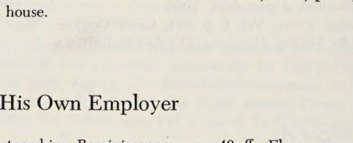

Rockefeller’s new partnership: Reminiscences, pp. 40 ff; Flynn, pp. Nevins, Rockefeller, the Heroic Age, Vol. 1, pp. 129 ff. Handy and early Cleveland banks: Wickham, Vol. II, p. 385; Colone Sullivan, One Hundred Years of Banking, a pamphlet reprinted fro Plain Dealer, May 29, 1910; Avery, Vol. I, p. 689; Rose, pp. 197, 199 Reminiscences, pp. 42-43; Annals of Early Settlers, Vol. IV, Number 75 ff. Bancroft: M. A. De Wolfe Howe, Life and Letters of George Bancroft

<!-- issues: image_text_overlap:0.271 -->

<!-- page_id: 0152-right | printed: 243 | viewer_token: 242 | viewer_sequence: 306/340 -->
## Page 243

York: Charles Scribner’s Sons, 1908, Vol. I, p. 190; Russell B. Nye, George Bancroft, New York: Alfred A. Knopf, 1944, pp. 91-92. Oberlin-Wellington Rescue: Roseboom and Weisenburger, pp. 177 ff. Contemporary Cleveland: Flynn, p. 71; Kennedy, p. 382; files of Cleveland Herald, Plain Dealer, and Leader, 1859-1866. John Brown: Grace Goulder, Ohio Scenes and Citizens, New York and Cleveland: World Publishing Company, 1964, pp. 189, 209-210. Drake’s discovery, Kier, petroleum, illuminants: John J. McLaurin, Sketches in Crude Oil, Franklin, Pennsylvania: published by the author, 1902; Leroy Thwing, Flickering Flames, Rutland, Vermont: Charles Tuttle Company, 1958; The American Petroleum Institute Quarterlies, Vol. 14, 1944, Vol. 15, July, 1945, Washington, D.C.; Flynn, pp. 54 ff.; Ralph W. Hidy, and Muriel E. Hidy, Pioneering in Big Business, New York: Harper & Brothers, 1955, p. 5; Patrick C. Boyle, The Derrick’s Handbook, Oil City, Pennsylvania: Derrick Publishing Company, 1898; The Leader (Cleveland), November 18, 1859.

apers. ted as tocke-

> 11. Oil as a Sideline

Clark & Rockefeller: Nevins, Rockefeller, the Heroic Age, Vol. I, pp. 129 ff. George W. Gardner: Rose, pp. 334, 401, 533; John K. Winkler, John D., A Portrait in Oils, New York: Blue Ribbon Books, 1929, p. 53; Avery, Vol. I, p. 233. Opposing attitudes in Cleveland to the Civil War: Rose, p. 297; Shaw, pp. 144 ff; Plain Dealer, November 3, 1862; Leader, October 22, 1863. A&GW Railroad: Shaw, p. 355; Albert Z. Carr, John D. Rockefeller’s Secret Weapon, New York: McGraw Hill Book Company, 1962, p. 19; Rose, p. 300; Annals of Cleveland for October-December, 1863. Bancroft: Howe (M. A. De Wolfe), Vol. II, p. 116. Frank and the Rockefeller family in the Civil War: the Inglis papers; Nevins, Rockefeller, the Heroic Age, Vol. I, p. 139. Levi Scofield: idem, p. 139-140. Clark & Andrews refinery: W. T. Holliday, president, Standard Oil of Ohio, an address before the Newcomen Society, Cleveland chapter, January 10, 1945, commemorating the seventy-fifth anniversary of the company’s founding. Samuel Andrews: Flynn, pp. 105-107; Rose, pp. 318-319. Sanuel Andrews and Maurice Clark: described by Mary Ann Rockefeller Rudd and recorded in the Inglis papers.

istory, ler, A Early , with

ib Ie m the ), 289; 1, pp.

<!-- page_id: 0153-left | printed: 244 | viewer_token: 244 | viewer_sequence: 308/340 -->
## Page 244

> 12. Cettie

Spelman data: Fanny Cooley Williams Barbour, The Spelman Genealogy, } York: Frank Allaben Genealogical Company, 1910, the work arranged by Mrs. John D. Rockefeller, a cousin of the compiler; Samuel A. L Fifty Years and Over, Akron, Ohio: Akron Beacon Job Department, 1 p. 121; Eleanor Iler Schapiro, Wadsworth Heritage, Wadsworth, O Wadsworth-News Banner, 1964, pp. 25-27; James N. Holm, editor, Stately Mansions, history of the Kent (Ohio) United Church of Christ, 1! pp. 28-29; James B. [sic] Holm, Portage County History, Kent, O Portage County Historical Society, 1957, p. 169, 453; Harvey Spelm diary, files of WRHS. The Spelmans, Laura particularly: Florence Matilda Read, The Story of S man College, Princeton, New Jersey: Princeton University Press, 1961, 19-25, 175 ff. Laura as a student at Oread: a collection of her letters and school paper Rockefeller Archives. Laura as a Cleveland school teacher: Freese, p. 90. Lucy’s comments about Laura: interview with Inglis in 1917, the Inglis pay Rockefeller’s trips to Spelman residence: ibid. Harvey Spelman: The Spelman genealogy states he was born in Granvy Massachusetts. However, on the monument in the Spelman lot in Lake V Cemetery, Cleveland, his birthplace is given as Rootstown, Ohio. For many details about the Spelman family, the author is indebted to | Burton Martin (Comfort Spelman) of Kent, Ohio. Green: John P. Green, Facts Stranger than Fiction, An Autobiography, Cl land: Riehl Printing Company, 1920. Spelmans in Rootstown: History First Congregational Church, Rootstc 1810-1960, a pamphlet, WRHS library.

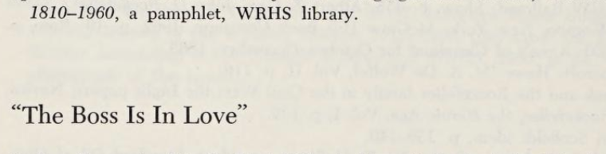

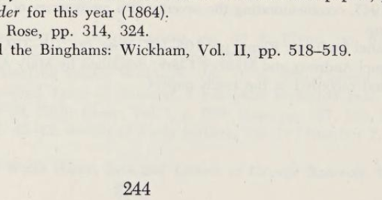

<!-- issues: image_text_overlap:0.279, image_text_overlap:0.238 -->

<!-- page_id: 0153-right | printed: 245 | viewer_token: 244 | viewer_sequence: 308/340 -->
## Page 245

### 14. “I Had Made Up My Mind. . . To Go Into The Oil Trade”

New for ane, 892, hio: The 969, hio: an’s

McClellan: support by Cleveland Copperheads, Rose, p. 326. Oil: subject frequently in Cleveland newspapers, especially the Leader, begii ning January 3, 1866; also Annals of Cleveland for this period. Hopper: Jane G. Griffen, editor, Here’s Lake County, Lake County Historic Society, Cleveland: Howard Allen, Publisher, 1964, pp. 113, 114; “Mystey Tramp Helped Save Infant Standard,” Cleveland: Sohio News, p. 2, Marc 2, 1970. Rockefeller and the Clarks: Nevins, Rockefeller, The Heroic Age, Vol. I, p 183 ff. Partnership dissolution: Reminiscences, pp. 79-81. “Oil on the Brain”: music and words by Eastburn, Philadelphia: Lee an Walker, publishers, 1865. Pithole Creek: Flynn, pp. 117 ff. Cleveland oil industry: Shaw, p. 168 ff; Hidy and Hidy, pp. 13 ff. Hanna: Croly, pp. 43 ff.

> 15. A Home on Euclid Avenue

Euclid Avenue: William Payne, Cleveland Illustrated, Cleveland: Fairbanl and Benedict, 1876, p. 109; Rose, p. 303; I. T. Frary, The Passing of a Fé mous Avenue, Architectural Record, No. 4, April 1918, p. 30; Shaw, p. 17. Rockefeller home: Ella Grant Wilson, Famous Old Euclid Avenue, Clevelanc privately printed, 1937, Vol. II, p. 147 ff. Comments often biased, but use ful as a contemporary record. Burgert house: Rose, p. 446; Wilson, Vol. II, pp. 148, 150. Details about the Everett mansion and the Everett-Rockefeller friendship wer supplied to the author by Mrs. S. Way Manning (Ruth Everett) of Cleve land, daughter of Colonel and Mrs. Everett; Wilson, Vol. II, p. 56. Rockefeller Euclid Avenue address: the house was Number 424 when pw chased by the Rockefellers, then changed to 997 and later to 1052. Home’s disposition: Plain Dealer, January 30, 1939.

<!-- page_id: 0154-left | printed: 246 | viewer_token: 246 | viewer_sequence: 310/340 -->
## Page 246

### 16. The Standard Oil Company Is Formed

Flagler: Sidney Walter Martin, Florida’s Flagler, Athens, Georgia: Unive of Georgia Press, 1949, pp. 5 ff; Reminiscences, pp. 10-17. Flagler and Harkness in Bellevue: Harold Detlefsen, in R.F.D. News (Belle Ohio), January 27, 1970; The Bellevue Gazette, September 1967; W. Williams, History of the Firelands, Cleveland: Leader Printing Comp 1879, pp. 54-55, 403, 414 ff. Harkness: Magazine of Western History, Vol. IX, 1888-1889, p. 188; FI p. 134. Standard Oil Company: Austin Leigh Moore, John D. Archbold and the E Development of the Standard Oil Company, New York: Columbia Uni sity publication, 1948, pp. 16 ff; Reminiscences, pp. 60-62; Nevins, Ro feller, the Heroic Age, Vol I, pp. 276. Benjamin Franklin Goodrich: Karl H. Grismer, Akron and Summit Cou Akron, Ohio: the Summit County Historical Society, n.d., pp. 207-216; H Allen, Rubber’s Home Town, New York: The Stratford House, 1949, 114-115, Information covering the complex Harkness-Flagler relationships was supy to the author by Mrs. Willard W. Brown (Louise Ingalls) and her mot Mrs. David S. Ingalls (Louise Harkness), descendants of Daniel Hark of Bellevue, who was a half brother of Stephen Harkness. Details also v kindly contributed by the Rev. Ralph H. Chapman of Tiffin, Ohio, for pastor of the Harkness Memorial Congregational Church, Bellevue, anc Professor Mildred Warmsley, Case Western Reserve University, a nativ Bellevue. Mrs. Elbert Schug, retired librarian in Monroeville, who lives : the former Harkness home in that village, added helpful details. Grat acknowledgment is made to Mrs. Carl Main, genealogist, WRHS, for | on the Harkness genealogy and for data about Stephen Harkness’s first v the former Laura Osborn, whom he married in Erie County, Ohio, in 1: She is presumed to have died in Monroeville, where their infant son, D: Harkness, who died in 1843, is buried in Riverside Cemetery.

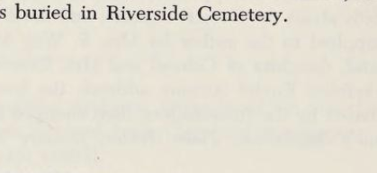

> 17. Giving

Ragged School: Kennedy, pp. 357-358; Freese, p. 64. Cleveland Bethel Union: Orth, Vol. I, pp. 393-394; Rose, p. 347. WERHS: extensive collection of records in Society files; Margaret Keal Knov Looking Back Through the First Hundred Years, History of the Wes Reserve Historical Society, published by the Society, 1968. Whittlesey: Avery, Vol. I, pp. 146 ff.; Baldwin, Biographical Sketch and morial Tract 68, WRHS; records in WRHS files. Harkness: Charles A. Post, Doan’s Corners, Cleveland: The Caxton Comp: 1930, pp. 97, 102, 178-179.

<!-- issues: image_text_overlap:0.172 -->

<!-- page_id: 0154-right | printed: 247 | viewer_token: 246 | viewer_sequence: 310/340 -->
## Page 247

Early Settlers: Kennedy, pp. 438-443; Early Settlers Association, Annals, Vol. II, 1886-1891, p. 215; Proceedings of the years 1947-1959, pp. 30 ff.; information on Rockefeller’s connection supplied by Donald L. Harbaugh, former association president. YMCA: data supplied by Robert Mills, general secretary, Cleveland Association; Russell Thompson, History of the Cleveland Young Men’s Christian Association, New York, 1901; YMCA records now in WRHS. Women’s Christian Association and YWCA: data from records, minute books, and early publications made available by Miss Louise Brown, executive director, Cleveland YWCA; YWCA records now in WRHS. Temperance movement and Friendly Inn, including the YWCA: extensive collections of minute books, secretary notes, letters, and newspaper clippings in the files of WRHS; history of Central Friendly Inn and the Rockefellers’ part in its launching was supplied the writer by Mrs. Elizabeth Fajen, retired director of the Settlement. Rockefeller on philanthropy: Reminiscences, pp. 152 ff., 182, 183. The Haymarket: Rose, pp. 397, 885-886; articles in the Cleveland News- Leader, May 8, 9, 1921.

arly ivercke-

inty, [ugh pp-

lied ther, ness

vere

mer 1 by e of near reful help vife, 842. avid

> 18. Turbulence

Oil Industry in early 1870s: William Greenleaf, John D. Rockefeller, one volume abridgement of Nevins’s Study in Power; John D. Rockefeller, New York: Charles Scribner’s Sons, 1959, pp. 34 ff.; Flynn, pp. 183 ff. Rockefeller children: data from Rockefeller Archives. Lake View Cemetery: Rose, p. 355; cemetery records. Devereux: Benton, Part III, pp. 79 ff. Duke Alexis: Rose, p. 381. South Improvement Company: Greenleaf, pp. 40-54; 55 ff.; Flynn, pp. 151 ff.; Moore, pp. 67 ff.; Plain Dealer, February 21, 1872. Rockefeller on railroads: Reminiscences, p. 111.

> 19. Cash or Stock

Payne: Dictionary American Biography, New York: Charles Scribner's Sons, 1934, Vol. XIV, p. 329; Flynn, p. 157. Perry family: Wickham, Vol. I, p. 84; Avery, Vol. 1, pp. 72-75. Stone: Dictionary American Biography, Vol. XVIII, p. 70; Nevins, Rockefeller, the Heroic Age, Vol. 1, pp. 388-392. Cleveland mergers: ibid, p. 364 ff.; Flynn, pp. 160 ff.; Mark Sullivan, Our Times, New York: Charles Scribner’s Sons, 1939, Vol. II, pp. 279 ff.

<!-- page_id: 0155-left | printed: 248 | viewer_token: 248 | viewer_sequence: 312/340 -->
## Page 248

John D. and Laura Rockefeller letters: Rockefeller Archives. The Cushing Block: Rose, p. 370. Union Club: For data on the club in this chapter the author is indebté Donald G. Titus, secretary, and to Bourne P. Dempsey, club member. Church contributions: From an incomplete list of Cleveland gifts in Re feller Archives. South Improvement Company: See notes with previous chapter; Ida M. bell, History of the Standard Oil Company Vol. I, pp. 55 ff.; editorials articles in Plain Dealer, and also Leader, in March and April, 1872; | and Hidy, p. 16; Mark Sullivan, pp. 294-297.

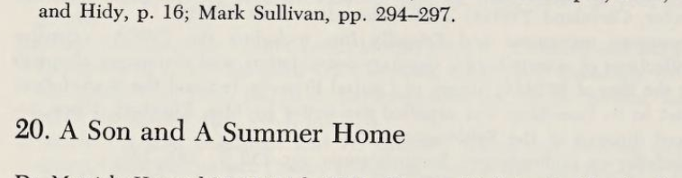

Dr. Merrick: Howard M. Dittrick, M.D., Pioneer Medicine in Cleveland, « piled for Cleveland Academy of Medicine, 1937, pp. 97-101. Mrs. Rockefeller’s letter to John D., Jr., January 29, 1896: Rockefeller chives. Forest Hill Association: Leader, April 1, 1875; Rose, p. 393; Ellen Lou; Price, A History of East Cleveland, privately printed, 1970, p. 63. Dummy Railroad: Harry Christiansen, Northern Ohio Interurban and R Transit Railroads, a pamphlet published by Transit Data, Incorpora 1965. The author is deeply indebted to David K. Ford, Cleveland attor for information about it. Helpful details also were contributed by } Eugene T. Izant (Jeanette Walworth), daughter of an early East Clevel family. Forest Hill as a club: Greenleaf, p. 162; Rockefeller’s statement in deposi during personal property tax suit, 1914 (see Chapter XXXI): “The year we lived there (Forest Hill) it was a sort of family hotel for our ne: bors and friends—any of our friends around there who wanted to come. Mrs. Hord’s reminiscences: Interview by the author at Mrs, Hord’s sum: home, Chagrin Falls, Ohio, July 1970.

> 21. Crowded Years

Cleveland refineries and mergers: Flynn, pp. 159-162; Inglis papers; Ju Abels, The Rockefeller Billions, New York: the Macmillan Company, 19 pp. 100ff.; Wilson, Vol. II, pp. 148-150; Reminiscences, pp. 94-96. The first Trust, 1882: Hidy and Hidy, pp. 40 ff.; Greenleaf, p. 148-157. Litigation and dissolution of Trust, 1892: Hidy and Hidy, pp. 218-219; Gre leaf, pp. 301-308.

<!-- issues: image_text_overlap:0.307 -->

<!-- page_id: 0155-right | printed: 249 | viewer_token: 248 | viewer_sequence: 312/340 -->
## Page 249

Standard Oil (New Jersey), a holding company: Hidy and Hidy, pp. 219 310-314; Greenleaf, pp. 310-312. Overseas markets and retail trade: Reminiscences, pp. 57-59; Flynn, pp. 14 147; Hidy and Hidy, pp. 122 ff.; pp. 494 ff. Samuel Andrews: Abels, pp. 171-172; Wilson, Vol. II, p. 1, 2. Hepburn Investigation: Flynn, pp. 218 ff.; Greenleaf, pp. 210-ff.; Tarb Vol. I, pp. 228 ff. Many years after the court case, Hepburn was appoin' to the board of the Rockefeller Foundation. Scofield, Shurmer & Teagle Company, and Backus suits: Reminiscences, | 96-107; Nevins, Rockefeller, the Heroic Age, Vol. Il, p. 45 ff. Abels, | 113 ff. John Teagle: Biographical Encyclopedia of the State of Ohio, Cincinn: Biographical Publishing Company, 1887, Vol. IV, p. 968. Rockefeller Foundation in China: Mary E. Ferguson, China Medical Bo and Peking Union Medical College, China Medical Board of New Yc 1970; History and Annual Report, 1969-1970; James Reston, article fr Peking, Plain Dealer, July 26, 1971. Lima Oil and Herman Frasch: Hidy and Hidy, pp. 155-161; Nevins, Roc feller, the Heroic Age, Vol. Il, pp. 4 ff. For the colorful story of Cleveland-made lamp parts for the China trade, author is indebted to W. Eli Thompson of Cleveland, retired executive the Perfection Stove Company. Thanks, too, are due Secretary Agnes Pearce of the China Medical Board of New York who supplied import information on the China story. Perfection Stove Company: Rose, pp. 486-487, 835. Rockefeller family: Rockefeller Archives. William C. Scofield: Avery, Vol. III, p. 96. Frank Rockefeller: ibid, p. 95. Ambrose McGregor’s name is perpetuated by the McGregor Home for Aged in East Cleveland, established and generously endowed in his mem by his widow, later the wife of Dr. M. O. Terry.

Tar- ; and Hidy

apid ited, ney, Mrs. land

tion first igh-

> 22. Planned Childhood

Rockefeller children: much of this chapter from JDR. JR’S recollections his childhood in Rockefeller Archives, and from references by Fosdi John D. Rockefeller, Jr., A Portrait, pp. 13 ff.; Abels, p. 304; Flynn, p. 2 Robert J. Heilbroner, “The Grand Acquisitor” in American Heritage, N York: American Heritage Publishing Company, December 1964, p. 20 ff Music in Cleveland in the 1880s: interview January 1968 with Dr. F. k Grossman, former leader Cleveland Philharmonic Orchestra and profes: Western Reserve University; Rose, pp. 364, 365, 402, 440; Adella Pren Hughes, Music Is My Life, New York and Cleveland: World Publish Company, 1947, pp. 41 ff., 66. aa

<!-- page_id: 0156-left | printed: 250 | viewer_token: 250 | viewer_sequence: 314/340 -->
## Page 250

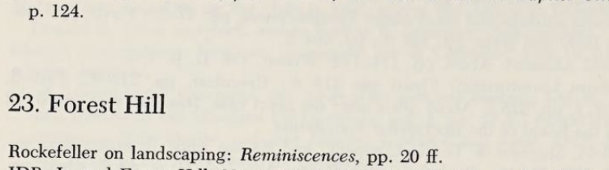

Rockefeller on landscaping: Reminiscences, pp. 20 ff. JDR, Jr. and Forest Hill: Nancy Newhall, A Contribution to the Heritag Every American, The Conservation Activities of John D. Rockefeller, New York: Alfred A. Knopf, 1957; Fosdick, pp. 29 ff. Much of this chapter is drawn from interviews in 1970 with Mrs. Harn Sims of Cleveland and from information which on these occasions she ki contributed. For data on JDR, Jr.’s conservation accomplishments thanks are due Wil E. Scheele, Museum of Natural History, Cleveland.

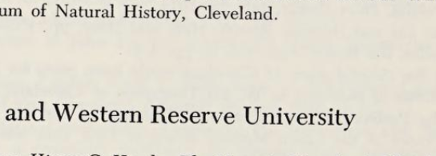

The removal: The Rev. Hiram C. Haydn, The Move to Cleveland, Cleve: Western Reserve University, 1895, pp. 35-87; Dr. Frederick C. Waite, W ern Reserve University, The Hudson Years, Cleveland: Western Res University Press, 1943, pp. 448 ff. Rockefeller on higher education: Reminiscences, pp. 35, 176, 177. Morgan Park Seminary: Nevins, Rockefeller, the Heroic Age, Vol. Il, Dee Stone: ibid, Vol. I, p. 388 and f.n.; The Moneymakers, by Henry F. J. Keer (New York: D. Appleton, 1886) was a cruel parody of Stone. He was eg recognized as the novel’s Aaron Grindstone who lived on Geometry (Euc Street and was held accountable for the collapse of a building he had erec Mather: Rockefeller, Reminiscences, pp. 122-128; Nevins, Rockefeller, Heroic Age, Vol. Il, pp. 405 ff.; A Dictionary of American Biography, XII, p. 396; Avery, Vol. III, p. 1. Mines and Great Lakes fleet: Rockefeller, Reminiscences, pp. 120-143; Gre leaf, p. 257 ff.; Abels, p. 185; Roger M. Jones, “The Rockefeller Fle Inland Seas, Great Lakes Historical Society Quarterly, July 1947, pp. 13. Hudson View of College move to Cleveland: articles in 1880-1882 in the I weekly Independent; Grace Forbush, Hudson Sesquicentennial, pampk Hudson, Ohio: 1950, pp. 17-22. Leonard Case, Jr.; Walter B. Hendrickson, The Arkites, Cleveland: the P. of Western Reserve University, 1953, p. 8. Hayes’s interview with JDR, Jr.: Mr. Hayes’s conversation with the aut! March 1970.

<!-- issues: image_text_overlap:0.268, image_text_overlap:0.405 -->

<!-- page_id: 0156-right | printed: 251 | viewer_token: 250 | viewer_sequence: 314/340 -->
## Page 251

Haydn-Rockefeller letters: Rockefeller Archives. This chapter is derived to a great extent from records of Case Western Resé University made available by the University Archivist, Ruth W. Helm The author wishes to express special appreciation for her cooperation help. A series of gossipy letters from the distinguished professor of chemistry, ward W. Morley to his father, Sardis, in Pittsfield, Massachusetts, also in files, recorded day by day news about the removal. Consulted in plans the new building, Morley criticized construction delays and named na: as he chafed at “hitches” in the work. Morley: Howard R. Williams, Edward William Morley, Easton, Penn vania: Chemical Education Publishing Company, 1957, pp. 183-189.

> 25. More Adventures in Education

Rockefeller at Vassar: Henry Noble MacCracken, The Hickory Limb, ) York: Charles Scribner's Sons, 1950, p. 29 ff. Bessie Rockefeller at Vas: Hughes pp. 66 ff. James M. Taylor: ibid, p. 20 ff.; American Dictionary of Biography, Vol. XV p. 329. Dr. Augustus H. Strong: Nevins, Rockefeller, the Heroic Age, Vol. II, 197 ff,, 203. The Cleveland Orchestra and the Rockefellers: Hughes, pp. 73-75, 79, 84- William R. Harper: Thomas W. Goodspeed, William Rainey Harper, Chica University of Chicago Press, 1928; Reminiscences, pp. 178-181. Frederick T. Gates: Flynn, p. 303 ff.; Greenleaf, p. 236 ff.; Reminiscen pp. 115-122; excerpts from Gates’s Autobiography, American Heritage, \ VI, No. 3, April, 1955, pp. 66 ff. University of Chicago: Thomas W. Goodspeed, History, University of Chica Chicago: University of Chicago Press, 1925; Greenleaf, p. 224 ff. Spelman College: Read, The Story of Spelman College, (see Notes, Chapter XII), pp. 175 ff.; Spelman Bulletin, 1969-1970, pp. 21-27. Laurance Rockefeller: Joe Alex Morris, Those Rockefeller Brothers, New Y« Harper & Brothers, 1952, pp. 32, 48, 49, 161. JDR, Jr. and Negro education: Fosdick, John D. Rockefeller, Jr., A Portr pp. 373-374. Grants from Rockefeller, Sr. and Jr.: Rockefeller Archives. President Alan Simpson of Vassar College kindly contributed data from College Archives about Rockefeller and his daughter at Vassar, includ John D.’s role as a trustee and his gifts to the College. William M. Sm president, Luckey Platt & Company, added details regarding Bessie Roc feller.

and: ‘esterve

200. nan, isily slid) ted. the Vol.

>enet,” 1 ff. ocal let,

<!-- page_id: 0157-left | printed: 252 | viewer_token: 252 | viewer_sequence: 316/340 -->
## Page 252

> 26. Family Affairs

Frank Rockefeller: An interview with his nephew, Charles E. Dangler Cleveland, whose mother, the former Effie Scofield, was a sister of Fra wife. Mr. Dangler often visited at the Wickliffe estate and at Soldier C Park. He described his aunt and uncle as cordial hosts, popular with t nieces and nephews who were always welcome guests. D. Edward Dan; Mr. Dangler’s father, founded the Dangler Stove Company in Clevelan 1885. A pioneer manufacturer of gasoline stoves, he was encouraged by Standard Oil Company then seeking commercial uses for gasoline. Lake View Cemetery Association: Helpful information was supplied Newton D. Baker, III, executive vice president, and John A. Matsko, retary-treasurer of the Association, and by Joseph Carabelli, Jr., wl grandfather, Joseph Carabelli, installed the Rockefeller monument in Cemetery. Eliza Rockefeller funeral: Data kindly supplied by The Rev. Edward Starr, curator, American Baptist Historical Society, Rochester, New Y from Society files. Alta House: Details about the Settlement were contributed by Glenn W. sen, former director, and by his successor, Kenneth Killary; Alta House History, pamphlet, published by the Settlement, 1900; Alta House rec in WRHS. Briggs family: Transactions of the Rockefeller Family Association, edited Henry Oscar Rockefeller, M.D., of Brooklyn, New York, New York: Knickerbocker Press, 1910, Vol. I, p. 305; the Cleveland Blue Book 1891 and 1933, Corrigan and Frank Rockefeller: Flynn, pp. 363 ff.; Abels, pp. 173 ff.; Tart McClure’s Magazine, July 1905, pp. 245 ff.; Nevins Rockefeller, The He! Age, Vol. II, pp. 384 ff. Kansas ranch: Terry H. Hermon, Soldier Creek Park, The Rockefeller Ra in Kiowa County, Kansas, a pamphlet, University of Kansas, in The T Guide, Vol. XIII, number 4, Kansas City, Missouri, 1968. Information about the withdrawal of Frank Rockefeller and his family fr the Euclid Avenue Baptist Church was supplied by Mrs. Gertrude Cr. of the Cleveland Baptist Association. Virgil P. Kline, one of Rockefeller’s lawyers in the Corrigan litigation, was incensed at the Tarbell account that he issued a public denial.

<!-- page_id: 0157-right | printed: 253 | viewer_token: 252 | viewer_sequence: 316/340 -->
## Page 253

> 27. Rockefeller Park

Park Lands; Records in office of Cleveland Park Commission; Orth, Vol. I 174; Rose, p. 573; Rockefeller Archives. The Arcade: Rose, p. 519; Plain Dealer, January 24, 1961. Harkness: The family had a large estate on the Lake Shore at Willough Following Harkness’s death and that of his daughter Florence, Mrs. H: ness established the Florence Harkness Fresh Air Camp for Children o section of the property, deeding it to the Day Nursery Association of Cle land. This was an early Cleveland charity of which Mrs. Rockefeller \ one of the founders. The Harkness estate was purchased later by the Cle land Electric Illuminating Company as site for its Eastlake plant, and camp moyed to its present location on SOM Center Road, in Willough Ohio. Florence Harkness: Her marriage to Louis Severance took place in Willough a private train bringing guests from Cleveland for the wedding, accord to a memorial pamphlet by The Rev. Hiram C. Haydn, December 11, 18 Mrs. Severance left a $100,000 bequest to the Day Nursery Association found the Mary Whittlesey Day Nursery in memory of her beloved “Gra ma (Mrs. Charles) Whittlesey.” The nursery was established on Cedar A nue in the seventy-seven hundred block. Interest in golf: Inglis papers; article in Echoes (The Ohio Historical Soci Columbus), Vol. 10, No. 7, July 1971; stories of Rockefeller and golf legion in Cleveland. Reception of Tarbell History: Ray Stannard Baker, American Chronicle, N York: Charles Scribner’s Sons, 1945, pp. 179, 183. Dr. Biggar: For information on the doctor, the author is indebted to daughter, Mrs. Benjamin T. Gilbert (Sue Biggar) of Clayville, New Ye a native Clevelander; and to his granddaughter, Mrs. J. F. Wieser (Rac Biggar) of Cleveland, daughter of Dr. Hamilton F. Biggar, Jr. As a girl « young woman Mrs. Wieser often rode with her grandfather as he made calls, first in a horse-drawn buggy, later when he acquired an automob She accompanied him on practically daily trips to Forest Hill, and later visits at Pocantico and Ormond Beach. For help in developing this chapter the author also wishes to thank Ralph Besse, retired chairman of the board of the Cleveland Electric Illuminat Company; Miss Eleanor Hosley, retired executive director, Day Nurs Association; Mrs. William Slack, curator, Lake County Historical Muset Mentor, Ohio; and Mrs. Nancy Turo, Kirtland, Ohio.

) Of ink’s reek their gler, d in the

by secnose the

ol- 2 A ords

by the for

<!-- page_id: 0158-left | printed: 254 | viewer_token: 254 | viewer_sequence: 318/340 -->
## Page 254

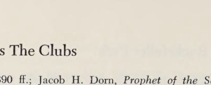

Tainted Money: Flynn, pp. 390 ff.; Jacob H. Dorn, Prophet of the S. Gospel, Columbus: Ohio State University Press, 1966, pp. 240 ff.; W ington Gladden, Recollections, Cambridge: Houghton Mifflin Comp Riverside Press, 1909, pp. 401 ff. While “tainted money” had appeared i article by Gladden in the Outlook in 1895, it was not until used in nection with Rockefeller’s large gift that it caught public attention. Rockefeller Building: Rose, pp. 637, 787; records of Central National I of Cleveland; John D., Jr. stated in 1944: “for over twenty years the « pany to which we sold the Rockefeller Building in Cleveland has, by ag ment at that time, continued to operate it under the name ‘The Rockef Building.’” Perry-Payne Building: J. H. Kennedy, History of Cleveland, Biographical pp. 60 ff. Tarbell in McClure’s Magazine June 1905 pp. 227-249, and August 1905, 386-398. Visit to Rockefeller: Forest Hill, September 26, 1905, Cleveland: Vinson Korner, printers, n.d.; Plain Dealer and Leader, September 27, 1905. 1 den’s remarks at Forest Hill are significant; shortly after Rockefeller’s p land gift, he was attacked on another subject by the Plain Dealer. Hol regretted this, and to this effect wrote Rockefeller at the time, Green] p. 228.

> 29. Two Empires

Trip to France: Hamilton F. Biggar, M.D., Compeignie-Personal Recol tions, a scrapbook in the Howard Dittrick Museum of Historie Medic Allen Memorial Medical Library, Cleveland, and made available to author by the museum’s director, Dr. Genevieve Miller. Mrs. Strong’s illness: Abels, pp. 256-257. Litigation and Supreme Court decision of 1911: Greenleaf, pp. 321-327; H and Hidy, 678-683, 684-718. Levingston mystery: New York World, February 2, 1908, February 23, 1s March 1, 1908; Cleveland Leader and Plain Dealer, February 3, 1908. Slaght’s comments on mystery: Inglis papers. Suit, Standard Oil of Indiana and Judge Landis’s fine: Plain Dealer, Aus 4, 1907; Mark Sullivan, Vol. III, p. 497. F. H. Goff: Nathanial E. Howard, Trust for All Time, Cleveland: the Cle land Foundation, 1963, pp. 1, 6, 10-11. Additional information on the G Rockefeller relationship was kindly contributed by Mr. Goff’s son, Will S. Goff of Cleveland. Rockefeller philanthropic agencies: Rockefeller Archives; Raymond B. Fosd

<!-- issues: image_text_overlap:0.269 -->

<!-- page_id: 0158-right | printed: 255 | viewer_token: 254 | viewer_sequence: 318/340 -->
## Page 255

The Story of the Rockefeller Foundation; New York: Harper & Broth 1952. See also Robert Shaplen, Toward the Wellbeing of Mankind, N York: Doubleday Company, 1964 and E. C. Stakman, Richard Bradfi and Paul C. Mangelsdorf, Campaigns Against Hunger, Cambridge: Bel Press, 1967. Gates, as almoner: Fosdick, John D. Rockefeller, Jr., A Portrait, pp. 83- 94; Greenleaf, pp. 246 ff.

ocial ’ashany, nan

con-

3ank -omreeeller

> 30. Forest Hill Nostalgia

The Rey. Charles A. Eaton: Following his pastorate at Euclid Avenue Bar Church in 1909, he held numerous positions in the East, becoming a Uni States Congressman as Representative from New Jersey in 1926. The Harpers: For the Harpers’ interest in Russia see The Russia I Believe the Memoirs of Samuel Harper, edited by Paul V. Harper, Chicago: versity of Chicago Press, 1969. Mrs. Patteson: After leaving Mr. Rockefeller’s employ, she turned to writ children’s books on nature and animal subjects, including the widely po lar Pussy Meow. A statue as a memorial to Mrs. Patteson was placed Cleveland nature lovers in the gardens of the Cleveland Museum of Ari The Stilwells: Following college, Charles and Clifford Stilwell went to w for the Warner & Swasey Company, manufacturers of machine tools. B rose to executive positions, Mr. Charles Stilwell becoming president of

and Holarkiden leaf,

> company.

lec- ‘ine, the

> 31. Finale

Tax dispute: Leader, February 11, 1914; Plain Dealer, December 7, 1s Chicago Tribune, February 26, 1915; Leader, April 13, 1915. Tax suit decision: Plain Dealer, May 14, 1915. Judge John H. Clarke Uni States District Court, ruling in favor of Rockefeller said: “This cour quite aware that such a decision as is here rendered will be the subjec’ criticism, but a judiciary which has not independence sufficient to pro the rights of rich men when they are believed to be unjustly assailed « not be trusted justly to protect either the personal or property rights of well to do or poor.” Mrs. Rockefeller’s death: Plain Dealer, March 13, 1915. Nicol painting: Rose, p. 720; offered to Cleveland Art Museum, Rockefe Archives; author’s correspondence with Parke, Bernet Galleries, 1970. Rockefeller family gifts to Cleveland Museum of Art: information from o! of Dr. Sherman Lee, museum director.

veoffiam

<!-- page_id: 0159-left | printed: 256 | viewer_token: 256 | viewer_sequence: 320/340 -->
## Page 256

Homestead fire: details supplied by Mrs. Kenneth M. Haber; Plain Dec December 18, 1917. New Euclid Avenue Baptist Church: H. E. Weeks, “Our New Church,’ Seventy-five Years of the Euclid Avenue Baptist Church, pp. 127-142; « respondence 1970 with Dr. Dore Sharpe of California, formerly execu director, Cleveland Baptist Association; conversations 1972 with Mr. | Mrs. David J. James of Cleveland, who were members of the old “Roc feller Church” and also active in the new church, Forest Hill Park: A. D. Taylor, Forest Hill Park, a Report for Proposed La scape Development Prepared for Citizens of East Cleveland and Clevel: Heights, 1937. The author also is indebted to Grant Apthorp, former C Manager of East Cleveland for further details about the park, and also information regarding changes and development of the remaining Fo1 Hill acres. Rockefeller’s last days: Nevins, Rockefeller, the Heroic Age, Vol. II, pp. 704 Death of Rockefeller: New York Times, May 24, 1937. Cleveland funeral: Plain Dealer, May 28, 1937. Memorial Book: John Davison Rockefeller, a Memorial containing facsimi of the thousands of messages received. It was printed privately, New Yo 1937, for the Rockefeller Institute for Medical Research, the General Ex cation Board and the Rockefeller Foundation.

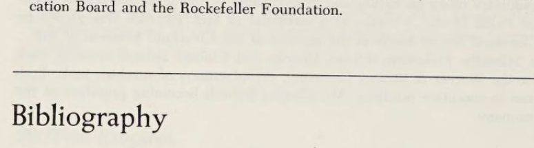

Abels, Jules: The Rockefeller Billions, New York: Macmillan Company, 19¢ Akers, William J.: Cleveland Schools in the Nineteenth Century, Clevelan W. M. Bayne, 1901. Alburn, Wilfred H., and Alburn, Miriam Russell: This Cleveland of Ou Chicago, Cleveland and Indianapolis: $. J. Clarke Co., 1933. Allen, Hugh: Rubber’s Home Town, New York: The Stratford House, 194 Allen, William H.: Rockefeller, Giant Dwarf Symbol, New York Institute f Public Service, 1930. Alta House, A History, Cleveland: published by the Settlement, 1900. American Heritage, New York: American Heritage Publishing Company, V VI, April, 1955. The American Petroleum Institute quarterlies, Washington, D.C.: publish: by the Institute, especially Vols., 14 and 15, 1944 and 1945. Petroleu The Story of An American Industry. Anderson, Russell H.: The Rowfant Club, A History, Cleveland: publish by the Rowfant Club, 1955.

<!-- issues: image_text_overlap:0.226 -->

<!-- page_id: 0159-right | printed: 257 | viewer_token: 256 | viewer_sequence: 320/340 -->
## Page 257

Annals of Cleveland, A Digest and Index of the Newspaper Record of Eve and Opinions, 1818-1876; 1931-1936, Cleveland: Works Progress Admir tration, 1937—June 1939. Annals of the Early Settlers Association of the Western Reserve, Clevelar 1880- Avery, Elroy McKendree: A History of Cleveland and Environs, 3 vols., C cago: Lewis Publishing Company, 1918. Baker, Ray Stannard: American Chronicle, The Autobiography of Ray Ste nard Baker (David Grayson), New York: Charles Scribner’s Sons, 1945. Baldwin, C. C.: Memorial tributes to Charles Whittlesey, Tract 68, 18 WRHS. Barbour, Fanny Cooley Williams: The Spelman Genealogy, New York: Fra Allaben Genealogical Company, 1910. Beer, Thomas: Hanna, New York: Alfred A. Knopf, 1929. Benton, Elbert Jay: Cultural Story of an American City, Cleveland, 3 pat Cleveland: Western Reserve Historical Society, 1943-1946. Biggar, Hamilton F., M.D.: Compeignie—Personal Recollections, a scrapbc in the Howard Dittrick Museum of Historic Medicine, Allen Memorial M¢ ical Library, Cleveland, n.d. Biographical Encyclopedia of the State of Ohio, Cincinnati: Biographi Publishing Company, 1887. Brown, Marcus M.: A Study of JDR, The Wealthiest Man in the Wor Cleveland: Published by the author, 1905. Butler, Margaret Manor, A Pictorial History of the Western Reserve, 179 1860, Cleveland: joint publication, Early Settlers Association of the West Reserve and Western Reserve Historical Society, 1963. Carr, Albert Z.: John D. Rockefeller’s Secret Weapon, New York: McGra Hill Book Company, Inc., 1962. Central High School, 1846-1946, a pamphlet published by the Centennial Co mittee, 1946, files of WRHS. Chapman, Edmund H.: Cleveland: Village to Metropolis, Cleveland: West Reserve Historical Society and The Press of Western Reserve Universi 1964. Chase, Mary Ellen: Abby Aldrich Rockefeller, New York: The Macmillan Co pany, 1950. Christiansen, Harry: Northern Ohio Interurban and Rapid Transit Railroa pamphlet by Transit Data, Inc., 1965. Cleave, Egbert: Cleve’s Biograph-Cyclopaedia of the State of Ohio and C of Cleveland, Philadelphia: J. B. Lippincott & Company, and Clevelar Fairbanks, Benedict Company, n.d. Condon, George E.: Cleveland, the Best Kept Secret, Garden City: Doub day & Company, Inc., 1967. Cramer, C. H.: Newton D. Baker, A Biography, New York and Clevelar World Publishing Company, 1961. Croly, Herbert D.: Marcus Alonzo Hanna, New York: The Macmillan Co pany, 1912.

cortive and ke-

ndand ity for rest

iles tk, du-

<!-- issues: low_ocr_confidence:78.07 -->

<!-- page_id: 0160-left | printed: 258 | viewer_token: 258 | viewer_sequence: 322/340 -->
## Page 258

Davis, Russell H.: Memorable Negroes in Cleveland’s Past, Cleveland: ern Reserve Historical Society, 1969. The Derricks’s Handbook of Petroleum, 2 vols. Oil City, Pennsylvania, Detlefsen, Harold: article in R.F.D. News, Bellevue, Ohio, January 27, Dictionary of American Biography, New York: Charles Scribner's Sons. Dittrick, Howard M., M.D.: Pioneer Medicine in Cleveland, compil the Cleveland (Ohio) Academy of Medicine, 1937. Dorn, Jacob H.: Prophet of the Social Gospel, Columbus: Ohio State l sity Press, 1966. Euclid Avenue Baptist Church, 1851-1926, The Historical Committee, Ferguson, Mary E.: China Medical Board and Peking Union Medical C China Medical Board of New York, Inc., 1970. The First Baptist Church of Greater Cleveland, 1833-1968, Church } Committee, Carl B. White, chairman. Flynn, John T.: God’s Gold, New York: Harcourt, Brace and Company, History, First Congregational Church, Rootstown, Ohio, 1810-1960 a plet, WRHS library. Forbush, Grace: Hudson Sesquicentennial, a pamphlet, Hudson, Ohio, Forest Hill, September 26, 1905, Cleveland: limited edition privately y by Vinson and Korner, 1905. Fosdick, Raymond B.: John D. Rockefeller, Jr., A Portrait, New York: | & Brothers, 1956. ———: The Story of the Rockefeller Foundation, New York: Harper & Br Publishers, 1952. Frary, I. T.: “The Passing of a Famous Avenue,” Architectural F April, 1918. Freese, Andrew: Early History of the Cleveland Public Schools, Cley Robison, Savage & Co., 1876. Gladden, Washington: Recollections, Cambridge: Houghton Mifflin Cor Riverside Press, 1909. ———: “Tainted Money,” The Outlook, November 30, 1895. Goodspeed, Thomas W.: History, University of Chicago, Chicago: Uni of Chicago Press, 1925. ———: William Rainey Harper, Chicago: University of Chicago Press, Goulder, Grace: Ohio Scenes and Citizens, New York and Cleveland: Publishing Company, 1964. ———: Articles, Plain Dealer Sunday Magazine, October 8, 1961, Sept 20, 1959. Green, John P.: Facts Stranger than Fiction, an autobiography, Cley The Riehl Printing Company, 1920. Greenleaf, William: John D. Rockefeller, a one volume abridgment of Nevins’s Study in Power: John D. Rockefeller, Industrialist and 1 thropist, New York: Charles Scribner's Sons, 1959. Griffen, Jane G.: editor, Here’s Lake County, Lake County Historical $ Cleveland: Howard Allen, publisher, 1964.

<!-- page_id: 0160-right | printed: 259 | viewer_token: 258 | viewer_sequence: 322/340 -->
## Page 259

West- Grismer, Karl H.: Akron and Summit County, the Summit County Historical Society, Akron, Ohio, n.d. 1898. Harper, Samuel: The Russia I Believe In, Memoirs of Samuel Harper, edited 1970. by Paul V. Harper, University of Chicago, 1969. Harris, Mary Emma and Robinson, Ruth Mills: The Proud Heritage of Cleveed for land Heights, Cleveland: Howard Allen, Publisher, 1966. Hatcher, Harlan: The Ohio Guide, Works Progress Administration for State of jnivers Ohio, New York: Oxford University Press, 1940. Haydn, The Rev. Hiram C.: The Move to Cleveland, Cleveland: Western 1997. Reserve University, 1894. ollege, Heilbroner, Robert L.: “The Grand Acquisitor,” American Heritage, December, 1964. American Heritage Publishing Company, N. Y. listory Hermon, Terry H.: Soldier Creek Park, The Rockefeller Ranch in Kiowa County, Kansas, pamphlet, University of Kansas, Lawrence, Kansas, 1968. 1932. Hendrickson, Walter B.: The Arkites, Cleveland: the Press of Western Reserve | pam- University, 1962. Heritage of Parma Heights, published by Parma Heights, Ohio, 1969. 1950. Hidy, Ralph W. and Hidy, Muriel E.: Pioneering in Big Business 1882-1911, printed History of Standard Oil Company (New Jersey), New York: Harper & ; Brothers, 1955. Harper Hodge, O. J.: Reminiscences 2 vols., Cleveland: The Imperial Press, 1902. Holliday, W. T.: address, seventy-fifth anniversary of Standard Oil Company's others, founding, Newcomen Society, Cleveland Chapter, Cleveland, January 10, 1945, tecord, Holm, James B.: Portage County History, Kent, Ohio: Portage County Historical Society, 1957. reland Holm, James N.: editor, The Stately Mansions, a history of the Kent (Ohio) United Church of Christ, June 1969. npany, Holt, Rackham: Mary McLeod Bethune, Garden City: Doubleday & Company, 1964. Howard, Nathaniel R.: Trust for All Time, Cleveland: The Cleveland Founvemity dation, 1963. Howe, Henry: Historical Collections of Ohio, 2 Vols. Cincinnati: C. J. Kreh- “1998, biel & Company, 1901. World Howe, M. A. De Wolfe: Life and Letters of George Bancroft, 2 Vols. New York: Charles Scribner's Sons, 1908. aonbed Hubbard, Elbert: “An Intimate Study of the Richest Man in the World,” National Sunday Magazine supplement of the Plain Dealer, May 10, 1914. lead! Hughes, Adella Prentiss: Music is My Life, Cleveland and New York: World Publishing Company, 1947. -vallard Inglis, W. O.: manuscript biography of John D. Rockefeller and related notes, Philan- referred to in these pages as “Inglis papers,” 1917, Rockefeller Archives, New York. aciety Jones, Roger M.: in Inland Seas, Great Lakes Historical Society Quarterly, 7 July 1947, Cleveland. Peers

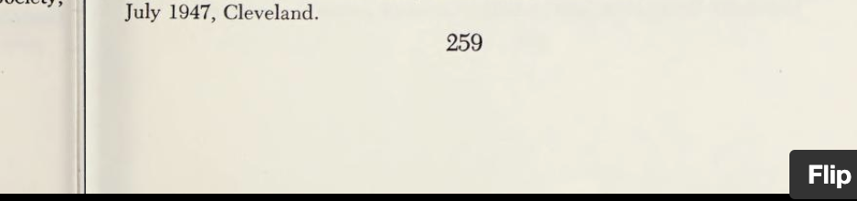

<!-- page_id: 0161-left | printed: 260 | viewer_token: 260 | viewer_sequence: 324/340 -->
## Page 260

Keenan, Henry F. J.: The Moneymakers, New York: D. Appleton, 1886. Kennedy, Charles E.: Fifty Years of Cleveland, 1875-1925, Cleveland: 4 1 1 1 3 0 51 76 276 15 -1 5 1 1 1 3 1 51 76 112 15 17.772150 tae 5 1 1 1 3 2 110 72 23 19 28.645382 oe 5 1 1 1 3 3 146 72 12 19 16.541939 NR 5 1 1 1 3 4 164 72 21 19 19.609261 by 5 1 1 1 3 5 190 83 76 8 15.121088 Seer 5 1 1 1 3 6 283 77 44 14 6.310635 ri: 5 1 1 1 3 7 324 72 7 19 0.000000 <

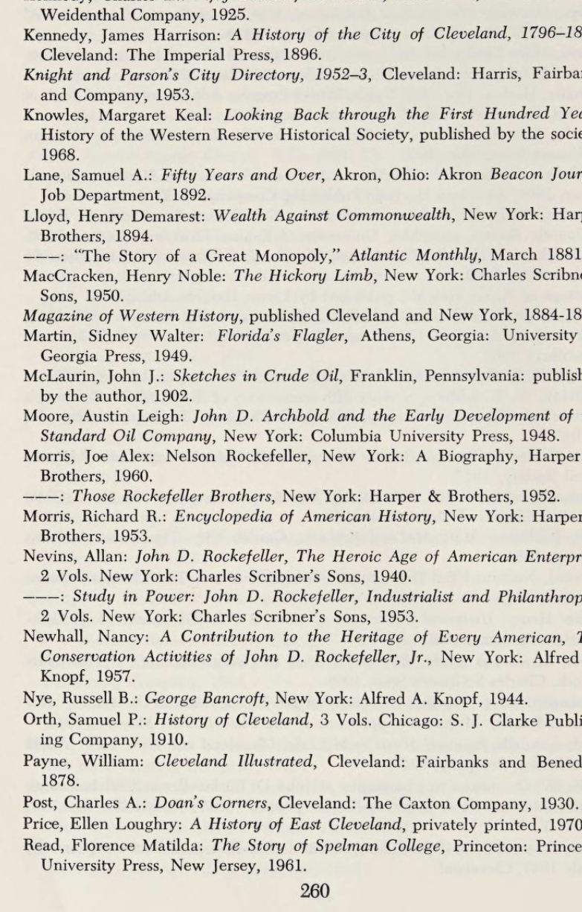

<!-- page_id: 0161-right | printed: 261 | viewer_token: 260 | viewer_sequence: 324/340 -->
## Page 261

Regier, C. C.: The Era of the Muckrakers, Gloucester, Massachusetts: P Smith, 1957. Rockefeller, John D.: Random Reminiscences of Men and Events, New Y‘ Doubleday, Page and Company, 1909. Rockefeller Memorial: John Davison Rockefeller, A Memorial, fascimiles letters received at Rockefellers death, New York: privately printed for Rockefeller Institute for Medical Research, the General Education Bo and the Rockefeller Foundation, 1937. Rockefeller, Henry Oscar, M.D., editor: Transactions of the Rockefeller Far Association, New York: The Knickerbocker Press, 1910. Rose, William Ganson: Cleveland, the Making of a City, Cleveland and ) York: World Publishing Company, 1959. Roseboom, Eugene H. and Weisburger, Francis P.: A History of Ohio, Jai H. Rodabaugh, editor, Columbus: Ohio Historical Society, 1967. Schapiro, Eleanor Iler: Wadsworth Heritage, Wadsworth, Ohio: Wadswx News-Banner, 1964. Seibert, Wilbur Henry: The Mysteries of Ohio’s Underground Railroads, | lumbus, Ohio: Long’s College Book Store, 1955. Seventy-five Years of the Euclid Avenue Baptist Church, 1851-1926, The } torical Committee, 1927. Shaplen, Robert: Toward the Well Being of Mankind, Garden City, New Y« Doubleday & Company, Inc., 1964. Shaw, Archer H.: The Plain Dealer, One Hundred Years in Cleveland, N York: Alfred A. Knopf, 1942. Stakman, E. C., Bradfield, Richard, and Mangelsdorf, Paul C.: Campai Against Hunger, Cambridge, Massachusetts: Belnap Press, 1967. Steffens, Lincoln: The Autobiography of Lincoln Steffens, New York: H court, Brace and Company, 1931. Sullivan, Colonel J. J.: One Hundred Years of Banking, pamphlet reprin from the Plain Dealer, May 23, 1910. Sullivan, Mark: Our Times, 6 Vols., New York: Charles Scribner’s Sons, 19 Tarbell, Ida M.: All in The Day’s Work, An Autobiography, New York: 1 Macmillan Co., 1939. ———: History of the Standard Oil Company, 2 vols. incl., New York: Pe Smith, 1950. ———: “John D, Rockefeller: A Character Study,” 2 parts, McClure’s Ma zine, July and August 1905. Taylor, A. D.: Forest Hill Park, Cleveland: The Caxton Company, 1938. Thompson, Russell: History of the Cleveland Young Men’s Christian Assoc tion, New York: 1901. Thwing, Leroy: Flickering Flames, Rutland, Vermont: Charles Tuttle Cc pany, 1958. Waite, Dr. Frederick C.: Western Reserve University, The Hudson Yee Cleveland: Western Reserve University Press, 1943.

_. eee EEE Fp

<!-- issues: low_ocr_confidence:56.07 -->

<!-- page_id: 0162-left | printed: 262 | viewer_token: 262 | viewer_sequence: 326/340 -->
## Page 262

Wickham, Gertrude Van Rensselaer: The Pioneer Families of Cleveland Vols. Cleveland: Evangelical Publishing House, 1914. William, Howard R.: Edward William Morley, Easton, Pennsylvania: Chi ical Education Publishing Company, 1957. Williams, W. W.: History of the Firelands, Cleveland: Press of the Lea Printing Company, 1879. Wilson, Ella Grant: Famous Old Euclid Avenue, 2 Vols. Cleveland: Priva printed, 1932, 1937. Winkler, John K.: John D., A Portrait in Oils, Cornwall, New York: Blue F bon Books, Cornwall Press, 1929. Wittke, Carl: The First Fifty Years, The Cleveland Museum of Art, 19. 1966, Cleveland: The John Huntington Art and Polytechnic Trust and Cleveland Museum of Art, 1966. ——— editor, History of the State of Ohio, Vols., IV, V Columbus: Ohio St Archaeological and Historical Society, 1943, 1944. Files of Cleveland Newspapers Consulted Herald (1819-1885) Leader (1854-1917) Plain Dealer (1842— — ) The Leader gave special attention to oil in the early days of Cleveland’s oil refining industry, and its files are helpful in this period.

<!-- page_id: 0162-right | printed: 263 | viewer_token: 262 | viewer_sequence: 326/340 -->
## Page 263

> Index

Acadia National Park, 153 Barton, James, 195 Adelbert College, 157, 159, 163, 166, Beecher, Henry Ward, 64 167, 176 Bellevue, Ohio, 55, 88, 90 Agnew, William, 224, 229 Benefactions, 237 Alexander and Hewitt, 118 Benjamin, Lucy Avery and Will Alexander, John, 51, 118 179 Alexander, Schofield and Company, Benjamin, Mrs. William W. (F 117 ence Briggs), 179 Alexis, Grand Duke, 109 Bessemer Steamship Company, | The Aliened American, 7 - 162 ee eee 7 iggar, Dr. Hamilton F., i cor anceps Leet ‘191-192; 201, 202, 235 Amasa Stone House, 160 Biggar, Mrs. Hamilton F., 142 Amasa Stone Memorial Chapel, 160 Bingham, Elijah, 73 American Baptist Education Associa- Bingham, William, 120 tion, 169, 173 Blakemore, Edward, 217 Andrews, Clark & Company, 61, 69 Blossom, Mrs. Dudley S., 114 Andrews, Horace, 136 Boardman, W. J., 158 Andrews, Samuel, 51, 59ff., 74, 91, Bolton, Mrs. Frances Payne (B 117, 118, 135-136, 158, 233, 235 ham), 114 Andrews, Mrs. Samuel, 59, 117 Bostwick, Jabez, 115, 128 The Arcade, 188 Brainard, Silas and Son, 145 Archbold, John D., 94, 121, 133; be- Brewster, Benjamin, 133 comes head of Standard, 139, 205; Briggs, Pierson D., 37, 179, 207, 208 Broad Street Congregational Chi Artemus Ward (Charles Farrar (Columbus ), 193 Browne), 39 Brown, John, 43, 49 Arter, Frank A., 118 Brush, Charles, 188 Arter, Charles K., 117-118, 129 Buckeye Foundry, 134 Ashtabula, Ohio, 159 Burgert, Leir, 86, 87 Atlantic & Great Western Railroad, Burrows Brothers Company, 217 Be Burton, William M., 139 Atwater Block, 2, 27, 47 Bushnell, Asa S., 186 Avery, Hezekiah, 124 Bustard, Rev. W. W., 230 ares Lee (Mrs, Walter Bryan, William Jennings, 194

California, visited 1886, 142 }: Carnegie, Andrew, 236 Carr, William F., 205 Case, Leonard Jr., 155 Case School of Applied Science: 102, 155, 157, 166, 167, 176

> Backus, Fred M., 130 Backus, Mrs. Fred M., 130-132; 160, 235 Baker, Newton D., 13, 167 Baldwin, C. C., 102, 157 Bancroft, George, 47, 54 >

ee es Fi

<!-- issues: low_ocr_confidence:79.73 -->

<!-- page_id: 0163-left | printed: 264 | viewer_token: 264 | viewer_sequence: 328/340 -->
## Page 264

Cooke, Jay, 128 Corrigan, James—Frank Rockefe controversy, 182-185; 192, 197 Couch, Will S., 204, 205 Cowell & Hubbard Company, 21 Cowles, Edwin, editor of the Leac 100 Cowles, J. G. W., president, Chi ber of Commerce, 186 Cox, James M., 227 Frederick C. Crawford Auto and Aviation Museum, 102 Crawford, Frederick C., president! The Western Reserve Histor Society, 100 Crile, Dr. George W., 165 De Cuevas, Mrs. George (Marg: Strong), 236 Cushing Block, 112, 116 Cushing, Dr. E. F., 165 Cushing, Dr. Henry K., 116 Cutler, Carroll, 155 Cuyahoga River, 2, 6, 44, 61, 67

> Case Western Reserve University, 156

Avyv Castle, Mrs. William B., 121 Cathcart, Wallace, 102, 217 Central High School, 1, 3, 5, 9, 10, 11, 12, 13, 38, 50, 62, 114 Central National Bank, 196 onl & Rudd Company, 4, 150, Cheshire Street house, 40, 180 Chester, George F., 132 China, market for kerosene, 134 China Medical Board, 135 Chisholm, Henry, 28, 120, 125, 235 Chisholm, Mrs. Henry, 100, 103, 116 Choate, Joseph H., 138 Clark & Rockefeller, 44ff., 55, 73 Clark, James, 60, 76, 112, 113 Clark, Maurice B., 43ff., 46, 59, 76- 79; 89, 112, 235 Clark, Payne and Company, 112, 113 Clark, Richard, 60, 76 Clarke, Judge John H., 227 Clements Brothers, 188 Cleaveland, Moses, 45, 103, 114 Cleveland Baptist Association, 232, 235 Cleveland Bethel Union, 99-100 Cleveland Clearing House Association, 47 Cleveland civic leaders at Forest Hill, 198-200 Cleveland, Columbus & Cincinnati Railroad, 5 “Cleveland Crowd,” 133 The Cleveland Grays, 56 Cleveland Herald, 155 Cleveland, Ohio, 1, 2, 4, 5-8; 9, 10, 11, 24, 37, 59, 61, 64, 97, 104, 106, 128, 137, 148, 151, 154, 155, 156, 169, 175, 234, 235 Cleveland State University, 85 Cleveland street names, 1fn Cleveland University, 8, 65, 155, 168 College for Women (Flora Stone Mather College), 163, 166 Collins, Rev. Charles T., 158 Columbus Street Bridge, 2 Cook, Stephen, 92 9)

Davison, John, 17, 21, 23 Day, William Howard, 7 Dean, C. E., 51 Denison University, 102, 156 Devereux, General J. H., 109, 11 Devereux, Henry K., 109 “Disputed Boundary,” 225, 226 “Doan’s Corners,” 101 Doan, W. H., 101, 158 Dodd, S. C. T., 138 Douglas, Stephen A., 41, 158 Dowling, Rev. George T., 158, 1 Drake, “Colonel” Edwin L., 43, 50ff., 60 Drury, Francis E., 134 Duncan, Rev. S. W., 180 Dunham Tavern, 100-101 Dutton, C. B., 123

8 Early Settlers Association, 103 Eaton, Rev. Charles Aubrey, 211] Eaton, Cyrus, 211ff. Ecclesiastes, 158 Eells, Dan P., 41, 47, 48, 49, 129, 235

<!-- page_id: 0163-right | printed: 265 | viewer_token: 264 | viewer_sequence: 328/340 -->
## Page 265

Eisenmann, John, 188 Fosdick, Dr. Henry Emerson, 23 Ely, George H., 158 Frasch, Herman, 136, 137 Erie Street Baptist Mission Church, Freese, Andrew, 9, 13 peeenan Bee: 85; 103, 143, From Hudson to Cleveland, 155 , 232, Fuller, Samuel Augustus, 220, 2: Euclid Avenue Baptist Church (the ee eae , “new” Church), 230-232 Gardner, George W., 53ff. Euclid Avenue Baptist Church, “the Garfield, General James A., 61, Rockefeller Church,” 85, 103, 126, 87, 157; monument, 163 141, Higa oats LEO AGT.E90, Cotes Credenick (0) 161,100) | age 7 i 173-175, 194, 195, 209 Euclid ane aue Forest Hill Associa- General Education Board, 165, tion, 12 194, 209, 218 Euclid Hotel, 211 Gilbert, Benjamin D., 192 Euclid Avenue house, 82, 108, 141, Gilbert, Mrs. Benjamin T. (Sue | 149 gar), 192° . Evans, Mrs. R. E., 228 Giles, Miss Harriet E., 71, 175, 1 Everett, Sylvester T., 87 Gladden, Washington, 193f. Everett, Mrs. Sylvester T. (Alice Goff, Frederick H., 205 Wade), 87 Goodrich, Dr. Benjamin F., 98 The Excelsior Works, 69, 73 Céndapeed. Th W., 158, 17 Eyears, Alfred, 25, 83-83; 126 Donen? deuraen amen? y ° sacs: . Gray, J. W., 54 Fackler, John D., 224 Great Smokey National Park, 15 Faunce, Dr. W. H. P., 177 ipieee teians Fifth Avenue Baptist Church, 149 Green, John, 65-66 ele a, GTM a Nae er Weg ©

Rastndeas: £ A de a op Fackler, John D., 224 Great Smokey National Park, 15 Faunce, Dr. W. H. P., 177 Great Tetons, 153 Fifth Avenue Baptist Church, 149 Green, John, 65-66 Ein baptist Church, Cleveland, 28, Haber, Mrs. Kenneth (“Lizzie” F , Rhodes), 222-223; 229 Se are eeu ia Stone) Hafner, John, 202, 203 Flagler, Henry M., 55, 88, 89, 90,91, Handy: Truman P., 42, 47, 48, 92, 94, 95, 96, 97, 98, 107, 109, d i 111, 114, 115, 116, 118, 121, 122° Hanna, Marcus Alonzo, 11, 12, 126, 127, 128, 132, 139, 148; 164, 82, 88, 235 205, 232 Harkness, Charles W., 139 Flaglor, Rev. Isaac, 90 Harkness, Daniel (son of David The Flats, 2, 6, 42, 185 Harkness), 90, 92 Floating Bethel, 100 Harkness, David, 90 Flynn, John T., 58, 111, 181, 195 Harkness, Isabelle (Mrs. David Folsom’s Commercial College, 14, Harkness), 90 15-16; 27, 44 See Lamon (father of Mr Ford, Mrs. Martha C., 157 H ae shag (Mrs. H M Forest Hill, 9, 12, 22, 27, 66, 123; TPlaple:) © 00 geen aoe niaeiins intended to be a sanitarium, 123, Bier), 125, 126; 141, 144-153; 154, 156, Harkness, Stephen V., 55, 90-98 159, 163, 167, 168, 171, 174, 176, 101, 157, 188, 232, 235 177, 179; golf course, 190, 198, Harper, Samuel, 214 199; the summertime “extras,” Harper, Dr. William Rainey, 211-223; 226, 228, 229, 230, 232 169, 170, 173-174; 213ff. Forest of Compeigne, 202 Harris, William, 158 Forest Hill Park, 229 Hay, John, 87, 157

eo! rtrts———C(;”:iCiRS

<!-- issues: low_ocr_confidence:57.82 -->

<!-- page_id: 0164-left | printed: 266 | viewer_token: 266 | viewer_sequence: 330/340 -->
## Page 266

Hay, Mrs. John, 160 Karsner, Dr. Howard T., 165 Hayden, Rev. Hiram C., 155, 156, Keith, Myron P., 132 159, 160, 163, 164 Kellogg, Frank B., 208 Hayes, Ralph, 167 Kerr, Leir, 156 Hayes, President Rutherford B., 87, Kier, Samuel, 50 101, 157 King Albert, 233 The Haymarket, 104, 105 King, Rev. George O., 175 Hearst, William Randolph, 208 Kingsbury Run, 61, 62, 108, 140, Hepburn, Alonzo B., 129, 136 Kirby, Josiah, 196 Hewitt, Isaac L., 27, 35, 36, 37, 38, Kline, Virgil P., 138, 184, 205 39, 42, 46, 118 Kna) ‘ Alfred 216 4 Heydler, Charles, 145 PP; ; Heydt, Charles, 202 Lake Superior iron ore mines, 1 History of the Standard Oil Com- Lake View & Collamer Railroad, pany, 192 124, 125 Hitchings, Ruth Hayden, 166 Lake View Cemetery, 108, 163, Hodge, O. J., 10, 25 Landis, Judge Kenesaw Moun Holden, Liberty E., 157, 158, 199, 204, 205 200 Laura Spelman Rockefeller Me “Home Day,” 142 rial, 153, 210 “Home Talks,” 143 The Leader, 7, 41, 45, 52, 59, 7 Hopper, George H., 75-76 Ledger A, 4, 31-35; 67 Hord, Mrs. John H. (Helen Chis- Ledger B, 67-73 holm), 125, 126 Le Roy, Ohio, 63 Hoster, William, 202, 203 Levingston, Dr. William, 206ff. Howe, Charles S., 166-167 Lima—Indiana oil fields, 136-13’ Hudson, David, 155 Lincoln, President Abraham, 56, Hudson, Ohio, 155, 156, 162 74 Hudson Street School, 64 Lindbergh, Charles, 87 Hughes, Adella Prentiss, 171, 172, Lloyd, Henry Demarest, 160, 19 173 Locher, Cyrus, 225 Hughes, Charles Evans, 149, 215 Lynch, Pat, 218, 228, 229 Humiston, Ransom F., 65 Huntington, Hugh, 117 McClellan, George B., 74 Huntington, John, 117, 129 McCloskey, James, 124 Hurlbut, Hinman B., 96, 225 McClures Magazine, 184, 197, Hussey, J. C. (Hussey & McBride), 207 52-53 McGregor, Ambrose, 118, 127, 136, 139, 235 Inglis, W. O. (See Notes, Chapter McKinley, William, 12, 96, 212 EP) ALIS233 McMaster University, 214 Izant, Robert J., 215ff. The Mansion House. 27. 42

Karsner, Dr. Howard T., 165 Keith, Myron P., 132 Kellogg, Frank B., 208 Kerr, Leir, 156 Kier, Samuel, 50 King Albert, 233 King, Rev. George O., 175 Kingsbury Run, 61, 62, 108, 140, Kirby, Josiah, 196 Kline, Virgil P., 138, 184, 205 Knapp, Alfred, 216

Lake Superior iron ore mines, 1! Lake View & Collamer Railroad, 124, 125 Lake View Cemetery, 108, 163, Landis, Judge Kenesaw Moun 204, 205 Laura Spelman Rockefeller Me rial, 153, 210 The Leader, 7, 41, 45, 52, 59, 7: Ledger A, 4, 31-35; 67 Ledger B, 67-73 Le Roy, Ohio, 63 Levingston, Dr. William, 206ff. Lima—Indiana oil fields, 136-13’ et President Abraham, 56

> Lindbergh, Charles, 87 Lloyd, Henry Demarest, 160, 19 Locher, Cyrus, 225 Lynch, Pat, 218, 228, 229

The Mansion House, 27, 42 Marcosson, Sol, 145, 146 Mather, Samuel, 160, 161, 165, Mather, Mrs. Samuel (Flora St 160, 165 The May Company, 116 Memorial Messages, 237

> Jewish Community Federation, 232 Johnson, Tom L., 136 Johnston, James D., 145 Johnston, Dr. Charles H., 207 Jones, “Brother” J. D., 100 Judson, Rev. Edward, 142, 176

<!-- page_id: 0164-right | printed: 267 | viewer_token: 266 | viewer_sequence: 330/340 -->
## Page 267

Mercier, Cardinal, 233 Page, Isaac, 124 Merrick, Dr. Myra K., 121, 122 Page, Rev. S. B., 70 Merwin, George, 42 Park River, North Dakota, 207 Merwin, Noble B., 27, 42 Parma, 16, 17, 25 Merwin Street, 6, 27, 40, 44, 185 Prentiss, E. Parmalee, 236 “Millionaires Row,” 82, 109 Panic of 1873, 128 Mittleberger, Miss Augusta, 86, 87 Payne, H. B., 61, 85, 113-114; 1 Mesabi Mines, 161 129, 196 Monroeville, Ohio, 93 Payne, Colonel Oliver Hazard, 1 Montgomery, Marcus W., 123, 124 ioe ae ane 122, 127, 133, 1 ee: babe ieee hes Perfection Stove Company, 134 an y ; : He . bs Perry, Nathan, 61, 85, 114 Morera Theological Seminary, Perry, Commodore Oliver Hazare y ; 54, 68 ae peer ae Perry—Payne Building, 196 z es 3 Peto, Sir Morton, 61 ets Art (Cleveland), 117, Phillips, Wendell, 64 bi Pickands, Mather Company, 160 I 14 > > SEEN ee The Plain Dealer 7, 41, 50, 1 National Refiners’ Association, 128 146, 157, mir -< Nevins, Alan, 108, 111, 160 Pocantico Hills, Tarrytown, New Newhall Ninoyeisd York, 152, 153, 226 New York Central—Lake Shore Rail- Pope, A. A., 160 road, 107, 149, 225 Pratt, Charles, 129, 139, 208 New York Supreme Court, 137 “Price of a Drink,” 144 New York World, 206, 207 Pulitzer, Joseph, 206, 208 ATz....) De-bin. OOF 002

> National Refiners’ Association, 128 Nevins, Alan, 108, 111, 160 Newhall, Nancy, 154 New York Central—Lake Shore Railroad, 107, 149, 225 New York Supreme Court, 137 New York World, 206, 207 Nicol, Erskine, 225-226 Northern Ohio Sanitary Fair, 67 Northrup, G. W., 158 Norton, D. F., 121 “Numerica,” 150

Ragged School, 42, 49 Ranney, Judge Rufus P., 156 Reserve Tribune Magazine, 162 Rheims Cathedral, 236 Rhodes, Augusta (Mrs. Mark Hanna), 12, 81, 82 Rhodes, Daniel P., 12, 41, 81 2, Rhodes, Dr. E. B., 191 4, Richardson, Rev. Willard, 235 Richfield, Ohio, 24 ie Richford, New York, 17 2, River Street, 6, 44, 45, 48, 53, 56 Rochester Theological Seminary, | 5, Rockefeller, Abby (Mrs. Jean Mauzé), 210 Rockefeller, Alice, 108, 181 Rockefeller, Alta (Mrs. E. Parma Prentice ), 110, 116, 143, 192, 2 236 Rockefeller, Bessie (Mrs. Charles Strong), 82, 116, 117, 120, 1

> Oberlin—Wellington Rescue, 49 O’Brien, P. C., 224 Oil (early days), 43, 49, 50, 51, 52, 58, 59, 60; articles in Leader, 74, 77, 80, 81 “Oil on the Brain,” popular song, 77 The Oil Regions, 58, 108, 119, 132, 192 Oread Collegiate Institute, 64, 65, 71, 176 Ormond, Florida, 226 “Our Plan,” 110, 112, 119 Oswego, New York, 23, 24

> Packard, Miss Sophia B., 71, 175, 17

_ ea eee

<!-- page_id: 0165-left | printed: 268 | viewer_token: 268 | viewer_sequence: 332/340 -->
## Page 268

168, 171, 173, 201; death in 1906, in education, 154-155; no part 203; 210, 236 Cleveland’s new Adelbert Coll Rockefeller Building, 195-196 and Case School, 156ff.; contr Rockefeller, David, 210 for ore vessels, 161; sells ore la g and fleet, 162; later gifts to W Rockefeller, Edith (Mrs. Harold Mc- ern Reserve University and C Cormick), 120, 126, 143, 146; School, 165-167; trustee at Va death in 1932, 236 College, 168ff.; University of ( Rockefeller, Emma (William’s cago formulated, 169ff.; asso daughter), 117 oon with Core Tee ¢ ee tributions to icago and Vas eee Foundation, 135, 165, 473ff.; backs _Achool ‘for Ne Rockefeller, Franklin (Frank), 16, oe Le ae er ate : 19, 57ff., 118, 121, 181-185; 198, supports Alta House, 186; y 208, 235 lands gifts to Cleveland, 187; ’ Rockefeller, Mrs. Frank (Helen Arcade, 188; retirement, 188-1] Schofield), 118, 181 Hens unpalted 189ff.; takes Rockefeller Institute (now Rockefel- golf, 190-191; “tainted mon ler University for graduate studies 195-196; denounced by Tarl and research), 108, 209 197ff.; honored by Cleveland d 3 5 gation, 199ff.; visits France, 20 Rockefeller, John D., arrives in tndictrneatet 1006 apart 5 1 1 1 22 9 766 500 16 16 61.269230 10 4 1 1 1 23 0 58 505 718 37 -1 5 1 1 1 23 1 58 516 102 20 96.764977 Cleveland, 5 1 1 1 23 2 178 517 35 19 90.622536 1-4; 5 1 1 1 23 3 229 516 17 20 90.622536 7, 5 1 1 1 23 4 262 516 17 19 95.848785 8; 5 1 1 1 23 5 296 519 17 13 95.534737 at 5 1 1 1 23 6 329 514 71 18 95.534737 Central 5 1 1 1 23 7 474 521 74 17 95.286537 Indiana, 5 1 1 1 23 8 568 514 35 24 95.286537 and 5 1 1 1 23 9 616 514 47 28 91.189888 Jerse 5 1 1 1 23 10 688 505 66 33 22.508917 Senda 5 1 1 1 23 11 764 521 12 17 50.427483 d 4 1 1 1 24 0 59 527 705 33 -1 5 1 1 1 24 1 59 538 47 20 96.864647 High 5 1 1 1 24 2 123 537 63 18 95.226234 School 5 1 1 1 24 3 204 538 59 19 95.226234 10-12; 5 1 1 1 24 4 282 537 26 20 96.577957 14, 5 1 1 1 24 5 327 537 26 20 96.515610 15, 5 1 1 1 24 6 372 537 27 19 94.967278 16; 5 1 1 1 24 7 474 533 107 27 0.000000 Coutice 5 1 1 1 24 8 601 543 50 17 39.304703 ODSE 5 1 1 1 24 9 659 528 54 32 48.681179 US! 5 1 1 1 24 10 734 527 30 32 31.711193 Sea 4 1 1 1 25 0 58 549 724 33 -1 5 1 1 1 25 1 58 560 47 17 95.669106 birth 5 1 1 1 25 2 115 559 34 18 96.978531 and 5 1 1 1 25 3 159 559 47 21 96.957039 early 5 1 1 1 25 4 216 565 49 15 96.957039 years 5 1 1 1 25 5 274 561 18 14 96.575027 in 5 1 1 1 25 6 302 559 44 16 96.840401 New 5 1 1 1 25 7 356 557 44 18 96.986542 York 5 1 1 1 25 8 474 549 58 33 45.410725 Cae 5 1 1 1 25 9 560 557 43 25 0.000000 TOL 5 1 1 1 25 10 634 557 66 25 0.000000 Geders 5 1 1 1 25 11 715 557 18 25 11.760368 di 5 1 1 1 25 12 746 549 36 32 24.526024 ae 4 1 1 1 26 0 59 571 722 36 -1 5 1 1 1 26 1 59 583 47 15 95.570946 State 5 1 1 1 26 2 126 582 59 18 95.570946 17-24; 5 1 1 1 26 3 203 580 36 18 96.700806 first 5 1 1 1 26 4 256 580 35 21 96.590851 job, 5 1 1 1 26 5 309 581 29 19 95.845612 26; 5 1 1 1 26 6 357 582 43 18 95.845612 joins 5 1 1 1 26 7 474 579 61 28 96.355072 Jersey 5 1 1 1 26 8 560 579 87 25 96.081718 Standard, 5 1 1 1 26 9 681 587 40 16 71.678123 205; 5 1 1 1 26 10 735 571 46 29 48.231106 ries 4 1 1 1 27 0 58 593 725 33 -1 5 1 1 1 27 1 58 604 40 16 95.201111 Erie 5 1 1 1 27 2 108 604 57 16 96.427620 Street 5 1 1 1 27 3 175 603 67 20 96.825157 Baptist 5 1 1 1 27 4 252 601 77 21 95.311928 Church, 5 1 1 1 27 5 339 602 61 19 96.898590 28-30; 5 1 1 1 27 6 475 593 104 32 19.574318 ee 5 1 1 1 27 7 589 601 82 24 24.943832 eee 5 1 1 1 27 8 641 589 12 41 1.891594 L 5 1 1 1 27 9 706 601 16 12 0.000000 Meneae 5 1 1 1 27 10 738 593 45 33 36.859776 et 4 1 1 1 28 0 59 615 722 32 -1 5 1 1 1 28 1 59 624 69 21 96.942917 Ledger 5 1 1 1 28 2 140 625 20 20 96.905533 A, 5 1 1 1 28 3 173 625 60 18 96.730965 31-35; 5 1 1 1 28 4 247 625 28 19 96.991028 36, 5 1 1 1 28 5 288 624 28 20 96.980431 37, 5 1 1 1 28 6 329 624 28 19 96.738503 38, 5 1 1 1 28 7 371 623 28 19 96.300713 39; 5 1 1 1 28 8 474 615 61 32 64.996414 father, 5 1 1 1 28 9 547 615 67 32 52.978813 206; 5 1 1 1 28 10 631 615 105 32 81.973671 establishes 5 1 1 1 28 11 751 615 30 32 81.973671 phi 4 1 1 1 29 0 58 636 723 33 -1 5 1 1 1 29 1 58 646 36 18 88.289314 first 5 1 1 1 29 2 111 646 86 20 93.594597 charities, 5 1 1 1 29 3 213 646 29 20 96.700867 41, 5 1 1 1 29 4 259 646 29 19 96.975601 42; 5 1 1 1 29 5 306 651 41 15 96.644363 goes 5 1 1 1 29 6 365 646 36 15 96.644363 into 5 1 1 1 29 7 475 645 68 24 17.043972 thropie 5 1 1 1 29 8 555 644 80 25 51.018452 agencies, 5 1 1 1 29 9 643 637 51 32 17.421074 “500. 5 1 1 1 29 10 703 636 59 33 30.169220 2104 5 1 1 1 29 11 776 637 5 10 38.218124 z 4 1 1 1 30 0 58 658 725 32 -1 5 1 1 1 30 1 58 668 80 17 69.495804 business 5 1 1 1 30 2 147 667 43 17 97.003525 with 5 1 1 1 30 3 200 674 9 10 96.866928 a 5 1 1 1 30 4 219 670 76 18 93.291992 partner, 5 1 1 1 30 5 305 666 49 20 90.938293 43ff.; 5 1 1 1 30 6 365 666 36 17 96.768074 first 5 1 1 1 30 7 475 673 26 17 49.490452 Pal 5 1 1 1 30 8 514 658 79 32 10.042915 re 5 1 1 1 30 9 607 666 42 24 0.000000 time 5 1 1 1 30 10 688 667 4 5 0.000000 vere 5 1 1 1 30 11 737 666 7 24 76.280685 t 5 1 1 1 30 12 756 658 27 32 28.765182 Ke 4 1 1 1 31 0 58 680 724 33 -1 5 1 1 1 31 1 58 690 46 20 95.913528 loan, 5 1 1 1 31 2 125 690 61 19 95.205772 47-48; 5 1 1 1 31 3 208 691 86 15 80.083557 increases 5 1 1 1 31 4 315 688 86 20 80.083557 charities, 5 1 1 1 31 5 476 695 35 17 78.785255 Hill, 5 1 1 1 31 6 541 696 83 16 83.968430 211-293: 5 1 1 1 31 7 665 680 70 33 8.564005 seit 5 1 1 1 31 8 766 680 16 32 0.000000 ie 4 1 1 1 32 0 58 698 723 43 -1 5 1 1 1 32 1 58 713 29 19 95.427467 49, 5 1 1 1 32 2 101 712 28 19 94.963844 50, 5 1 1 1 32 3 143 712 28 19 92.630386 51, 5 1 1 1 32 4 184 712 23 16 91.087715 53, 5 1 1 1 32 5 226 711 28 20 91.087715 55, 5 1 1 1 32 6 269 711 60 19 93.026390 60-62; 5 1 1 1 32 7 344 712 57 15 92.422066 court- 5 1 1 1 32 8 475 710 60 24 86.935501 224ff.; 5 1 1 1 32 9 548 710 91 24 96.599098 abandons 5 1 1 1 32 10 650 698 32 43 83.334015 For 5 1 1 1 32 11 705 720 6 14 59.922279 t 5 1 1 1 32 12 719 698 40 43 76.107094 Till 5 1 1 1 32 13 774 701 7 25 0.000000 ‘ 4 1 1 1 33 0 59 723 724 33 -1 5 1 1 1 33 1 59 733 45 21 93.295349 ship, 5 1 1 1 33 2 113 733 49 19 83.714813 62ff.; 5 1 1 1 33 3 173 725 69 28 91.973640 Ledger 5 1 1 1 33 4 251 733 13 16 93.064407 B 5 1 1 1 33 5 274 732 35 17 96.987221 and 5 1 1 1 33 6 318 731 83 21 97.013168 wedding 5 1 1 1 33 7 475 740 40 16 37.890781 O96) 5 1 1 1 33 8 532 729 53 27 0.000000 contd 5 1 1 1 33 9 590 725 54 35 0.000000 butes: 5 1 1 1 33 10 677 723 69 21 11.373100 pai 5 1 1 1 33 11 756 727 27 28 72.250473 Eu 4 1 1 1 34 0 59 745 723 33 -1 5 1 1 1 34 1 59 757 39 19 96.982224 trip, 5 1 1 1 34 2 107 755 60 19 96.675491 67-73; 5 1 1 1 34 3 176 757 81 18 96.889580 supports 5 1 1 1 34 4 264 760 36 11 96.907112 war 5 1 1 1 34 5 307 753 56 20 95.902626 effort, 5 1 1 1 34 6 371 753 29 19 95.902626 70; 5 1 1 1 34 7 475 753 73 25 5.699463 Aventio 5 1 1 1 34 8 562 762 23 15 81.377304 Ba 5 1 1 1 34 9 600 745 37 33 14.867249 Mee 5 1 1 1 34 10 643 746 27 32 44.136452 CH 5 1 1 1 34 11 693 745 89 33 34.299797 Rae 4 1 1 1 35 0 59 767 722 33 -1 5 1 1 1 35 1 59 783 41 14 96.958679 goes 5 1 1 1 35 2 115 778 37 15 96.886299 into 5 1 1 1 35 3 166 776 28 20 92.861084 oil, 5 1 1 1 35 4 209 776 49 18 82.186096 73ff.; 5 1 1 1 35 5 273 775 49 20 90.905518 76ff.; 5 1 1 1 35 6 338 774 63 18 96.987335 Euclid 5 1 1 1 35 7 475 782 26 17 49.459476 Ris 5 1 1 1 35 8 517 782 33 17 77.472000 last 5 1 1 1 35 9 576 767 42 32 10.531445 eee 5 1 1 1 35 10 638 767 83 33 74.567894 939-938, 5 1 1 1 35 11 746 771 35 28 0.000000 ele 4 1 1 1 36 0 59 782 723 43 -1 5 1 1 1 36 1 59 800 72 15 96.907921 Avenue 5 1 1 1 36 2 144 798 60 20 96.274857 house, 5 1 1 1 36 3 216 797 61 20 96.587059 82-87; 5 1 1 1 36 4 290 798 29 19 96.678383 88; 5 1 1 1 36 5 333 796 68 21 96.654060 Flagler 5 1 1 1 36 6 476 804 25 17 51.641449 shit 5 1 1 1 36 7 526 789 50 32 24.440102 Site 5 1 1 1 36 8 589 794 32 27 46.717270 ey 5 1 1 1 36 9 630 793 49 28 26.016708 234. 5 1 1 1 36 10 697 797 25 24 79.647675 hil 5 1 1 1 36 11 739 789 17 10 2.524366 te 5 1 1 1 36 12 761 782 21 43 9.645071 +H 4 1 1 1 37 0 59 810 706 33 -1 5 1 1 1 37 1 59 820 35 17 96.680817 and 5 1 1 1 37 2 111 819 93 20 96.496872 Harkness, 5 1 1 1 37 3 222 820 29 19 96.601540 90; 5 1 1 1 37 4 269 818 87 18 95.135818 Standard 5 1 1 1 37 5 372 818 29 17 95.135818 Oil 5 1 1 1 37 6 488 810 34 33 28.963346 a 5 1 1 1 37 7 553 811 43 32 63.054665 934: 5 1 1 1 37 8 607 819 11 24 75.656296 d 5 1 1 1 37 9 641 811 54 32 0.000000 niees 5 1 1 1 37 10 710 811 55 32 0.000000 eal 4 1 1 1 38 0 59 829 718 37 -1 5 1 1 1 38 1 59 842 98 20 96.503731 Company, 5 1 1 1 38 2 168 841 29 20 96.985207 97; 5 1 1 1 38 3 208 840 81 18 93.215958 charities 5 1 1 1 38 4 298 840 49 20 92.551361 99ff.; 5 1 1 1 38 5 358 842 44 18 96.946030 joins 5 1 1 1 38 6 476 832 65 33 26.735964 ale 5 1 1 1 38 7 562 838 39 27 71.253128 934: 5 1 1 1 38 8 620 832 20 11 48.154022 Se 5 1 1 1 38 9 654 833 12 31 21.735424 ies 5 1 1 1 38 10 679 832 61 34 35.901600 ae 5 1 1 1 38 11 759 829 18 25 96.984413 at 4 1 1 1 39 0 59 855 724 34 -1 5 1 1 1 39 1 59 864 38 16 96.389656 The 5 1 1 1 39 2 115 864 81 16 92.444275 Western 5 1 1 1 39 3 215 864 74 16 92.444275 Reserve 5 1 1 1 39 4 309 861 92 18 94.100494 Historical 5 1 1 1 39 5 476 871 36 17 81.446594 Tak 5 1 1 1 39 6 534 855 15 22 0.000000 o 5 1 1 1 39 7 584 863 18 26 33.695293 Ce 5 1 1 1 39 8 615 855 91 14 0.000000 Pravecce 5 1 1 1 39 9 718 855 65 11 36.397453 src 4 1 1 1 40 0 60 873 722 39 -1 5 1 1 1 40 1 60 886 74 20 93.453857 Society, 5 1 1 1 40 2 143 885 39 19 93.453857 101; 5 1 1 1 40 3 191 884 81 17 92.930344 charities 5 1 1 1 40 4 281 884 58 19 80.046280 103ff.; 5 1 1 1 40 5 349 883 52 21 96.798065 guide 5 1 1 1 40 6 486 878 17 34 16.009798 sii 5 1 1 1 40 7 514 878 56 11 0.000000 arluach 5 1 1 1 40 8 600 876 83 24 4.846220 anita 5 1 1 1 40 9 698 873 84 17 88.162682 attended 4 1 1 1 41 0 59 895 724 32 -1 5 1 1 1 41 1 59 907 43 17 96.982727 lines 5 1 1 1 41 2 119 906 28 18 96.857094 for 5 1 1 1 41 3 163 908 65 19 96.313156 giving, 5 1 1 1 41 4 247 907 38 19 96.653496 106, 5 1 1 1 41 5 304 906 39 20 96.527191 108, 5 1 1 1 41 6 362 905 39 19 96.843651 109; 5 1 1 1 41 7 476 895 78 17 96.755440 children 5 1 1 1 41 8 574 895 35 29 96.353905 and 5 1 1 1 41 9 629 895 86 21 92.890739 relatives, 5 1 1 1 41 10 735 897 48 16 44.065910 234-: 4 1 1 1 42 0 60 918 723 30 -1 5 1 1 1 42 1 60 929 48 17 96.762238 “Our 5 1 1 1 42 2 123 928 58 20 96.136902 Plan,” 5 1 1 1 42 3 199 929 82 18 94.740952 110-111; 5 1 1 1 42 4 298 927 55 18 93.285889 South 5 1 1 1 42 5 367 928 35 16 93.060173 Im- 5 1 1 1 42 6 476 921 53 14 96.199226 assets 5 1 1 1 42 7 543 918 35 29 95.311096 and 5 1 1 1 42 8 591 919 139 17 96.620171 disbursements 5 1 1 1 42 9 743 919 19 18 96.633392 of 5 1 1 1 42 10 775 926 8 15 60.548271 1 4 1 1 1 43 0 59 941 713 30 -1 5 1 1 1 43 1 59 953 103 18 60.759167 provement 5 1 1 1 43 2 182 950 98 20 60.759167 Company, 5 1 1 1 43 3 303 950 38 19 92.506775 111, 5 1 1 1 43 4 363 949 39 18 95.311119 112, 5 1 1 1 43 5 476 941 92 22 92.829514 anthropic 5 1 1 1 43 6 580 944 87 19 96.930359 agencies, 5 1 1 1 43 7 679 944 40 19 96.564125 236, 5 1 1 1 43 8 731 943 41 20 96.564125 237; 4 1 1 1 44 0 61 965 722 27 -1 5 1 1 1 44 1 61 973 39 19 96.629471 113, 5 1 1 1 44 2 123 972 37 20 96.948761 114, 5 1 1 1 44 3 184 972 37 19 96.243362 115, 5 1 1 1 44 4 245 972 38 19 96.142952 116; 5 1 1 1 44 5 305 970 58 17 95.703537 letters 5 1 1 1 44 6 384 973 18 14 95.703537 to 5 1 1 1 44 7 476 965 61 17 91.785217 morial 5 1 1 1 44 8 552 971 88 15 96.157524 messages 5 1 1 1 44 9 655 966 45 17 96.177963 from 5 1 1 1 44 10 715 966 30 17 92.829056 the 5 1 1 1 44 11 759 972 24 11 41.597008 w« 4 1 1 1 45 0 60 989 450 43 -1 5 1 1 1 45 1 60 995 62 37 46.925323 Laure, 5 1 1 1 45 2 149 993 82 39 38.951782 ee 5 1 1 1 45 3 256 999 52 32 0.000000 cube 5 1 1 1 45 4 316 995 44 15 0.000000 ney 5 1 1 1 45 5 384 991 19 18 96.784096 of 5 1 1 1 45 6 476 989 34 17 96.387184 237 4 1 1 1 46 0 82 1014 701 21 -1 5 1 1 1 46 1 82 1022 69 10 60.499508 leveland 5 1 1 1 46 2 165 1017 86 15 96.984184 refineries 5 1 1 1 46 3 259 1021 22 11 96.442215 and 5 1 1 1 46 4 302 1016 53 19 93.268974 rising 5 1 1 1 46 5 363 1014 39 17 92.835518 hos- 5 1 1 1 46 6 487 1026 2 3 0.000000 . 5 1 1 1 46 7 780 1027 3 3 0.000000 ’ 4 1 1 1 47 0 60 1018 723 42 -1 5 1 1 1 47 1 60 1037 49 21 93.105835 tility, 5 1 1 1 47 2 123 1037 58 19 87.299957 117ff.; 5 1 1 1 47 3 193 1036 65 18 96.995491 church 5 1 1 1 47 4 270 1036 132 19 96.691986 contributions, 5 1 1 1 47 5 454 1018 114 42 25.196495 one 5 1 1 1 47 6 574 1020 44 40 0.000000 EMe 5 1 1 1 47 7 638 1020 53 40 5.876417 lon 5 1 1 1 47 8 709 1021 23 39 29.818855 2 5 1 1 1 47 9 753 1021 30 19 53.461502 (Li 4 1 1 1 48 0 61 1044 715 39 -1 5 1 1 1 48 1 61 1060 39 19 96.804878 120; 5 1 1 1 48 2 112 1065 9 11 96.765060 a 5 1 1 1 48 3 131 1065 31 11 96.765060 son 5 1 1 1 48 4 173 1061 13 15 96.968941 is 5 1 1 1 48 5 196 1058 43 18 97.010315 born 5 1 1 1 48 6 250 1058 34 17 96.929947 and 5 1 1 1 48 7 295 1059 61 16 96.148186 Forest 5 1 1 1 48 8 367 1057 35 17 96.812737 Hill 5 1 1 1 48 9 477 1057 51 26 20.245148 hens 5 1 1 1 48 10 538 1066 70 17 95.697685 Central 5 1 1 1 48 11 619 1066 47 17 77.836510 High 5 1 1 1 48 12 676 1049 34 34 11.835546 ae 5 1 1 1 48 13 716 1050 40 33 36.628838 man 5 1 1 1 48 14 763 1044 13 20 0.000000 Ns 4 1 1 1 49 0 60 1068 723 43 -1 5 1 1 1 49 1 60 1080 89 22 96.870605 acquired, 5 1 1 1 49 2 163 1081 83 18 96.494347 121-126; 5 1 1 1 49 3 259 1083 79 18 96.050354 operates 5 1 1 1 49 4 350 1086 10 10 93.242188 a 5 1 1 1 49 5 372 1079 30 17 92.978729 ho- 5 1 1 1 49 6 478 1080 59 26 83.178810 62-66: 5 1 1 1 49 7 551 1069 24 42 85.057335 68. 5 1 1 1 49 8 585 1072 18 34 58.122295 ye 5 1 1 1 49 9 638 1072 16 14 95.514137 igh 5 1 1 1 49 10 688 1073 57 14 91.723656 School, 5 1 1 1 49 11 757 1068 26 19 94.490631 11, 4 1 1 1 50 0 59 1090 722 39 -1 5 1 1 1 50 1 59 1103 29 19 96.887009 tel, 5 1 1 1 50 2 101 1103 38 20 96.860794 125; 5 1 1 1 50 3 150 1102 44 17 96.718803 adds 5 1 1 1 50 4 203 1108 48 11 96.579590 more 5 1 1 1 50 5 261 1101 96 17 96.579590 Cleveland 5 1 1 1 50 6 368 1100 34 18 96.568718 and 5 1 1 1 50 7 489 1100 18 29 96.570946 03 5 1 1 1 50 8 535 1104 3 5 72.690071 ; 5 1 1 1 50 9 575 1104 4 6 95.193085 68, 5 1 1 1 50 10 596 1091 23 19 95.193085 69, 5 1 1 1 50 11 632 1090 28 20 96.693245 70, 5 1 1 1 50 12 672 1091 28 19 93.785049 71, 5 1 1 1 50 13 712 1091 29 20 95.302917 72, 5 1 1 1 50 14 753 1091 28 20 95.600197 73, 4 1 1 1 51 0 60 1113 707 31 -1 5 1 1 1 51 1 60 1124 114 18 96.409782 out-of-town 5 1 1 1 51 2 189 1123 92 21 95.771790 refineries, 5 1 1 1 51 3 297 1124 39 19 93.188507 128; 5 1 1 1 51 4 351 1129 52 15 92.598526 repu- 5 1 1 1 51 5 478 1113 83 18 95.976471 103-105; 5 1 1 1 51 6 578 1114 38 19 95.237648 106, 5 1 1 1 51 7 631 1113 39 20 95.237648 107, 5 1 1 1 51 8 684 1114 83 20 96.271446 116-117; 4 1 1 1 52 0 60 1137 719 29 -1 5 1 1 1 52 1 60 1148 55 15 96.287560 tation 5 1 1 1 52 2 129 1146 41 17 94.697128 hurt 5 1 1 1 52 3 184 1146 24 20 94.697128 by 5 1 1 1 52 4 223 1145 87 21 62.822968 Hepburn 5 1 1 1 52 5 324 1145 79 19 62.822968 hearing, 5 1 1 1 52 6 479 1137 38 27 96.743034 122, 5 1 1 1 52 7 533 1137 38 19 96.872559 125, 5 1 1 1 52 8 586 1137 38 27 96.558372 126, 5 1 1 1 52 9 639 1137 83 18 93.110367 140-146; 5 1 1 1 52 10 739 1138 40 16 92.016304 148- 4 1 1 1 53 0 62 1160 721 28 -1 5 1 1 1 53 1 62 1169 39 19 96.826851 129; 5 1 1 1 53 2 120 1170 42 15 95.024345 ‘suits 5 1 1 1 53 3 179 1167 24 21 95.941002 by 5 1 1 1 53 4 220 1166 74 18 93.076019 Scofield 5 1 1 1 53 5 312 1166 37 18 93.076019 firm 5 1 1 1 53 6 368 1166 35 17 94.146622 and 5 1 1 1 53 7 480 1161 37 19 57.287094 151, 5 1 1 1 53 8 531 1160 41 19 96.742760 513; 5 1 1 1 53 9 587 1160 42 17 96.377296 with 5 1 1 1 53 10 644 1160 45 20 93.206161 John 5 1 1 1 53 11 703 1161 29 20 91.402771 D., 5 1 1 1 53 12 746 1164 37 14 0.000000 con 4 1 1 1 54 0 60 1182 708 28 -1 5 1 1 1 54 1 60 1191 42 16 96.202835 Mrs. 5 1 1 1 54 2 120 1189 73 21 96.834351 Backus, 5 1 1 1 54 3 213 1190 38 19 93.036339 129, 5 1 1 1 54 4 271 1188 59 20 89.102020 130ff.; 5 1 1 1 54 5 349 1188 54 17 96.863922 heads 5 1 1 1 54 6 477 1186 39 14 95.460251 utes 5 1 1 1 54 7 529 1186 18 14 95.460251 to 5 1 1 1 54 8 561 1182 72 21 96.195572 College 5 1 1 1 54 9 646 1183 28 17 96.049171 for 5 1 1 1 54 10 686 1184 82 20 96.049171 Women, 4 1 1 1 55 0 60 1206 709 26 -1 5 1 1 1 55 1 60 1213 57 19 95.718346 Trust, 5 1 1 1 55 2 136 1212 39 19 95.848198 133; 5 1 1 1 55 3 193 1213 64 15 95.994331 invests 5 1 1 1 55 4 274 1213 17 14 93.655647 in 5 1 1 1 55 5 309 1211 49 16 93.655647 Lima 5 1 1 1 55 6 375 1210 28 19 95.915573 oil, 5 1 1 1 55 7 480 1207 38 19 96.173241 176, 5 1 1 1 55 8 533 1207 83 19 96.929245 177-178; 5 1 1 1 55 9 629 1206 49 17 96.982704 takes 5 1 1 1 55 10 690 1213 24 14 96.335602 up 5 1 1 1 55 11 727 1206 42 21 96.335602 golf, 4 1 1 1 56 0 62 1231 707 23 -1 5 1 1 1 56 1 62 1234 59 19 91.653427 136ff.; 5 1 1 1 56 2 136 1235 60 19 96.499619 enjoys 5 1 1 1 56 3 211 1234 60 16 96.882706 Forest 5 1 1 1 56 4 286 1232 41 20 93.243889 Hill, 5 1 1 1 56 5 344 1231 58 20 90.334808 146ff.; 5 1 1 1 56 6 480 1231 39 19 96.870605 199; 5 1 1 1 56 7 533 1232 48 15 96.854836 visits 5 1 1 1 56 8 594 1231 59 16 96.901024 Bessie 5 1 1 1 56 9 666 1232 17 15 95.882866 in 5 1 1 1 56 10 696 1231 73 20 96.829567 France, 4 1 1 1 57 0 61 1252 722 24 -1 5 1 1 1 57 1 61 1257 44 16 95.870422 New 5 1 1 1 57 2 113 1255 45 18 95.870422 York 5 1 1 1 57 3 166 1256 40 20 95.938065 City 5 1 1 1 57 4 214 1255 60 20 96.302818 house, 5 1 1 1 57 5 285 1255 39 19 96.709175 148; 5 1 1 1 57 6 333 1256 71 15 96.806854 interest 5 1 1 1 57 7 476 1255 40 19 95.811035 211, 5 1 1 1 57 8 524 1253 85 20 95.811035 217-218; 5 1 1 1 57 9 618 1254 40 19 96.814888 224; 5 1 1 1 57 10 667 1252 65 22 96.412491 golden 5 1 1 1 57 11 739 1253 44 17 88.756470 wed 4 1 1 1 58 0 410 1282 39 20 -1 5 1 1 1 58 1 410 1282 39 20 96.917717

<!-- page_id: 0165-right | printed: 269 | viewer_token: 268 | viewer_sequence: 332/340 -->
## Page 269

anniversary, 226; death 1915, 226, Rouse, Rebecca (Mrs. Benjamin), « ae ate John D. Jr, 85; bith The Rowfant Club, 42 ockefeller, John D. Jr., 5 bi 5 125, 140, 141, 142, 143, 144; plays PN Eo Kesey ed GEN aie violin, 146, 150; makes maple 5 syrup at Forest Hill, 152; backs Rudd, William C., 4 151 historic preservation projects, 153- Russia, 213, 214; oil sales to, 134 a 155, ae 176; eats to Rychlik, Charles, 145 pelman College, 177, 179, 195, 196; marries Abby Aldrich, ty UMAEAIICR aaa 218, 226, 227; breaks up Forest Hill, 229; donates Forest Hill Sawyer, Dr. John F., 165 Park, 229; buys the “Rockefeller School of Medicine, Western Reser Church,” Sa contributes to the University, 165 “new” Euclid Avenue Baptists Schweinfurth. i} , Church, 321, 232, 934, 235,936 So (py anaig eins ae Rockefeller, John D. 3rd., 210, 226 i ¥ z 2 > Schofield, Hel eo Rockefeller, Laurance S., 178, 210 alleys 18 (ares Hrenls Kock Rockefeller, Lucy (Mrs. Pierson Schofield, Levi Tucker, 9, 13, 57, 2 Briggs), 17, 37, 67; death 1878, Schofield, William, 117, 235 Rockefeller, Mary Ann (Mrs. Wil- Seige Thomas A, iL liam C. Rudd) 4, 16, 19, 20, 29, econ Nations! Bank of Clevelan 38, 59ff., 150, 151, 178, 180, 235 7 . Rockefeller Memorial Chapel, 173 Peta pla H., ee (FI Rockefeller, Nelson, 210 everance, Mrs. Louis H., (Floren Rockefeller Park, 186-187 SER SEE ioe 5 The Sexton Building, 88 Rockefeller, Percy, 207 Rockefeller, William, 1, 3, 4, 7, 17, Shaker Lakes Park, 187 21, 23, 29, 37, 46, 56, 59; heads Sharpe, Dr. Dore, 235 the Standard Works, 80; goes to Sherman Anti-Trust Act, 137 New oe f oaeee export aces Sherman, Senator John, 93, 101 , 97, 98, 134; becomes presiden' : of Standard of New York, 138, Shibley, Dr. Gerald, 165 139, 180, 181, 205, 207, 232 By i rp Be es at Rockefeller, Mrs. William (Almira mms, Mrs ary). (Dorothy, Geraldine Gooddell), 68 Rudd), 150, 151, 152 Rockefeller, “Doctor” William Avery; Sked, Deacon Alexander, 28 settles his sons in Cleveland, 1-4; Smith, George H., 188 ne 16, hae ren rt Smith, Rev. J. Hyatt, 28 , 38, 40, 46, 56, 57, 72, 7, 148, 179, 180, 197, 206-268 Be eccrine Rockefeller, Mrs. William ey OL Y es Eli i 7. 20, Fe NG itech Soldiex. Cruel Pek 100. 1a8 4 1 1 1 47 0 57 1071 744 24 -1 5 1 1 1 47 1 57 1073 18 15 96.872345 in 5 1 1 1 47 2 87 1071 51 20 96.499184 1889, 5 1 1 1 47 3 151 1072 83 19 96.484756 180-181; 5 1 1 1 47 4 245 1072 35 16 95.470634 227 5 1 1 1 47 5 454 1073 76 17 96.866814 Soldiers 5 1 1 1 47 6 540 1073 34 17 96.852707 and 5 1 1 1 47 7 585 1073 63 18 96.818192 Sailors 5 1 1 1 47 8 658 1075 110 20 95.858879 Monument, 5 1 1 1 47 9 778 1075 23 17 95.858879 57 4 1 1 1 48 0 34 1098 767 26 -1 5 1 1 1 48 1 34 1098 115 20 96.926056 Rockefeller, 5 1 1 1 48 2 162 1098 100 22 96.452194 Winthrop, 5 1 1 1 48 3 275 1100 35 16 96.612274 210 5 1 1 1 48 4 454 1102 54 17 95.189232 South 5 1 1 1 48 5 523 1103 131 20 95.189232 Improvement 5 1 1 1 48 6 668 1103 98 21 96.677376 Company, 5 1 1 1 48 7 782 1104 19 16 96.347076 11 4 1 1 1 49 0 33 1125 530 21 -1 5 1 1 1 49 1 33 1126 72 20 93.294830 Rogers, 5 1 1 1 49 2 117 1126 22 16 90.258324 H. 5 1 1 1 49 3 152 1126 22 16 90.258324 H. 5 1 1 1 49 4 187 1126 39 20 96.954903 129, 5 1 1 1 49 5 239 1127 38 19 96.889351 193, 5 1 1 1 49 6 289 1127 34 16 96.941399 205 5 1 1 1 49 7 479 1125 38 19 96.652412 115, 5 1 1 1 49 8 530 1125 33 16 96.478096 119 4 1 1 1 50 0 33 1152 720 22 -1 5 1 1 1 50 1 33 1153 71 20 96.409874 Rogers, 5 1 1 1 50 2 115 1153 59 20 93.262741 James 5 1 1 1 50 3 185 1153 22 17 91.825676 H. 5 1 1 1 50 4 221 1153 33 17 96.470070 146 5 1 1 1 50 5 454 1152 66 21 92.645950 Slaght, 5 1 1 1 50 6 532 1154 58 20 93.299286 James 5 1 1 1 50 7 601 1154 34 20 92.424469 W., 5 1 1 1 50 8 646 1153 60 21 89.945869 206ff., 5 1 1 1 50 9 718 1154 35 17 96.570198 208 4 1 1 1 51 0 32 1179 657 24 -1 5 1 1 1 51 1 32 1179 99 21 96.581062 Roosevelt, 5 1 1 1 51 2 143 1180 99 21 96.528252 Theodore, 5 1 1 1 51 3 253 1181 35 16 96.894096 203 5 1 1 1 51 4 454 1181 102 22 96.600739 Spaulding, 5 1 1 1 51 5 567 1182 56 17 93.280174 Rufus 5 1 1 1 51 6 632 1183 24 20 92.133331 P., 5 1 1 1 51 7 666 1183 23 16 96.968636 56 4 1 1 1 52 0 32 1207 656 25 -1 5 1 1 1 52 1 32 1208 109 19 96.657295 Rootstown, 5 1 1 1 52 2 153 1207 52 21 96.064873 Ohio, 5 1 1 1 52 3 218 1208 22 17 96.064873 64 5 1 1 1 52 4 454 1210 82 18 96.426918 Spelman 5 1 1 1 52 5 546 1211 78 21 93.286606 College, 5 1 1 1 52 6 635 1211 53 17 65.118965 176ff. 4 1 1 1 53 0 465 1217 12 15 -1 5 1 1 1 53 1 465 1217 12 15 38.330399 Dp 4 1 1 1 54 0 31 1234 774 27 -1 5 1 1 1 54 1 31 1235 52 20 96.683380 Rose, 5 1 1 1 54 2 93 1234 78 17 96.702927 William 5 1 1 1 54 3 181 1235 78 20 91.563591 Ganson, 5 1 1 1 54 4 271 1236 21 16 94.281540 13 5 1 1 1 54 5 453 1239 89 22 96.377098 Spelman, 5 1 1 1 54 6 563 1241 41 16 96.717476 Mrs. 5 1 1 1 54 7 625 1241 70 20 93.273483 Harvey 5 1 1 1 54 8 715 1241 25 20 90.167313 B., 5 1 1 1 54 9 760 1241 45 17 96.855713 62-6 4 1 1 1 55 0 31 1262 581 20 -1 5 1 1 1 55 1 31 1263 64 19 96.789742 Rouse, 5 1 1 1 55 2 107 1262 98 20 96.014214 Benjamin, 5 1 1 1 55 3 215 1263 24 16 96.686554 29 5 1 1 1 55 4 478 1263 39 19 96.117844 143, 5 1 1 1 55 5 528 1262 39 20 96.565735 144, 5 1 1 1 55 6 578 1262 34 17 96.474182 176 4 1 1 1 56 0 409 1290 40 20 -1 5 1 1 1 56 1 409 1290 40 20 95.364944

Rouse, Rebecca (Mrs. Benjamin), The Rowfant Club, 42 Rudd, Mrs. George A. (Ada Pipe: 150 Rudd, William C., 4, 151 Russia, 213, 214; oil sales to, 134 Rychlik, Charles, 145 Ryder, John F., 38

t in lege acts nds est- Jase ssar chiciasonsar, 2210 ank L85; park The 189; up bell, ey,

eleiB, hio, Oil eme tion ores his lanuthrest IXeS, 226iclid 232; iony of Posat | by 235; yhilmeorld,

aura at- , 13, 82, 121, 149; trib- 166, 190, 201, ding

— Eee ip

<!-- issues: low_ocr_confidence:69.1 -->

<!-- page_id: 0166-left | printed: 270 | viewer_token: 270 | viewer_sequence: 334/340 -->
## Page 270

Uncle Tom’s Cabin, 7 United States Steel Corporation, Underground Railroad, 63 The Union Club, 120, 121, 198 University of Chicago, 154, 158, | 164, 168, 170, 173ff., 213, 214

Speen Pay eau Daea 11; nee Uncle Tom’s Cabin, 7 , 63, 64-66; 86-87; 142, 176, i i 195, 199, 201, 218, 224, 228 te ae ra at Sy EL The Union Club, 120, 121, 198 Squire, Andrew, 199, 200 Fame A ‘ y 5 = University of Chicago, 154, 158, | a re s rene ts Church, 85, 87 164, 168, 170, 173ff., 213, 214 afford, A. A., Staley, Cady, 56, 157 Vanderbilt, Commodore Cornelit Standard Block, 123, 238, 179 1L0/e Standard Oil Company, 61, 97, 101, Van Sweringen, O. P. and M. J., 107, 108, 109, 110, 111,113, 115, Vassar College, 168-171; 173 117, 118, 119, 121, 122, 129, 140, Vilas, George H., 132 160, 171, 181, 192, 232, 233 Standard Oil of Indiana, 203-204 Wade, Senator Benjamin F., 101 Standard Oil (New Jersey), 138, Wade, J. H., 8, 87, 102, 108, | 139, 203-204; 205, 208, 209 157 Standard Oil of New York, 138 Wade Park, 157 Standard Oil Company of Ohio, 138 Wadsworth, Ohio, 63 Standard Oil Trust, 138, 159, 234 Waite, Dr. Frederick C., 165 Standard Works, 80 Waite, Morrison B., 101 Stanley, John, 114, 129 Walworth Run, 108, 112 Stilwell, Charles and Clifford, 221 Walworth, W. F., 123 Stilwell, Rev. H. F., 221 Watson, Peter H., 115 Stone, Amasa, 61, 107, 115, 120, 157, Wealth Against Common Wealt 159, 160, 235 192 The (Old) Stone Church, 41, 104; The Weddell House, 2, 195-196 (See also First Presbyterian West, William, 124 Church ) The Western Reserve, 1, 100, 1 sy one, ae Augustus H., 168, 169, Western Reserve College (and A 70, 201 emy) at Hudson, 11, 15, 154, Strong, Charles A., 169 157 Strongsville, 1, 5, 16, 24, 25, 228 The Western Reserve Historical Sunday School Union, 49 ciety, 100, 102, 110, 156, 157, Sullivan, Louis H., 196 Western Reserve University, 15 Sullivan, Colonel J. J., 196 160, 162, 163, 165, 229 Swasey, Ambrose, 205 Whisky Hill, 105 White, Chief Justice Edward D., Tantum, L. M., 124 White, E. E., 9, 13 Tarbell, Ida M., 111, 121, 130, 184, White, William J., 137 192, 197, 198, 199, 206, 207 Whiting, Indiana, 137 Taft, William Howard, 208 Whittlesey, Charles, 100, 101 Taylor, Dr. James M., 168, 169, 170, —_willard, Archibold M., 38, 110 iis Williamson, Samuel E., 157 Teagle, Walter Clark, 130 Pe eee Re ae ‘ Williamsburg, Virginia, 236 Thwing, Dr. Charles F., 165 Willis, Frank B., 228 Titusville, Pennsylvania, 49, 121 Bin ae z Willson Avenue Baptist Church, Tolles, Sheldon, 205 i ti Tuttle, Henry B., 27, 35, 36 ae Caeidi thera , eed es itt, Stillman, 94, 96, 115, 158, University of Cleveland, 167 Wolcott, Samuel, 70

Ee Commodore Corneliv 10’ Van Sweringen, O. P. and M. J., Vassar College, 168-171; 173 Vilas, George H., 132

> Tantum, L. M., 124 Tarbell, Ida M., 111, 121, 130, 184, 192, 197, 198, 199, 206, 207 Taft, William Howard, 208 avlog Dr. James M., 168, 169, 170, 17: Teagle, Walter Clark, 130 Thwing, Dr. Charles F., 165 Titusville, Pennsylvania, 49, 121 Tolles, Sheldon, 205 Tuttle, Henry B., 27, 35, 36 University of Cleveland, 167 rT?

<!-- page_id: 0166-right | printed: 271 | viewer_token: 270 | viewer_sequence: 334/340 -->
## Page 271

> Women’s Christian Temperance (Union) League, 104, 143 The “Woman’s Crusade” in Hillsboro, Ohio, 143 Woodin, Mrs., 1, 2, 3, 4, 8, 10, 25, 26, 28, 34, 37, 38, 143, 230 Woodin, Martha (Mrs. Alfred Eyears), 3, 25, 28, 84, 116, 143

Yellowstone National Park, 142 Young Men’s Christian Associati 47, 103 Young Women’s Christian Assoc tion, 103

Zwerlein Shoe Repair Shop, 217

14 cad- 155,

<!-- page_id: 0167-left | printed: 272 | viewer_token: 272 | viewer_sequence: 336/340 -->
## Page 272

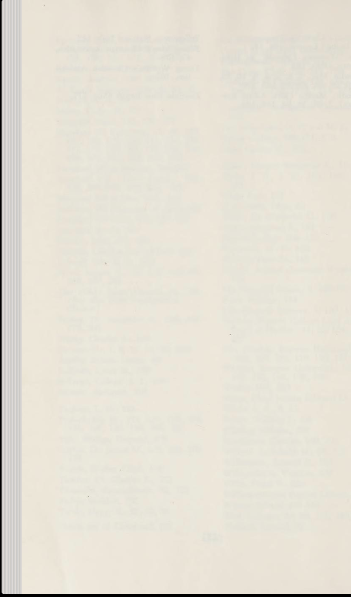

<!-- page_id: 0167-right | printed: 273 | viewer_token: 272 | viewer_sequence: 336/340 -->
## Page 273

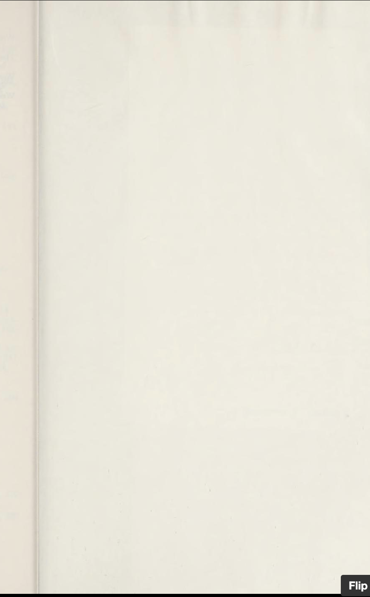

<!-- page_id: 0056-left | printed: none | viewer_token: none | viewer_sequence: none/none -->
## Unnumbered Page

Hi

> .

> e a

> =.

> om x

### y 72

<!-- issues: low_ocr_confidence:25.42 -->

<!-- page_id: 0056-right | printed: none | viewer_token: none | viewer_sequence: none/none -->
## Unnumbered Page

The more imposing houses were across the street. Also, at the time it was a little too far out to be quite haut-monde. Neither fact was of the slightest consequence to the Rockefellers. They became sentimentally attached to the place, especially Mrs. Rockefeller. She thought of it as her “Mother House,” for all her children, except Bessie, were born here. The Euclid Avenue residence was the first of several homes the Rockefellers eventually owned, and they were very happy in it. Rockefeller never could bear to part with the property, even after he left Cleveland and had no further need for a pied a terre in the city. The house has been described as “modified French,” probably because of the mansard roof with its rounded dormer window inserts. A columned portico at the entrance lent a classic touch, while window groupings reflected the Victorian mode. The architect managed to blend it all into a pleasing, substantial whole. Inside, large sunny rooms with high ceilings and open fireplaces were arranged around a center hall to make a commodious, very livable home. Now financially able to have good horses, Rockefeller built a handsome stone stable for them at the rear of his lot which extended a full block to Prospect Street. The building, far more elaborate than his home, was pine paneled inside with well designed | stalls. It was a worthy headquarters for his trotters with intriguing names like Midnight, Flash Eye, and Truffle. | Influential residents had succeeded in having the horsecars, and _ later the electric trolley cars, detoured off the Avenue from Case to 4 Perry Street. This section of about twenty blocks constituted prac- | tically a private right-of-way for the wealthy landowners. The pave- “., ment, free of car tracks, was as smooth as a table top, perfect for showing off fine horses. Friendly races took place in which Rockefeller participated with his neighbors. None of them had better horses or was more skilled in handling them. No one enjoyed the sport more than he, though he gave less time to it than some. : One of the tales about Rockefeller that went the rounds in Cleve- | Jand concerned a race he had with his longtime friend Eyears. Now a successful merchant tailor and horseman, too, Eyears and his 83
